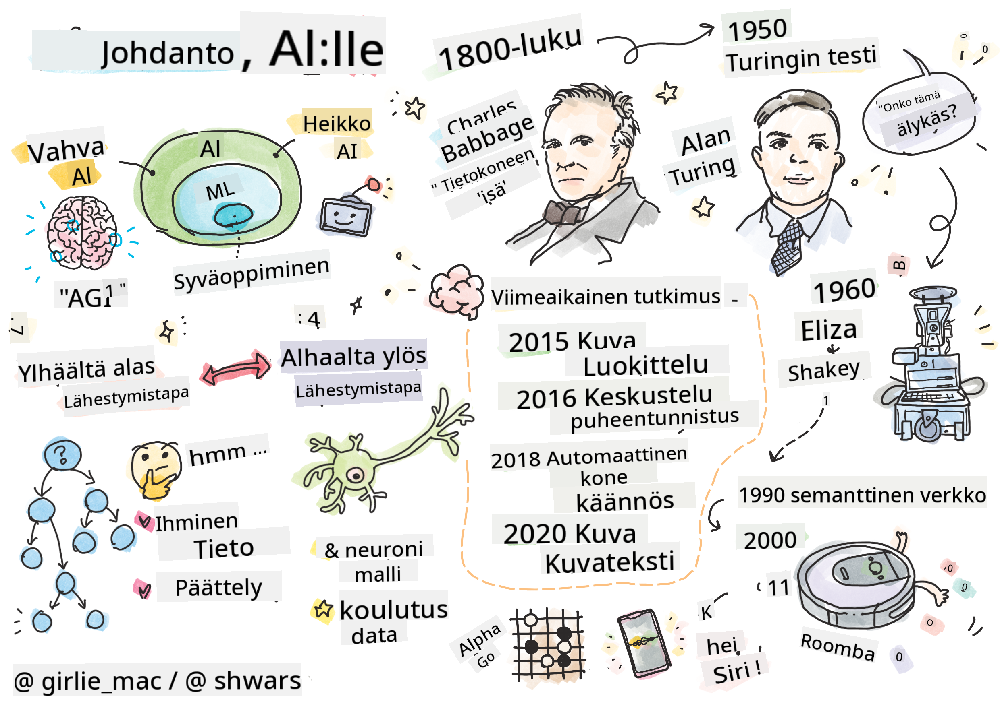
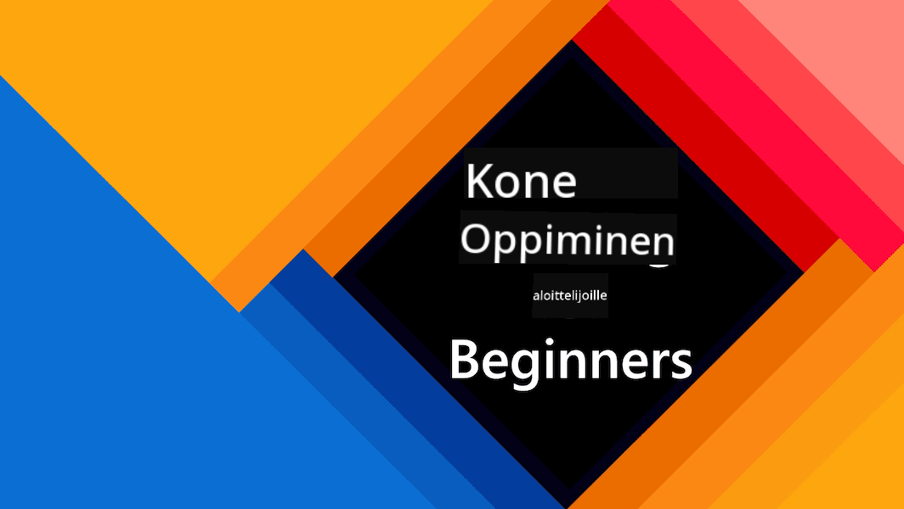

<!--
CO_OP_TRANSLATOR_METADATA:
{
  "original_hash": "06ca1b0138e65b964481ae83275b270e",
  "translation_date": "2025-10-03T08:27:01+00:00",
  "source_file": "lessons/1-Intro/README.md",
  "language_code": "fi"
}
-->
# Johdatus tekoälyyn

> Piirros: [Tomomi Imura](https://twitter.com/girlie_mac)

## [Esiluennon kysely](https://ff-quizzes.netlify.app/en/ai/quiz/1)

**Tekoäly** on kiehtova tieteenala, joka tutkii, kuinka voimme saada tietokoneet osoittamaan älykästä käyttäytymistä, esimerkiksi tekemään asioita, joissa ihmiset ovat hyviä.

Alun perin tietokoneet keksittiin [Charles Babbagen](https://en.wikipedia.org/wiki/Charles_Babbage) toimesta käsittelemään numeroita ennalta määritellyn menettelyn - algoritmin - mukaisesti. Vaikka modernit tietokoneet ovat huomattavasti kehittyneempiä kuin 1800-luvulla ehdotettu alkuperäinen malli, ne noudattavat edelleen samaa ohjattujen laskentojen periaatetta. Näin ollen tietokone voidaan ohjelmoida tekemään jotain, jos tiedämme tarkalleen, mitä vaiheita meidän on suoritettava tavoitteen saavuttamiseksi.

> Kuva: [Vickie Soshnikova](http://twitter.com/vickievalerie)

> ✅ Henkilön iän määrittäminen hänen valokuvastaan on tehtävä, jota ei voida ohjelmoida eksplisiittisesti, koska emme tiedä, miten päädymme lukuun mielessämme, kun teemme sen.

---

On kuitenkin joitakin tehtäviä, joita emme osaa ratkaista eksplisiittisesti. Esimerkiksi henkilön iän määrittäminen hänen valokuvastaan. Opimme tekemään sen, koska olemme nähneet monia esimerkkejä eri-ikäisistä ihmisistä, mutta emme osaa selittää tarkasti, miten teemme sen, emmekä voi ohjelmoida tietokonetta tekemään sitä. Juuri tällaiset tehtävät kiinnostavat **tekoälyä** (lyhennettynä AI).

✅ Mieti joitakin tehtäviä, jotka voisit delegoida tietokoneelle ja jotka hyötyisivät tekoälystä. Pohdi rahoituksen, lääketieteen ja taiteen aloja - miten nämä alat hyötyvät tekoälystä nykyään?

## Heikko tekoäly vs. vahva tekoäly

Heikko tekoäly | Vahva tekoäly
---------------------------------------|-------------------------------------
Heikko tekoäly viittaa tekoälyjärjestelmiin, jotka on suunniteltu ja koulutettu tiettyä tehtävää tai kapeaa tehtäväjoukkoa varten.|Vahva tekoäly, eli yleinen tekoäly (AGI), viittaa tekoälyjärjestelmiin, joilla on ihmisen tasoinen älykkyys ja ymmärrys.
Nämä tekoälyjärjestelmät eivät ole yleisesti älykkäitä; ne ovat erinomaisia ennalta määritellyn tehtävän suorittamisessa, mutta niiltä puuttuu todellinen ymmärrys tai tietoisuus.|Nämä tekoälyjärjestelmät pystyvät suorittamaan mitä tahansa älyllistä tehtävää, jonka ihminen voi tehdä, sopeutumaan eri aloihin ja omaavat jonkinlaisen tietoisuuden tai itsetietoisuuden.
Esimerkkejä heikosta tekoälystä ovat virtuaaliassistentit kuten Siri tai Alexa, suositusalgoritmit suoratoistopalveluissa ja chatbotit, jotka on suunniteltu tiettyihin asiakaspalvelutehtäviin.|Vahvan tekoälyn saavuttaminen on tekoälytutkimuksen pitkän aikavälin tavoite, ja se vaatisi tekoälyjärjestelmien kehittämistä, jotka voivat järkeillä, oppia, ymmärtää ja sopeutua laajaan tehtävä- ja kontekstikirjoon.
Heikko tekoäly on erittäin erikoistunut eikä omaa ihmisen kaltaisia kognitiivisia kykyjä tai yleisiä ongelmanratkaisukykyjä kapean alueensa ulkopuolella.|Vahva tekoäly on tällä hetkellä teoreettinen käsite, eikä mikään tekoälyjärjestelmä ole saavuttanut tätä yleisen älykkyyden tasoa.

Lisätietoja löytyy **[Artificial General Intelligence](https://en.wikipedia.org/wiki/Artificial_general_intelligence)** (AGI).

## Älykkyyden määritelmä ja Turingin testi

Yksi ongelma käsiteltäessä termiä **[älykkyys](https://en.wikipedia.org/wiki/Intelligence)** on, että sille ei ole selkeää määritelmää. Voidaan väittää, että älykkyys liittyy **abstraktiin ajatteluun** tai **itsetietoisuuteen**, mutta emme voi määritellä sitä kunnolla.

> [Kuva](https://unsplash.com/photos/75715CVEJhI) Unsplashista, kuvaaja [Amber Kipp](https://unsplash.com/@sadmax)

Termiin *älykkyys* liittyvän epäselvyyden näkemiseksi yritä vastata kysymykseen: "Onko kissa älykäs?". Eri ihmiset antavat tähän kysymykseen erilaisia vastauksia, koska ei ole yleisesti hyväksyttyä testiä, joka todistaisi väitteen olevan totta tai ei. Ja jos mielestäsi sellainen on - kokeile laittaa kissasi älykkyystestiin...

✅ Mieti hetki, miten määrittelet älykkyyden. Onko varis, joka osaa ratkaista labyrintin ja päästä ruoan luo, älykäs? Onko lapsi älykäs?

---

Kun puhumme AGI:stä, meidän on oltava jokin tapa todeta, olemmeko luoneet aidosti älykkään järjestelmän. [Alan Turing](https://en.wikipedia.org/wiki/Alan_Turing) ehdotti menetelmää nimeltä **[Turingin testi](https://en.wikipedia.org/wiki/Turing_test)**, joka toimii myös älykkyyden määritelmänä. Testissä verrataan annettua järjestelmää johonkin luontaisesti älykkääseen - oikeaan ihmiseen, ja koska mikä tahansa automaattinen vertailu voidaan ohittaa tietokoneohjelmalla, käytämme ihmistuomaria. Jos ihminen ei pysty erottamaan oikeaa henkilöä ja tietokonejärjestelmää tekstipohjaisessa vuoropuhelussa, järjestelmää pidetään älykkäänä.

> Chatbot nimeltä [Eugene Goostman](https://en.wikipedia.org/wiki/Eugene_Goostman), joka kehitettiin Pietarissa, oli lähellä läpäistä Turingin testin vuonna 2014 käyttämällä ovelaa persoonallisuustemppua. Se ilmoitti etukäteen olevansa 13-vuotias ukrainalainen poika, mikä selittäisi tiedon puutteen ja joitakin tekstin epäjohdonmukaisuuksia. Botti vakuutti 30 % tuomareista, että se oli ihminen viiden minuutin keskustelun jälkeen, mikä oli metriikka, jonka Turing uskoi koneen pystyvän läpäisemään vuoteen 2000 mennessä. On kuitenkin ymmärrettävä, että tämä ei tarkoita, että olisimme luoneet älykkään järjestelmän tai että tietokonejärjestelmä olisi huijannut ihmistuomaria - järjestelmä ei huijannut ihmisiä, vaan bottien luojat tekivät sen!

✅ Oletko koskaan tullut huijatuksi chatbotin toimesta niin, että luulit puhuvasi ihmisen kanssa? Miten se vakuutti sinut?

## Eri lähestymistavat tekoälyyn

Jos haluamme tietokoneen käyttäytyvän kuin ihminen, meidän on jollain tavalla mallinnettava tietokoneessa oma ajattelutapamme. Siksi meidän on yritettävä ymmärtää, mikä tekee ihmisestä älykkään.

> Jotta voisimme ohjelmoida älykkyyden koneeseen, meidän on ymmärrettävä, miten omat päätöksentekoprosessimme toimivat. Jos teet hieman itsetutkiskelua, huomaat, että jotkut prosessit tapahtuvat alitajuisesti – esimerkiksi voimme erottaa kissan koirasta ajattelematta sitä – kun taas toiset sisältävät järkeilyä.

Tähän ongelmaan on kaksi mahdollista lähestymistapaa:

Ylhäältä alas -lähestymistapa (symbolinen järkeily) | Alhaalta ylös -lähestymistapa (neuroverkot)
---------------------------------------|-------------------------------------
Ylhäältä alas -lähestymistapa mallintaa ihmisen järkeilyä ongelman ratkaisemiseksi. Se sisältää **tiedon** keräämisen ihmiseltä ja sen esittämisen tietokoneen ymmärtämässä muodossa. Meidän on myös kehitettävä tapa mallintaa **järkeily** tietokoneessa. | Alhaalta ylös -lähestymistapa mallintaa ihmisaivojen rakennetta, joka koostuu suuresta määrästä yksinkertaisia yksiköitä, joita kutsutaan **neuroneiksi**. Jokainen neuroni toimii painotettuna keskiarvona syötteistään, ja voimme kouluttaa neuroniverkkoa ratkaisemaan hyödyllisiä ongelmia tarjoamalla sille **koulutusdataa**.

On myös muita mahdollisia lähestymistapoja älykkyyteen:

* **Emergentti**, **synergeettinen** tai **moniagenttinen lähestymistapa** perustuu siihen, että monimutkainen älykäs käyttäytyminen voi syntyä suuren määrän yksinkertaisten agenttien vuorovaikutuksesta. [Evoluutiokybernetiikan](https://en.wikipedia.org/wiki/Global_brain#Evolutionary_cybernetics) mukaan älykkyys voi *syntyä* yksinkertaisemmasta, reaktiivisesta käyttäytymisestä *metasysteemitransition* prosessissa.

* **Evolutiivinen lähestymistapa** tai **geneettinen algoritmi** on optimointiprosessi, joka perustuu evoluution periaatteisiin.

Käsittelemme näitä lähestymistapoja myöhemmin kurssilla, mutta nyt keskitymme kahteen pääsuuntaan: ylhäältä alas ja alhaalta ylös.

### Ylhäältä alas -lähestymistapa

**Ylhäältä alas -lähestymistavassa** yritämme mallintaa järkeilyämme. Koska voimme seurata ajatuksiamme järkeillessämme, voimme yrittää formalisoida tämän prosessin ja ohjelmoida sen tietokoneeseen. Tätä kutsutaan **symboliseksi järkeilyksi**.

Ihmisillä on tapana käyttää sääntöjä päätöksentekoprosessien ohjaamiseen. Esimerkiksi lääkäri diagnosoi potilasta ja saattaa huomata, että henkilöllä on kuumetta, mikä viittaa tulehdukseen kehossa. Soveltamalla laajaa sääntöjoukkoa tiettyyn ongelmaan lääkäri voi päätyä lopulliseen diagnoosiin.

Tämä lähestymistapa perustuu vahvasti **tiedon esittämiseen** ja **järkeilyyn**. Tiedon kerääminen ihmisen asiantuntijalta voi olla vaikein osa, koska lääkäri ei monissa tapauksissa tiedä tarkalleen, miksi hän päätyy tiettyyn diagnoosiin. Joskus ratkaisu vain ilmestyy hänen mieleensä ilman eksplisiittistä ajattelua. Joitakin tehtäviä, kuten henkilön iän määrittäminen valokuvasta, ei voida lainkaan pelkistää tiedon käsittelyyn.

### Alhaalta ylös -lähestymistapa

Vaihtoehtoisesti voimme yrittää mallintaa aivojemme yksinkertaisimpia elementtejä – neuronia. Voimme rakentaa niin sanotun **keinotekoisen neuroverkon** tietokoneeseen ja yrittää opettaa sitä ratkaisemaan ongelmia antamalla sille esimerkkejä. Tämä prosessi on samanlainen kuin vastasyntyneen lapsen oppiminen ympäristöstään tekemällä havaintoja.

✅ Tee hieman tutkimusta siitä, miten vauvat oppivat. Mitkä ovat vauvan aivojen peruselementit?

> | Entä ML?         |      |
> |--------------|-----------|
> | Osa tekoälyä, joka perustuu tietokoneen oppimiseen ratkaisemaan ongelma jonkin datan perusteella, kutsutaan **koneoppimiseksi**. Emme käsittele klassista koneoppimista tässä kurssissa - viittaamme erilliseen [Machine Learning for Beginners](http://aka.ms/ml-beginners) -opetussuunnitelmaan. |       |

## Lyhyt historia tekoälystä

Tekoäly aloitettiin tieteenalana 1900-luvun puolivälissä. Aluksi symbolinen järkeily oli vallitseva lähestymistapa, ja se johti useisiin merkittäviin saavutuksiin, kuten asiantuntijajärjestelmiin – tietokoneohjelmiin, jotka pystyivät toimimaan asiantuntijana joillakin rajatuilla ongelma-alueilla. Pian kuitenkin kävi selväksi, että tällainen lähestymistapa ei skaalaudu hyvin. Tiedon kerääminen asiantuntijalta, sen esittäminen tietokoneessa ja tietokantapohjan pitäminen tarkkana osoittautui erittäin monimutkaiseksi ja liian kalliiksi monissa tapauksissa. Tämä johti niin sanottuun [tekoälytalveen](https://en.wikipedia.org/wiki/AI_winter) 1970-luvulla.

> Kuva: [Dmitry Soshnikov](http://soshnikov.com)

Ajan myötä laskentaresurssit halpenivat ja saatavilla oleva data lisääntyi, joten neuroverkkopohjaiset lähestymistavat alkoivat osoittaa erinomaista suorituskykyä kilpaillessaan ihmisten kanssa monilla alueilla, kuten tietokonenäkö tai puheen ymmärtäminen. Viime vuosikymmenen aikana termiä tekoäly on enimmäkseen käytetty synonyyminä neuroverkoille, koska suurin osa tekoälyn menestyksistä, joista kuulemme, perustuu niihin.

Voimme havaita, kuinka lähestymistavat ovat muuttuneet esimerkiksi shakkia pelaavan tietokoneohjelman luomisessa:

* Varhaiset shakkiohjelmat perustuivat hakuun – ohjelma yritti eksplisiittisesti arvioida vastustajan mahdollisia siirtoja tietyn määrän seuraavia siirtoja varten ja valitsi optimaalisen siirron perustuen optimaaliseen asemaan, joka voidaan saavuttaa muutamassa siirrossa. Tämä johti niin sanotun [alpha-beta karsinnan](https://en.wikipedia.org/wiki/Alpha%E2%80%93beta_pruning) hakualgoritmin kehittämiseen.
* Hakustrategiat toimivat hyvin pelin loppuvaiheessa, jossa hakutila on rajattu pienellä määrällä mahdollisia siirtoja. Kuitenkin pelin alussa hakutila on valtava, ja algoritmia voidaan parantaa oppimalla olemassa olevista ihmispelaajien välisistä peleistä. Seuraavat kokeilut käyttivät niin sanottua [case-based reasoning](https://en.wikipedia.org/wiki/Case-based_reasoning) -menetelmää, jossa ohjelma etsi tietokannasta tapauksia, jotka ovat hyvin samanlaisia kuin nykyinen peliasema.
* Modernit ohjelmat, jotka voittavat ihmispelaajat, perustuvat neuroverkkoihin ja [vahvistusoppimiseen](https://en.wikipedia.org/wiki/Reinforcement_learning), jossa ohjelmat oppivat pelaamaan yksinomaan pelaamalla pitkään itseään vastaan ja oppimalla omista virheistään – aivan kuten ihmiset tekevät oppiessaan pelaamaan shakkia. Tietokoneohjelma voi kuitenkin pelata paljon enemmän pelejä paljon lyhyemmässä ajassa ja siten oppia paljon nopeammin.

✅ Tee hieman tutkimusta muista peleistä, joita tekoäly on pelannut.

Samoin voimme nähdä, kuinka lähestymistapa "puhuvien ohjelmien" (jotka saattavat läpäistä Turingin testin) luomiseen on muuttunut:

* Varhaiset ohjelmat, kuten [Eliza](https://en.wikipedia.org/wiki/ELIZA), perustuivat hyvin yksinkertaisiin kielioppisääntöihin ja syötteen lauseen muotoiluun kysymykseksi.
* Modernit assistentit, kuten Cortana, Siri tai Google Assistant, ovat kaikki hybridijärjestelmiä, jotka käyttävät neuroverkkoja muuntamaan puheen tekstiksi ja tunnistamaan tarkoituksemme, ja sitten käyttävät järkeilyä tai eksplisiittisiä algoritmeja suorittamaan vaadittuja toimia.
* Tulevaisuudessa voimme odottaa täysin neuroverkkopohjaista mallia, joka käsittelee vuoropuhelua itsenäisesti. Viimeisimmät GPT- ja [Turing-NLG](https://www.microsoft.com/research/blog/turing-nlg-a-17-billion-parameter-language-model-by-microsoft) -neuroverkkojen perheet osoittavat suurta menestystä tässä.

> Kuva Dmitry Soshnikovilta, [valokuva](https://unsplash.com/photos/r8LmVbUKgns) Marina Abrosimovalta, Unsplash

## Viimeaikainen tekoälytutkimus

Neuroverkkojen tutkimuksen valtava kasvu alkoi noin vuonna 2010, kun suuret julkiset tietoaineistot tulivat saataville. Suuri kokoelma kuvia nimeltä [ImageNet](https://en.wikipedia.org/wiki/ImageNet), joka sisältää noin 14 miljoonaa annotoitua kuvaa, synnytti [ImageNet Large Scale Visual Recognition Challenge](https://image-net.org/challenges/LSVRC/).

> Kuva [Dmitry Soshnikovilta](http://soshnikov.com)

Vuonna 2012 [Konvoluutioneuroverkkoja](../4-ComputerVision/07-ConvNets/README.md) käytettiin ensimmäistä kertaa kuvien luokittelussa, mikä johti merkittävään virheiden vähenemiseen (lähes 30 %:sta 16,4 %:iin). Vuonna 2015 Microsoft Researchin ResNet-arkkitehtuuri [saavutti ihmistasoisen tarkkuuden](https://doi.org/10.1109/ICCV.2015.123).

Sen jälkeen neuroverkot ovat osoittaneet erittäin menestyksekästä toimintaa monissa tehtävissä:

---

Vuosi | Ihmistaso saavutettu
-----|--------
2015 | [Kuvien luokittelu](https://doi.org/10.1109/ICCV.2015.123)
2016 | [Puheentunnistus keskusteluissa](https://arxiv.org/abs/1610.05256)
2018 | [Automaattinen konekäännös](https://arxiv.org/abs/1803.05567) (kiinasta englantiin)
2020 | [Kuvatekstien luominen](https://arxiv.org/abs/2009.13682)

Viime vuosina olemme nähneet suuria saavutuksia suurten kielimallien, kuten BERT ja GPT-3, kanssa. Tämä on tapahtunut pääasiassa siksi, että saatavilla on paljon yleistä tekstidataa, joka mahdollistaa mallien kouluttamisen tekstien rakenteen ja merkityksen ymmärtämiseen, niiden esikouluttamisen yleisillä tekstikokoelmilla ja sitten erikoistamisen tarkempiin tehtäviin. Opimme lisää [luonnollisen kielen käsittelystä](../5-NLP/README.md) myöhemmin tässä kurssissa.

## 🚀 Haaste

Tutki internetiä ja päätä, missä mielestäsi tekoälyä käytetään tehokkaimmin. Onko se karttasovelluksessa, puheesta tekstiksi -palvelussa vai videopelissä? Tutki, miten järjestelmä on rakennettu.

## [Luennon jälkeinen kysely](https://ff-quizzes.netlify.app/en/ai/quiz/2)

## Katsaus & Itseopiskelu

Käy läpi tekoälyn ja koneoppimisen historia lukemalla [tämä oppitunti](https://github.com/microsoft/ML-For-Beginners/tree/main/1-Introduction/2-history-of-ML). Valitse jokin elementti tämän oppitunnin tai sen alussa olevan sketchnoten sisällöstä ja tutki sitä syvällisemmin ymmärtääksesi sen kehitystä ohjaavaa kulttuurista kontekstia.

**Tehtävä**: [Game Jam](assignment.md)

---

**Vastuuvapauslauseke**:  
Tämä asiakirja on käännetty AI-käännöspalvelulla [Co-op Translator](https://github.com/Azure/co-op-translator). Vaikka pyrimme tarkkuuteen, huomioithan, että automaattiset käännökset voivat sisältää virheitä tai epätarkkuuksia. Alkuperäistä asiakirjaa sen alkuperäisellä kielellä tulisi pitää ensisijaisena lähteenä. Kriittisen tiedon osalta suositellaan ammattimaista ihmiskäännöstä. Emme ole vastuussa väärinkäsityksistä tai virhetulkinnoista, jotka johtuvat tämän käännöksen käytöstä.