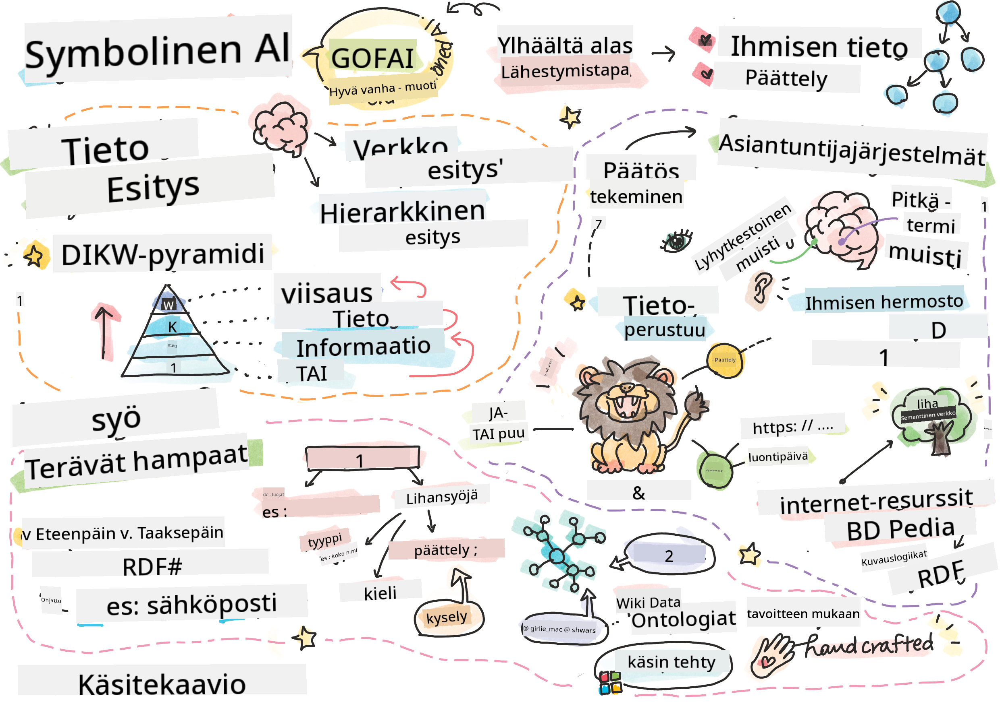
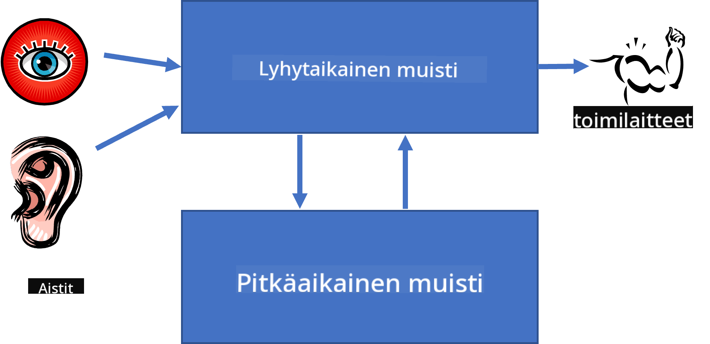
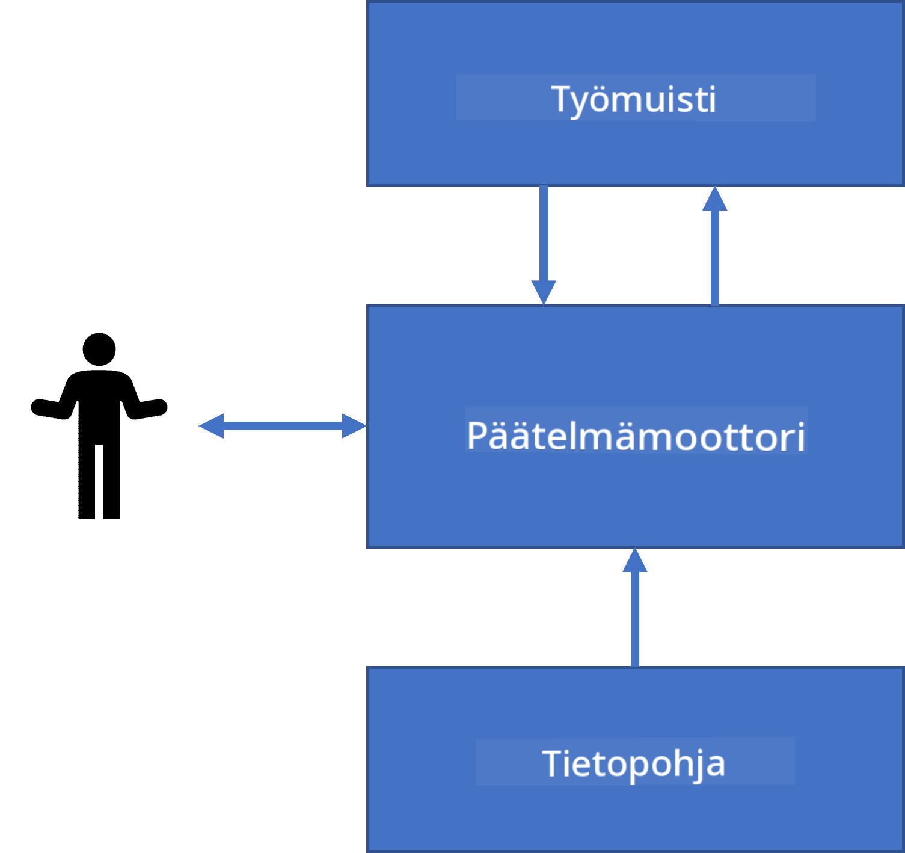
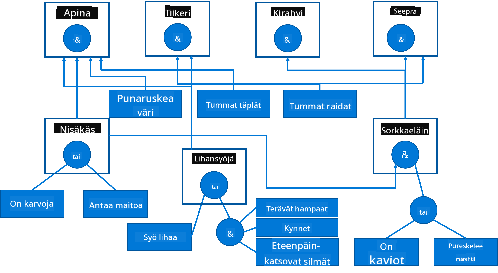

<!--
CO_OP_TRANSLATOR_METADATA:
{
  "original_hash": "98c5222ff9556b55223fed2337145e18",
  "translation_date": "2025-08-28T19:38:06+00:00",
  "source_file": "lessons/2-Symbolic/README.md",
  "language_code": "fi"
}
-->
# Tiedon esittäminen ja asiantuntijajärjestelmät



> Sketchnote by [Tomomi Imura](https://twitter.com/girlie_mac)

Tekoälyn tavoite perustuu tiedon etsintään, pyrkimykseen ymmärtää maailmaa samalla tavalla kuin ihmiset. Mutta miten tämä voidaan toteuttaa?

## [Ennakkokysely ennen luentoa](https://red-field-0a6ddfd03.1.azurestaticapps.net/quiz/102)

Tekoälyn alkuvaiheessa suosittiin ylhäältä alas -lähestymistapaa älykkäiden järjestelmien luomisessa (käsitelty edellisessä oppitunnissa). Ajatuksena oli siirtää ihmisten tieto koneelle koneen ymmärtämässä muodossa ja käyttää sitä ongelmien automaattiseen ratkaisemiseen. Tämä lähestymistapa perustui kahteen suureen ideaan:

* Tiedon esittäminen
* Päättely

## Tiedon esittäminen

Yksi symbolisen tekoälyn tärkeistä käsitteistä on **tieto**. On tärkeää erottaa tieto *informaatiosta* tai *datasta*. Esimerkiksi voidaan sanoa, että kirjat sisältävät tietoa, koska niiden avulla voi oppia ja tulla asiantuntijaksi. Todellisuudessa kirjat sisältävät kuitenkin *dataa*, ja lukemalla kirjoja ja integroimalla tämä data maailmankuvaamme muutamme datan tiedoksi.

> ✅ **Tieto** on jotain, joka on päässämme ja edustaa ymmärrystämme maailmasta. Se saadaan aktiivisen **oppimisprosessin** kautta, joka yhdistää vastaanottamamme informaation osaksi aktiivista maailmankuvaamme.

Usein emme määrittele tietoa tiukasti, vaan yhdistämme sen muihin siihen liittyviin käsitteisiin käyttämällä [DIKW-pyramidia](https://en.wikipedia.org/wiki/DIKW_pyramid). Pyramidissa on seuraavat käsitteet:

* **Data** on jotain, joka on esitetty fyysisessä mediassa, kuten kirjoitetussa tekstissä tai puhutuissa sanoissa. Data on riippumatonta ihmisistä ja sitä voidaan siirtää henkilöltä toiselle.
* **Informaatio** on tapa, jolla tulkitsemme dataa päässämme. Esimerkiksi kun kuulemme sanan *tietokone*, meillä on jonkinlainen käsitys siitä, mitä se on.
* **Tieto** on informaatiota, joka on integroitu maailmankuvaamme. Esimerkiksi kun opimme, mitä tietokone on, alamme ymmärtää, miten se toimii, kuinka paljon se maksaa ja mihin sitä voidaan käyttää. Tämä toisiinsa liittyvien käsitteiden verkosto muodostaa tietomme.
* **Viisaus** on vielä yksi taso ymmärryksessämme maailmasta, ja se edustaa *metatietoa*, esimerkiksi käsitystä siitä, miten ja milloin tietoa tulisi käyttää.

*Image [from Wikipedia](https://commons.wikimedia.org/w/index.php?curid=37705247), By Longlivetheux - Own work, CC BY-SA 4.0*

Näin ollen **tiedon esittämisen** ongelma on löytää tehokas tapa esittää tieto tietokoneessa datan muodossa, jotta sitä voidaan käyttää automaattisesti. Tämä voidaan nähdä spektrinä:


> Kuva: [Dmitry Soshnikov](http://soshnikov.com)

* Vasemmalla ovat hyvin yksinkertaiset tiedon esittämistavat, joita tietokoneet voivat käyttää tehokkaasti. Yksinkertaisin tapa on algoritminen, jossa tieto esitetään tietokoneohjelmana. Tämä ei kuitenkaan ole paras tapa esittää tietoa, koska se ei ole joustava. Päässämme oleva tieto on usein ei-algoritmista.
* Oikealla ovat esitykset, kuten luonnollinen teksti. Se on voimakkain, mutta sitä ei voida käyttää automaattiseen päättelyyn.

> ✅ Mieti hetki, miten esität tietoa päässäsi ja muutat sen muistiinpanoiksi. Onko jokin tietty muoto, joka auttaa sinua muistamaan paremmin?

## Tietokoneen tiedon esittämistapojen luokittelu

Voimme luokitella erilaisia tietokoneen tiedon esittämistapoja seuraaviin kategorioihin:

* **Verkkoesitykset** perustuvat siihen, että päässämme on verkosto toisiinsa liittyviä käsitteitä. Voimme yrittää jäljentää samanlaisia verkostoja graafina tietokoneessa - niin sanottu **semanttinen verkko**.

1. **Objekti-Attribuutti-Arvo -kolmikot** tai **attribuutti-arvo -parit**. Koska graafi voidaan esittää tietokoneessa solmujen ja reunojen listana, voimme esittää semanttisen verkon listana kolmikoita, jotka sisältävät objektit, attribuutit ja arvot. Esimerkiksi voimme rakentaa seuraavat kolmikot ohjelmointikielistä:

Objekti | Attribuutti | Arvo
--------|------------|-----
Python | on | Tyypittämätön kieli
Python | keksijä | Guido van Rossum
Python | lohko-syntaksi | sisennys
Tyypittämätön kieli | ei sisällä | tyyppimäärityksiä

> ✅ Mieti, miten kolmikoita voidaan käyttää muun tyyppisen tiedon esittämiseen.

2. **Hierarkkiset esitykset** korostavat sitä, että usein luomme hierarkian objekteista päässämme. Esimerkiksi tiedämme, että kanarialintu on lintu, ja kaikilla linnuilla on siivet. Meillä on myös käsitys siitä, minkä värinen kanarialintu yleensä on ja mikä on sen lentonopeus.

   - **Kehysesitys** perustuu siihen, että jokainen objekti tai objektien luokka esitetään **kehyksenä**, joka sisältää **paikkoja**. Paikoilla voi olla oletusarvoja, arvorajoituksia tai tallennettuja proseduureja, joita voidaan kutsua paikan arvon saamiseksi. Kaikki kehykset muodostavat hierarkian, joka on samanlainen kuin objektihierarkia olio-ohjelmointikielissä.
   - **Skenaariot** ovat erityinen kehysten tyyppi, joka edustaa monimutkaisia tilanteita, jotka voivat kehittyä ajan myötä.

**Python**

Paikka | Arvo | Oletusarvo | Väli |
-------|------|------------|------|
Nimi | Python | | |
On | Tyypittämätön kieli | | |
Muuttujan tapaus | | CamelCase | |
Ohjelman pituus | | | 5-5000 riviä |
Lohko-syntaksi | Sisennys | | |

3. **Proseduraaliset esitykset** perustuvat tiedon esittämiseen toimintojen listana, jotka voidaan suorittaa, kun tietty ehto täyttyy.
   - Tuotantosäännöt ovat jos-niin -lauseita, jotka mahdollistavat johtopäätösten tekemisen. Esimerkiksi lääkärillä voi olla sääntö, joka sanoo, että **JOS** potilaalla on korkea kuume **TAI** korkea C-reaktiivisen proteiinin taso verikokeessa **NIIN** hänellä on tulehdus. Kun kohtaamme jonkin ehdon, voimme tehdä johtopäätöksen tulehduksesta ja käyttää sitä edelleen päättelyssä.
   - Algoritmeja voidaan pitää toisena proseduraalisen esityksen muotona, vaikka niitä ei lähes koskaan käytetä suoraan tietopohjaisissa järjestelmissä.

4. **Logiikka** ehdotettiin alun perin Aristoteleen toimesta universaalin ihmistiedon esittämiseksi.
   - Predikaattilogiikka matemaattisena teoriana on liian rikas ollakseen laskettavissa, joten siitä käytetään yleensä jotakin osajoukkoa, kuten Prologissa käytettyjä Horn-lauseita.
   - Kuvaileva logiikka on joukko loogisia järjestelmiä, joita käytetään hierarkioiden ja hajautettujen tiedon esitysten, kuten *semanttisen webin*, esittämiseen ja päättelyyn.

## Asiantuntijajärjestelmät

Symbolisen tekoälyn varhaisia menestyksiä olivat niin sanotut **asiantuntijajärjestelmät** - tietokonejärjestelmät, jotka suunniteltiin toimimaan asiantuntijana jollakin rajatulla ongelma-alueella. Ne perustuivat **tietokantaan**, joka oli kerätty yhdeltä tai useammalta ihmisasiantuntijalta, ja ne sisälsivät **päättelymoottorin**, joka suoritti päättelyä sen pohjalta.

 | 
---------------------------------------------|------------------------------------------------
Ihmisen hermojärjestelmän yksinkertaistettu rakenne | Tietopohjaisen järjestelmän arkkitehtuuri

Asiantuntijajärjestelmät rakennetaan ihmisen päättelyjärjestelmän tapaan, joka sisältää **lyhytkestoisen muistin** ja **pitkäkestoisen muistin**. Vastaavasti tietopohjaisissa järjestelmissä erotamme seuraavat komponentit:

* **Ongelman muisti**: sisältää tiedon parhaillaan ratkaistavasta ongelmasta, kuten potilaan lämpötilan tai verenpaineen, onko hänellä tulehdus vai ei jne. Tätä tietoa kutsutaan myös **staattiseksi tiedoksi**, koska se sisältää hetkellisen tilannekuvan siitä, mitä tiedämme ongelmasta - niin sanotun *ongelman tilan*.
* **Tietokanta**: edustaa pitkäkestoista tietoa ongelma-alueesta. Se kerätään manuaalisesti ihmisasiantuntijoilta eikä muutu konsultoinnista toiseen. Koska sen avulla voidaan navigoida ongelman tilasta toiseen, sitä kutsutaan myös **dynaamiseksi tiedoksi**.
* **Päättelymoottori**: ohjaa koko prosessia ongelman tilan avaruudessa etsimisessä, kysyy tarvittaessa käyttäjältä kysymyksiä ja löytää oikeat säännöt, joita sovelletaan jokaiseen tilaan.

Esimerkkinä tarkastellaan seuraavaa asiantuntijajärjestelmää, joka määrittää eläimen sen fyysisten ominaisuuksien perusteella:



> Kuva: [Dmitry Soshnikov](http://soshnikov.com)

Tätä kaaviota kutsutaan **AND-OR-puuksi**, ja se on graafinen esitys tuotantosääntöjen joukosta. Puun piirtäminen on hyödyllistä asiantuntijalta tiedon keräämisen alkuvaiheessa. Tiedon esittämiseksi tietokoneessa on kuitenkin kätevämpää käyttää sääntöjä:

```
IF the animal eats meat
OR (animal has sharp teeth
    AND animal has claws
    AND animal has forward-looking eyes
) 
THEN the animal is a carnivore
```

Huomaat, että jokainen ehto säännön vasemmalla puolella ja toiminto ovat pohjimmiltaan objekti-attribuutti-arvo (OAV) -kolmikoita. **Työmuisti** sisältää joukon OAV-kolmikoita, jotka vastaavat parhaillaan ratkaistavaa ongelmaa. **Sääntömoottori** etsii sääntöjä, joiden ehdot täyttyvät, ja soveltaa niitä, lisäten uuden kolmikon työmuistiin.

> ✅ Piirrä oma AND-OR-puu aiheesta, joka kiinnostaa sinua!

### Eteenpäin vs. taaksepäin päättely

Edellä kuvattu prosessi kutsutaan **eteenpäin päättelyksi**. Se alkaa ongelman alkuperäisistä tiedoista, jotka ovat saatavilla työmuistissa, ja suorittaa seuraavan päättelysilmukan:

1. Jos kohdeattribuutti on työmuistissa - lopeta ja anna tulos
2. Etsi kaikki säännöt, joiden ehdot täyttyvät - muodosta **konfliktijoukko** säännöistä.
3. Suorita **konfliktin ratkaisu** - valitse yksi sääntö, joka suoritetaan tällä askeleella. Konfliktinratkaisustrategioita voi olla erilaisia:
   - Valitse ensimmäinen sovellettava sääntö tietokannasta
   - Valitse satunnainen sääntö
   - Valitse *tarkempi* sääntö, eli se, joka täyttää eniten ehtoja "vasemmalla puolella" (LHS)
4. Sovella valittua sääntöä ja lisää uusi tieto ongelman tilaan
5. Toista vaiheesta 1.

Joissakin tapauksissa saatamme kuitenkin haluta aloittaa tyhjällä tiedolla ongelmasta ja esittää kysymyksiä, jotka auttavat meitä pääsemään johtopäätökseen. Esimerkiksi lääketieteellisessä diagnostiikassa emme yleensä tee kaikkia lääketieteellisiä analyyseja etukäteen ennen potilaan diagnosointia. Sen sijaan haluamme tehdä analyyseja, kun päätös on tehtävä.

Tämä prosessi voidaan mallintaa **taaksepäin päättelyllä**. Se ohjautuu **tavoitteesta** - attribuuttiarvosta, jota etsimme:

1. Valitse kaikki säännöt, jotka voivat antaa meille tavoitteen arvon (eli tavoite oikealla puolella (RHS)) - konfliktijoukko
1. Jos attribuutille ei ole sääntöjä tai on sääntö, joka sanoo, että arvo tulisi kysyä käyttäjältä - kysy se, muuten:
1. Käytä konfliktinratkaisustrategiaa valitaksesi yksi sääntö, jota käytämme *hypoteesina* - yritämme todistaa sen
1. Toista prosessi rekursiivisesti kaikille säännön vasemmalla puolella oleville attribuuteille yrittäen todistaa ne tavoitteina
1. Jos prosessi epäonnistuu jossain vaiheessa - käytä toista sääntöä vaiheessa 3.

> ✅ Missä tilanteissa eteenpäin päättely on sopivampaa? Entä taaksepäin päättely?

### Asiantuntijajärjestelmien toteuttaminen

Asiantuntijajärjestelmiä voidaan toteuttaa eri työkaluilla:

* Ohjelmoimalla ne suoraan jollakin korkean tason ohjelmointikielellä. Tämä ei ole paras idea, koska tietopohjaisen järjestelmän pääasiallinen etu on, että tieto on erotettu päättelystä, ja ongelma-alueen asiantuntijan tulisi pystyä kirjoittamaan sääntöjä ymmärtämättä päättelyprosessin yksityiskohtia.
* Käyttämällä **asiantuntijajärjestelmän kuorta**, eli järjestelmää, joka on erityisesti suunniteltu täytettäväksi tiedolla käyttämällä jotakin tiedon esityskieltä.

## ✍️ Harjoitus: Eläinten päättely

Katso [Animals.ipynb](https://github.com/microsoft/AI-For-Beginners/blob/main/lessons/2-Symbolic/Animals.ipynb) esimerkki eteenpäin ja taaksepäin päättelyä käyttävän asiantuntijajärjestelmän toteuttamisesta.
> **Huomio**: Tämä esimerkki on melko yksinkertainen ja antaa vain käsityksen siitä, miltä asiantuntijajärjestelmä näyttää. Kun alat luoda tällaista järjestelmää, huomaat *älykkään* käyttäytymisen vasta, kun sääntöjen määrä saavuttaa tietyn rajan, noin 200+. Jossain vaiheessa säännöistä tulee niin monimutkaisia, että kaikkia ei voi pitää mielessä, ja saatat alkaa ihmetellä, miksi järjestelmä tekee tiettyjä päätöksiä. Tärkeä piirre tietopohjaisissa järjestelmissä on kuitenkin se, että voit aina *selittää* tarkalleen, miten mikä tahansa päätös tehtiin.
## Ontologiat ja semanttinen verkko

1900-luvun lopulla käynnistettiin hanke, jossa pyrittiin käyttämään tiedon esitystä Internet-resurssien annotointiin, jotta olisi mahdollista löytää resursseja, jotka vastaavat hyvin tarkkoja kyselyitä. Tätä hanketta kutsuttiin **semanttiseksi verkoksi**, ja se perustui useisiin käsitteisiin:

- Erityinen tiedon esitystapa, joka perustuu **[kuvauslogiikkaan](https://en.wikipedia.org/wiki/Description_logic)** (DL). Se muistuttaa kehystiedon esitystä, koska se rakentaa hierarkian objekteista ja niiden ominaisuuksista, mutta siinä on muodollinen looginen semantiikka ja päättely. DL:stä on olemassa kokonainen perhe, joka tasapainottelee ilmaisukyvyn ja päättelyn algoritmisen monimutkaisuuden välillä.
- Hajautettu tiedon esitys, jossa kaikki käsitteet esitetään globaalilla URI-tunnisteella, mikä mahdollistaa tiedon hierarkioiden luomisen, jotka kattavat koko internetin.
- XML-pohjaisten kielten perhe tiedon kuvaamiseen: RDF (Resource Description Framework), RDFS (RDF Schema), OWL (Ontology Web Language).

Semanttisen verkon ydinajatus on **ontologian** käsite. Se viittaa ongelma-alueen eksplisiittiseen määrittelyyn käyttäen jotakin muodollista tiedon esitystä. Yksinkertaisin ontologia voi olla vain hierarkia objekteista ongelma-alueella, mutta monimutkaisemmat ontologiat sisältävät sääntöjä, joita voidaan käyttää päättelyyn.

Semanttisessa verkossa kaikki esitykset perustuvat kolmikoihin. Jokainen objekti ja jokainen suhde tunnistetaan yksilöllisesti URI:lla. Esimerkiksi, jos haluamme ilmaista, että tämä AI Curriculum on kehitetty Dmitry Soshnikovin toimesta 1. tammikuuta 2022, voimme käyttää seuraavia kolmikoita:


```
http://github.com/microsoft/ai-for-beginners http://www.example.com/terms/creation-date “Jan 13, 2007”
http://github.com/microsoft/ai-for-beginners http://purl.org/dc/elements/1.1/creator http://soshnikov.com
```

> ✅ Tässä `http://www.example.com/terms/creation-date` ja `http://purl.org/dc/elements/1.1/creator` ovat joitakin tunnettuja ja yleisesti hyväksyttyjä URI-tunnisteita, jotka ilmaisevat käsitteet *luoja* ja *luomispäivämäärä*.

Monimutkaisemmassa tapauksessa, jos haluamme määritellä luojien listan, voimme käyttää RDF:ssä määriteltyjä tietorakenteita.


> Yllä olevat kaaviot: [Dmitry Soshnikov](http://soshnikov.com)

Semanttisen verkon kehitystä hidasti jossain määrin hakukoneiden ja luonnollisen kielen käsittelytekniikoiden menestys, jotka mahdollistavat rakenteellisen tiedon poimimisen tekstistä. Kuitenkin joillakin alueilla ontologioiden ja tietokantojen ylläpitoon panostetaan edelleen merkittävästi. Muutamia huomionarvoisia projekteja:

* [WikiData](https://wikidata.org/) on kokoelma koneellisesti luettavia tietokantoja, jotka liittyvät Wikipediaan. Suurin osa tiedoista on louhittu Wikipedian *InfoBoxeista*, rakenteellisista sisällöistä Wikipedia-sivujen sisällä. Voit [kysellä](https://query.wikidata.org/) WikiDataa SPARQL:lla, semanttisen verkon erityisellä kyselykielellä. Tässä on esimerkkikysely, joka näyttää ihmisten yleisimmät silmien värit:

```sparql
#defaultView:BubbleChart
SELECT ?eyeColorLabel (COUNT(?human) AS ?count)
WHERE
{
  ?human wdt:P31 wd:Q5.       # human instance-of homo sapiens
  ?human wdt:P1340 ?eyeColor. # human eye-color ?eyeColor
  SERVICE wikibase:label { bd:serviceParam wikibase:language "en". }
}
GROUP BY ?eyeColorLabel
```

* [DBpedia](https://www.dbpedia.org/) on toinen WikiDataa vastaava hanke.

> ✅ Jos haluat kokeilla omien ontologioiden rakentamista tai olemassa olevien avaamista, on olemassa erinomainen visuaalinen ontologiaeditori nimeltä [Protégé](https://protege.stanford.edu/). Lataa se tai käytä sitä verkossa.


*Web Protégé -editori avoinna Romanov-suvun ontologialla. Kuvakaappaus: Dmitry Soshnikov*

## ✍️ Harjoitus: Perheontologia

Katso [FamilyOntology.ipynb](https://github.com/Ezana135/AI-For-Beginners/blob/main/lessons/2-Symbolic/FamilyOntology.ipynb) esimerkki semanttisen verkon tekniikoiden käytöstä perhesuhteiden päättelyyn. Käytämme yleisessä GEDCOM-muodossa esitettyä sukupuuta ja perhesuhteiden ontologiaa rakentaaksemme graafin kaikista perhesuhteista tietylle henkilöjoukolle.

## Microsoft Concept Graph

Useimmissa tapauksissa ontologiat luodaan huolellisesti käsin. On kuitenkin myös mahdollista **louhia** ontologioita jäsentämättömästä tiedosta, esimerkiksi luonnollisen kielen teksteistä.

Yksi tällainen yritys tehtiin Microsoft Researchin toimesta, ja sen tuloksena syntyi [Microsoft Concept Graph](https://blogs.microsoft.com/ai/microsoft-researchers-release-graph-that-helps-machines-conceptualize/?WT.mc_id=academic-77998-cacaste).

Se on suuri kokoelma entiteettejä, jotka on ryhmitelty `is-a`-perintäsuhteen avulla. Se mahdollistaa kysymyksiin vastaamisen, kuten "Mikä on Microsoft?" - vastauksena esimerkiksi "yritys todennäköisyydellä 0,87 ja brändi todennäköisyydellä 0,75".

Graafi on saatavilla joko REST API:n kautta tai suurena ladattavana tekstitiedostona, joka listaa kaikki entiteettiparit.

## ✍️ Harjoitus: Konseptigraafi

Kokeile [MSConceptGraph.ipynb](https://github.com/microsoft/AI-For-Beginners/blob/main/lessons/2-Symbolic/MSConceptGraph.ipynb) -muistikirjaa nähdäksesi, kuinka voimme käyttää Microsoft Concept Graphia ryhmittelemään uutisartikkeleita useisiin kategorioihin.

## Yhteenveto

Nykyään tekoälyä pidetään usein *koneoppimisen* tai *neuroverkkojen* synonyymina. Kuitenkin ihminen osoittaa myös eksplisiittistä päättelyä, joka on jotain, mitä neuroverkot eivät tällä hetkellä käsittele. Todellisissa projekteissa eksplisiittistä päättelyä käytetään edelleen tehtävissä, jotka vaativat selityksiä tai järjestelmän käyttäytymisen muokkaamista hallitulla tavalla.

## 🚀 Haaste

Family Ontology -muistikirjassa, joka liittyy tähän oppituntiin, on mahdollisuus kokeilla muita perhesuhteita. Yritä löytää uusia yhteyksiä ihmisten välillä sukupuussa.

## [Luennon jälkeinen kysely](https://red-field-0a6ddfd03.1.azurestaticapps.net/quiz/202)

## Kertaus ja itseopiskelu

Tutki internetistä alueita, joissa ihmiset ovat yrittäneet kvantifioida ja koodata tietoa. Tutustu Bloom'n taksonomiaan ja palaa historiaan oppiaksesi, kuinka ihmiset ovat yrittäneet ymmärtää maailmaansa. Tarkastele Linnaeuksen työtä organismien taksonomian luomisessa ja havainnoi, kuinka Dmitri Mendelejev loi tavan kuvata ja ryhmitellä kemiallisia alkuaineita. Mitä muita mielenkiintoisia esimerkkejä löydät?

**Tehtävä**: [Rakenna ontologia](assignment.md)

---

**Vastuuvapauslauseke**:  
Tämä asiakirja on käännetty käyttämällä tekoälypohjaista käännöspalvelua [Co-op Translator](https://github.com/Azure/co-op-translator). Vaikka pyrimme tarkkuuteen, huomioithan, että automaattiset käännökset voivat sisältää virheitä tai epätarkkuuksia. Alkuperäinen asiakirja sen alkuperäisellä kielellä tulisi pitää ensisijaisena lähteenä. Kriittisen tiedon osalta suositellaan ammattimaista ihmiskäännöstä. Emme ole vastuussa väärinkäsityksistä tai virhetulkinnoista, jotka johtuvat tämän käännöksen käytöstä.