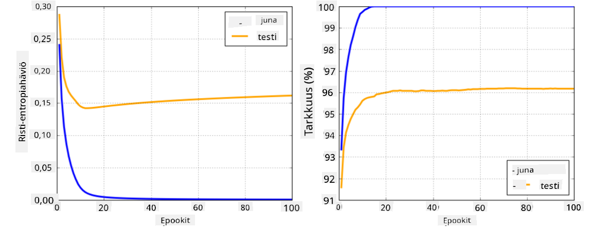

<!--
CO_OP_TRANSLATOR_METADATA:
{
  "original_hash": "2b544f20b796402507fb05a0df893323",
  "translation_date": "2025-08-28T19:49:29+00:00",
  "source_file": "lessons/3-NeuralNetworks/05-Frameworks/README.md",
  "language_code": "fi"
}
-->
# Neuroverkkojen Kehykset

Kuten olemme jo oppineet, neuroverkkojen tehokkaaseen kouluttamiseen tarvitaan kaksi asiaa:

* Kyky käsitellä tensoreita, esimerkiksi kertoa, laskea yhteen ja laskea joitakin funktioita, kuten sigmoid tai softmax
* Kyky laskea kaikkien lausekkeiden gradientit, jotta voidaan suorittaa gradienttilaskeuman optimointi

## [Esiluentavisa](https://ff-quizzes.netlify.app/en/ai/quiz/9)

Vaikka `numpy`-kirjasto pystyy suorittamaan ensimmäisen osan, tarvitsemme mekanismin gradienttien laskemiseen. [Oma kehyksemme](../04-OwnFramework/OwnFramework.ipynb), jonka kehitimme edellisessä osiossa, vaati, että kaikki derivaattafunktiot ohjelmoitiin manuaalisesti `backward`-metodissa, joka suorittaa takapropagaation. Ihanteellisesti kehys antaisi meille mahdollisuuden laskea gradientit *mille tahansa lausekkeelle*, jonka voimme määritellä.

Toinen tärkeä asia on kyky suorittaa laskelmia GPU:lla tai muilla erikoistuneilla laskentayksiköillä, kuten [TPU](https://en.wikipedia.org/wiki/Tensor_Processing_Unit). Syvien neuroverkkojen kouluttaminen vaatii *valtavasti* laskentatehoa, ja näiden laskelmien rinnakkaistaminen GPU:illa on erittäin tärkeää.

> ✅ Termi 'rinnakkaistaminen' tarkoittaa laskelmien jakamista useille laitteille.

Tällä hetkellä kaksi suosituinta neuroverkkokehystä ovat: [TensorFlow](http://TensorFlow.org) ja [PyTorch](https://pytorch.org/). Molemmat tarjoavat matalan tason API:n tensoreiden käsittelyyn sekä CPU:lla että GPU:lla. Matalan tason API:n lisäksi on myös korkeamman tason API, nimeltään [Keras](https://keras.io/) ja [PyTorch Lightning](https://pytorchlightning.ai/) vastaavasti.

Matalan tason API | [TensorFlow](http://TensorFlow.org) | [PyTorch](https://pytorch.org/)
------------------|-------------------------------------|--------------------------------
Korkean tason API | [Keras](https://keras.io/) | [PyTorch Lightning](https://pytorchlightning.ai/)

**Matalan tason API:t** molemmissa kehyksissä mahdollistavat niin sanottujen **laskentakaavioiden** rakentamisen. Tämä kaavio määrittää, miten tulos (yleensä häviöfunktio) lasketaan annetuilla syöteparametreilla, ja se voidaan siirtää laskettavaksi GPU:lle, jos sellainen on käytettävissä. On olemassa funktioita, jotka voivat laskea tämän laskentakaavion gradientit, joita voidaan sitten käyttää mallin parametrien optimointiin.

**Korkean tason API:t** käsittelevät neuroverkkoja pitkälti **kerrosten sarjana**, mikä tekee useimpien neuroverkkojen rakentamisesta paljon helpompaa. Mallin kouluttaminen vaatii yleensä datan valmistelun ja sitten `fit`-funktion kutsumisen työn suorittamiseksi.

Korkean tason API mahdollistaa tyypillisten neuroverkkojen nopean rakentamisen ilman, että tarvitsee huolehtia monista yksityiskohdista. Samaan aikaan matalan tason API tarjoaa paljon enemmän hallintaa koulutusprosessiin, ja siksi niitä käytetään paljon tutkimuksessa, kun käsitellään uusia neuroverkkorakenteita.

On myös tärkeää ymmärtää, että molempia API:ja voidaan käyttää yhdessä. Esimerkiksi voit kehittää oman verkkokerrosarkkitehtuurisi matalan tason API:lla ja käyttää sitä sitten osana suurempaa verkkoa, joka on rakennettu ja koulutettu korkean tason API:lla. Tai voit määritellä verkon korkean tason API:lla kerrosten sarjana ja käyttää sitten omaa matalan tason koulutussilmukkaa optimointiin. Molemmat API:t perustuvat samoihin peruskäsitteisiin, ja ne on suunniteltu toimimaan hyvin yhdessä.

## Oppiminen

Tässä kurssissa tarjoamme suurimman osan sisällöstä sekä PyTorchille että TensorFlow'lle. Voit valita haluamasi kehyksen ja käydä läpi vain vastaavat muistikirjat. Jos et ole varma, minkä kehyksen valitset, lue keskusteluja internetistä aiheesta **PyTorch vs. TensorFlow**. Voit myös tutustua molempiin kehyksiin saadaksesi paremman käsityksen.

Missä mahdollista, käytämme yksinkertaisuuden vuoksi korkean tason API:ja. Uskomme kuitenkin, että on tärkeää ymmärtää, miten neuroverkot toimivat alusta alkaen, joten aluksi aloitamme työskentelemällä matalan tason API:n ja tensoreiden kanssa. Jos kuitenkin haluat päästä nopeasti alkuun etkä halua käyttää paljon aikaa näiden yksityiskohtien oppimiseen, voit ohittaa ne ja siirtyä suoraan korkean tason API-muistikirjoihin.

## ✍️ Harjoitukset: Kehykset

Jatka oppimista seuraavissa muistikirjoissa:

Matalan tason API | [TensorFlow+Keras Notebook](IntroKerasTF.ipynb) | [PyTorch](IntroPyTorch.ipynb)
------------------|-------------------------------------|--------------------------------
Korkean tason API | [Keras](IntroKeras.ipynb) | *PyTorch Lightning*

Kun olet hallinnut kehykset, kerrataan ylikoulutuksen käsite.

# Ylikoulutus

Ylikoulutus on erittäin tärkeä käsite koneoppimisessa, ja on erittäin tärkeää ymmärtää se oikein!

Tarkastellaan seuraavaa ongelmaa, jossa yritetään approksimoida 5 pistettä (esitettynä `x`-merkeillä alla olevissa kaavioissa):

 | 
-------------------------|--------------------------
**Lineaarinen malli, 2 parametria** | **Ei-lineaarinen malli, 7 parametria**
Koulutusvirhe = 5.3 | Koulutusvirhe = 0
Validointivirhe = 5.1 | Validointivirhe = 20

* Vasemmalla näemme hyvän suoran viivan approksimaation. Koska parametrien määrä on sopiva, malli ymmärtää pisteiden jakautumisen oikein.
* Oikealla malli on liian voimakas. Koska meillä on vain 5 pistettä ja mallilla on 7 parametria, se voi mukautua siten, että se kulkee kaikkien pisteiden läpi, jolloin koulutusvirhe on 0. Tämä kuitenkin estää mallia ymmärtämästä datan oikeaa mallia, joten validointivirhe on erittäin korkea.

On erittäin tärkeää löytää oikea tasapaino mallin monimutkaisuuden (parametrien määrä) ja koulutusnäytteiden määrän välillä.

## Miksi ylikoulutusta tapahtuu

  * Liian vähän koulutusdataa
  * Liian voimakas malli
  * Liikaa kohinaa syötedatassa

## Miten ylikoulutus havaitaan

Kuten yllä olevasta kaaviosta näkyy, ylikoulutus voidaan havaita erittäin alhaisesta koulutusvirheestä ja korkeasta validointivirheestä. Normaalisti koulutuksen aikana sekä koulutus- että validointivirheet alkavat pienentyä, ja jossain vaiheessa validointivirhe saattaa lakata pienentymästä ja alkaa kasvaa. Tämä on merkki ylikoulutuksesta ja osoitus siitä, että koulutus tulisi todennäköisesti lopettaa tässä vaiheessa (tai ainakin tallentaa mallin tilanne).

## Miten ylikoulutusta estetään

Jos huomaat, että ylikoulutusta tapahtuu, voit tehdä jonkin seuraavista:

 * Lisää koulutusdatan määrää
 * Vähennä mallin monimutkaisuutta
 * Käytä jotakin [regularisointitekniikkaa](../../4-ComputerVision/08-TransferLearning/TrainingTricks.md), kuten [Dropout](../../4-ComputerVision/08-TransferLearning/TrainingTricks.md#Dropout), jota käsittelemme myöhemmin.

## Ylikoulutus ja Bias-Variance-tasapaino

Ylikoulutus on itse asiassa tapaus yleisemmästä tilastollisesta ongelmasta, jota kutsutaan [Bias-Variance-tasapainoksi](https://en.wikipedia.org/wiki/Bias%E2%80%93variance_tradeoff). Jos tarkastelemme mallimme mahdollisia virhelähteitä, voimme nähdä kahdenlaisia virheitä:

* **Harhavirheet** johtuvat siitä, että algoritmimme ei pysty mallintamaan koulutusdatan suhdetta oikein. Tämä voi johtua siitä, että mallimme ei ole tarpeeksi voimakas (**alikoulutus**).
* **Varianssivirheet**, jotka johtuvat siitä, että malli mallintaa syötedatan kohinaa merkityksellisen suhteen sijaan (**ylikoulutus**).

Koulutuksen aikana harhavirhe pienenee (kun mallimme oppii approksimoimaan dataa), ja varianssivirhe kasvaa. On tärkeää lopettaa koulutus - joko manuaalisesti (kun havaitsemme ylikoulutusta) tai automaattisesti (ottamalla käyttöön regularisointi) - ylikoulutuksen estämiseksi.

## Yhteenveto

Tässä oppitunnissa opit kahden suosituimman tekoälykehyksen, TensorFlow'n ja PyTorchin, eri API:en erot. Lisäksi opit erittäin tärkeän aiheen, ylikoulutuksen.

## 🚀 Haaste

Mukana olevissa muistikirjoissa löydät 'tehtäviä' alareunasta; käy läpi muistikirjat ja suorita tehtävät.

## [Jälkiluentavisa](https://ff-quizzes.netlify.app/en/ai/quiz/10)

## Kertaus ja itseopiskelu

Tee tutkimusta seuraavista aiheista:

- TensorFlow
- PyTorch
- Ylikoulutus

Kysy itseltäsi seuraavat kysymykset:

- Mitä eroa on TensorFlow'lla ja PyTorchilla?
- Mitä eroa on ylikoulutuksella ja alikoulutuksella?

## [Tehtävä](lab/README.md)

Tässä laboratoriossa sinun tulee ratkaista kaksi luokitteluongelmaa käyttäen yksi- ja monikerroksisia täysin kytkettyjä verkkoja joko PyTorchilla tai TensorFlow'lla.

* [Ohjeet](lab/README.md)
* [Muistikirja](lab/LabFrameworks.ipynb)

---

**Vastuuvapauslauseke**:  
Tämä asiakirja on käännetty käyttämällä tekoälypohjaista käännöspalvelua [Co-op Translator](https://github.com/Azure/co-op-translator). Vaikka pyrimme tarkkuuteen, huomioithan, että automaattiset käännökset voivat sisältää virheitä tai epätarkkuuksia. Alkuperäistä asiakirjaa sen alkuperäisellä kielellä tulisi pitää ensisijaisena lähteenä. Kriittisen tiedon osalta suositellaan ammattimaista ihmiskäännöstä. Emme ole vastuussa väärinkäsityksistä tai virhetulkinnoista, jotka johtuvat tämän käännöksen käytöstä.