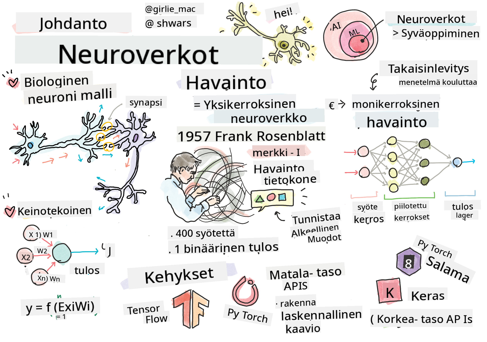
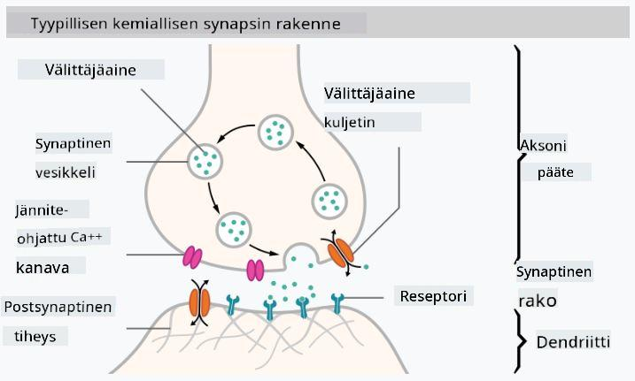

<!--
CO_OP_TRANSLATOR_METADATA:
{
  "original_hash": "1c6b8c7c1778a35fc1139b7f2aecb7b3",
  "translation_date": "2025-08-28T19:45:24+00:00",
  "source_file": "lessons/3-NeuralNetworks/README.md",
  "language_code": "fi"
}
-->
# Johdanto neuroverkkoihin

Kuten keskustelimme johdannossa, yksi tapa saavuttaa älykkyyttä on kouluttaa **tietokonemalli** tai **keinotekoinen aivo**. 1900-luvun puolivälistä lähtien tutkijat kokeilivat erilaisia matemaattisia malleja, kunnes viime vuosina tämä suunta osoittautui erittäin menestyksekkääksi. Näitä aivojen matemaattisia malleja kutsutaan **neuroverkoiksi**.

> Neuroverkkoja kutsutaan joskus *keinotekoisiksi neuroverkoiksi* (Artificial Neural Networks, ANNs) korostaakseen, että kyseessä ovat mallit, eivät oikeat hermosolujen verkostot.

## Koneoppiminen

Neuroverkot ovat osa laajempaa tieteenalaa nimeltä **koneoppiminen**, jonka tavoitteena on käyttää dataa tietokonemallien kouluttamiseen ongelmien ratkaisemiseksi. Koneoppiminen muodostaa suuren osan tekoälystä, mutta emme käsittele perinteistä koneoppimista tässä oppimateriaalissa.

> Tutustu erilliseen **[Koneoppiminen aloittelijoille](http://github.com/microsoft/ml-for-beginners)** -opetussuunnitelmaamme oppiaksesi lisää perinteisestä koneoppimisesta.

Koneoppimisessa oletamme, että meillä on jokin esimerkkien **X** datasetti ja vastaavat tulosarvot **Y**. Esimerkit ovat usein N-ulotteisia vektoreita, jotka koostuvat **piirteistä**, ja tuloksia kutsutaan **luokiksi**.

Käsittelemme kahta yleisintä koneoppimisongelmaa:

* **Luokittelu**, jossa meidän täytyy luokitella syöteobjekti kahteen tai useampaan luokkaan.
* **Regressio**, jossa meidän täytyy ennustaa numeerinen arvo jokaiselle syötenäytteelle.

> Kun syötteet ja tulokset esitetään tensoreina, syötedatasetti on M×N-kokoinen matriisi, jossa M on näytteiden määrä ja N on piirteiden määrä. Tulosluokat Y ovat M-kokoinen vektori.

Tässä oppimateriaalissa keskitymme vain neuroverkkopohjaisiin malleihin.

## Hermosolun malli

Biologiasta tiedämme, että aivomme koostuvat hermosoluista, joilla jokaisella on useita "tuloja" (aksonit) ja yksi lähtö (dendriitti). Aksonit ja dendriitit voivat johtaa sähköisiä signaaleja, ja aksonien ja dendriittien väliset yhteydet voivat osoittaa erilaisia johtavuusasteita (joita säätelevät välittäjäaineet).

 | 
----|----
Oikea hermosolu *([Kuva](https://en.wikipedia.org/wiki/Synapse#/media/File:SynapseSchematic_lines.svg) Wikipediasta)* | Keinotekoinen hermosolu *(Kuva tekijältä)*

Näin ollen yksinkertaisin matemaattinen hermosolumalli sisältää useita tuloja X1, ..., XN ja yhden lähdön Y sekä joukon painoja W1, ..., WN. Lähtö lasketaan seuraavasti:

missä f on jokin epälineaarinen **aktivointifunktio**.

> Varhaiset hermosolumallit kuvattiin klassisessa artikkelissa [A logical calculus of the ideas immanent in nervous activity](https://www.cs.cmu.edu/~./epxing/Class/10715/reading/McCulloch.and.Pitts.pdf), jonka kirjoittivat Warren McCullock ja Walter Pitts vuonna 1943. Donald Hebb ehdotti kirjassaan "[The Organization of Behavior: A Neuropsychological Theory](https://books.google.com/books?id=VNetYrB8EBoC)" tapaa, jolla näitä verkkoja voidaan kouluttaa.

## Tässä osiossa

Tässä osiossa opimme:
* [Perceptronista](03-Perceptron/README.md), joka on yksi varhaisimmista neuroverkkopohjaisista malleista kaksiluokkaiseen luokitteluun
* [Monikerroksisista verkoista](04-OwnFramework/README.md) ja siihen liittyvästä muistikirjasta [kuinka rakentaa oma kehys](04-OwnFramework/OwnFramework.ipynb)
* [Neuroverkkokehityksestä](05-Frameworks/README.md) ja näistä muistikirjoista: [PyTorch](05-Frameworks/IntroPyTorch.ipynb) ja [Keras/Tensorflow](05-Frameworks/IntroKerasTF.ipynb)
* [Ylitrainauksesta](../../../../lessons/3-NeuralNetworks/05-Frameworks)

---

**Vastuuvapauslauseke**:  
Tämä asiakirja on käännetty käyttämällä tekoälypohjaista käännöspalvelua [Co-op Translator](https://github.com/Azure/co-op-translator). Vaikka pyrimme tarkkuuteen, huomioithan, että automaattiset käännökset voivat sisältää virheitä tai epätarkkuuksia. Alkuperäinen asiakirja sen alkuperäisellä kielellä tulisi pitää ensisijaisena lähteenä. Kriittisen tiedon osalta suositellaan ammattimaista ihmiskäännöstä. Emme ole vastuussa väärinkäsityksistä tai virhetulkinnoista, jotka johtuvat tämän käännöksen käytöstä.