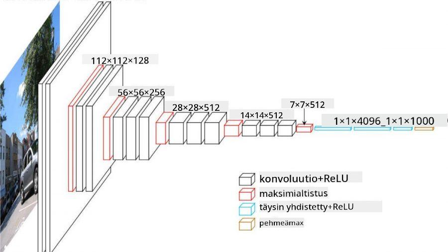

<!--
CO_OP_TRANSLATOR_METADATA:
{
  "original_hash": "2f7b97b375358cb51a1e098df306bf73",
  "translation_date": "2025-08-28T19:24:49+00:00",
  "source_file": "lessons/4-ComputerVision/07-ConvNets/CNN_Architectures.md",
  "language_code": "fi"
}
-->
# Tunnetut CNN-arkkitehtuurit

### VGG-16

VGG-16 on verkko, joka saavutti 92,7 % tarkkuuden ImageNetin top-5-luokittelussa vuonna 2014. Sen kerrosrakenne on seuraava:

Kuten näet, VGG noudattaa perinteistä pyramidirakennetta, joka koostuu konvoluutio- ja pooling-kerrosten sarjasta.

> Kuva [Researchgate](https://www.researchgate.net/figure/Vgg16-model-structure-To-get-the-VGG-NIN-model-we-replace-the-2-nd-4-th-6-th-7-th_fig2_335194493) -sivustolta

### ResNet

ResNet on Microsoft Researchin vuonna 2015 ehdottama malliperhe. ResNetin pääidea on käyttää **residuaalilohkoja**:

> Kuva [tästä artikkelista](https://arxiv.org/pdf/1512.03385.pdf)

Identiteettisiirron käyttö mahdollistaa sen, että kerros ennustaa **erotuksen** edellisen kerroksen tuloksen ja residuaalilohkon ulostulon välillä - tästä nimi *residuaali*. Näitä lohkoja on helpompi kouluttaa, ja niiden avulla voidaan rakentaa verkkoja, joissa on satoja tällaisia lohkoja (yleisimmät variantit ovat ResNet-52, ResNet-101 ja ResNet-152).

Tätä verkkoa voi myös ajatella sellaisena, joka mukauttaa monimutkaisuutensa datan mukaan. Aluksi, kun verkkoa aletaan kouluttaa, painot ovat pieniä, ja suurin osa signaalista kulkee identiteettikerrosten läpi. Koulutuksen edetessä ja painojen kasvaessa verkon parametrien merkitys kasvaa, ja verkko mukautuu saavuttaakseen tarvittavan ilmaisukyvyn luokitellakseen koulutuskuvat oikein.

### Google Inception

Google Inception -arkkitehtuuri vie tämän idean askeleen pidemmälle ja rakentaa jokaisen verkon kerroksen useiden eri polkujen yhdistelmänä:

> Kuva [Researchgate](https://www.researchgate.net/figure/Inception-module-with-dimension-reductions-left-and-schema-for-Inception-ResNet-v1_fig2_355547454) -sivustolta

Tässä on tärkeää korostaa 1x1-konvoluutioiden roolia, sillä aluksi ne eivät vaikuta järkeviltä. Miksi käyttäisimme 1x1-suodatinta kuvan läpikäymiseen? On kuitenkin muistettava, että konvoluutiosuodattimet toimivat myös useiden syvyyskanavien kanssa (alun perin - RGB-värit, myöhemmissä kerroksissa - eri suodattimien kanavat), ja 1x1-konvoluutiota käytetään näiden syöttökanavien yhdistämiseen eri koulutettavilla painoilla. Sitä voidaan myös pitää kanavien välisenä alasnäytteistyksenä (pooling).

Tässä on [hyvä blogikirjoitus](https://medium.com/analytics-vidhya/talented-mr-1x1-comprehensive-look-at-1x1-convolution-in-deep-learning-f6b355825578) aiheesta ja [alkuperäinen artikkeli](https://arxiv.org/pdf/1312.4400.pdf).

### MobileNet

MobileNet on malliperhe, jonka koko on pienennetty, ja se soveltuu mobiililaitteille. Käytä niitä, jos resurssit ovat rajalliset ja voit tinkiä hieman tarkkuudesta. Niiden pääidea on niin sanottu **syvyyssuuntainen erilliskonvoluutio**, joka mahdollistaa konvoluutiosuodattimien esittämisen tilallisten konvoluutioiden ja syvyyskanavien 1x1-konvoluution yhdistelmänä. Tämä vähentää merkittävästi parametrien määrää, mikä tekee verkosta pienemmän ja helpomman kouluttaa vähemmällä datalla.

Tässä on [hyvä blogikirjoitus MobileNetistä](https://medium.com/analytics-vidhya/image-classification-with-mobilenet-cc6fbb2cd470).

## Yhteenveto

Tässä osiossa opit konvoluutioverkkojen pääperiaatteet, jotka ovat tietokonenäön hermoverkkojen perusta. Reaaliaikaiset arkkitehtuurit, jotka mahdollistavat kuvien luokittelun, objektien tunnistuksen ja jopa kuvien generoinnin, perustuvat kaikki CNN-verkkoihin, mutta niissä on enemmän kerroksia ja joitakin lisäkoulutustemppuja.

## 🚀 Haaste

Mukana olevissa muistikirjoissa on alareunassa muistiinpanoja siitä, miten saavuttaa parempi tarkkuus. Tee kokeita nähdäksesi, voitko saavuttaa korkeamman tarkkuuden.

## [Luennon jälkeinen kysely](https://ff-quizzes.netlify.app/en/ai/quiz/14)

## Kertaus ja itseopiskelu

Vaikka CNN-verkkoja käytetään useimmiten tietokonenäkötehtäviin, ne soveltuvat yleisesti kiinteän kokoisten kuvioiden tunnistamiseen. Esimerkiksi, jos käsittelemme ääniä, voimme käyttää CNN-verkkoja etsimään tiettyjä kuvioita äänisignaalista - tällöin suodattimet olisivat 1-ulotteisia (ja tätä CNN-verkkoa kutsuttaisiin 1D-CNN:ksi). Lisäksi joskus käytetään 3D-CNN-verkkoja piirteiden tunnistamiseen moniulotteisessa tilassa, kuten tiettyjen tapahtumien havaitsemiseen videoilla - CNN voi tunnistaa tiettyjä piirteiden muutoksia ajan kuluessa. Tee kertausta ja itseopiskelua muista tehtävistä, joita CNN-verkkojen avulla voidaan suorittaa.

## [Tehtävä](lab/README.md)

Tässä laboratoriossa tehtävänäsi on luokitella eri kissan- ja koirarotuja. Nämä kuvat ovat monimutkaisempia kuin MNIST-datasetti, niiden ulottuvuudet ovat suuremmat, ja luokkia on yli 10.

---

**Vastuuvapauslauseke**:  
Tämä asiakirja on käännetty käyttämällä tekoälypohjaista käännöspalvelua [Co-op Translator](https://github.com/Azure/co-op-translator). Vaikka pyrimme tarkkuuteen, huomioithan, että automaattiset käännökset voivat sisältää virheitä tai epätarkkuuksia. Alkuperäinen asiakirja sen alkuperäisellä kielellä tulisi pitää ensisijaisena lähteenä. Kriittisen tiedon osalta suositellaan ammattimaista ihmiskäännöstä. Emme ole vastuussa väärinkäsityksistä tai virhetulkinnoista, jotka johtuvat tämän käännöksen käytöstä.