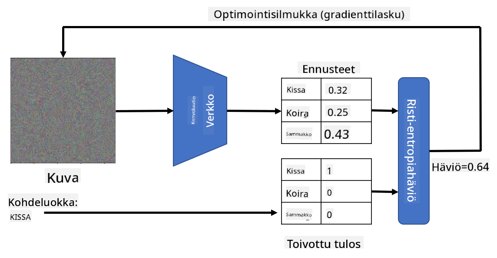

<!--
CO_OP_TRANSLATOR_METADATA:
{
  "original_hash": "178c0b5ee5395733eb18aec51e71a0a9",
  "translation_date": "2025-09-23T09:56:44+00:00",
  "source_file": "lessons/4-ComputerVision/08-TransferLearning/README.md",
  "language_code": "fi"
}
-->
# Esikoulutetut verkot ja siirtäminen oppiminen

CNN:ien kouluttaminen voi viedä paljon aikaa, ja siihen tarvitaan runsaasti dataa. Suuri osa ajasta kuluu kuitenkin parhaita matalan tason suodattimia oppiessa, joita verkko voi käyttää kuvioiden tunnistamiseen kuvista. Luonnollinen kysymys herää - voimmeko käyttää yhdellä datasetillä koulutettua neuroverkkoa ja mukauttaa sen luokittelemaan erilaisia kuvia ilman täydellistä koulutusprosessia?

## [Pre-lecture quiz](https://ff-quizzes.netlify.app/en/ai/quiz/15)

Tätä lähestymistapaa kutsutaan **siirtämiseksi oppimiseksi**, koska siirrämme tietoa yhdestä neuroverkkon mallista toiseen. Siirtämisessä oppimisessa aloitamme yleensä esikoulutetulla mallilla, joka on koulutettu suurella kuvadatasetillä, kuten **ImageNet**. Nämä mallit osaavat jo hyvin tunnistaa erilaisia piirteitä yleisistä kuvista, ja monissa tapauksissa pelkkä luokittelijan rakentaminen näiden piirteiden päälle voi tuottaa hyviä tuloksia.

> ✅ Siirtäminen oppiminen on termi, joka esiintyy myös muilla akateemisilla aloilla, kuten kasvatustieteessä. Se viittaa prosessiin, jossa tietoa siirretään yhdeltä alueelta toiselle.

## Esikoulutetut mallit piirteiden tunnistajina

Edellisessä osiossa käsitellyt konvoluutiot sisältävät useita kerroksia, joista jokainen on tarkoitettu tunnistamaan piirteitä kuvasta, alkaen matalan tason pikseliyhdistelmistä (kuten vaakasuora/pystysuora viiva tai veto) ja päätyen korkeampien tasojen piirteisiin, jotka vastaavat esimerkiksi liekin silmää. Jos koulutamme CNN:n riittävän suurella datasetillä, joka sisältää yleisiä ja monipuolisia kuvia, verkon pitäisi oppia tunnistamaan nämä yleiset piirteet.

Sekä Keras että PyTorch sisältävät toimintoja, joilla voi helposti ladata esikoulutettuja neuroverkon painoja joillekin yleisille arkkitehtuureille, joista useimmat on koulutettu ImageNet-kuvilla. Useimmin käytetyt arkkitehtuurit on kuvattu [CNN Architectures](../07-ConvNets/CNN_Architectures.md) -sivulla edellisessä oppitunnissa. Erityisesti kannattaa harkita seuraavia:

* **VGG-16/VGG-19**, jotka ovat suhteellisen yksinkertaisia malleja mutta tuottavat silti hyvää tarkkuutta. VGG:n käyttö ensimmäisenä kokeiluna on hyvä valinta, kun halutaan nähdä, miten siirtäminen oppiminen toimii.
* **ResNet**, Microsoft Researchin vuonna 2015 ehdottama malliperhe. Näissä on enemmän kerroksia, ja ne vaativat enemmän resursseja.
* **MobileNet**, pienennettyjen mallien perhe, joka sopii mobiililaitteille. Käytä niitä, jos sinulla on rajalliset resurssit ja voit tinkiä hieman tarkkuudesta.

Tässä on esimerkki piirteistä, jotka VGG-16-verkko on tunnistanut kissan kuvasta:

## Kissojen ja koirien datasetti

Tässä esimerkissä käytämme [Kissojen ja koirien](https://www.microsoft.com/download/details.aspx?id=54765&WT.mc_id=academic-77998-cacaste) datasettiä, joka on hyvin lähellä todellista kuvanluokitteluskenaariota.

## ✍️ Harjoitus: Siirtäminen oppiminen

Katsotaan siirtämistä oppimista käytännössä vastaavissa muistikirjoissa:

* [Siirtäminen oppiminen - PyTorch](TransferLearningPyTorch.ipynb)
* [Siirtäminen oppiminen - TensorFlow](TransferLearningTF.ipynb)

## Adversaarisen kissan visualisointi

Esikoulutettu neuroverkko sisältää erilaisia kuvioita "aivoissaan", mukaan lukien käsityksiä **ihanteellisesta kissasta** (sekä ihanteellisesta koirasta, ihanteellisesta seeprasta jne.). Olisi mielenkiintoista jotenkin **visualisoida tämä kuva**. Tämä ei kuitenkaan ole yksinkertaista, koska kuviot ovat hajautettu verkon painoihin ja järjestetty hierarkkiseen rakenteeseen.

Yksi lähestymistapa on aloittaa satunnaisesta kuvasta ja yrittää käyttää **gradient descent -optimointitekniikkaa** säätämään kuvaa niin, että verkko alkaa ajatella sen olevan kissa.

Jos teemme näin, saamme jotain hyvin satunnaisen kohinan kaltaista. Tämä johtuu siitä, että *on monia tapoja saada verkko ajattelemaan, että syötekuva on kissa*, mukaan lukien sellaisia, jotka eivät ole visuaalisesti järkeviä. Vaikka nämä kuvat sisältävät paljon kissalle tyypillisiä kuvioita, mikään ei rajoita niitä olemaan visuaalisesti erottuvia.

Tuloksen parantamiseksi voimme lisätä toisen termin häviöfunktioon, jota kutsutaan **variation loss** -termiksi. Se on mittari, joka osoittaa, kuinka samanlaisia kuvan vierekkäiset pikselit ovat. Variation lossin minimointi tekee kuvasta tasaisemman ja poistaa kohinaa - paljastaen visuaalisesti miellyttävämpiä kuvioita. Tässä esimerkki tällaisista "ihanteellisista" kuvista, jotka luokitellaan kissaksi ja seepraksi suurella todennäköisyydellä:

 | 
-----|-----
 *Ihanteellinen kissa* | *Ihanteellinen seepra*

Samaa lähestymistapaa voidaan käyttää suorittamaan niin sanottuja **adversaarisia hyökkäyksiä** neuroverkkoon. Oletetaan, että haluamme huijata neuroverkkoa ja saada koiran näyttämään kissalta. Jos otamme koiran kuvan, jonka verkko tunnistaa koiraksi, voimme sitten säätää sitä hieman gradient descent -optimoinnin avulla, kunnes verkko alkaa luokitella sen kissaksi:

 | 
-----|-----
*Alkuperäinen kuva koirasta* | *Kuva koirasta, joka luokitellaan kissaksi*

Katso koodi yllä olevien tulosten toistamiseen seuraavasta muistikirjasta:

* [Ihanteellinen ja adversaarinen kissa - TensorFlow](AdversarialCat_TF.ipynb)

## Yhteenveto

Siirtämisen oppimisen avulla voit nopeasti rakentaa luokittelijan mukautettuun objektinluokittelutehtävään ja saavuttaa korkean tarkkuuden. Näet, että monimutkaisemmat tehtävät, joita nyt ratkaisemme, vaativat suurempaa laskentatehoa, eikä niitä voida helposti ratkaista CPU:lla. Seuraavassa osiossa yritämme käyttää kevyempää toteutusta saman mallin kouluttamiseen pienemmillä laskentaresursseilla, mikä johtaa vain hieman alhaisempaan tarkkuuteen.

## 🚀 Haaste

Mukana olevissa muistikirjoissa on alaviitteitä siitä, miten siirtämisen oppiminen toimii parhaiten jossain määrin samanlaisen koulutusdatan kanssa (esimerkiksi uusi eläinlaji). Tee kokeiluja täysin uusilla kuvatyypeillä nähdäksesi, kuinka hyvin tai huonosti siirtämisen oppimisen mallit toimivat.

## [Post-lecture quiz](https://ff-quizzes.netlify.app/en/ai/quiz/16)

## Kertaus ja itseopiskelu

Lue [TrainingTricks.md](TrainingTricks.md) syventääksesi tietämystäsi muista tavoista kouluttaa mallejasi.

## [Tehtävä](lab/README.md)

Tässä laboratoriossa käytämme todellista [Oxford-IIIT](https://www.robots.ox.ac.uk/~vgg/data/pets/) lemmikkieläindatasettiä, joka sisältää 35 kissan- ja koirarotua, ja rakennamme siirtämisen oppimisen luokittelijan.

---

