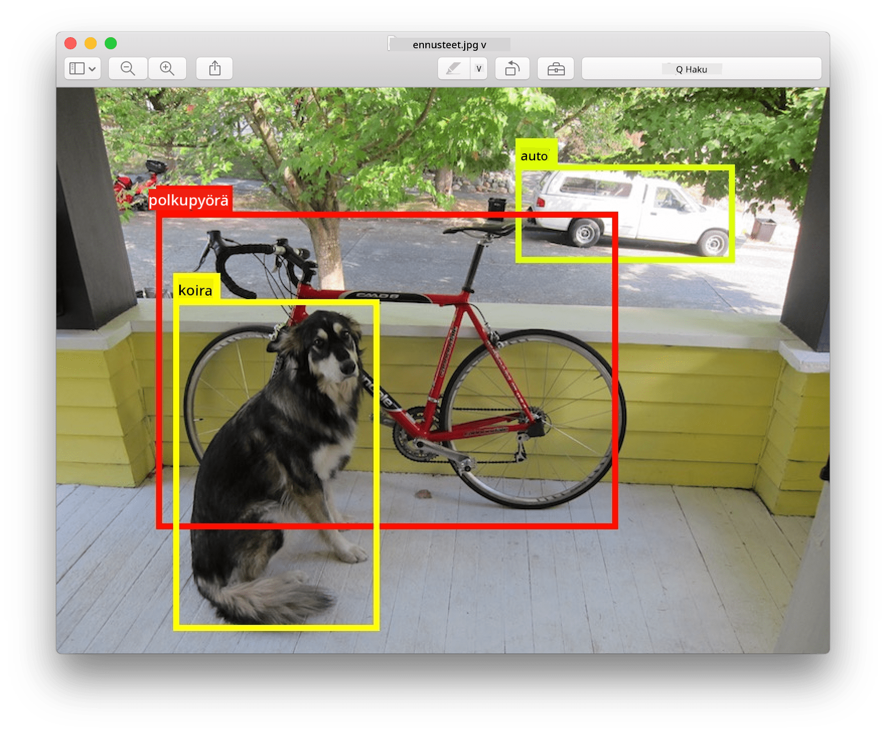
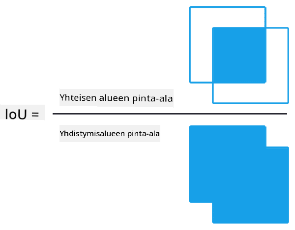
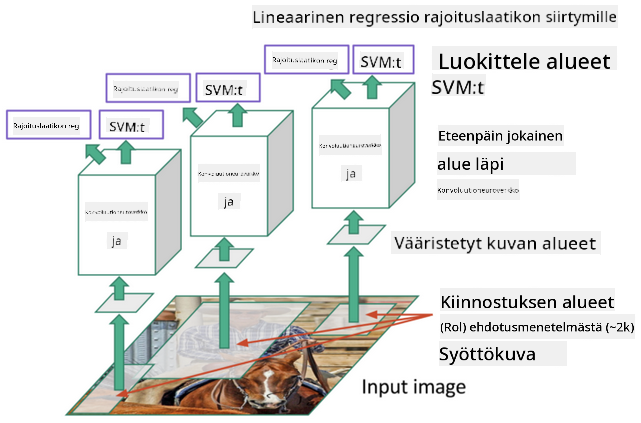
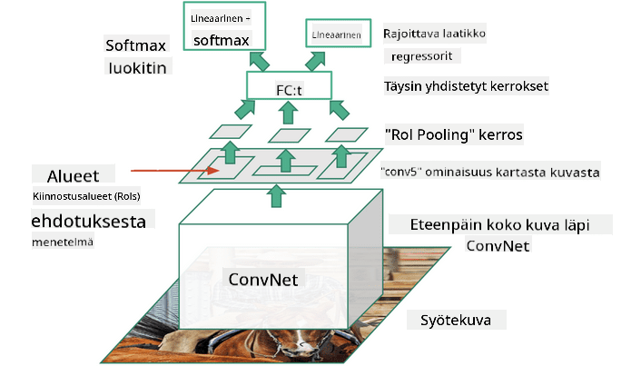
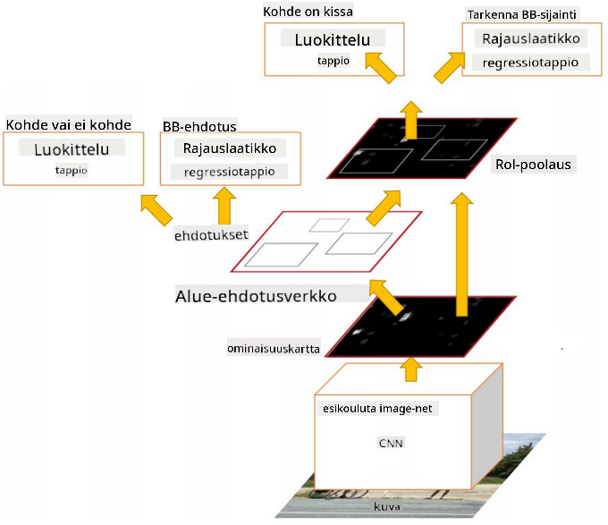
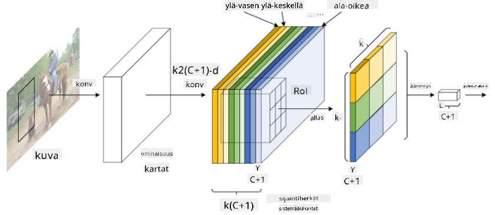

<!--
CO_OP_TRANSLATOR_METADATA:
{
  "original_hash": "d76a7eda28de5210c8b1ba50a6216c69",
  "translation_date": "2025-09-23T09:57:41+00:00",
  "source_file": "lessons/4-ComputerVision/11-ObjectDetection/README.md",
  "language_code": "fi"
}
-->
# Objektien tunnistus

Kuvien luokittelumallit, joita olemme tähän mennessä käsitelleet, ottavat kuvan ja tuottavat kategorisen tuloksen, kuten luokan 'numero' MNIST-ongelmassa. Monissa tapauksissa emme kuitenkaan halua vain tietää, että kuva esittää objekteja – haluamme pystyä määrittämään niiden tarkka sijainti. Juuri tähän **objektien tunnistus** keskittyy.

## [Pre-lecture quiz](https://ff-quizzes.netlify.app/en/ai/quiz/21)

> Kuva [YOLO v2 -verkkosivustolta](https://pjreddie.com/darknet/yolov2/)

## Naiivi lähestymistapa objektien tunnistukseen

Oletetaan, että haluaisimme löytää kissan kuvasta. Hyvin yksinkertainen lähestymistapa objektien tunnistukseen voisi olla seuraava:

1. Pilko kuva useiksi ruuduiksi.
2. Suorita kuvien luokittelu jokaiselle ruudulle.
3. Ruudut, jotka tuottavat riittävän korkean aktivoinnin, voidaan katsoa sisältävän kyseisen objektin.

> *Kuva [harjoitusmuistiosta](ObjectDetection-TF.ipynb)*

Tämä lähestymistapa on kuitenkin kaukana ihanteellisesta, koska se sallii algoritmin määrittää objektin rajauslaatikon sijainnin vain hyvin epätarkasti. Tarkempaa sijaintia varten meidän täytyy käyttää jonkinlaista **regressiota** ennustamaan rajauslaatikoiden koordinaatit – ja tätä varten tarvitsemme erityisiä tietoaineistoja.

## Regressio objektien tunnistukseen

[Tämä blogikirjoitus](https://towardsdatascience.com/object-detection-with-neural-networks-a4e2c46b4491) tarjoaa hyvän johdannon muotojen tunnistukseen.

## Tietoaineistot objektien tunnistukseen

Tässä tehtävässä saatat törmätä seuraaviin tietoaineistoihin:

* [PASCAL VOC](http://host.robots.ox.ac.uk/pascal/VOC/) – 20 luokkaa
* [COCO](http://cocodataset.org/#home) – Common Objects in Context. 80 luokkaa, rajauslaatikot ja segmentointimaskit

## Objektien tunnistuksen mittarit

### Intersection over Union

Kuvien luokittelussa algoritmin suorituskyvyn mittaaminen on helppoa, mutta objektien tunnistuksessa meidän täytyy mitata sekä luokan oikeellisuus että ennustetun rajauslaatikon sijainnin tarkkuus. Jälkimmäistä varten käytämme niin kutsuttua **Intersection over Union** (IoU) -mittaria, joka mittaa, kuinka hyvin kaksi laatikkoa (tai kaksi satunnaista aluetta) menevät päällekkäin.

> *Kuva 2 [tästä erinomaisesta IoU-blogikirjoituksesta](https://pyimagesearch.com/2016/11/07/intersection-over-union-iou-for-object-detection/)*

Idea on yksinkertainen – jaamme kahden kuvion leikkausalueen pinta-alan niiden yhdistymisalueen pinta-alalla. Kahdelle identtiselle alueelle IoU olisi 1, kun taas täysin erillisille alueille se olisi 0. Muuten se vaihtelee välillä 0–1. Tyypillisesti otamme huomioon vain ne rajauslaatikot, joiden IoU ylittää tietyn arvon.

### Keskiarvoinen tarkkuus (Average Precision)

Oletetaan, että haluamme mitata, kuinka hyvin tietty objektiluokka $C$ tunnistetaan. Tätä varten käytämme **keskiarvoista tarkkuutta** (Average Precision), joka lasketaan seuraavasti:

1. Tarkastellaan tarkkuus-kutsukäyrää, joka näyttää tarkkuuden tunnistuskynnyksen arvon (0–1) mukaan.
2. Kynnyksen mukaan saamme enemmän tai vähemmän objekteja tunnistettua kuvasta, ja tarkkuuden ja kutsun arvot vaihtelevat.
3. Käyrä näyttää tältä:

> *Kuva [NeuroWorkshopista](http://github.com/shwars/NeuroWorkshop)*

Keskiarvoinen tarkkuus tietylle luokalle $C$ on tämän käyrän alla oleva pinta-ala. Tarkemmin sanottuna kutsu-akseli jaetaan tyypillisesti 10 osaan, ja tarkkuus keskiarvoistetaan kaikissa näissä pisteissä:

$$
AP = {1\over11}\sum_{i=0}^{10}\mbox{Precision}(\mbox{Recall}={i\over10})
$$

### AP ja IoU

Otamme huomioon vain ne tunnistukset, joiden IoU ylittää tietyn arvon. Esimerkiksi PASCAL VOC -tietoaineistossa tyypillisesti $\mbox{IoU Threshold} = 0.5$, kun taas COCO:ssa AP mitataan eri $\mbox{IoU Threshold}$-arvoille.

> *Kuva [NeuroWorkshopista](http://github.com/shwars/NeuroWorkshop)*

### Keskiarvoinen tarkkuus (Mean Average Precision - mAP)

Objektien tunnistuksen päämittari on **keskiarvoinen tarkkuus**, eli **mAP**. Se on keskiarvoisen tarkkuuden arvo, keskiarvoistettuna kaikkien objektiluokkien yli, ja joskus myös $\mbox{IoU Threshold}$-arvojen yli. Tarkempi kuvaus **mAP**-laskentaprosessista löytyy
[tästä blogikirjoituksesta](https://medium.com/@timothycarlen/understanding-the-map-evaluation-metric-for-object-detection-a07fe6962cf3)), sekä [täältä koodiesimerkkien kanssa](https://gist.github.com/tarlen5/008809c3decf19313de216b9208f3734).

## Eri lähestymistavat objektien tunnistukseen

Objektien tunnistusalgoritmit voidaan jakaa kahteen pääluokkaan:

* **Alue-ehdotusverkot** (R-CNN, Fast R-CNN, Faster R-CNN). Pääidea on luoda **kiinnostusalueita** (ROI) ja ajaa CNN niiden yli, etsien maksimaalista aktivointia. Tämä on hieman samanlainen kuin naiivi lähestymistapa, mutta ROI:t luodaan älykkäämmin. Yksi suurimmista haittapuolista tällaisissa menetelmissä on niiden hitaus, koska CNN-luokittelijaa täytyy ajaa kuvan yli monta kertaa.
* **Yhden passin** (YOLO, SSD, RetinaNet) menetelmät. Näissä arkkitehtuureissa verkko suunnitellaan ennustamaan sekä luokat että ROI:t yhdellä passilla.

### R-CNN: Aluepohjainen CNN

[R-CNN](http://islab.ulsan.ac.kr/files/announcement/513/rcnn_pami.pdf) käyttää [Selective Search](http://www.huppelen.nl/publications/selectiveSearchDraft.pdf) -menetelmää luomaan hierarkkisen rakenteen ROI-alueista, jotka sitten syötetään CNN-ominaisuuksien erottimiin ja SVM-luokittelijoihin objektin luokan määrittämiseksi, sekä lineaariseen regressioon *rajauslaatikon* koordinaattien määrittämiseksi. [Virallinen artikkeli](https://arxiv.org/pdf/1506.01497v1.pdf)

> *Kuva van de Sande et al. ICCV’11*

> *Kuvat [tästä blogista](https://towardsdatascience.com/r-cnn-fast-r-cnn-faster-r-cnn-yolo-object-detection-algorithms-36d53571365e)*

### F-RCNN - Fast R-CNN

Tämä lähestymistapa on samanlainen kuin R-CNN, mutta alueet määritellään vasta konvoluutiokerrosten soveltamisen jälkeen.

> Kuva [virallisesta artikkelista](https://www.cv-foundation.org/openaccess/content_iccv_2015/papers/Girshick_Fast_R-CNN_ICCV_2015_paper.pdf), [arXiv](https://arxiv.org/pdf/1504.08083.pdf), 2015

### Faster R-CNN

Tämän lähestymistavan pääidea on käyttää neuroverkkoa ennustamaan ROI:t – niin kutsuttu *Region Proposal Network*. [Artikkeli](https://arxiv.org/pdf/1506.01497.pdf), 2016

> Kuva [virallisesta artikkelista](https://arxiv.org/pdf/1506.01497.pdf)

### R-FCN: Aluepohjainen täysin konvoluutioverkko

Tämä algoritmi on jopa nopeampi kuin Faster R-CNN. Pääidea on seuraava:

1. Ominaisuudet erotetaan ResNet-101:llä.
2. Ominaisuudet käsitellään **Position-Sensitive Score Map** -kartalla. Jokainen objekti luokasta $C$ jaetaan $k\times k$ alueisiin, ja verkkoa koulutetaan ennustamaan objektien osia.
3. Jokaiselle osalle $k\times k$ alueista kaikki verkot äänestävät objektin luokista, ja eniten ääniä saanut luokka valitaan.

> Kuva [virallisesta artikkelista](https://arxiv.org/abs/1605.06409)

### YOLO - You Only Look Once

YOLO on reaaliaikainen yhden passin algoritmi. Pääidea on seuraava:

 * Kuva jaetaan $S\times S$ alueisiin.
 * Jokaiselle alueelle **CNN** ennustaa $n$ mahdollista objektia, *rajauslaatikon* koordinaatit ja *luottamus*=*todennäköisyys* * IoU.

 

> Kuva [virallisesta artikkelista](https://arxiv.org/abs/1506.02640)

### Muut algoritmit

* RetinaNet: [virallinen artikkeli](https://arxiv.org/abs/1708.02002)
   - [PyTorch-toteutus Torchvisionissa](https://pytorch.org/vision/stable/_modules/torchvision/models/detection/retinanet.html)
   - [Keras-toteutus](https://github.com/fizyr/keras-retinanet)
   - [Objektien tunnistus RetinaNetillä](https://keras.io/examples/vision/retinanet/) Keras-esimerkeissä
* SSD (Single Shot Detector): [virallinen artikkeli](https://arxiv.org/abs/1512.02325)

## ✍️ Harjoitukset: Objektien tunnistus

Jatka oppimista seuraavassa muistiossa:

[ObjectDetection.ipynb](ObjectDetection.ipynb)

## Yhteenveto

Tässä oppitunnissa tutustuit moniin eri tapoihin, joilla objektien tunnistus voidaan toteuttaa!

## 🚀 Haaste

Lue nämä artikkelit ja muistiot YOLO:sta ja kokeile niitä itse:

* [Hyvä blogikirjoitus](https://www.analyticsvidhya.com/blog/2018/12/practical-guide-object-detection-yolo-framewor-python/) YOLO:sta
 * [Virallinen sivusto](https://pjreddie.com/darknet/yolo/)
 * Yolo: [Keras-toteutus](https://github.com/experiencor/keras-yolo2), [askel-askeleelta muistio](https://github.com/experiencor/basic-yolo-keras/blob/master/Yolo%20Step-by-Step.ipynb)
 * Yolo v2: [Keras-toteutus](https://github.com/experiencor/keras-yolo2), [askel-askeleelta muistio](https://github.com/experiencor/keras-yolo2/blob/master/Yolo%20Step-by-Step.ipynb)

## [Post-lecture quiz](https://ff-quizzes.netlify.app/en/ai/quiz/22)

## Kertaus & Itseopiskelu

* [Objektien tunnistus](https://tjmachinelearning.com/lectures/1718/obj/) kirjoittanut Nikhil Sardana
* [Hyvä vertailu objektien tunnistusalgoritmeista](https://lilianweng.github.io/lil-log/2018/12/27/object-detection-part-4.html)
* [Katsaus syväoppimisalgoritmeihin objektien tunnistuksessa](https://medium.com/comet-app/review-of-deep-learning-algorithms-for-object-detection-c1f3d437b852)
* [Perusteellinen johdanto objektien tunnistusalgoritmeihin askel askeleelta](https://www.analyticsvidhya.com/blog/2018/10/a-step-by-step-introduction-to-the-basic-object-detection-algorithms-part-1/)
* [Faster R-CNN:n toteutus Pythonilla objektien tunnistukseen](https://www.analyticsvidhya.com/blog/2018/11/implementation-faster-r-cnn-python-object-detection/)

## [Tehtävä: Objektien tunnistus](lab/README.md)

---

