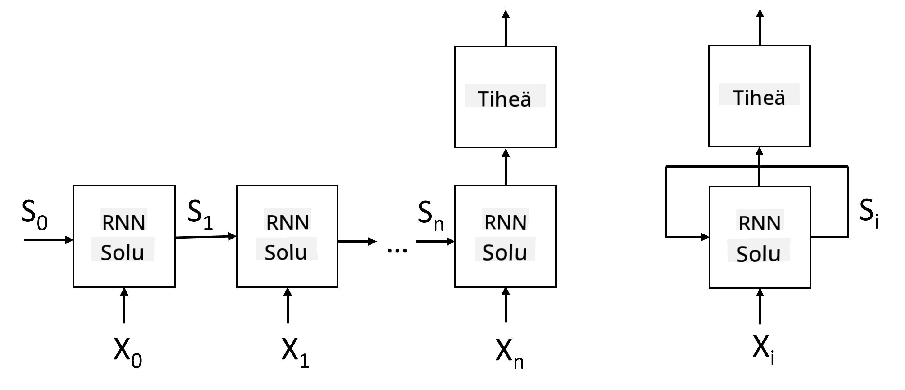

<!--
CO_OP_TRANSLATOR_METADATA:
{
  "original_hash": "e2273cc150380a5e191903cea858f021",
  "translation_date": "2025-09-23T10:04:31+00:00",
  "source_file": "lessons/5-NLP/16-RNN/README.md",
  "language_code": "fi"
}
-->
# Toistuvat Neuronaaliverkot

## [Ennakkokysely](https://ff-quizzes.netlify.app/en/ai/quiz/31)

Aiemmissa osioissa olemme käyttäneet tekstin semanttisia esityksiä ja yksinkertaista lineaarista luokittelijaa upotusten päällä. Tämä arkkitehtuuri pyrkii vangitsemaan sanojen yhdistetyn merkityksen lauseessa, mutta se ei ota huomioon sanojen **järjestystä**, koska upotusten päälle tehty aggregointitoiminto poistaa tämän tiedon alkuperäisestä tekstistä. Koska nämä mallit eivät pysty mallintamaan sanojen järjestystä, ne eivät voi ratkaista monimutkaisempia tai epäselvempiä tehtäviä, kuten tekstin generointia tai kysymysten vastaamista.

Tekstijonon merkityksen vangitsemiseksi meidän on käytettävä toisenlaista neuronaaliverkkoarkkitehtuuria, jota kutsutaan **toistuvaksi neuronaaliverkoksi** eli RNN:ksi. RNN:ssä syötämme lauseen verkon läpi yksi symboli kerrallaan, ja verkko tuottaa jonkin **tilan**, jonka syötämme verkkoon uudelleen seuraavan symbolin kanssa.

> Kuva: kirjoittaja

Kun syötteenä on tokenien jono X0,...,Xn, RNN luo neuronaaliverkkolohkojen jonon ja kouluttaa tämän jonon päästä päähän takaisinkytkennän avulla. Jokainen verkkolohko ottaa syötteenä parin (Xi,Si) ja tuottaa tuloksena Si+1. Lopullinen tila Sn (tai tulos Yn) syötetään lineaariseen luokittelijaan tuloksen tuottamiseksi. Kaikilla verkkolohkoilla on samat painot, ja ne koulutetaan päästä päähän yhdellä takaisinkytkentäkierroksella.

Koska tilavektorit S0,...,Sn kulkevat verkon läpi, se pystyy oppimaan sanojen välisiä järjestyksellisiä riippuvuuksia. Esimerkiksi, kun sana *ei* esiintyy jossain kohtaa jonoa, verkko voi oppia kumoamaan tiettyjä elementtejä tilavektorissa, mikä johtaa negaatioon.

> ✅ Koska kaikkien RNN-lohkojen painot yllä olevassa kuvassa ovat jaettuja, sama kuva voidaan esittää yhtenä lohkona (oikealla) toistuvalla takaisinkytkentäsilmukalla, joka syöttää verkon ulostulotilan takaisin syötteeksi.

## RNN-solun anatomia

Katsotaan, miten yksinkertainen RNN-solu on järjestetty. Se ottaa syötteenä edellisen tilan Si-1 ja nykyisen symbolin Xi, ja sen on tuotettava ulostulotila Si (ja joskus olemme kiinnostuneita myös jostain muusta ulostulosta Yi, kuten generatiivisissa verkoissa).

Yksinkertaisessa RNN-solussa on kaksi painomatriisia: yksi muuntaa syötesymbolin (kutsutaan sitä W:ksi) ja toinen muuntaa syötetilan (H). Tässä tapauksessa verkon ulostulo lasketaan kaavalla &sigma;(W&times;Xi+H&times;Si-1+b), missä &sigma; on aktivointifunktio ja b on lisäbias.

> Kuva: kirjoittaja

Monissa tapauksissa syötetokenit kulkevat upotuskerroksen läpi ennen RNN:ään syöttämistä, jotta ulottuvuus pienenee. Tässä tapauksessa, jos syötevektorien ulottuvuus on *emb_size* ja tilavektorin ulottuvuus on *hid_size*, W:n koko on *emb_size*&times;*hid_size* ja H:n koko on *hid_size*&times;*hid_size*.

## Pitkäkestoiset muistiyksiköt (LSTM)

Yksi klassisten RNN:ien suurimmista ongelmista on niin sanottu **häviävien gradienttien** ongelma. Koska RNN:t koulutetaan päästä päähän yhdellä takaisinkytkentäkierroksella, niillä on vaikeuksia välittää virhettä verkon ensimmäisiin kerroksiin, eikä verkko näin ollen pysty oppimaan kaukaisten tokenien välisiä suhteita. Yksi tapa välttää tämä ongelma on ottaa käyttöön **eksplisiittinen tilanhallinta** käyttämällä niin sanottuja **portteja**. Tällaisia arkkitehtuureja on kaksi tunnettua: **Pitkäkestoinen muistiyksikkö** (LSTM) ja **Porttivälitteinen yksikkö** (GRU).

> Kuvan lähde TBD

LSTM-verkko on järjestetty samalla tavalla kuin RNN, mutta kerroksesta toiseen kulkee kaksi tilaa: varsinainen tila C ja piilotettu vektori H. Jokaisessa yksikössä piilotettu vektori Hi yhdistetään syötteeseen Xi, ja ne ohjaavat, mitä tilalle C tapahtuu **porttien** avulla. Jokainen portti on neuronaaliverkko, jossa on sigmoid-aktivointi (ulostulo välillä [0,1]), ja sitä voidaan ajatella bittimaskina, kun se kerrotaan tilavektorilla. Kuvassa yllä olevat portit (vasemmalta oikealle) ovat:

* **Unohtamisportti** ottaa piilotetun vektorin ja määrittää, mitkä tilavektorin C komponentit tulee unohtaa ja mitkä välittää eteenpäin.
* **Syöttöportti** ottaa tietoa syöte- ja piilotetuista vektoreista ja lisää sen tilaan.
* **Ulostuloportti** muuntaa tilan lineaarisen kerroksen kautta, jossa on *tanh*-aktivointi, ja valitsee sen komponentteja piilotetun vektorin Hi avulla tuottaakseen uuden tilan Ci+1.

Tilan C komponentteja voidaan ajatella lippuina, jotka voidaan kytkeä päälle ja pois. Esimerkiksi, kun kohtaamme nimen *Alice* jaksossa, voimme olettaa, että se viittaa naispuoliseen hahmoon, ja nostaa tilassa lipun, joka kertoo, että lauseessa on naispuolinen substantiivi. Kun myöhemmin kohtaamme fraasin *ja Tom*, nostamme lipun, joka kertoo, että lauseessa on monikollinen substantiivi. Näin manipuloimalla tilaa voimme mahdollisesti seurata lauseen osien kieliopillisia ominaisuuksia.

> ✅ Erinomainen resurssi LSTM:n sisäisen toiminnan ymmärtämiseen on Christopher Olahin artikkeli [Understanding LSTM Networks](https://colah.github.io/posts/2015-08-Understanding-LSTMs/).

## Kaksisuuntaiset ja monikerroksiset RNN:t

Olemme käsitelleet toistuvia verkkoja, jotka toimivat yhteen suuntaan, jaksosta alusta loppuun. Tämä vaikuttaa luonnolliselta, koska se muistuttaa tapaa, jolla luemme ja kuuntelemme puhetta. Kuitenkin, koska monissa käytännön tapauksissa meillä on satunnainen pääsy syötejärjestykseen, voi olla järkevää suorittaa toistuva laskenta molempiin suuntiin. Tällaisia verkkoja kutsutaan **kaksisuuntaisiksi** RNN:iksi. Kaksisuuntaisessa verkossa tarvitsemme kaksi piilotettua tilavektoria, yhden kumpaankin suuntaan.

Toistuva verkko, joko yksisuuntainen tai kaksisuuntainen, tunnistaa tiettyjä kuvioita jaksossa ja voi tallentaa ne tilavektoriin tai välittää ulostuloon. Kuten konvoluutiokerroksissa, voimme rakentaa toisen toistuvan kerroksen ensimmäisen päälle tunnistaaksemme korkeamman tason kuvioita ja rakentaaksemme matalan tason kuvioista, jotka ensimmäinen kerros on tunnistanut. Tämä johtaa käsitteeseen **monikerroksinen RNN**, joka koostuu kahdesta tai useammasta toistuvasta verkosta, joissa edellisen kerroksen ulostulo syötetään seuraavaan kerrokseen.

*Kuva [tästä upeasta artikkelista](https://towardsdatascience.com/from-a-lstm-cell-to-a-multilayer-lstm-network-with-pytorch-2899eb5696f3) kirjoittanut Fernando López*

## ✍️ Harjoitukset: Upotukset

Jatka oppimista seuraavissa muistikirjoissa:

* [RNN:t PyTorchilla](RNNPyTorch.ipynb)
* [RNN:t TensorFlow'lla](RNNTF.ipynb)

## Yhteenveto

Tässä osiossa olemme nähneet, että RNN:itä voidaan käyttää jaksoluokitteluun, mutta itse asiassa ne voivat käsitellä monia muita tehtäviä, kuten tekstin generointia, konekäännöstä ja paljon muuta. Tarkastelemme näitä tehtäviä seuraavassa osiossa.

## 🚀 Haaste

Lue kirjallisuutta LSTM:istä ja pohdi niiden sovelluksia:

- [Grid Long Short-Term Memory](https://arxiv.org/pdf/1507.01526v1.pdf)
- [Show, Attend and Tell: Neural Image Caption
Generation with Visual Attention](https://arxiv.org/pdf/1502.03044v2.pdf)

## [Jälkikysely](https://ff-quizzes.netlify.app/en/ai/quiz/32)

## Kertaus ja itseopiskelu

- [Understanding LSTM Networks](https://colah.github.io/posts/2015-08-Understanding-LSTMs/) kirjoittanut Christopher Olah.

## [Tehtävä: Muistikirjat](assignment.md)

---

