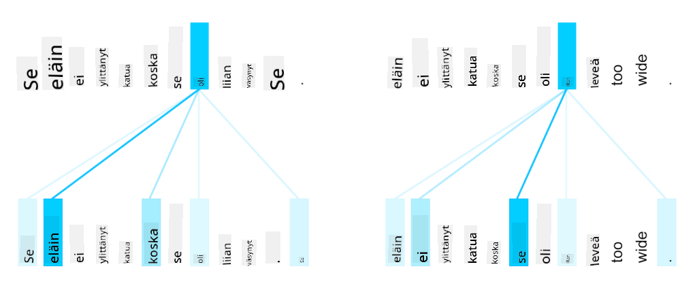

<!--
CO_OP_TRANSLATOR_METADATA:
{
  "original_hash": "f335dfcb4a993920504c387973a36957",
  "translation_date": "2025-09-23T10:03:21+00:00",
  "source_file": "lessons/5-NLP/18-Transformers/README.md",
  "language_code": "fi"
}
-->
# Huomiomekanismit ja Transformerit

## [Ennakkokysely](https://ff-quizzes.netlify.app/en/ai/quiz/35)

Yksi NLP:n tärkeimmistä ongelmista on **konekäännös**, olennainen tehtävä, joka on pohjana esimerkiksi Google Kääntäjälle. Tässä osiossa keskitymme konekäännökseen tai yleisemmin mihin tahansa *sekvenssi-sekvenssi*-tehtävään (jota kutsutaan myös **lauseen muunnokseksi**).

RNN:ien avulla sekvenssi-sekvenssi toteutetaan kahdella toistuvalla verkolla, joissa yksi verkko, **enkooderi**, tiivistää syötteen piilotilaan, kun taas toinen verkko, **dekooderi**, purkaa tämän piilotilan käännetyksi tulokseksi. Tässä lähestymistavassa on kuitenkin muutamia ongelmia:

* Enkooderin verkon lopputila ei muista hyvin lauseen alkua, mikä heikentää mallin laatua pitkien lauseiden kohdalla.
* Kaikilla sekvenssin sanoilla on sama vaikutus tulokseen. Todellisuudessa tietyillä sanoilla syötteessä on usein suurempi vaikutus kuin toisilla.

**Huomiomekanismit** tarjoavat tavan painottaa kunkin syötevektorin kontekstuaalista vaikutusta RNN:n kunkin ennusteen kohdalla. Tämä toteutetaan luomalla oikoteitä syötteen RNN:n välitilojen ja tuloksen RNN:n välille. Näin ollen, kun tuotetaan ulostulosymbolia yt, otamme huomioon kaikki syötteen piilotilat hi, eri painokertoimilla &alpha;t,i.

> Enkooderi-dekooderi-malli additiivisella huomiomekanismilla [Bahdanau et al., 2015](https://arxiv.org/pdf/1409.0473.pdf), lainattu [tästä blogikirjoituksesta](https://lilianweng.github.io/lil-log/2018/06/24/attention-attention.html)

Huomiomatriisi {&alpha;i,j} edustaa sitä, kuinka paljon tietyt syötteen sanat vaikuttavat tietyn sanan tuottamiseen ulostulosekvenssissä. Alla on esimerkki tällaisesta matriisista:

> Kuva [Bahdanau et al., 2015](https://arxiv.org/pdf/1409.0473.pdf) (Fig.3)

Huomiomekanismit ovat vastuussa monista nykyisistä tai lähes nykyisistä huipputason NLP-malleista. Huomion lisääminen kuitenkin kasvattaa merkittävästi mallin parametrien määrää, mikä johti RNN:ien skaalausongelmiin. RNN:ien keskeinen rajoite on, että mallien toistuva luonne tekee koulutuksen eräajosta ja rinnakkaistamisesta haastavaa. RNN:ssä jokainen sekvenssin elementti täytyy käsitellä järjestyksessä, mikä tarkoittaa, että sitä ei voi helposti rinnakkaistaa.

> Kuva [Googlen blogista](https://research.googleblog.com/2016/09/a-neural-network-for-machine.html)

Huomiomekanismien käyttöönotto yhdessä tämän rajoitteen kanssa johti nykyisten huipputason Transformer-mallien luomiseen, kuten BERT ja Open-GPT3.

## Transformer-mallit

Yksi transformereiden keskeisistä ideoista on välttää RNN:ien sekventiaalinen luonne ja luoda malli, joka on rinnakkaistettavissa koulutuksen aikana. Tämä saavutetaan kahdella idealla:

* positionaalinen koodaus
* itsehuomiomekanismin käyttö kuvioiden tunnistamiseen RNN:ien (tai CNN:ien) sijaan (siksi paperi, joka esittelee transformerit, on nimeltään *[Attention is all you need](https://arxiv.org/abs/1706.03762)*)

### Positionaalinen koodaus/Upotus

Positionaalisen koodauksen idea on seuraava. 
1. RNN:ien käytössä tokenien suhteellinen sijainti edustetaan askelten määrällä, eikä sitä tarvitse eksplisiittisesti esittää. 
2. Kun siirrytään huomioon, tokenien suhteelliset sijainnit sekvenssissä täytyy tietää. 
3. Positionaalisen koodauksen saamiseksi täydennämme token-sekvenssiä sekvenssin token-sijaintien sekvenssillä (esim. numerot 0,1, ...).
4. Sekoitetaan token-sijainti tokenin upotusvektoriin. Position (kokonaisluku) voidaan muuntaa vektoriksi eri tavoilla:

* Koulutettava upotus, kuten token-upotus. Tämä on lähestymistapa, jota tarkastelemme tässä. Sovellamme upotuskerroksia sekä tokeneihin että niiden sijainteihin, jolloin saadaan samankokoiset upotusvektorit, jotka sitten lisätään yhteen.
* Kiinteä positionaalinen koodausfunktio, kuten alkuperäisessä paperissa ehdotettiin.

> Kuva kirjoittajalta

Tuloksena saadaan positionaalinen upotus, joka upottaa sekä alkuperäisen tokenin että sen sijainnin sekvenssissä.

### Monipäinen itsehuomio

Seuraavaksi täytyy tunnistaa kuvioita sekvenssissä. Tätä varten transformerit käyttävät **itsehuomiomekanismia**, joka on käytännössä huomio, joka kohdistetaan samaan sekvenssiin syötteenä ja tuloksena. Itsehuomion soveltaminen mahdollistaa **kontekstin** huomioimisen lauseessa ja sen, mitkä sanat liittyvät toisiinsa. Esimerkiksi se auttaa tunnistamaan, mihin sanat kuten *se* viittaavat, ja ottaa kontekstin huomioon:

> Kuva [Googlen blogista](https://research.googleblog.com/2017/08/transformer-novel-neural-network.html)

Transformereissa käytetään **monipäistä huomiota**, jotta verkko pystyy tunnistamaan useita erilaisia riippuvuuksia, kuten pitkäaikaisia vs. lyhytaikaisia sanasuhteita, korrelaatioita vs. jotain muuta jne.

[TensorFlow Notebook](TransformersTF.ipynb) sisältää lisää yksityiskohtia transformer-kerrosten toteutuksesta.

### Enkooderi-Dekooderi Huomio

Transformereissa huomiota käytetään kahdessa paikassa:

* Kuvioiden tunnistamiseen syötetekstissä itsehuomion avulla
* Sekvenssien kääntämiseen - se on huomio-kerros enkooderin ja dekooderin välillä.

Enkooderi-dekooderi huomio on hyvin samanlainen kuin RNN:ien huomiomekanismi, kuten tämän osion alussa kuvattiin. Tämä animoitu diagrammi selittää enkooderi-dekooderi huomion roolin.

Koska jokainen syötteen sijainti kartoitetaan itsenäisesti jokaiseen tuloksen sijaintiin, transformerit voivat rinnakkaistaa paremmin kuin RNN:t, mikä mahdollistaa paljon suuremmat ja ilmaisukykyisemmät kielimallit. Jokainen huomiopää voidaan käyttää oppimaan erilaisia sanasuhteita, jotka parantavat NLP-tehtäviä.

## BERT

**BERT** (Bidirectional Encoder Representations from Transformers) on erittäin suuri monikerroksinen transformer-verkko, jossa on 12 kerrosta *BERT-base*-mallissa ja 24 kerrosta *BERT-large*-mallissa. Malli esikoulutetaan ensin suurella tekstikorpuksella (Wikipedia + kirjat) käyttämällä valvomatonta koulutusta (ennustamalla peitettyjä sanoja lauseessa). Esikoulutuksen aikana malli omaksuu merkittävän määrän kielen ymmärrystä, jota voidaan hyödyntää muilla aineistoilla hienosäädön avulla. Tätä prosessia kutsutaan **siirto-oppimiseksi**.

> Kuva [lähde](http://jalammar.github.io/illustrated-bert/)

## ✍️ Harjoitukset: Transformerit

Jatka oppimista seuraavissa muistikirjoissa:

* [Transformerit PyTorchilla](TransformersPyTorch.ipynb)
* [Transformerit TensorFlow'lla](TransformersTF.ipynb)

## Yhteenveto

Tässä oppitunnissa opit Transformereista ja Huomiomekanismeista, jotka ovat olennaisia työkaluja NLP:n työkalupakissa. Transformer-arkkitehtuureista on monia variaatioita, kuten BERT, DistilBERT, BigBird, OpenGPT3 ja muita, joita voidaan hienosäätää. [HuggingFace-paketti](https://github.com/huggingface/) tarjoaa alustan monien näiden arkkitehtuurien kouluttamiseen sekä PyTorchilla että TensorFlow'lla.

## 🚀 Haaste

## [Jälkikysely](https://ff-quizzes.netlify.app/en/ai/quiz/36)

## Kertaus & Itseopiskelu

* [Blogikirjoitus](https://mchromiak.github.io/articles/2017/Sep/12/Transformer-Attention-is-all-you-need/), joka selittää klassisen [Attention is all you need](https://arxiv.org/abs/1706.03762) -paperin transformereista.
* [Blogikirjoitusten sarja](https://towardsdatascience.com/transformers-explained-visually-part-1-overview-of-functionality-95a6dd460452) transformereista, joka selittää arkkitehtuurin yksityiskohtaisesti.

## [Tehtävä](assignment.md)

---

