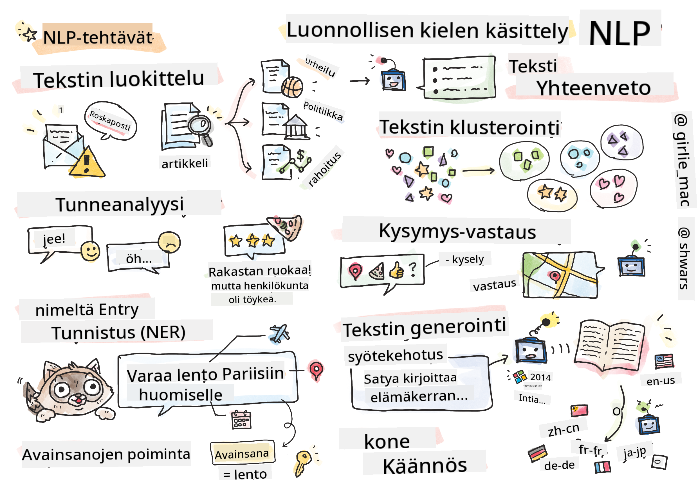

<!--
CO_OP_TRANSLATOR_METADATA:
{
  "original_hash": "8ef02a9318257ea140ed3ed74442096d",
  "translation_date": "2025-08-28T19:56:47+00:00",
  "source_file": "lessons/5-NLP/README.md",
  "language_code": "fi"
}
-->
# Luonnollisen kielen käsittely



Tässä osiossa keskitymme käyttämään neuroverkkoja **luonnollisen kielen käsittelyyn (NLP)** liittyvien tehtävien ratkaisemiseen. On monia NLP-ongelmia, joita haluamme tietokoneiden pystyvän ratkaisemaan:

* **Tekstin luokittelu** on tyypillinen luokitteluongelma, joka liittyy tekstijonoihin. Esimerkkejä ovat sähköpostiviestien luokittelu roskapostiksi tai ei-roskapostiksi, tai artikkeleiden luokittelu urheiluun, liiketoimintaan, politiikkaan jne. Lisäksi chatbotteja kehitettäessä meidän on usein ymmärrettävä, mitä käyttäjä haluaa sanoa – tässä tapauksessa käsittelemme **tarkoituksen luokittelua**. Tarkoituksen luokittelussa on usein käsiteltävä monia kategorioita.
* **Tunneanalyysi** on tyypillinen regressio-ongelma, jossa meidän on annettava lauseelle numero (tunne), joka vastaa sen positiivisuuden/negatiivisuuden astetta. Kehittyneempi versio tunneanalyysistä on **aspektipohjainen tunneanalyysi** (ABSA), jossa tunteet kohdistetaan koko lauseen sijaan sen eri osiin (aspekteihin), esim. *Tässä ravintolassa pidin ruoasta, mutta tunnelma oli kamala*.
* **Nimekkeiden tunnistus** (NER) viittaa ongelmaan, jossa tekstistä poimitaan tiettyjä entiteettejä. Esimerkiksi lauseessa *Minun täytyy lentää huomenna Pariisiin* sanat *huomenna* viittaavat AIKAAN ja *Pariisi* PAIKKAAN.  
* **Avainsanojen poiminta** on samankaltainen kuin NER, mutta siinä sanat, jotka ovat tärkeitä lauseen merkityksen kannalta, poimitaan automaattisesti ilman erityistä esikoulutusta tiettyihin entiteettityyppeihin.
* **Tekstin klusterointi** voi olla hyödyllistä, kun haluamme ryhmitellä yhteen samankaltaisia lauseita, esimerkiksi teknisen tuen keskusteluissa esiintyviä samankaltaisia pyyntöjä.
* **Kysymys-vastausjärjestelmät** viittaavat mallin kykyyn vastata tiettyyn kysymykseen. Malli saa syötteenä tekstikappaleen ja kysymyksen, ja sen on löydettävä tekstistä kohta, jossa vastaus kysymykseen on (tai joskus luotava vastausteksti).
* **Tekstin generointi** on mallin kyky luoda uutta tekstiä. Sitä voidaan pitää luokittelutehtävänä, jossa ennustetaan seuraava kirjain/sana jonkin *tekstisyötteen* perusteella. Kehittyneet tekstin generointimallit, kuten GPT-3, pystyvät ratkaisemaan muita NLP-tehtäviä käyttämällä tekniikoita, kuten [prompt-ohjelmointi](https://towardsdatascience.com/software-3-0-how-prompting-will-change-the-rules-of-the-game-a982fbfe1e0) tai [prompt-suunnittelu](https://medium.com/swlh/openai-gpt-3-and-prompt-engineering-dcdc2c5fcd29).
* **Tekstin tiivistäminen** on tekniikka, jossa haluamme tietokoneen "lukevan" pitkän tekstin ja tiivistävän sen muutamaan lauseeseen.
* **Konekäännös** voidaan nähdä yhdistelmänä tekstin ymmärtämistä yhdellä kielellä ja tekstin generointia toisella kielellä.

Aluksi suurin osa NLP-tehtävistä ratkaistiin perinteisillä menetelmillä, kuten kielioppeja hyödyntämällä. Esimerkiksi konekäännöksessä käytettiin jäsennin-ohjelmia, jotka muunsivat alkuperäisen lauseen syntaksipuuksi, minkä jälkeen korkeampia semanttisia rakenteita poimittiin lauseen merkityksen esittämiseksi. Tämän merkityksen ja kohdekielen kieliopin perusteella luotiin lopputulos. Nykyään monet NLP-tehtävät ratkaistaan tehokkaammin neuroverkkojen avulla.

> Monet klassiset NLP-menetelmät on toteutettu [Natural Language Processing Toolkit (NLTK)](https://www.nltk.org) -kirjastossa Pythonille. Verkossa on saatavilla erinomainen [NLTK-kirja](https://www.nltk.org/book/), joka kattaa, miten erilaisia NLP-tehtäviä voidaan ratkaista NLTK:ta käyttäen.

Kurssillamme keskitymme pääasiassa neuroverkkojen käyttöön NLP:ssä, ja käytämme NLTK:ta tarvittaessa.

Olemme jo oppineet käyttämään neuroverkkoja taulukkodatan ja kuvien käsittelyyn. Suurin ero näiden datatyyppien ja tekstin välillä on, että teksti on vaihtelevan pituinen jono, kun taas kuvien tapauksessa syötteen koko tiedetään etukäteen. Vaikka konvoluutiot voivat poimia kuvioita syötteestä, tekstin kuviot ovat monimutkaisempia. Esimerkiksi kielteisyys voi olla erotettuna subjektista monilla sanoilla (esim. *En pidä appelsiineista* vs. *En pidä noista isoista värikkäistä maukkaista appelsiineista*), ja se tulisi silti tulkita yhtenä kuviona. Siksi kielen käsittelyyn tarvitaan uusia neuroverkkotyyppejä, kuten *toistoverkkoja* ja *transformereita*.

## Kirjastojen asentaminen

Jos käytät paikallista Python-asennusta tämän kurssin suorittamiseen, saatat joutua asentamaan kaikki NLP:ssä tarvittavat kirjastot seuraavilla komennoilla:

**PyTorchille**
```bash
pip install -r requirements-torch.txt
```
**TensorFlow'lle**
```bash
pip install -r requirements-tf.txt
```

> Voit kokeilla NLP:tä TensorFlow'lla [Microsoft Learnissa](https://docs.microsoft.com/learn/modules/intro-natural-language-processing-tensorflow/?WT.mc_id=academic-77998-cacaste)

## GPU-varoitus

Tässä osiossa joissakin esimerkeissä koulutamme melko suuria malleja.
* **Käytä GPU:lla varustettua tietokonetta**: On suositeltavaa suorittaa muistikirjat GPU:lla varustetulla tietokoneella, jotta odotusajat suurten mallien kanssa lyhenevät.
* **GPU-muistin rajoitukset**: GPU:lla suorittaminen voi johtaa tilanteisiin, joissa GPU-muisti loppuu, erityisesti suuria malleja koulutettaessa.
* **GPU-muistin kulutus**: GPU-muistin kulutus koulutuksen aikana riippuu useista tekijöistä, kuten minibatchin koosta.
* **Pienennä minibatchin kokoa**: Jos kohtaat GPU-muistiongelmia, harkitse minibatchin koon pienentämistä koodissasi mahdollisena ratkaisuna.
* **TensorFlow'n GPU-muistin vapautus**: TensorFlow'n vanhemmat versiot eivät välttämättä vapauta GPU-muistia oikein, kun koulutetaan useita malleja yhdessä Python-ytimessä. GPU-muistin käytön hallitsemiseksi tehokkaasti voit määrittää TensorFlow'n varaamaan GPU-muistia vain tarpeen mukaan.
* **Koodin sisällyttäminen**: Voit asettaa TensorFlow'n kasvattamaan GPU-muistin varausta vain tarvittaessa lisäämällä seuraavan koodin muistikirjoihisi:

```python
physical_devices = tf.config.list_physical_devices('GPU') 
if len(physical_devices)>0:
    tf.config.experimental.set_memory_growth(physical_devices[0], True) 
```

Jos olet kiinnostunut oppimaan NLP:stä klassisen koneoppimisen näkökulmasta, käy [tässä oppituntikokonaisuudessa](https://github.com/microsoft/ML-For-Beginners/tree/main/6-NLP).

## Tässä osiossa
Tässä osiossa opimme:

* [Tekstin esittäminen tensoreina](13-TextRep/README.md)
* [Sana-upotukset](14-Emdeddings/README.md)
* [Kielimallinnus](15-LanguageModeling/README.md)
* [Toistuvat neuroverkot](16-RNN/README.md)
* [Generatiiviset verkot](17-GenerativeNetworks/README.md)
* [Transformerit](18-Transformers/README.md)

---

**Vastuuvapauslauseke**:  
Tämä asiakirja on käännetty käyttämällä tekoälypohjaista käännöspalvelua [Co-op Translator](https://github.com/Azure/co-op-translator). Vaikka pyrimme tarkkuuteen, huomioithan, että automaattiset käännökset voivat sisältää virheitä tai epätarkkuuksia. Alkuperäistä asiakirjaa sen alkuperäisellä kielellä tulisi pitää ensisijaisena lähteenä. Kriittisen tiedon osalta suositellaan ammattimaista ihmiskäännöstä. Emme ole vastuussa väärinkäsityksistä tai virhetulkinnoista, jotka johtuvat tämän käännöksen käytöstä.