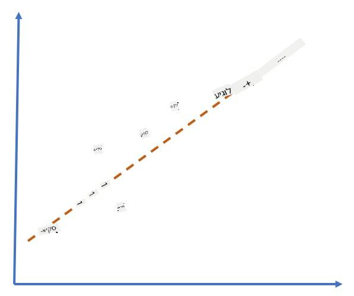
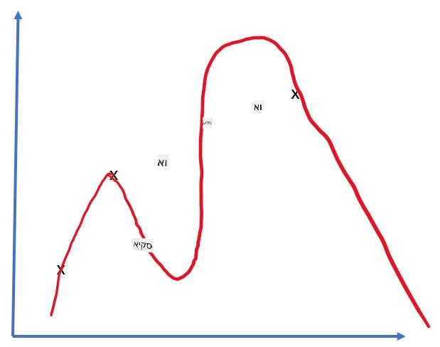
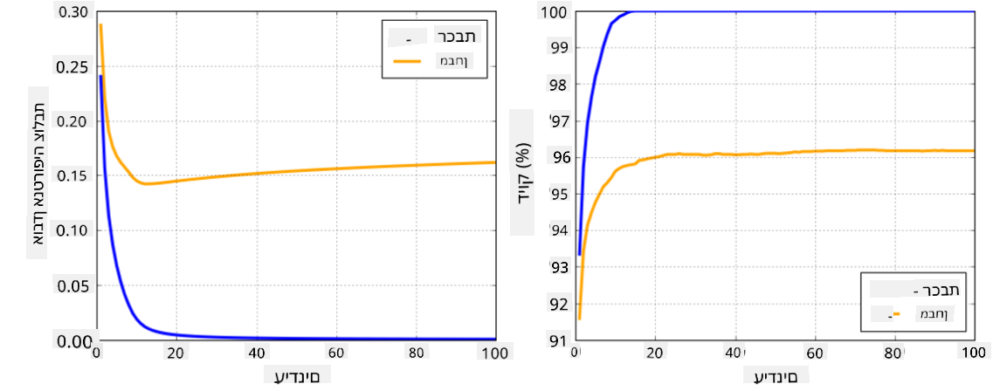

<!--
CO_OP_TRANSLATOR_METADATA:
{
  "original_hash": "2b544f20b796402507fb05a0df893323",
  "translation_date": "2025-08-28T19:50:23+00:00",
  "source_file": "lessons/3-NeuralNetworks/05-Frameworks/README.md",
  "language_code": "he"
}
-->
# מסגרות רשתות עצביות

כפי שלמדנו כבר, כדי לאמן רשתות עצביות בצורה יעילה, עלינו לעשות שני דברים:

* לעבוד עם טנסורים, למשל להכפיל, להוסיף ולחשב פונקציות כמו סיגמואיד או סופטמקס.
* לחשב גרדיאנטים של כל הביטויים, כדי לבצע אופטימיזציה באמצעות ירידת גרדיאנט.

## [מבחן לפני השיעור](https://red-field-0a6ddfd03.1.azurestaticapps.net/quiz/105)

בעוד שספריית `numpy` יכולה לבצע את החלק הראשון, אנו זקוקים למנגנון שיחשב גרדיאנטים. במסגרת [שלנו](../04-OwnFramework/OwnFramework.ipynb) שפיתחנו בסעיף הקודם, היינו צריכים לתכנת ידנית את כל פונקציות הנגזרות בתוך המתודה `backward`, שמבצעת את תהליך הבקפרופגציה. באופן אידיאלי, מסגרת צריכה לאפשר לנו לחשב גרדיאנטים של *כל ביטוי* שנוכל להגדיר.

דבר חשוב נוסף הוא היכולת לבצע חישובים על GPU, או יחידות חישוב מיוחדות אחרות, כמו [TPU](https://en.wikipedia.org/wiki/Tensor_Processing_Unit). אימון רשתות עצביות עמוקות דורש *הרבה* חישובים, והיכולת להקביל את החישובים הללו על GPUs היא קריטית.

> ✅ המונח 'להקביל' מתייחס לחלוקת החישובים בין מספר מכשירים.

כיום, שתי המסגרות הפופולריות ביותר לרשתות עצביות הן: [TensorFlow](http://TensorFlow.org) ו-[PyTorch](https://pytorch.org/). שתיהן מספקות API ברמה נמוכה לעבודה עם טנסורים על CPU ו-GPU. בנוסף ל-API ברמה נמוכה, יש גם API ברמה גבוהה, הנקרא [Keras](https://keras.io/) ו-[PyTorch Lightning](https://pytorchlightning.ai/) בהתאמה.

API ברמה נמוכה | [TensorFlow](http://TensorFlow.org) | [PyTorch](https://pytorch.org/)
----------------|-------------------------------------|--------------------------------
API ברמה גבוהה | [Keras](https://keras.io/) | [PyTorch Lightning](https://pytorchlightning.ai/)

**APIs ברמה נמוכה** בשתי המסגרות מאפשרים לבנות את מה שנקרא **גרפים חישוביים**. גרף זה מגדיר כיצד לחשב את הפלט (בדרך כלל פונקציית האובדן) עם פרמטרי הקלט הנתונים, וניתן לדחוף אותו לחישוב על GPU, אם הוא זמין. ישנן פונקציות להבדיל את הגרף החישובי הזה ולחשב גרדיאנטים, שניתן להשתמש בהם לאחר מכן לאופטימיזציה של פרמטרי המודל.

**APIs ברמה גבוהה** מתייחסים לרשתות עצביות כאל **רצף של שכבות**, ומקלים מאוד על בניית רוב הרשתות העצביות. אימון המודל בדרך כלל דורש הכנת הנתונים ואז קריאה לפונקציה `fit` שתבצע את העבודה.

ה-API ברמה גבוהה מאפשר לבנות רשתות עצביות טיפוסיות במהירות רבה מבלי לדאוג לפרטים רבים. במקביל, ה-API ברמה נמוכה מציע שליטה רבה יותר על תהליך האימון, ולכן הוא משמש רבות במחקר, כאשר מתמודדים עם ארכיטקטורות רשת עצבית חדשות.

חשוב גם להבין שניתן להשתמש בשני ה-APIs יחד, למשל, ניתן לפתח ארכיטקטורת שכבת רשת משלכם באמצעות API ברמה נמוכה, ואז להשתמש בה בתוך רשת גדולה יותר שנבנתה ואומנה עם API ברמה גבוהה. או שניתן להגדיר רשת באמצעות API ברמה גבוהה כרצף של שכבות, ואז להשתמש בלולאת אימון ברמה נמוכה משלכם כדי לבצע אופטימיזציה. שני ה-APIs משתמשים באותם מושגים בסיסיים, והם מתוכננים לעבוד היטב יחד.

## למידה

בקורס זה, אנו מציעים את רוב התוכן הן עבור PyTorch והן עבור TensorFlow. תוכלו לבחור את המסגרת המועדפת עליכם ולעבור רק על המחברות המתאימות. אם אינכם בטוחים איזו מסגרת לבחור, קראו דיונים באינטרנט על **PyTorch מול TensorFlow**. תוכלו גם להסתכל על שתי המסגרות כדי לקבל הבנה טובה יותר.

במקומות שבהם ניתן, נשתמש ב-APIs ברמה גבוהה לשם פשטות. עם זאת, אנו מאמינים שחשוב להבין כיצד רשתות עצביות פועלות מהבסיס, ולכן בהתחלה נתחיל לעבוד עם API ברמה נמוכה וטנסורים. עם זאת, אם אתם רוצים להתחיל מהר ולא רוצים להשקיע זמן רב בלמידת הפרטים הללו, תוכלו לדלג עליהם ולעבור ישר למחברות של API ברמה גבוהה.

## ✍️ תרגילים: מסגרות

המשיכו את הלמידה שלכם במחברות הבאות:

API ברמה נמוכה | [מחברת TensorFlow+Keras](IntroKerasTF.ipynb) | [PyTorch](IntroPyTorch.ipynb)
----------------|-------------------------------------|--------------------------------
API ברמה גבוהה | [Keras](IntroKeras.ipynb) | *PyTorch Lightning*

לאחר שליטה במסגרות, בואו נסכם את מושג האוברפיטינג.

# אוברפיטינג

אוברפיטינג הוא מושג חשוב ביותר בלמידת מכונה, וחשוב מאוד להבין אותו נכון!

שקלו את הבעיה הבאה של התאמת 5 נקודות (מיוצגות על ידי `x` בגרפים למטה):

 | 
-------------------------|--------------------------
**מודל ליניארי, 2 פרמטרים** | **מודל לא ליניארי, 7 פרמטרים**
שגיאת אימון = 5.3 | שגיאת אימון = 0
שגיאת ולידציה = 5.1 | שגיאת ולידציה = 20

* משמאל, אנו רואים התאמה טובה של קו ישר. מכיוון שמספר הפרמטרים מתאים, המודל מבין את התבנית שמאחורי פיזור הנקודות.
* מימין, המודל חזק מדי. מכיוון שיש לנו רק 5 נקודות והמודל מכיל 7 פרמטרים, הוא יכול להתאים את עצמו כך שיעבור דרך כל הנקודות, מה שגורם לשגיאת האימון להיות 0. עם זאת, זה מונע מהמודל להבין את התבנית הנכונה שמאחורי הנתונים, ולכן שגיאת הוולידציה גבוהה מאוד.

חשוב מאוד למצוא את האיזון הנכון בין עושר המודל (מספר הפרמטרים) לבין מספר דוגמאות האימון.

## מדוע אוברפיטינג מתרחש

  * כמות נתוני אימון לא מספקת
  * מודל חזק מדי
  * יותר מדי רעש בנתוני הקלט

## כיצד לזהות אוברפיטינג

כפי שניתן לראות מהגרף למעלה, ניתן לזהות אוברפיטינג על ידי שגיאת אימון נמוכה מאוד ושגיאת ולידציה גבוהה. בדרך כלל במהלך האימון נראה גם את שגיאות האימון וגם את שגיאות הוולידציה מתחילות לרדת, ואז בשלב מסוים שגיאת הוולידציה עשויה להפסיק לרדת ולהתחיל לעלות. זה יהיה סימן לאוברפיטינג, ואינדיקציה לכך שכדאי להפסיק את האימון בנקודה זו (או לפחות לשמור עותק של המודל).

## כיצד למנוע אוברפיטינג

אם אתם רואים שאוברפיטינג מתרחש, תוכלו לעשות אחד מהדברים הבאים:

 * להגדיל את כמות נתוני האימון
 * להקטין את מורכבות המודל
 * להשתמש בטכניקת [רגולריזציה](../../4-ComputerVision/08-TransferLearning/TrainingTricks.md), כמו [Dropout](../../4-ComputerVision/08-TransferLearning/TrainingTricks.md#Dropout), שנשקול בהמשך.

## אוברפיטינג וסחר-מכר הטיה-שונות

אוברפיטינג הוא למעשה מקרה של בעיה כללית יותר בסטטיסטיקה הנקראת [סחר-מכר הטיה-שונות](https://en.wikipedia.org/wiki/Bias%E2%80%93variance_tradeoff). אם נבחן את מקורות השגיאה האפשריים במודל שלנו, נוכל לראות שני סוגי שגיאות:

* **שגיאות הטיה** נגרמות מכך שהאלגוריתם שלנו לא מצליח לתפוס את הקשר בין נתוני האימון בצורה נכונה. זה יכול לנבוע מכך שהמודל שלנו לא חזק מספיק (**אוברפיטינג**).
* **שגיאות שונות**, שנגרמות מכך שהמודל מתאים רעש בנתוני הקלט במקום קשר משמעותי (**אוברפיטינג**).

במהלך האימון, שגיאת הטיה יורדת (כשהמודל שלנו לומד להתאים את הנתונים), ושגיאת שונות עולה. חשוב להפסיק את האימון - או ידנית (כשאנו מזהים אוברפיטינג) או אוטומטית (על ידי הכנסת רגולריזציה) - כדי למנוע אוברפיטינג.

## סיכום

בשיעור זה, למדתם על ההבדלים בין ה-APIs השונים לשתי המסגרות הפופולריות ביותר ל-AI, TensorFlow ו-PyTorch. בנוסף, למדתם על נושא חשוב מאוד, אוברפיטינג.

## 🚀 אתגר

במחברות המצורפות, תמצאו 'משימות' בתחתית; עברו על המחברות והשלימו את המשימות.

## [מבחן אחרי השיעור](https://red-field-0a6ddfd03.1.azurestaticapps.net/quiz/205)

## סקירה ולימוד עצמי

בצעו מחקר על הנושאים הבאים:

- TensorFlow
- PyTorch
- אוברפיטינג

שאלו את עצמכם את השאלות הבאות:

- מה ההבדל בין TensorFlow ל-PyTorch?
- מה ההבדל בין אוברפיטינג לאנדרפיטינג?

## [מטלה](lab/README.md)

במעבדה זו, תתבקשו לפתור שתי בעיות סיווג באמצעות רשתות מחוברות באופן מלא, חד-שכבתיות ורב-שכבתיות, באמצעות PyTorch או TensorFlow.

* [הוראות](lab/README.md)
* [מחברת](lab/LabFrameworks.ipynb)

---

**כתב ויתור**:  
מסמך זה תורגם באמצעות שירות תרגום מבוסס בינה מלאכותית [Co-op Translator](https://github.com/Azure/co-op-translator). בעוד שאנו שואפים לדיוק, יש להיות מודעים לכך שתרגומים אוטומטיים עשויים להכיל שגיאות או אי דיוקים. המסמך המקורי בשפתו המקורית צריך להיחשב כמקור הסמכותי. עבור מידע קריטי, מומלץ להשתמש בתרגום מקצועי על ידי אדם. איננו נושאים באחריות לאי הבנות או לפרשנויות שגויות הנובעות משימוש בתרגום זה.