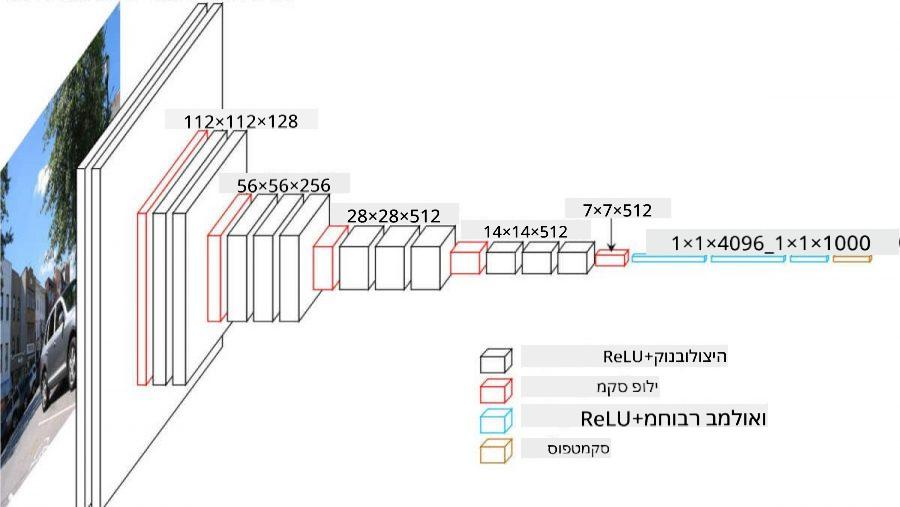

<!--
CO_OP_TRANSLATOR_METADATA:
{
  "original_hash": "2f7b97b375358cb51a1e098df306bf73",
  "translation_date": "2025-08-28T19:25:30+00:00",
  "source_file": "lessons/4-ComputerVision/07-ConvNets/CNN_Architectures.md",
  "language_code": "he"
}
-->
# ארכיטקטורות CNN ידועות

### VGG-16

VGG-16 היא רשת שהשיגה דיוק של 92.7% בסיווג ImageNet top-5 בשנת 2014. המבנה שלה כולל את השכבות הבאות:

כפי שניתן לראות, VGG עוקבת אחר ארכיטקטורת פירמידה מסורתית, שהיא רצף של שכבות קונבולוציה-פולינג.

> תמונה מ-[Researchgate](https://www.researchgate.net/figure/Vgg16-model-structure-To-get-the-VGG-NIN-model-we-replace-the-2-nd-4-th-6-th-7-th_fig2_335194493)

### ResNet

ResNet היא משפחת מודלים שהוצעה על ידי Microsoft Research בשנת 2015. הרעיון המרכזי ב-ResNet הוא שימוש ב**בלוקים שאריים**:

> תמונה מתוך [המאמר הזה](https://arxiv.org/pdf/1512.03385.pdf)

הסיבה לשימוש במעבר זהות היא לגרום לשכבה שלנו לחזות **את ההפרש** בין התוצאה של השכבה הקודמת לבין הפלט של הבלוק השארי - ומכאן השם *שארי*. בלוקים אלו קלים יותר לאימון, וניתן לבנות רשתות עם מאות בלוקים כאלו (הגרסאות הנפוצות ביותר הן ResNet-52, ResNet-101 ו-ResNet-152).

ניתן גם לחשוב על רשת זו ככזו שמסוגלת להתאים את המורכבות שלה לנתונים. בתחילת האימון, כאשר ערכי המשקלים קטנים, רוב האות עובר דרך שכבות הזהות. ככל שהאימון מתקדם והמשקלים גדלים, החשיבות של פרמטרי הרשת עולה, והרשת מתאימה את עצמה כדי לספק את הכוח הביטויי הנדרש לסיווג נכון של תמונות האימון.

### Google Inception

ארכיטקטורת Google Inception לוקחת את הרעיון הזה צעד אחד קדימה, ובונה כל שכבת רשת כקומבינציה של מספר מסלולים שונים:

> תמונה מ-[Researchgate](https://www.researchgate.net/figure/Inception-module-with-dimension-reductions-left-and-schema-for-Inception-ResNet-v1_fig2_355547454)

כאן, חשוב להדגיש את התפקיד של קונבולוציות בגודל 1x1, כי בהתחלה זה לא נראה הגיוני. למה שנרצה לעבור על התמונה עם פילטר בגודל 1x1? עם זאת, יש לזכור שפילטרי קונבולוציה עובדים גם עם מספר ערוצי עומק (במקור - צבעי RGB, ובשכבות הבאות - ערוצים עבור פילטרים שונים), וקונבולוציה בגודל 1x1 משמשת לערבוב ערוצי הקלט הללו יחד באמצעות משקלים ניתנים לאימון. ניתן גם לראות זאת כפעולת downsampling (פולינג) על ממד הערוצים.

הנה [פוסט בלוג טוב](https://medium.com/analytics-vidhya/talented-mr-1x1-comprehensive-look-at-1x1-convolution-in-deep-learning-f6b355825578) בנושא, ו-[המאמר המקורי](https://arxiv.org/pdf/1312.4400.pdf).

### MobileNet

MobileNet היא משפחת מודלים בגודל מופחת, המתאימה למכשירים ניידים. השתמשו בהם אם אתם מוגבלים במשאבים, ויכולים לוותר על מעט דיוק. הרעיון המרכזי מאחוריהם הוא **קונבולוציה נפרדת לפי עומק**, שמאפשרת לייצג פילטרי קונבולוציה כקומפוזיציה של קונבולוציות מרחביות וקונבולוציה בגודל 1x1 על ערוצי עומק. זה מפחית משמעותית את מספר הפרמטרים, מה שהופך את הרשת לקטנה יותר בגודלה, וגם קלה יותר לאימון עם פחות נתונים.

הנה [פוסט בלוג טוב על MobileNet](https://medium.com/analytics-vidhya/image-classification-with-mobilenet-cc6fbb2cd470).

## סיכום

ביחידה זו, למדתם את הרעיון המרכזי מאחורי רשתות עצביות לראייה ממוחשבת - רשתות קונבולוציה. ארכיטקטורות אמיתיות שמניעות סיווג תמונות, זיהוי אובייקטים ואפילו רשתות ליצירת תמונות מבוססות כולן על CNNs, רק עם יותר שכבות וכמה טריקים נוספים לאימון.

## 🚀 אתגר

במחברות המצורפות, יש הערות בתחתית על איך להשיג דיוק גבוה יותר. בצעו ניסויים כדי לראות אם תוכלו להשיג דיוק גבוה יותר.

## [שאלון לאחר ההרצאה](https://red-field-0a6ddfd03.1.azurestaticapps.net/quiz/207)

## סקירה ולמידה עצמית

למרות ש-CNNs משמשות לרוב למשימות ראייה ממוחשבת, הן טובות באופן כללי בזיהוי תבניות בגודל קבוע. לדוגמה, אם אנו מתמודדים עם צלילים, ייתכן שנרצה גם להשתמש ב-CNNs כדי לחפש תבניות מסוימות באות השמע - במקרה כזה הפילטרים יהיו חד-ממדיים (ו-CNN זו תיקרא 1D-CNN). בנוסף, לעיתים משתמשים ב-3D-CNN כדי לחלץ מאפיינים במרחב רב-ממדי, כמו אירועים מסוימים שמתרחשים בווידאו - CNN יכולה ללכוד תבניות מסוימות של שינוי מאפיינים לאורך זמן. בצעו סקירה ולמידה עצמית על משימות נוספות שניתן לבצע עם CNNs.

## [משימה](lab/README.md)

במעבדה זו, המשימה שלכם היא לסווג גזעים שונים של חתולים וכלבים. התמונות מורכבות יותר ממאגר MNIST, בעלות ממדים גבוהים יותר, ויש יותר מ-10 קטגוריות.

---

**כתב ויתור**:  
מסמך זה תורגם באמצעות שירות תרגום מבוסס בינה מלאכותית [Co-op Translator](https://github.com/Azure/co-op-translator). בעוד שאנו שואפים לדיוק, יש להיות מודעים לכך שתרגומים אוטומטיים עשויים להכיל שגיאות או אי דיוקים. המסמך המקורי בשפתו המקורית צריך להיחשב כמקור סמכותי. עבור מידע קריטי, מומלץ להשתמש בתרגום מקצועי על ידי אדם. איננו נושאים באחריות לאי הבנות או לפרשנויות שגויות הנובעות משימוש בתרגום זה.