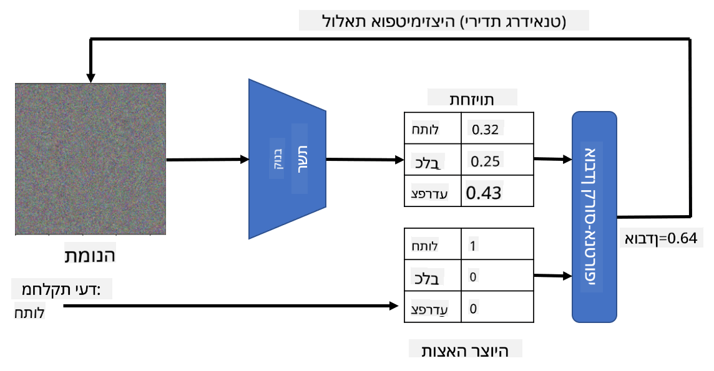

<!--
CO_OP_TRANSLATOR_METADATA:
{
  "original_hash": "178c0b5ee5395733eb18aec51e71a0a9",
  "translation_date": "2025-09-23T10:17:12+00:00",
  "source_file": "lessons/4-ComputerVision/08-TransferLearning/README.md",
  "language_code": "he"
}
-->
# רשתות מאומנות מראש ולמידת העברה

אימון רשתות CNN יכול לקחת זמן רב, ודורש כמות גדולה של נתונים. עם זאת, חלק גדול מהזמן מושקע בלמידת המסננים ברמה נמוכה שהרשת יכולה להשתמש בהם כדי לחלץ דפוסים מתמונות. עולה שאלה טבעית - האם ניתן להשתמש ברשת עצבית שאומנה על מערך נתונים אחד ולהתאים אותה לסיווג תמונות שונות מבלי לדרוש תהליך אימון מלא?

## [שאלון לפני ההרצאה](https://ff-quizzes.netlify.app/en/ai/quiz/15)

גישה זו נקראת **למידת העברה**, מכיוון שאנו מעבירים ידע מסוים ממודל רשת עצבית אחד לאחר. בלמידת העברה, בדרך כלל מתחילים עם מודל מאומן מראש, שאומן על מערך נתונים גדול של תמונות, כמו **ImageNet**. מודלים אלו כבר מסוגלים לבצע עבודה טובה בחילוץ תכונות שונות מתמונות כלליות, ובמקרים רבים בניית מסווג על גבי התכונות שחולצו יכולה להניב תוצאות טובות.

> ✅ למידת העברה הוא מונח שניתן למצוא גם בתחומים אקדמיים אחרים, כמו חינוך. הוא מתייחס לתהליך של לקיחת ידע מתחום אחד ויישומו בתחום אחר.

## מודלים מאומנים מראש כמחלצי תכונות

הרשתות הקונבולוציוניות שדיברנו עליהן בסעיף הקודם מכילות מספר שכבות, שכל אחת מהן אמורה לחלץ תכונות מהתמונה, החל משילובי פיקסלים ברמה נמוכה (כמו קווים אופקיים/אנכיים או משיכות), ועד שילובים ברמה גבוהה יותר של תכונות, המתאימים לדברים כמו עין של להבה. אם נאמן CNN על מערך נתונים גדול ומגוון של תמונות כלליות, הרשת אמורה ללמוד לחלץ את התכונות הנפוצות הללו.

גם Keras וגם PyTorch מכילים פונקציות לטעינת משקלים מאומנים מראש של רשתות עצביות עבור כמה ארכיטקטורות נפוצות, שרובן אומנו על תמונות ImageNet. הארכיטקטורות הנפוצות ביותר מתוארות בעמוד [ארכיטקטורות CNN](../07-ConvNets/CNN_Architectures.md) מהשיעור הקודם. בפרט, ייתכן שתרצו לשקול שימוש באחת מהבאות:

* **VGG-16/VGG-19** הן מודלים יחסית פשוטים שעדיין מספקים דיוק טוב. לעיתים שימוש ב-VGG כניסיון ראשון הוא בחירה טובה כדי לראות איך למידת העברה עובדת.
* **ResNet** היא משפחת מודלים שהוצעה על ידי Microsoft Research בשנת 2015. יש להן יותר שכבות, ולכן הן דורשות יותר משאבים.
* **MobileNet** היא משפחת מודלים עם גודל מופחת, המתאימה למכשירים ניידים. השתמשו בהן אם אתם מוגבלים במשאבים ויכולים להקריב מעט דיוק.

להלן דוגמה לתכונות שחולצו מתמונה של חתול על ידי רשת VGG-16:

## מערך נתונים של חתולים וכלבים

בדוגמה זו, נשתמש במערך נתונים של [חתולים וכלבים](https://www.microsoft.com/download/details.aspx?id=54765&WT.mc_id=academic-77998-cacaste), שהוא קרוב מאוד לתרחיש סיווג תמונות בחיים האמיתיים.

## ✍️ תרגיל: למידת העברה

בואו נראה את למידת ההעברה בפעולה במחברות המתאימות:

* [למידת העברה - PyTorch](TransferLearningPyTorch.ipynb)
* [למידת העברה - TensorFlow](TransferLearningTF.ipynb)

## הדמיית חתול אידיאלי

רשת עצבית מאומנת מראש מכילה דפוסים שונים בתוך ה*"מוח"* שלה, כולל מושגים של **חתול אידיאלי** (כמו גם כלב אידיאלי, זברה אידיאלית וכו'). יהיה מעניין לנסות **להדמיה את התמונה הזו**. עם זאת, זה לא פשוט, מכיוון שהדפוסים מפוזרים בכל משקלי הרשת וגם מאורגנים במבנה היררכי.

גישה אחת שנוכל לקחת היא להתחיל עם תמונה אקראית, ואז לנסות להשתמש בטכניקת **אופטימיזציה בירידת גרדיאנט** כדי להתאים את התמונה כך שהרשת תתחיל לחשוב שמדובר בחתול.

עם זאת, אם נעשה זאת, נקבל משהו שדומה מאוד לרעש אקראי. זאת מכיוון ש*יש הרבה דרכים לגרום לרשת לחשוב שהתמונה הקלט היא חתול*, כולל כאלה שאינן הגיוניות מבחינה חזותית. למרות שהתמונות הללו מכילות הרבה דפוסים אופייניים לחתול, אין שום דבר שמגביל אותן להיות מובחנות חזותית.

כדי לשפר את התוצאה, נוכל להוסיף מונח נוסף לפונקציית ההפסד, שנקרא **הפסד וריאציה**. זהו מדד שמראה עד כמה פיקסלים סמוכים בתמונה דומים זה לזה. צמצום הפסד וריאציה הופך את התמונה לחלקה יותר ומסלק רעש - ובכך חושף דפוסים מושכים יותר מבחינה חזותית. הנה דוגמה לתמונות "אידיאליות" כאלה, שמסווגות כחתול וכזברה בהסתברות גבוהה:

 | 
-----|-----
 *חתול אידיאלי* | *זברה אידיאלית*

גישה דומה יכולה לשמש לביצוע מה שנקרא **התקפות עוינות** על רשת עצבית. נניח שאנחנו רוצים להטעות רשת עצבית ולגרום לכלב להיראות כמו חתול. אם ניקח תמונה של כלב, שמזוהה על ידי הרשת ככלב, נוכל לשנות אותה מעט באמצעות אופטימיזציה בירידת גרדיאנט, עד שהרשת תתחיל לסווג אותה כחתול:

 | 
-----|-----
*תמונה מקורית של כלב* | *תמונה של כלב שמסווג כחתול*

ראו את הקוד לשחזור התוצאות לעיל במחברת הבאה:

* [חתול אידיאלי ועוין - TensorFlow](AdversarialCat_TF.ipynb)

## סיכום

באמצעות למידת העברה, ניתן להרכיב במהירות מסווג למשימת סיווג אובייקטים מותאמת אישית ולהשיג דיוק גבוה. ניתן לראות שמשימות מורכבות יותר שאנו פותרים כעת דורשות כוח חישוב גבוה יותר, ולא ניתן לפתור אותן בקלות על מעבד. ביחידה הבאה, ננסה להשתמש ביישום קל משקל יותר כדי לאמן את אותו מודל תוך שימוש במשאבי חישוב נמוכים יותר, מה שמוביל לדיוק מעט נמוך יותר.

## 🚀 אתגר

במחברות המצורפות, יש הערות בתחתית על איך ידע מועבר עובד הכי טוב עם נתוני אימון דומים במידה מסוימת (סוג חדש של בעל חיים, אולי). בצעו ניסויים עם סוגים חדשים לחלוטין של תמונות כדי לראות עד כמה מודלי העברת הידע שלכם עובדים טוב או גרוע.

## [שאלון לאחר ההרצאה](https://ff-quizzes.netlify.app/en/ai/quiz/16)

## סקירה ולימוד עצמי

קראו את [TrainingTricks.md](TrainingTricks.md) כדי להעמיק את הידע שלכם בדרכים נוספות לאימון המודלים שלכם.

## [מטלה](lab/README.md)

במעבדה זו, נשתמש במערך נתונים אמיתי של [Oxford-IIIT](https://www.robots.ox.ac.uk/~vgg/data/pets/) עם 35 גזעים של חתולים וכלבים, ונבנה מסווג למידת העברה.

---

