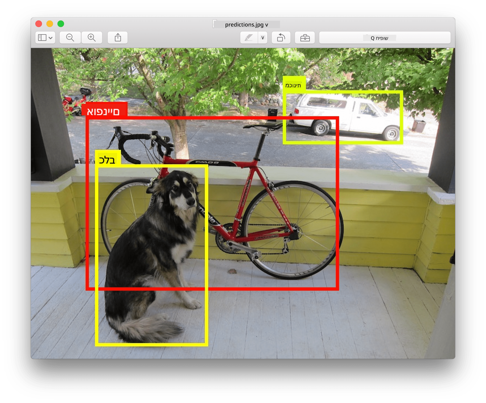
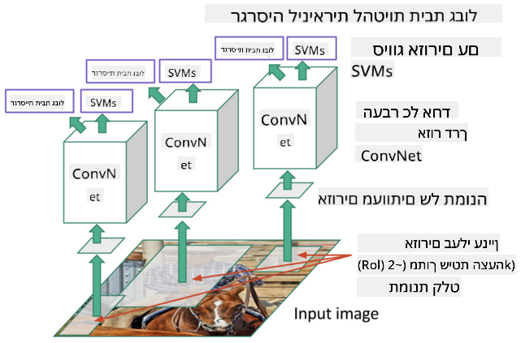
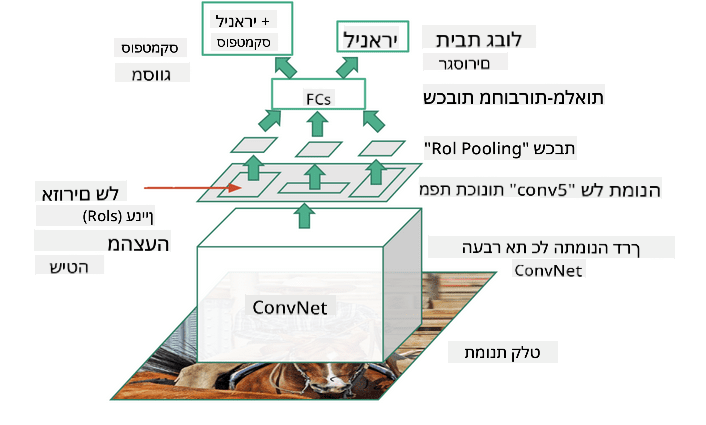

<!--
CO_OP_TRANSLATOR_METADATA:
{
  "original_hash": "d85c8b08f6d1b48fd7f35b99f93c1138",
  "translation_date": "2025-08-28T19:32:43+00:00",
  "source_file": "lessons/4-ComputerVision/11-ObjectDetection/README.md",
  "language_code": "he"
}
-->
# זיהוי אובייקטים

מודלי סיווג תמונות שעסקנו בהם עד כה לקחו תמונה והפיקו תוצאה קטגורית, כמו הקטגוריה 'מספר' בבעיה של MNIST. עם זאת, במקרים רבים אנחנו לא רוצים רק לדעת שתמונה מציגה אובייקטים - אנחנו רוצים להיות מסוגלים לקבוע את המיקום המדויק שלהם. זה בדיוק הנושא של **זיהוי אובייקטים**.

## [מבחן מקדים להרצאה](https://ff-quizzes.netlify.app/en/ai/quiz/21)

> תמונה מתוך [אתר YOLO v2](https://pjreddie.com/darknet/yolov2/)

## גישה נאיבית לזיהוי אובייקטים

נניח שרצינו למצוא חתול בתמונה, גישה נאיבית מאוד לזיהוי אובייקטים תהיה כדלקמן:

1. לחלק את התמונה למספר אריחים.
2. להריץ סיווג תמונה על כל אריח.
3. אריחים שמניבים הפעלה גבוהה מספיק יכולים להיחשב ככוללים את האובייקט המדובר.

> *תמונה מתוך [מחברת התרגילים](ObjectDetection-TF.ipynb)*

עם זאת, גישה זו רחוקה מלהיות אידיאלית, מכיוון שהיא מאפשרת לאלגוריתם לאתר את תיבת הגבול של האובייקט בצורה מאוד לא מדויקת. למיקום מדויק יותר, עלינו להריץ סוג של **רגרסיה** כדי לחזות את הקואורדינטות של תיבות הגבול - ולשם כך, אנו זקוקים למערכי נתונים ספציפיים.

## רגרסיה לזיהוי אובייקטים

[פוסט הבלוג הזה](https://towardsdatascience.com/object-detection-with-neural-networks-a4e2c46b4491) מציע מבוא עדין ומעולה לזיהוי צורות.

## מערכי נתונים לזיהוי אובייקטים

ייתכן שתיתקלו במערכי הנתונים הבאים למשימה זו:

* [PASCAL VOC](http://host.robots.ox.ac.uk/pascal/VOC/) - 20 קטגוריות
* [COCO](http://cocodataset.org/#home) - אובייקטים נפוצים בהקשר. 80 קטגוריות, תיבות גבול ומסכות סגמנטציה

## מדדים לזיהוי אובייקטים

### חיתוך על איחוד (Intersection over Union)

בעוד שבסיווג תמונות קל למדוד עד כמה האלגוריתם מצליח, בזיהוי אובייקטים עלינו למדוד הן את נכונות הקטגוריה, והן את דיוק מיקום תיבת הגבול שחוזה האלגוריתם. עבור האחרון, אנו משתמשים במדד שנקרא **חיתוך על איחוד** (IoU), שמודד עד כמה שתי תיבות (או שני אזורים שרירותיים) חופפים.

> *איור 2 מתוך [פוסט בלוג מצוין על IoU](https://pyimagesearch.com/2016/11/07/intersection-over-union-iou-for-object-detection/)*

הרעיון פשוט - אנו מחלקים את שטח החיתוך בין שתי הצורות בשטח האיחוד שלהן. עבור שני אזורים זהים, IoU יהיה 1, בעוד שעבור אזורים שאינם חופפים כלל הוא יהיה 0. אחרת הוא ינוע בין 0 ל-1. בדרך כלל אנו מתחשבים רק בתיבות גבול עבורן IoU מעל ערך מסוים.

### דיוק ממוצע (Average Precision)

נניח שאנחנו רוצים למדוד עד כמה קטגוריה מסוימת של אובייקטים $C$ מזוהה היטב. כדי למדוד זאת, אנו משתמשים במדד **דיוק ממוצע**, שמחושב כך:

1. עקומת דיוק-שליפה (Precision-Recall) מציגה את הדיוק בהתאם לערך סף זיהוי (מ-0 עד 1).
2. בהתאם לסף, נקבל יותר או פחות אובייקטים מזוהים בתמונה, וערכים שונים של דיוק ושליפה.
3. העקומה תיראה כך:

> *תמונה מתוך [NeuroWorkshop](http://github.com/shwars/NeuroWorkshop)*

הדיוק הממוצע עבור קטגוריה מסוימת $C$ הוא השטח מתחת לעקומה זו. באופן מדויק יותר, ציר השליפה מחולק בדרך כלל ל-10 חלקים, והדיוק מחושב כממוצע על כל הנקודות הללו:

$$
AP = {1\over11}\sum_{i=0}^{10}\mbox{Precision}(\mbox{Recall}={i\over10})
$$

### AP ו-IoU

אנו נתחשב רק בזיהויים עבורם IoU מעל ערך מסוים. לדוגמה, במערך הנתונים PASCAL VOC בדרך כלל $\mbox{IoU Threshold} = 0.5$, בעוד שב-COCO AP נמדד עבור ערכים שונים של $\mbox{IoU Threshold}$.

> *תמונה מתוך [NeuroWorkshop](http://github.com/shwars/NeuroWorkshop)*

### דיוק ממוצע כולל - mAP

המדד המרכזי לזיהוי אובייקטים נקרא **דיוק ממוצע כולל**, או **mAP**. זהו ערך הדיוק הממוצע, מחושב כממוצע על פני כל קטגוריות האובייקטים, ולעיתים גם על פני $\mbox{IoU Threshold}$. תהליך חישוב **mAP** מתואר בפירוט
[בפוסט בלוג זה](https://medium.com/@timothycarlen/understanding-the-map-evaluation-metric-for-object-detection-a07fe6962cf3)), וגם [כאן עם דוגמאות קוד](https://gist.github.com/tarlen5/008809c3decf19313de216b9208f3734).

## גישות שונות לזיהוי אובייקטים

ישנן שתי קטגוריות עיקריות של אלגוריתמים לזיהוי אובייקטים:

* **רשתות הצעת אזורים** (R-CNN, Fast R-CNN, Faster R-CNN). הרעיון המרכזי הוא ליצור **אזורים מעניינים** (ROI) ולהריץ CNN עליהם, בחיפוש אחר הפעלה מקסימלית. זה דומה במעט לגישה הנאיבית, למעט העובדה שהאזורים נוצרים בצורה חכמה יותר. אחד החסרונות המרכזיים של שיטות אלו הוא שהן איטיות, מכיוון שצריך לבצע מספר רב של מעברים של מסווג CNN על התמונה.
* **מעבר יחיד** (YOLO, SSD, RetinaNet). בארכיטקטורות אלו אנו מעצבים את הרשת כך שתנבא הן קטגוריות והן אזורים במעבר אחד.

### R-CNN: רשת CNN מבוססת אזורים

[R-CNN](http://islab.ulsan.ac.kr/files/announcement/513/rcnn_pami.pdf) משתמשת ב-[חיפוש סלקטיבי](http://www.huppelen.nl/publications/selectiveSearchDraft.pdf) כדי ליצור מבנה היררכי של אזורי ROI, אשר מועברים לאחר מכן דרך מסנני תכונות CNN ומסווגי SVM כדי לקבוע את קטגוריית האובייקט, ורגרסיה ליניארית כדי לקבוע את קואורדינטות *תיבת הגבול*. [מאמר רשמי](https://arxiv.org/pdf/1506.01497v1.pdf)

> *תמונה מתוך van de Sande et al. ICCV’11*

> *תמונות מתוך [פוסט בלוג זה](https://towardsdatascience.com/r-cnn-fast-r-cnn-faster-r-cnn-yolo-object-detection-algorithms-36d53571365e)*

### F-RCNN - Fast R-CNN

גישה זו דומה ל-R-CNN, אך האזורים מוגדרים לאחר יישום שכבות הקונבולוציה.

> תמונה מתוך [המאמר הרשמי](https://www.cv-foundation.org/openaccess/content_iccv_2015/papers/Girshick_Fast_R-CNN_ICCV_2015_paper.pdf), [arXiv](https://arxiv.org/pdf/1504.08083.pdf), 2015

### Faster R-CNN

הרעיון המרכזי בגישה זו הוא להשתמש ברשת עצבית כדי לנבא אזורים - מה שנקרא *רשת הצעת אזורים*. [מאמר](https://arxiv.org/pdf/1506.01497.pdf), 2016

> תמונה מתוך [המאמר הרשמי](https://arxiv.org/pdf/1506.01497.pdf)

### R-FCN: רשת מבוססת אזורים עם קונבולוציה מלאה

אלגוריתם זה מהיר אף יותר מ-Faster R-CNN. הרעיון המרכזי הוא כדלקמן:

1. אנו מוציאים תכונות באמצעות ResNet-101.
2. התכונות מעובדות על ידי **מפת ניקוד רגישה למיקום**. כל אובייקט מתוך $C$ קטגוריות מחולק ל-$k\times k$ אזורים, ואנו מאמנים את הרשת לנבא חלקים של אובייקטים.
3. עבור כל חלק מתוך $k\times k$ אזורים כל הרשתות מצביעות על קטגוריות אובייקטים, וקטגוריית האובייקט עם ההצבעה המקסימלית נבחרת.

> תמונה מתוך [המאמר הרשמי](https://arxiv.org/abs/1605.06409)

### YOLO - You Only Look Once

YOLO הוא אלגוריתם מעבר יחיד בזמן אמת. הרעיון המרכזי הוא כדלקמן:

 * התמונה מחולקת ל-$S\times S$ אזורים.
 * עבור כל אזור, **CNN** מנבא $n$ אובייקטים אפשריים, *קואורדינטות תיבת הגבול* ו-*ביטחון*=*הסתברות* * IoU.

 

> תמונה מתוך [המאמר הרשמי](https://arxiv.org/abs/1506.02640)

### אלגוריתמים נוספים

* RetinaNet: [מאמר רשמי](https://arxiv.org/abs/1708.02002)
   - [מימוש ב-PyTorch ב-Torchvision](https://pytorch.org/vision/stable/_modules/torchvision/models/detection/retinanet.html)
   - [מימוש ב-Keras](https://github.com/fizyr/keras-retinanet)
   - [זיהוי אובייקטים עם RetinaNet](https://keras.io/examples/vision/retinanet/) בדוגמאות של Keras
* SSD (Single Shot Detector): [מאמר רשמי](https://arxiv.org/abs/1512.02325)

## ✍️ תרגילים: זיהוי אובייקטים

המשיכו ללמוד במחברת הבאה:

[ObjectDetection.ipynb](ObjectDetection.ipynb)

## סיכום

בשיעור זה עשיתם סיור מהיר בכל הדרכים השונות שבהן ניתן לבצע זיהוי אובייקטים!

## 🚀 אתגר

קראו את המאמרים והמחברות על YOLO ונסו אותם בעצמכם:

* [פוסט בלוג טוב](https://www.analyticsvidhya.com/blog/2018/12/practical-guide-object-detection-yolo-framewor-python/) שמתאר את YOLO
 * [אתר רשמי](https://pjreddie.com/darknet/yolo/)
 * YOLO: [מימוש ב-Keras](https://github.com/experiencor/keras-yolo2), [מחברת שלב-אחר-שלב](https://github.com/experiencor/basic-yolo-keras/blob/master/Yolo%20Step-by-Step.ipynb)
 * YOLO v2: [מימוש ב-Keras](https://github.com/experiencor/keras-yolo2), [מחברת שלב-אחר-שלב](https://github.com/experiencor/keras-yolo2/blob/master/Yolo%20Step-by-Step.ipynb)

## [מבחן לאחר ההרצאה](https://ff-quizzes.netlify.app/en/ai/quiz/22)

## סקירה ולימוד עצמי

* [זיהוי אובייקטים](https://tjmachinelearning.com/lectures/1718/obj/) מאת Nikhil Sardana
* [השוואה טובה של אלגוריתמים לזיהוי אובייקטים](https://lilianweng.github.io/lil-log/2018/12/27/object-detection-part-4.html)
* [סקירה של אלגוריתמים ללמידה עמוקה לזיהוי אובייקטים](https://medium.com/comet-app/review-of-deep-learning-algorithms-for-object-detection-c1f3d437b852)
* [מבוא שלב-אחר-שלב לאלגוריתמים בסיסיים לזיהוי אובייקטים](https://www.analyticsvidhya.com/blog/2018/10/a-step-by-step-introduction-to-the-basic-object-detection-algorithms-part-1/)
* [מימוש של Faster R-CNN בפייתון לזיהוי אובייקטים](https://www.analyticsvidhya.com/blog/2018/11/implementation-faster-r-cnn-python-object-detection/)

## [מטלה: זיהוי אובייקטים](lab/README.md)

---

**כתב ויתור**:  
מסמך זה תורגם באמצעות שירות תרגום מבוסס בינה מלאכותית [Co-op Translator](https://github.com/Azure/co-op-translator). למרות שאנו שואפים לדיוק, יש לקחת בחשבון שתרגומים אוטומטיים עשויים להכיל שגיאות או אי-דיוקים. המסמך המקורי בשפתו המקורית נחשב למקור הסמכותי. למידע קריטי, מומלץ להשתמש בתרגום מקצועי על ידי מתרגם אנושי. איננו נושאים באחריות לכל אי-הבנה או פרשנות שגויה הנובעת משימוש בתרגום זה.  