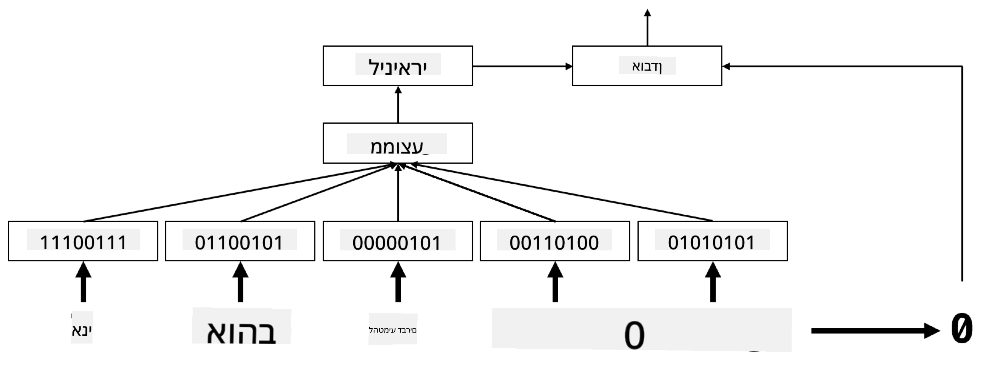

<!--
CO_OP_TRANSLATOR_METADATA:
{
  "original_hash": "b708c9b85b833864c73c6281f1e6b96e",
  "translation_date": "2025-09-23T10:25:01+00:00",
  "source_file": "lessons/5-NLP/14-Embeddings/README.md",
  "language_code": "he"
}
-->
# הטמעות

## [שאלון לפני השיעור](https://ff-quizzes.netlify.app/en/ai/quiz/27)

בעת אימון מסווגים המבוססים על BoW או TF/IDF, עבדנו עם וקטורי תיק מילים (bag-of-words) בעלי ממד גבוה באורך `vocab_size`, והמרנו באופן מפורש מווקטורי ייצוג מיקום בעלי ממד נמוך לייצוג דל של אחד-חם (one-hot). עם זאת, ייצוג אחד-חם אינו יעיל מבחינת זיכרון. בנוסף, כל מילה מטופלת באופן עצמאי, כלומר וקטורי אחד-חם אינם מבטאים שום דמיון סמנטי בין מילים.

הרעיון של **הטמעות** הוא לייצג מילים באמצעות וקטורים צפופים בעלי ממד נמוך יותר, שמשקפים בצורה כלשהי את המשמעות הסמנטית של מילה. נדון בהמשך כיצד לבנות הטמעות מילים משמעותיות, אך כרגע נחשוב על הטמעות כדרך להקטין את הממדיות של וקטור מילה.

לכן, שכבת ההטמעות תקבל מילה כקלט ותפיק וקטור פלט בגודל `embedding_size` מוגדר. במובן מסוים, זה מאוד דומה לשכבת `Linear`, אך במקום לקבל וקטור אחד-חם, היא תוכל לקבל מספר מילה כקלט, מה שמאפשר לנו להימנע מיצירת וקטורי אחד-חם גדולים.

על ידי שימוש בשכבת הטמעות כשכבה הראשונה ברשת המסווג שלנו, נוכל לעבור מתיק מילים למודל **תיק הטמעות** (embedding bag), שבו אנו קודם ממירים כל מילה בטקסט שלנו להטמעה המתאימה, ואז מחשבים פונקציית צבירה כלשהי על כל ההטמעות הללו, כמו `sum`, `average` או `max`.

> תמונה מאת המחבר

## ✍️ תרגילים: הטמעות

המשיכו ללמוד במחברות הבאות:
* [הטמעות עם PyTorch](EmbeddingsPyTorch.ipynb)
* [הטמעות TensorFlow](EmbeddingsTF.ipynb)

## הטמעות סמנטיות: Word2Vec

בעוד ששכבת ההטמעות למדה למפות מילים לייצוג וקטורי, ייצוג זה לא בהכרח היה בעל משמעות סמנטית רבה. יהיה נחמד ללמוד ייצוג וקטורי כזה שמילים דומות או מילים נרדפות יתאימו לוקטורים הקרובים זה לזה במונחים של מרחק וקטורי כלשהו (למשל, מרחק אוקלידי).

כדי לעשות זאת, עלינו לאמן מראש את מודל ההטמעות שלנו על אוסף טקסט גדול בצורה מסוימת. אחת הדרכים לאמן הטמעות סמנטיות נקראת [Word2Vec](https://en.wikipedia.org/wiki/Word2vec). היא מבוססת על שתי ארכיטקטורות עיקריות המשמשות ליצירת ייצוג מפוזר של מילים:

 - **תיק מילים רציף** (CBoW) — בארכיטקטורה זו, אנו מאמנים את המודל לנבא מילה מתוך הקשר סביבתי. בהינתן ngram $(W_{-2},W_{-1},W_0,W_1,W_2)$, מטרת המודל היא לנבא $W_0$ מתוך $(W_{-2},W_{-1},W_1,W_2)$.
 - **דילוג רציף** (skip-gram) הוא ההפך מ-CBoW. המודל משתמש בחלון סביבתי של מילים בהקשר כדי לנבא את המילה הנוכחית.

CBoW מהיר יותר, בעוד ש-skip-gram איטי יותר, אך עושה עבודה טובה יותר בייצוג מילים נדירות.

> תמונה מתוך [המאמר הזה](https://arxiv.org/pdf/1301.3781.pdf)

הטמעות Word2Vec שאומנו מראש (כמו גם מודלים דומים אחרים, כגון GloVe) יכולות לשמש גם במקום שכבת הטמעות ברשתות נוירונים. עם זאת, עלינו להתמודד עם אוצר מילים, מכיוון שאוצר המילים ששימש לאימון מראש של Word2Vec/GloVe עשוי להיות שונה מאוצר המילים בטקסט שלנו. עיינו במחברות לעיל כדי לראות כיצד ניתן לפתור בעיה זו.

## הטמעות הקשריות

מגבלה מרכזית של ייצוגי הטמעות שאומנו מראש כמו Word2Vec היא בעיית הבהרת משמעות המילה. בעוד שהטמעות שאומנו מראש יכולות ללכוד חלק מהמשמעות של מילים בהקשר, כל המשמעויות האפשריות של מילה מקודדות באותה הטמעה. זה יכול לגרום לבעיות במודלים בהמשך, מכיוון שלמילים רבות, כמו המילה 'play', יש משמעויות שונות בהתאם להקשר שבו הן משמשות.

לדוגמה, המילה 'play' בשני המשפטים הבאים יש לה משמעות שונה לחלוטין:

- הלכתי ל**הצגה** בתיאטרון.
- ג'ון רוצה **לשחק** עם חבריו.

ההטמעות שאומנו מראש מייצגות את שתי המשמעויות הללו של המילה 'play' באותה הטמעה. כדי להתגבר על מגבלה זו, עלינו לבנות הטמעות המבוססות על **מודל שפה**, שמאומן על קורפוס טקסט גדול ו*יודע* כיצד מילים יכולות להשתלב בהקשרים שונים. דיון בהטמעות הקשריות הוא מחוץ לתחום של מדריך זה, אך נחזור אליהן כשנדבר על מודלי שפה בהמשך הקורס.

## סיכום

בשיעור זה, גיליתם כיצד לבנות ולהשתמש בשכבות הטמעות ב-TensorFlow וב-PyTorch כדי לשקף טוב יותר את המשמעויות הסמנטיות של מילים.

## 🚀 אתגר

Word2Vec שימש ליישומים מעניינים, כולל יצירת שירי פואטיקה. עיינו ב[מאמר הזה](https://www.politetype.com/blog/word2vec-color-poems) שמסביר כיצד המחבר השתמש ב-Word2Vec ליצירת פואטיקה. צפו גם ב[סרטון הזה של דן שיפמן](https://www.youtube.com/watch?v=LSS_bos_TPI&ab_channel=TheCodingTrain) כדי לגלות הסבר שונה על הטכניקה הזו. לאחר מכן נסו ליישם את הטכניקות הללו על קורפוס טקסט משלכם, אולי מקורפוס שנמצא ב-Kaggle.

## [שאלון אחרי השיעור](https://ff-quizzes.netlify.app/en/ai/quiz/28)

## סקירה ולימוד עצמי

קראו את המאמר הזה על Word2Vec: [Efficient Estimation of Word Representations in Vector Space](https://arxiv.org/pdf/1301.3781.pdf)

## [מטלה: מחברות](assignment.md)

---

