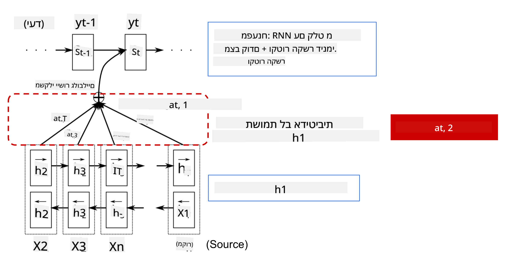
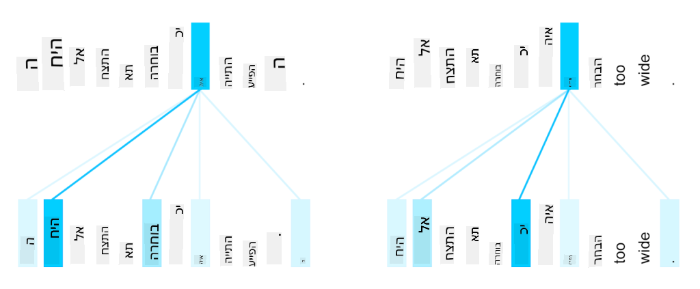
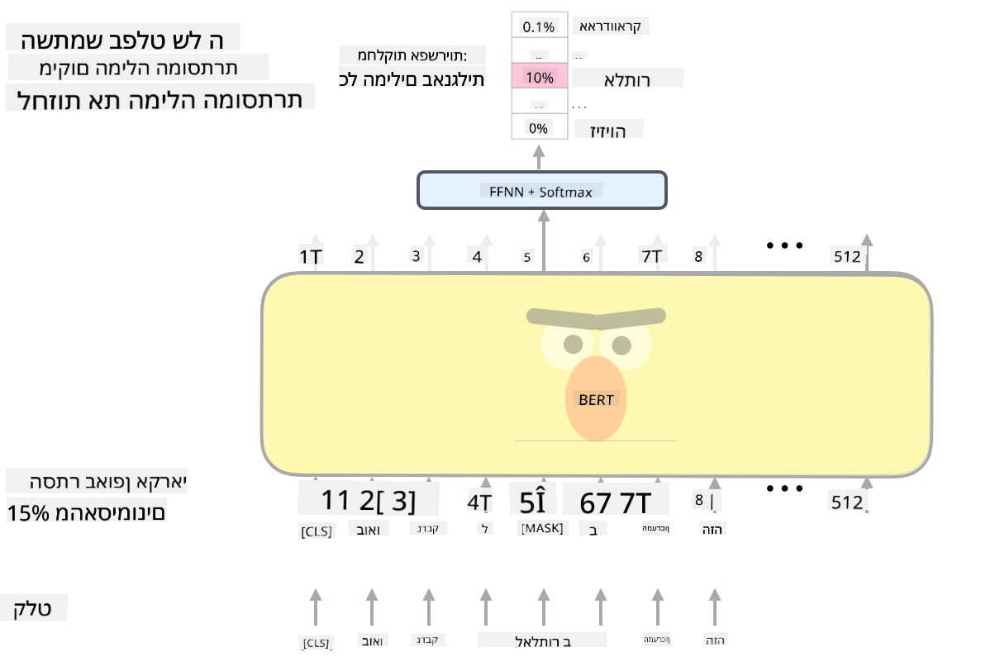

<!--
CO_OP_TRANSLATOR_METADATA:
{
  "original_hash": "7e617f0b8de85a43957a853aba09bfeb",
  "translation_date": "2025-08-28T20:02:01+00:00",
  "source_file": "lessons/5-NLP/18-Transformers/README.md",
  "language_code": "he"
}
-->
# מנגנוני קשב ומודלים של טרנספורמרים

## [שאלון לפני השיעור](https://ff-quizzes.netlify.app/en/ai/quiz/35)

אחת הבעיות החשובות ביותר בתחום עיבוד השפה הטבעית (NLP) היא **תרגום מכונה**, משימה חיונית שעומדת בבסיס כלים כמו Google Translate. בחלק זה נתמקד בתרגום מכונה, או באופן כללי יותר, בכל משימה של *רצף-לרצף* (המכונה גם **שינוי משפטים**).

עם RNNs, משימות רצף-לרצף מיושמות על ידי שני רשתות חוזרות, כאשר רשת אחת, ה-**encoder**, דוחסת רצף קלט למצב מוסתר, בעוד רשת אחרת, ה-**decoder**, פותחת את המצב המוסתר לתוצאה מתורגמת. ישנן כמה בעיות בגישה זו:

* המצב הסופי של רשת ה-encoder מתקשה לזכור את תחילת המשפט, מה שגורם לאיכות ירודה של המודל במשפטים ארוכים.
* לכל המילים ברצף יש השפעה זהה על התוצאה. במציאות, לעומת זאת, למילים מסוימות ברצף הקלט יש לעיתים השפעה רבה יותר על הפלט מאשר לאחרות.

**מנגנוני קשב** מספקים דרך לשקלל את ההשפעה ההקשרית של כל וקטור קלט על כל תחזית פלט של ה-RNN. זה מיושם על ידי יצירת קיצורי דרך בין המצבים הביניים של ה-RNN של הקלט לבין ה-RNN של הפלט. כך, כאשר מייצרים את סמל הפלט yt, ניקח בחשבון את כל המצבים המוסתרים של הקלט hi, עם מקדמי משקל שונים αt,i.

> מודל ה-encoder-decoder עם מנגנון קשב אדיטיבי מתוך [Bahdanau et al., 2015](https://arxiv.org/pdf/1409.0473.pdf), מצוטט מתוך [הפוסט הזה](https://lilianweng.github.io/lil-log/2018/06/24/attention-attention.html)

מטריצת הקשב {αi,j} מייצגת את המידה שבה מילים מסוימות בקלט משפיעות על יצירת מילה מסוימת ברצף הפלט. להלן דוגמה למטריצה כזו:

> איור מתוך [Bahdanau et al., 2015](https://arxiv.org/pdf/1409.0473.pdf) (איור 3)

מנגנוני קשב אחראים לחלק גדול מהמצב הנוכחי או הקרוב ביותר למצב האמנותי (State of the Art) ב-NLP. עם זאת, הוספת קשב מגדילה משמעותית את מספר הפרמטרים במודל, מה שהוביל לבעיות סקיילינג עם RNNs. מגבלה מרכזית בסקיילינג של RNNs היא שהאופי החוזר של המודלים מקשה על ביצוע אימון במקביל. ב-RNN כל אלמנט ברצף צריך להיות מעובד בסדר רציף, מה שאומר שלא ניתן לבצע בקלות עיבוד מקבילי.

> איור מתוך [הבלוג של Google](https://research.googleblog.com/2016/09/a-neural-network-for-machine.html)

האימוץ של מנגנוני קשב בשילוב עם מגבלה זו הוביל ליצירת מודלי הטרנספורמרים המתקדמים שאנו מכירים ומשתמשים בהם כיום, כמו BERT ו-Open-GPT3.

## מודלי טרנספורמרים

אחת הרעיונות המרכזיים מאחורי טרנספורמרים היא להימנע מהאופי הרציף של RNNs וליצור מודל שניתן לבצע עליו עיבוד מקבילי במהלך האימון. זה מושג על ידי יישום שני רעיונות:

* קידוד מיקום
* שימוש במנגנון קשב עצמי כדי לזהות דפוסים במקום RNNs (או CNNs) (זו הסיבה שהמאמר שמציג את הטרנספורמרים נקרא *[Attention is all you need](https://arxiv.org/abs/1706.03762)*)

### קידוד/הטמעת מיקום

הרעיון של קידוד מיקום הוא כדלקמן:
1. כאשר משתמשים ב-RNNs, המיקום היחסי של הטוקנים מיוצג על ידי מספר הצעדים, ולכן אין צורך לייצגו במפורש.
2. עם זאת, ברגע שעוברים לקשב, יש צורך לדעת את המיקומים היחסיים של הטוקנים בתוך הרצף.
3. כדי לקבל קידוד מיקום, אנו מוסיפים לרצף הטוקנים שלנו רצף של מיקומי טוקנים ברצף (כלומר, רצף של מספרים 0,1, ...).
4. לאחר מכן אנו מערבבים את מיקום הטוקן עם וקטור ההטמעה של הטוקן. כדי להפוך את המיקום (מספר שלם) לוקטור, ניתן להשתמש בגישות שונות:

* הטמעה ניתנת לאימון, בדומה להטמעת טוקנים. זו הגישה שנשקול כאן. אנו מיישמים שכבות הטמעה על גבי הטוקנים והמיקומים שלהם, ומקבלים וקטורי הטמעה באותם ממדים, אותם אנו מחברים יחד.
* פונקציית קידוד מיקום קבועה, כפי שהוצע במאמר המקורי.

> תמונה מאת המחבר

התוצאה שאנו מקבלים עם הטמעת מיקום משלבת גם את הטוקן המקורי וגם את מיקומו בתוך הרצף.

### קשב עצמי רב-ראשי

כעת, עלינו לזהות דפוסים מסוימים בתוך הרצף שלנו. לשם כך, טרנספורמרים משתמשים במנגנון **קשב עצמי**, שהוא למעשה קשב המיושם על אותו רצף כקלט וכפלט. יישום קשב עצמי מאפשר לנו לקחת בחשבון **הקשר** בתוך המשפט, ולראות אילו מילים קשורות זו לזו. לדוגמה, זה מאפשר לנו לראות אילו מילים מתייחסות זו לזו באמצעות התייחסויות כמו *it*, וגם לקחת את ההקשר בחשבון:

> תמונה מתוך [הבלוג של Google](https://research.googleblog.com/2017/08/transformer-novel-neural-network.html)

בטרנספורמרים, אנו משתמשים ב**קשב רב-ראשי** כדי לתת לרשת את היכולת לזהות סוגים שונים של תלות, למשל, יחסים ארוכי טווח מול קצרי טווח בין מילים, התייחסות משותפת מול משהו אחר, וכו'.

[מחברת TensorFlow](TransformersTF.ipynb) מכילה פרטים נוספים על יישום שכבות טרנספורמרים.

### קשב בין מקודד לפענח

בטרנספורמרים, קשב משמש בשני מקומות:

* כדי לזהות דפוסים בתוך טקסט הקלט באמצעות קשב עצמי.
* כדי לבצע תרגום רצפים - זהו שכבת הקשב בין ה-encoder ל-decoder.

קשב בין מקודד לפענח דומה מאוד למנגנון הקשב ששימש ב-RNNs, כפי שתואר בתחילת החלק הזה. הדיאגרמה האנימטיבית הבאה מסבירה את תפקיד הקשב בין מקודד לפענח.

מכיוון שכל מיקום קלט ממופה באופן עצמאי לכל מיקום פלט, טרנספורמרים יכולים לבצע עיבוד מקבילי טוב יותר מ-RNNs, מה שמאפשר מודלים לשוניים גדולים ומתקדמים יותר. כל ראש קשב יכול לשמש ללמידת יחסים שונים בין מילים, מה שמשפר משימות עיבוד שפה טבעית.

## BERT

**BERT** (Bidirectional Encoder Representations from Transformers) הוא רשת טרנספורמרים גדולה מאוד עם 12 שכבות עבור *BERT-base*, ו-24 עבור *BERT-large*. המודל מאומן תחילה על מאגר טקסטים גדול (ויקיפדיה + ספרים) באמצעות אימון לא מפוקח (חיזוי מילים מוסתרות במשפט). במהלך האימון הראשוני, המודל סופג רמות משמעותיות של הבנת שפה, שניתן לאחר מכן לנצל עם מערכי נתונים אחרים באמצעות כיוונון עדין. תהליך זה נקרא **למידת העברה**.

> מקור התמונה [כאן](http://jalammar.github.io/illustrated-bert/)

## ✍️ תרגילים: טרנספורמרים

המשיכו ללמוד במחברות הבאות:

* [טרנספורמרים ב-PyTorch](TransformersPyTorch.ipynb)
* [טרנספורמרים ב-TensorFlow](TransformersTF.ipynb)

## סיכום

בשיעור זה למדתם על טרנספורמרים ומנגנוני קשב, כלים חיוניים בארגז הכלים של NLP. ישנן וריאציות רבות של ארכיטקטורות טרנספורמרים, כולל BERT, DistilBERT, BigBird, OpenGPT3 ועוד, שניתן לכוונן. חבילת [HuggingFace](https://github.com/huggingface/) מספקת מאגר לאימון רבות מהארכיטקטורות הללו עם PyTorch ו-TensorFlow.

## 🚀 אתגר

## [שאלון לאחר השיעור](https://ff-quizzes.netlify.app/en/ai/quiz/36)

## סקירה ולימוד עצמי

* [פוסט בבלוג](https://mchromiak.github.io/articles/2017/Sep/12/Transformer-Attention-is-all-you-need/), המסביר את המאמר הקלאסי [Attention is all you need](https://arxiv.org/abs/1706.03762) על טרנספורמרים.
* [סדרת פוסטים בבלוג](https://towardsdatascience.com/transformers-explained-visually-part-1-overview-of-functionality-95a6dd460452) על טרנספורמרים, המסבירה את הארכיטקטורה בפירוט.

## [משימה](assignment.md)

---

**כתב ויתור**:  
מסמך זה תורגם באמצעות שירות תרגום מבוסס בינה מלאכותית [Co-op Translator](https://github.com/Azure/co-op-translator). בעוד שאנו שואפים לדיוק, יש לקחת בחשבון שתרגומים אוטומטיים עשויים להכיל שגיאות או אי דיוקים. המסמך המקורי בשפתו המקורית צריך להיחשב כמקור סמכותי. עבור מידע קריטי, מומלץ להשתמש בתרגום מקצועי על ידי אדם. איננו נושאים באחריות לאי הבנות או לפרשנויות שגויות הנובעות משימוש בתרגום זה.