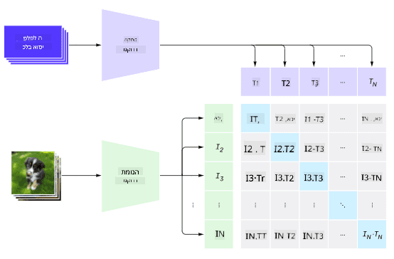
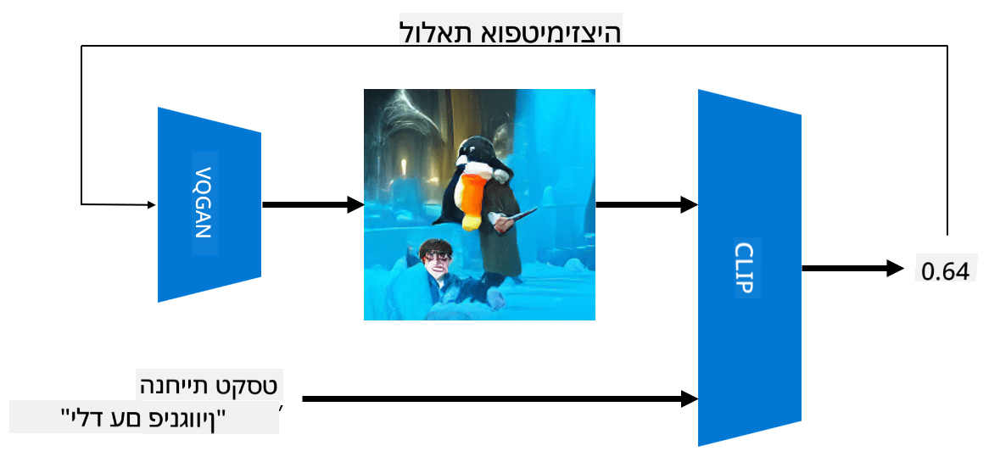
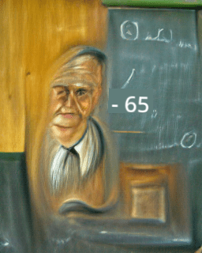

<!--
CO_OP_TRANSLATOR_METADATA:
{
  "original_hash": "9c592c26aca16ca085d268c732284187",
  "translation_date": "2025-08-28T19:22:51+00:00",
  "source_file": "lessons/X-Extras/X1-MultiModal/README.md",
  "language_code": "he"
}
-->
# רשתות מולטי-מודליות

לאחר ההצלחה של מודלי טרנספורמר במשימות עיבוד שפה טבעית (NLP), אותן ארכיטקטורות או דומות להן יושמו גם במשימות ראייה ממוחשבת. יש עניין גובר בבניית מודלים שמשלבים יכולות של ראייה ושפה טבעית. אחד הניסיונות הללו נעשה על ידי OpenAI, והוא נקרא CLIP ו-DALL.E.

## Contrastive Image Pre-Training (CLIP)

הרעיון המרכזי של CLIP הוא היכולת להשוות בין טקסט לתמונה ולקבוע עד כמה התמונה מתאימה לטקסט.

> *תמונה מתוך [הפוסט הזה](https://openai.com/blog/clip/)*

המודל מאומן על תמונות שנאספו מהאינטרנט והכיתובים שלהן. בכל אצווה, לוקחים N זוגות של (תמונה, טקסט) וממירים אותם לייצוגים וקטוריים I ו-T. ייצוגים אלו מותאמים זה לזה. פונקציית ההפסד מוגדרת כך שהיא ממקסמת את הדמיון הקוסינוסי בין וקטורים של זוג אחד (למשל I ו-T), וממזערת את הדמיון הקוסינוסי בין כל שאר הזוגות. זו הסיבה שהגישה הזו נקראת **קונטרסטיבית**.

ספריית CLIP זמינה ב-[GitHub של OpenAI](https://github.com/openai/CLIP). הגישה מתוארת ב-[פוסט הזה](https://openai.com/blog/clip/) ובפירוט רב יותר ב-[מאמר הזה](https://arxiv.org/pdf/2103.00020.pdf).

לאחר שהמודל מאומן מראש, ניתן להזין לו אצווה של תמונות ואצווה של טקסטים, והוא יחזיר טנזור עם הסתברויות. ניתן להשתמש ב-CLIP למספר משימות:

**סיווג תמונות**

נניח שעלינו לסווג תמונות בין חתולים, כלבים ובני אדם. במקרה זה, ניתן להזין למודל תמונה וסדרה של טקסטים: "*תמונה של חתול*", "*תמונה של כלב*", "*תמונה של אדם*". בווקטור התוצאות של 3 ההסתברויות, נבחר את האינדקס עם הערך הגבוה ביותר.

> *תמונה מתוך [הפוסט הזה](https://openai.com/blog/clip/)*

**חיפוש תמונות מבוסס טקסט**

ניתן גם לעשות את ההפך. אם יש לנו אוסף של תמונות, נוכל להעביר את האוסף למודל יחד עם טקסט, והוא יחזיר את התמונה שהכי דומה לטקסט הנתון.

## ✍️ דוגמה: [שימוש ב-CLIP לסיווג תמונות וחיפוש תמונות](Clip.ipynb)

פתחו את המחברת [Clip.ipynb](Clip.ipynb) כדי לראות את CLIP בפעולה.

## יצירת תמונות עם VQGAN+CLIP

ניתן להשתמש ב-CLIP גם ליצירת תמונות מטקסט. לשם כך, נדרש **מודל גנרטור** שיוכל ליצור תמונות בהתבסס על קלט וקטורי. אחד המודלים הללו נקרא [VQGAN](https://compvis.github.io/taming-transformers/) (Vector-Quantized GAN).

הרעיונות המרכזיים של VQGAN שמבדילים אותו מ-GAN רגיל הם:
* שימוש בארכיטקטורת טרנספורמר אוטורגרסיבית ליצירת רצף של חלקים ויזואליים עשירים בהקשר שמרכיבים את התמונה. חלקים אלו נלמדים על ידי [CNN](../../4-ComputerVision/07-ConvNets/README.md).
* שימוש במבחין תת-תמונה שמזהה האם חלקים מהתמונה הם "אמיתיים" או "מזויפים" (בניגוד לגישה של "הכל או כלום" ב-GAN מסורתי).

למידע נוסף על VQGAN, בקרו באתר [Taming Transformers](https://compvis.github.io/taming-transformers/).

אחת ההבדלים החשובים בין VQGAN ל-GAN מסורתי היא שהאחרון יכול לייצר תמונה סבירה מכל וקטור קלט, בעוד ש-VQGAN עשוי לייצר תמונה שאינה קוהרנטית. לכן, יש להנחות את תהליך יצירת התמונה, וזה נעשה באמצעות CLIP.

כדי ליצור תמונה שמתאימה לטקסט, מתחילים עם וקטור קידוד אקראי שמועבר דרך VQGAN ליצירת תמונה. לאחר מכן, CLIP משמש ליצירת פונקציית הפסד שמראה עד כמה התמונה מתאימה לטקסט. המטרה היא למזער את ההפסד הזה באמצעות back propagation כדי להתאים את פרמטרי וקטור הקלט.

ספרייה מצוינת שמממשת VQGAN+CLIP היא [Pixray](http://github.com/pixray/pixray).

 |   | 
----|----|----
תמונה שנוצרה מהטקסט *דיוקן בצבעי מים של מורה צעיר לספרות עם ספר* | תמונה שנוצרה מהטקסט *דיוקן בשמן של מורה צעירה למדעי המחשב עם מחשב* | תמונה שנוצרה מהטקסט *דיוקן בשמן של מורה מבוגר למתמטיקה מול לוח שחור*

> תמונות מתוך אוסף **מורים מלאכותיים** מאת [דמיטרי סושניקוב](http://soshnikov.com)

## DALL-E
### [DALL-E 1](https://openai.com/research/dall-e)
DALL-E הוא גרסה של GPT-3 שאומנה ליצירת תמונות מטקסט. הוא אומן עם 12 מיליארד פרמטרים.

בניגוד ל-CLIP, DALL-E מקבל טקסט ותמונה כזרם אחד של טוקנים עבור שניהם. לכן, ניתן ליצור תמונות ממספר טקסטים.

### [DALL-E 2](https://openai.com/dall-e-2)
ההבדל המרכזי בין DALL-E 1 ל-DALL-E 2 הוא שגרסה 2 מייצרת תמונות ואמנות ריאליסטיות יותר.

דוגמאות ליצירת תמונות עם DALL-E:
 |   | 
----|----|----
תמונה שנוצרה מהטקסט *דיוקן בצבעי מים של מורה צעיר לספרות עם ספר* | תמונה שנוצרה מהטקסט *דיוקן בשמן של מורה צעירה למדעי המחשב עם מחשב* | תמונה שנוצרה מהטקסט *דיוקן בשמן של מורה מבוגר למתמטיקה מול לוח שחור*

## מקורות

* מאמר VQGAN: [Taming Transformers for High-Resolution Image Synthesis](https://compvis.github.io/taming-transformers/paper/paper.pdf)
* מאמר CLIP: [Learning Transferable Visual Models From Natural Language Supervision](https://arxiv.org/pdf/2103.00020.pdf)

---

**כתב ויתור**:  
מסמך זה תורגם באמצעות שירות תרגום מבוסס בינה מלאכותית [Co-op Translator](https://github.com/Azure/co-op-translator). בעוד שאנו שואפים לדיוק, יש להיות מודעים לכך שתרגומים אוטומטיים עשויים להכיל שגיאות או אי דיוקים. המסמך המקורי בשפתו המקורית צריך להיחשב כמקור סמכותי. עבור מידע קריטי, מומלץ להשתמש בתרגום מקצועי על ידי אדם. איננו נושאים באחריות לאי הבנות או לפרשנויות שגויות הנובעות משימוש בתרגום זה.