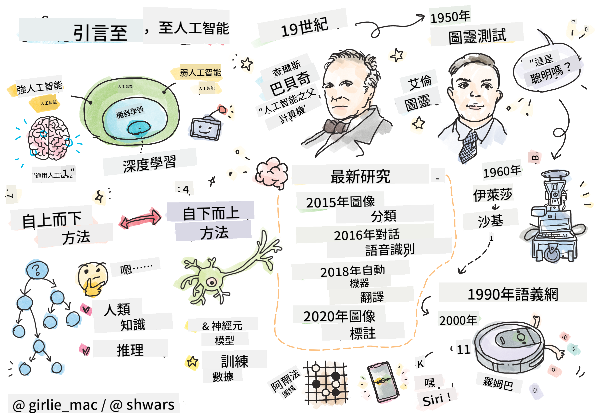

<!--
CO_OP_TRANSLATOR_METADATA:
{
  "original_hash": "06ca1b0138e65b964481ae83275b270e",
  "translation_date": "2025-10-03T07:41:36+00:00",
  "source_file": "lessons/1-Intro/README.md",
  "language_code": "hk"
}
-->
# 人工智能簡介

> 手繪圖由 [Tomomi Imura](https://twitter.com/girlie_mac) 提供

## [課前測驗](https://ff-quizzes.netlify.app/en/ai/quiz/1)

**人工智能**是一門令人興奮的科學學科，研究如何讓電腦表現出智能行為，例如完成人類擅長的事情。

最初，電腦是由 [Charles Babbage](https://en.wikipedia.org/wiki/Charles_Babbage) 發明的，用於按照明確定義的程序（算法）處理數字。現代電腦雖然比19世紀提出的原始模型先進得多，但仍然遵循受控計算的理念。因此，如果我們知道實現目標所需的精確步驟序列，就可以編程讓電腦完成某些事情。

> 照片由 [Vickie Soshnikova](http://twitter.com/vickievalerie) 提供

> ✅ 從一個人的照片中判斷其年齡是一項無法明確編程的任務，因為我們不知道自己在腦海中得出數字的具體過程。

---

然而，有些任務我們並不知道如何明確解決。例如，從一個人的照片中判斷其年齡。我們能夠學會這樣做，是因為我們看過許多不同年齡的人的例子，但我們無法明確解釋自己是如何做到的，也無法編程讓電腦完成這項任務。這正是 **人工智能**（簡稱 AI）感興趣的任務類型。

✅ 想一想有哪些任務可以交給電腦完成，並且能從人工智能中受益。考慮金融、醫療和藝術領域——這些領域今天如何受益於人工智能？

## 弱人工智能 vs. 強人工智能

弱人工智能 | 強人工智能
---------------------------------------|-------------------------------------
弱人工智能指的是為特定任務或一組狹窄任務設計和訓練的人工智能系統。|強人工智能（或人工通用智能，AGI）指的是具有人類水平智能和理解能力的人工智能系統。
這些人工智能系統並不具備普遍智能；它們在執行預定義任務方面表現出色，但缺乏真正的理解或意識。|這些人工智能系統能夠執行人類可以完成的任何智力任務，適應不同領域，並擁有某種形式的意識或自我認知。
弱人工智能的例子包括虛擬助手如 Siri 或 Alexa、流媒體服務使用的推薦算法，以及專門設計用於客戶服務的聊天機器人。|實現強人工智能是人工智能研究的長期目標，需要開發能夠在廣泛任務和情境中進行推理、學習、理解和適應的人工智能系統。
弱人工智能高度專業化，並不具備人類般的認知能力或超出其狹窄領域的通用問題解決能力。|強人工智能目前仍是一個理論概念，尚無人工智能系統達到這種通用智能的水平。

更多信息請參考 **[人工通用智能](https://en.wikipedia.org/wiki/Artificial_general_intelligence)** (AGI)。

## 智能的定義與圖靈測試

在討論 **[智能](https://en.wikipedia.org/wiki/Intelligence)** 這個術語時，其中一個問題是沒有明確的定義。有人認為智能與 **抽象思維** 或 **自我意識** 有關，但我們無法準確地定義它。

> [照片](https://unsplash.com/photos/75715CVEJhI) 由 [Amber Kipp](https://unsplash.com/@sadmax) 提供，來自 Unsplash

為了理解“智能”這個術語的模糊性，試著回答一個問題：“貓是智能的嗎？”不同的人往往會給出不同的答案，因為沒有普遍接受的測試來證明這一說法是否正確。如果你認為有——試著讓你的貓參加智商測試……

✅ 花一分鐘思考你如何定義智能。一隻能解迷宮並獲得食物的烏鴉是智能的嗎？一個孩子是智能的嗎？

---

在討論 AGI 時，我們需要某種方法來判斷是否創造了一個真正智能的系統。[Alan Turing](https://en.wikipedia.org/wiki/Alan_Turing) 提出了一種方法，稱為 **[圖靈測試](https://en.wikipedia.org/wiki/Turing_test)**，它也可以作為智能的定義。該測試將給定系統與某些固有智能的事物（如真人）進行比較，並且因為任何自動比較都可能被電腦程序繞過，我們使用人類審問者。如果人類無法在基於文本的對話中區分真人和電腦系統，那麼該系統就被認為是智能的。

> 一個名為 [Eugene Goostman](https://en.wikipedia.org/wiki/Eugene_Goostman) 的聊天機器人於2014年在聖彼得堡接近通過圖靈測試，使用了一個巧妙的個性技巧。它事先聲稱自己是一個13歲的烏克蘭男孩，這解釋了知識的缺乏和文本中的一些差異。該機器人在5分鐘的對話中說服了30%的評委相信它是人類，這是一個圖靈認為機器能在2000年通過的指標。然而，應該理解，這並不表明我們創造了一個智能系統，或者電腦系統欺騙了人類審問者——實際上是機器人創造者欺騙了人類，而不是系統本身。

✅ 你是否曾被聊天機器人欺騙，認為自己在與人類交談？它是如何說服你的？

## 人工智能的不同方法

如果我們希望電腦像人類一樣行事，我們需要以某種方式在電腦內部模擬我們的思維方式。因此，我們需要嘗試理解什麼使人類具有智能。

> 為了能夠將智能編程到機器中，我們需要理解自己做決策的過程是如何運作的。如果你進行一些自我反思，你會意識到有些過程是潛意識進行的——例如，我們可以在不思考的情況下區分貓和狗——而另一些則涉及推理。

解決這個問題有兩種可能的方法：

自上而下方法（符號推理） | 自下而上方法（神經網絡）
---------------------------------------|-------------------------------------
自上而下方法模擬人類解決問題的推理方式。它涉及從人類中提取 **知識**，並以計算機可讀的形式表示。我們還需要開發一種方法來在計算機內部模擬 **推理**。|自下而上方法模擬人類大腦的結構，由大量簡單單元組成，稱為 **神經元**。每個神經元的作用類似於其輸入的加權平均值，我們可以通過提供 **訓練數據** 來訓練神經元網絡以解決有用的問題。

此外，還有一些其他可能的智能方法：

* **涌現式**、**協同式**或**多代理方法**基於這樣一個事實，即通過大量簡單代理的交互可以獲得複雜的智能行為。根據 [進化控制論](https://en.wikipedia.org/wiki/Global_brain#Evolutionary_cybernetics)，智能可以在 *元系統轉變* 的過程中從更簡單的反應行為中 *涌現*。

* **進化方法**或**遺傳算法**是一種基於進化原則的優化過程。

我們將在課程後續部分探討這些方法，但現在我們將重點放在兩個主要方向：自上而下和自下而上。

### 自上而下方法

在 **自上而下方法** 中，我們嘗試模擬我們的推理。由於我們可以在推理時跟隨自己的思維，我們可以嘗試將這一過程形式化並編程到計算機中。這被稱為 **符號推理**。

人們往往在頭腦中有一些指導其決策過程的規則。例如，當醫生診斷病人時，他或她可能意識到病人有發燒症狀，因此可能存在某些炎症。通過將大量規則應用於特定問題，醫生可能能夠得出最終診斷。

這種方法高度依賴於 **知識表示** 和 **推理**。從人類專家中提取知識可能是最困難的部分，因為醫生在許多情況下可能不知道自己為什麼得出特定診斷。有時解決方案只是自然而然地出現在他的腦海中，而沒有明確的思考。有些任務，例如從照片中判斷一個人的年齡，根本無法簡化為知識操作。

### 自下而上方法

另一種方法是嘗試模擬我們大腦中的最簡單元素——神經元。我們可以在計算機內部構建所謂的 **人工神經網絡**，然後通過提供示例來教它解決問題。這個過程類似於新生兒通過觀察學習周圍環境的方式。

✅ 研究一下嬰兒是如何學習的。嬰兒大腦的基本元素是什麼？

> | 機器學習呢？         |      |
> |--------------|-----------|
> | 人工智能的一部分基於計算機通過一些數據學習解決問題，稱為 **機器學習**。我們不會在本課程中探討傳統機器學習——請參考單獨的 [機器學習入門課程](http://aka.ms/ml-beginners)。 |       |

## 人工智能的簡史

人工智能作為一個領域始於20世紀中期。最初，符號推理是一種流行的方法，並取得了一些重要的成功，例如專家系統——能夠在某些有限問題領域中充當專家的計算機程序。然而，很快就發現這種方法的可擴展性不佳。從專家中提取知識、在計算機中表示知識以及保持知識庫的準確性，事實證明是一項非常複雜且成本高昂的任務，在許多情況下不切實際。這導致了1970年代的所謂 [人工智能寒冬](https://en.wikipedia.org/wiki/AI_winter)。

> 圖片由 [Dmitry Soshnikov](http://soshnikov.com) 提供

隨著時間的推移，計算資源變得更便宜，更多數據可用，神經網絡方法開始在許多領域（如計算機視覺或語音理解）中表現出色。在過去十年中，“人工智能”這個術語大多被用作神經網絡的同義詞，因為我們聽到的大多數人工智能成功案例都基於神經網絡。

我們可以觀察到方法的變化，例如在創建下棋程序方面：

* 早期的下棋程序基於搜索——程序明確嘗試估算對手在給定的幾步棋中可能的走法，並根據幾步棋後可以達到的最佳位置選擇最佳走法。這導致了所謂的 [alpha-beta剪枝](https://en.wikipedia.org/wiki/Alpha%E2%80%93beta_pruning) 搜索算法的發展。
* 搜索策略在遊戲結束時效果很好，因為搜索空間受到少量可能走法的限制。然而，在遊戲開始時，搜索空間巨大，算法可以通過學習人類玩家之間的現有比賽來改進。隨後的實驗採用了所謂的 [基於案例推理](https://en.wikipedia.org/wiki/Case-based_reasoning)，程序在知識庫中尋找與當前棋局非常相似的案例。
* 現代能夠擊敗人類玩家的程序基於神經網絡和 [強化學習](https://en.wikipedia.org/wiki/Reinforcement_learning)，程序通過長時間與自己對弈並從自己的錯誤中學習來學會下棋——就像人類學習下棋一樣。然而，計算機程序可以在更短的時間內玩更多的棋局，因此可以學得更快。

✅ 研究一下人工智能玩過的其他遊戲。

同樣，我們可以看到創建“會說話的程序”（可能通過圖靈測試）的方法如何改變：

* 早期的此類程序，例如 [Eliza](https://en.wikipedia.org/wiki/ELIZA)，基於非常簡單的語法規則和將輸入句子重新表述為問題。
* 現代助手，例如 Cortana、Siri 或 Google Assistant，都是混合系統，使用神經網絡將語音轉換為文本並識別我們的意圖，然後使用一些推理或明確算法執行所需操作。
* 未來，我們可能期待一個完全基於神經網絡的模型自行處理對話。最近的 GPT 和 [Turing-NLG](https://www.microsoft.com/research/blog/turing-nlg-a-17-billion-parameter-language-model-by-microsoft) 系列神經網絡顯示出巨大成功。

> 圖片由 Dmitry Soshnikov 提供，[照片](https://unsplash.com/photos/r8LmVbUKgns) 由 [Marina Abrosimova](https://unsplash.com/@abrosimova_marina_foto) 提供，Unsplash

## 最近的人工智能研究

神經網絡研究的巨大增長始於2010年左右，當時大型公共數據集開始變得可用。一個名為 [ImageNet](https://en.wikipedia.org/wiki/ImageNet) 的龐大圖像集合，包含約1400萬張註解圖像，催生了 [ImageNet 大規模視覺識別挑戰](https://image-net.org/challenges/LSVRC/)。

> 圖片由 [Dmitry Soshnikov](http://soshnikov.com) 提供

2012年，[卷積神經網絡](../4-ComputerVision/07-ConvNets/README.md) 首次被用於圖像分類，導致分類錯誤率顯著下降（從接近30%降至16.4%）。2015年，微軟研究院的 ResNet 架構 [達到人類級別的準確率](https://doi.org/10.1109/ICCV.2015.123)。

自那時起，神經網絡在許多任務中表現出非常成功的效果：

---

年份 | 達到人類水平
-----|--------
2015 | [圖像分類](https://doi.org/10.1109/ICCV.2015.123)
2016 | [對話式語音識別](https://arxiv.org/abs/1610.05256)
2018 | [自動機器翻譯](https://arxiv.org/abs/1803.05567)（中英翻譯）
2020 | [圖像標註](https://arxiv.org/abs/2009.13682)

在過去幾年中，我們見證了大型語言模型的巨大成功，例如 BERT 和 GPT-3。這主要是因為有大量的通用文本數據可用，這使得我們能夠訓練模型以捕捉文本的結構和意義，先在通用文本集合上進行預訓練，然後再使這些模型專注於更具體的任務。我們稍後會在本課程中學習更多關於 [自然語言處理](../5-NLP/README.md) 的內容。

## 🚀 挑戰

在互聯網上進行探索，判斷在你看來人工智能在哪些領域最有效地被使用。是地圖應用程序、語音轉文字服務還是視頻遊戲？研究該系統是如何構建的。

## [課後測驗](https://ff-quizzes.netlify.app/en/ai/quiz/2)

## 回顧與自學

通過閱讀 [這節課](https://github.com/microsoft/ML-For-Beginners/tree/main/1-Introduction/2-history-of-ML) 來回顧人工智能和機器學習的歷史。從該課程或本課程頂部的手繪筆記中選取一個元素，深入研究以了解其演變背後的文化背景。

**作業**: [遊戲開發挑戰](assignment.md)

---

**免責聲明**：  
本文件已使用人工智能翻譯服務 [Co-op Translator](https://github.com/Azure/co-op-translator) 進行翻譯。儘管我們致力於提供準確的翻譯，但請注意，自動翻譯可能包含錯誤或不準確之處。原始文件的母語版本應被視為權威來源。對於重要資訊，建議使用專業人工翻譯。我們對因使用此翻譯而引起的任何誤解或錯誤解釋概不負責。