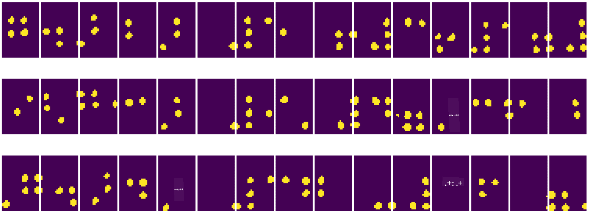

<!--
CO_OP_TRANSLATOR_METADATA:
{
  "original_hash": "4bedc8e702db17260cfe824d58b6cfd4",
  "translation_date": "2025-08-24T22:00:46+00:00",
  "source_file": "lessons/4-ComputerVision/06-IntroCV/README.md",
  "language_code": "hk"
}
-->
# 電腦視覺簡介

[電腦視覺](https://wikipedia.org/wiki/Computer_vision) 是一個學科，其目標是讓電腦能夠對數碼圖像進行高層次的理解。這是一個相當廣泛的定義，因為*理解*可以意味著很多不同的事情，包括在圖片中找到物體（**物體檢測**）、理解發生了什麼（**事件檢測**）、用文字描述圖片，或者重建3D場景。還有一些與人類圖像相關的特殊任務，例如年齡和情緒估算、人臉檢測與識別，以及3D姿態估算等。

## [課前測驗](https://red-field-0a6ddfd03.1.azurestaticapps.net/quiz/106)

電腦視覺最簡單的任務之一是**圖像分類**。

電腦視覺通常被認為是人工智能的一個分支。如今，大多數電腦視覺任務都是通過神經網絡解決的。我們將在本節中學習更多關於用於電腦視覺的特殊神經網絡類型，[卷積神經網絡](../07-ConvNets/README.md)。

然而，在將圖像傳遞給神經網絡之前，在許多情況下，使用一些算法技術來增強圖像是有意義的。

以下是一些可用於圖像處理的 Python 庫：

* **[imageio](https://imageio.readthedocs.io/en/stable/)** 可用於讀取/寫入不同的圖像格式。它還支持 ffmpeg，一個將視頻幀轉換為圖像的有用工具。
* **[Pillow](https://pillow.readthedocs.io/en/stable/index.html)**（也稱為 PIL）功能更強大，還支持一些圖像操作，例如變形、調整調色板等。
* **[OpenCV](https://opencv.org/)** 是一個用 C++ 編寫的強大圖像處理庫，已成為圖像處理的*事實標準*。它有一個方便的 Python 接口。
* **[dlib](http://dlib.net/)** 是一個 C++ 庫，實現了許多機器學習算法，包括一些電腦視覺算法。它也有一個 Python 接口，可用於如人臉和面部特徵點檢測等挑戰性任務。

## OpenCV

[OpenCV](https://opencv.org/) 被認為是圖像處理的*事實標準*。它包含許多有用的算法，這些算法是用 C++ 實現的。你也可以從 Python 調用 OpenCV。

學習 OpenCV 的一個好地方是 [這個 Learn OpenCV 課程](https://learnopencv.com/getting-started-with-opencv/)。在我們的課程中，我們的目標不是學習 OpenCV，而是向你展示一些可以使用它的例子以及如何使用。

### 加載圖像

在 Python 中，圖像可以方便地表示為 NumPy 陣列。例如，大小為 320x200 像素的灰度圖像將存儲在一個 200x320 的陣列中，而相同尺寸的彩色圖像將具有 200x320x3 的形狀（對應3個顏色通道）。要加載圖像，可以使用以下代碼：

```python
import cv2
import matplotlib.pyplot as plt

im = cv2.imread('image.jpeg')
plt.imshow(im)
```

傳統上，OpenCV 使用 BGR（藍-綠-紅）編碼來表示彩色圖像，而其他 Python 工具則使用更傳統的 RGB（紅-綠-藍）。為了使圖像顯示正確，你需要將其轉換為 RGB 色彩空間，可以通過在 NumPy 陣列中交換維度，或者調用 OpenCV 函數來完成：

```python
im = cv2.cvtColor(im,cv2.COLOR_BGR2RGB)
```

同樣的 `cvtColor` 函數還可以用於執行其他色彩空間轉換，例如將圖像轉換為灰度或 HSV（色調-飽和度-亮度）色彩空間。

你還可以使用 OpenCV 逐幀加載視頻——在練習 [OpenCV Notebook](../../../../../lessons/4-ComputerVision/06-IntroCV/OpenCV.ipynb) 中提供了一個示例。

### 圖像處理

在將圖像傳遞給神經網絡之前，你可能需要應用幾個預處理步驟。OpenCV 可以執行許多操作，包括：

* 使用 `im = cv2.resize(im, (320,200),interpolation=cv2.INTER_LANCZOS)` **調整圖像大小**
* 使用 `im = cv2.medianBlur(im,3)` 或 `im = cv2.GaussianBlur(im, (3,3), 0)` **模糊圖像**
* 通過 NumPy 陣列操作更改圖像的**亮度和對比度**，具體方法參見 [這篇 Stackoverflow 筆記](https://stackoverflow.com/questions/39308030/how-do-i-increase-the-contrast-of-an-image-in-python-opencv)。
* 使用 [閾值處理](https://docs.opencv.org/4.x/d7/d4d/tutorial_py_thresholding.html)，通過調用 `cv2.threshold`/`cv2.adaptiveThreshold` 函數，這通常比調整亮度或對比度更可取。
* 對圖像應用不同的[變換](https://docs.opencv.org/4.5.5/da/d6e/tutorial_py_geometric_transformations.html)：
    - **[仿射變換](https://docs.opencv.org/4.5.5/d4/d61/tutorial_warp_affine.html)** 如果你需要對圖像進行旋轉、調整大小和傾斜，並且知道圖像中三個點的源位置和目標位置，仿射變換會保持平行線的平行性。
    - **[透視變換](https://medium.com/analytics-vidhya/opencv-perspective-transformation-9edffefb2143)** 當你知道圖像中四個點的源位置和目標位置時非常有用。例如，如果你用智能手機從某個角度拍攝了一張矩形文件的照片，並希望將其轉換為矩形圖像。
* 使用 **[光流](https://docs.opencv.org/4.5.5/d4/dee/tutorial_optical_flow.html)** 理解圖像中的運動。

## 電腦視覺的應用示例

在我們的 [OpenCV Notebook](../../../../../lessons/4-ComputerVision/06-IntroCV/OpenCV.ipynb) 中，我們提供了一些電腦視覺用於執行特定任務的示例：

* **預處理盲文書籍的照片**。我們專注於如何使用閾值處理、特徵檢測、透視變換和 NumPy 操作來分離單個盲文符號，以便神經網絡進一步分類。

 |  | 
----|-----|-----

> 圖片來自 [OpenCV.ipynb](../../../../../lessons/4-ComputerVision/06-IntroCV/OpenCV.ipynb)

* **使用幀差檢測視頻中的運動**。如果攝像機是固定的，那麼來自攝像機的幀應該彼此非常相似。由於幀被表示為陣列，只需對兩個連續幀的陣列進行減法運算，我們就可以得到像素差異，靜態幀的差異應該很小，而當圖像中有顯著運動時，差異會變大。


> 圖片來自 [OpenCV.ipynb](../../../../../lessons/4-ComputerVision/06-IntroCV/OpenCV.ipynb)

* **使用光流檢測運動**。[光流](https://docs.opencv.org/3.4/d4/dee/tutorial_optical_flow.html) 允許我們理解視頻幀中每個像素的運動方式。有兩種類型的光流：

   - **密集光流** 計算顯示每個像素移動方向的向量場
   - **稀疏光流** 基於圖像中的一些顯著特徵（例如邊緣），並從幀到幀構建它們的軌跡。


> 圖片來自 [OpenCV.ipynb](../../../../../lessons/4-ComputerVision/06-IntroCV/OpenCV.ipynb)

## ✍️ 示例筆記本：OpenCV [試試 OpenCV 的實際應用](../../../../../lessons/4-ComputerVision/06-IntroCV/OpenCV.ipynb)

讓我們通過探索 [OpenCV Notebook](../../../../../lessons/4-ComputerVision/06-IntroCV/OpenCV.ipynb) 來進行一些 OpenCV 的實驗。

## 結論

有時，像運動檢測或指尖檢測這樣相對複雜的任務可以純粹通過電腦視覺來解決。因此，了解電腦視覺的基本技術以及像 OpenCV 這樣的庫能做什麼是非常有幫助的。

## 🚀 挑戰

觀看 [這段視頻](https://docs.microsoft.com/shows/ai-show/ai-show--2021-opencv-ai-competition--grand-prize-winners--cortic-tigers--episode-32?WT.mc_id=academic-77998-cacaste)，了解 Cortic Tigers 項目以及他們如何通過機器人構建基於積木的解決方案來普及電腦視覺任務。研究其他類似的項目，了解它們如何幫助新學習者進入這個領域。

## [課後測驗](https://red-field-0a6ddfd03.1.azurestaticapps.net/quiz/206)

## 回顧與自學

閱讀更多關於光流的內容 [在這篇精彩的教程中](https://learnopencv.com/optical-flow-in-opencv/)。

## [作業](lab/README.md)

在這個實驗中，你將拍攝一段包含簡單手勢的視頻，你的目標是使用光流提取上下左右的運動。


**免責聲明**：  
本文件使用人工智能翻譯服務 [Co-op Translator](https://github.com/Azure/co-op-translator) 進行翻譯。我們致力於提供準確的翻譯，但請注意，自動翻譯可能包含錯誤或不準確之處。應以原文文件作為權威來源。對於關鍵資訊，建議尋求專業人工翻譯。我們對因使用此翻譯而引起的任何誤解或誤釋不承擔責任。