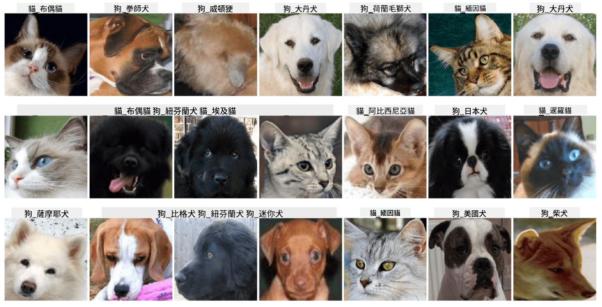

<!--
CO_OP_TRANSLATOR_METADATA:
{
  "original_hash": "b70fcf7fcee862990f848c679090943f",
  "translation_date": "2025-10-03T14:52:58+00:00",
  "source_file": "lessons/4-ComputerVision/07-ConvNets/lab/README.md",
  "language_code": "hk"
}
-->
# 寵物面孔分類

來自 [AI for Beginners Curriculum](https://github.com/microsoft/ai-for-beginners) 的實驗作業。

## 任務

假設你需要開發一個寵物托管應用程式，用於記錄所有寵物。這樣的應用程式的一個重要功能就是能夠從照片中自動識別寵物的品種。這可以通過神經網絡成功實現。

你需要訓練一個卷積神經網絡來分類不同品種的貓和狗，使用 **Pet Faces** 數據集。

## 數據集

我們將使用 [Oxford-IIIT Pet Dataset](https://www.robots.ox.ac.uk/~vgg/data/pets/)，該數據集包含37種不同品種的狗和貓的圖片。



要下載數據集，請使用以下代碼片段：

```python
!wget https://thor.robots.ox.ac.uk/~vgg/data/pets/images.tar.gz
!tar xfz images.tar.gz
!rm images.tar.gz
```

**注意：** Oxford-IIIT Pet Dataset 的圖片是根據文件名組織的（例如，`Abyssinian_1.jpg`，`Bengal_2.jpg`）。筆記本中包含代碼，用於將這些圖片整理到按品種分類的子目錄中，以便於分類。

## 開始筆記本

通過打開 [PetFaces.ipynb](PetFaces.ipynb) 開始實驗。

## 收穫

你已經從零開始解決了一個相對複雜的圖像分類問題！儘管有很多類別，你仍然能夠獲得合理的準確率！同時，測量 top-k 準確率也是有意義的，因為有些類別即使對人類來說也不容易區分。

---

**免責聲明**：  
本文件已使用人工智能翻譯服務 [Co-op Translator](https://github.com/Azure/co-op-translator) 進行翻譯。儘管我們致力於提供準確的翻譯，但請注意，自動翻譯可能包含錯誤或不準確之處。原始文件的母語版本應被視為權威來源。對於重要信息，建議使用專業人工翻譯。我們對因使用此翻譯而引起的任何誤解或錯誤解釋概不負責。