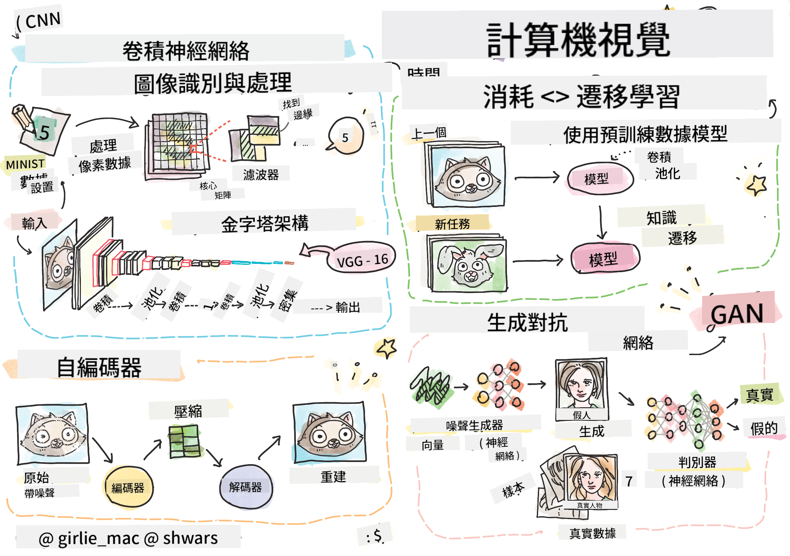

<!--
CO_OP_TRANSLATOR_METADATA:
{
  "original_hash": "58a52f000089c1d8906a4daa4ab1169b",
  "translation_date": "2025-08-24T21:55:08+00:00",
  "source_file": "lessons/4-ComputerVision/README.md",
  "language_code": "hk"
}
-->
# 電腦視覺

在這部分，我們將學習以下內容：

* [電腦視覺與 OpenCV 簡介](06-IntroCV/README.md)
* [卷積神經網絡](07-ConvNets/README.md)
* [預訓練網絡與遷移學習](08-TransferLearning/README.md) 
* [自編碼器](09-Autoencoders/README.md)
* [生成對抗網絡](10-GANs/README.md)
* [物件偵測](11-ObjectDetection/README.md)
* [語義分割](12-Segmentation/README.md)

**免責聲明**：  
本文件已使用人工智能翻譯服務 [Co-op Translator](https://github.com/Azure/co-op-translator) 進行翻譯。我們致力於提供準確的翻譯，但請注意，自動翻譯可能包含錯誤或不準確之處。應以原文文件作為權威來源。對於關鍵資訊，建議尋求專業人工翻譯。我們對因使用此翻譯而引起的任何誤解或錯誤解釋概不負責。