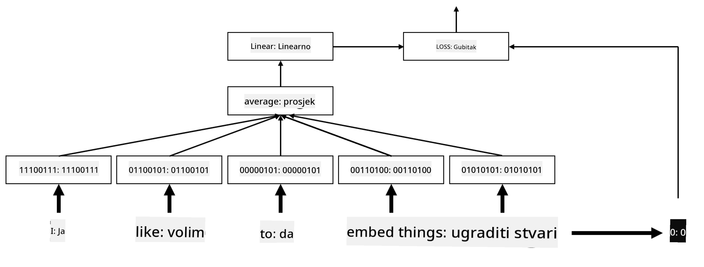

<!--
CO_OP_TRANSLATOR_METADATA:
{
  "original_hash": "e40b47ac3fd48f71304ede1474e66293",
  "translation_date": "2025-08-25T21:40:30+00:00",
  "source_file": "lessons/5-NLP/14-Embeddings/README.md",
  "language_code": "hr"
}
-->
# Ugrađivanja

## [Kviz prije predavanja](https://ff-quizzes.netlify.app/en/ai/quiz/27)

Kada smo trenirali klasifikatore temeljene na BoW ili TF/IDF, radili smo s vektorima vreće riječi visoke dimenzionalnosti duljine `vocab_size`, te smo eksplicitno pretvarali vektore s niskodimenzionalnim pozicijskim prikazom u rijetke one-hot prikaze. Međutim, ovaj one-hot prikaz nije memorijski učinkovit. Osim toga, svaka se riječ tretira neovisno o drugima, tj. one-hot kodirani vektori ne izražavaju nikakvu semantičku sličnost između riječi.

Ideja **ugrađivanja** je predstavljati riječi pomoću vektora niže dimenzionalnosti, koji na neki način odražavaju semantičko značenje riječi. Kasnije ćemo raspraviti kako izgraditi značajna ugrađivanja riječi, ali za sada razmotrimo ugrađivanja kao način smanjenja dimenzionalnosti vektora riječi.

Dakle, sloj za ugrađivanje uzima riječ kao ulaz i proizvodi izlazni vektor određene `embedding_size`. Na neki način, to je vrlo slično sloju `Linear`, ali umjesto da uzima one-hot kodirani vektor, može uzeti broj riječi kao ulaz, omogućujući nam da izbjegnemo stvaranje velikih one-hot kodiranih vektora.

Korištenjem sloja za ugrađivanje kao prvog sloja u našoj mreži klasifikatora, možemo prijeći s modela vreće riječi na model **vreće ugrađivanja**, gdje prvo pretvaramo svaku riječ u našem tekstu u odgovarajuće ugrađivanje, a zatim izračunavamo neku agregatnu funkciju nad svim tim ugrađivanjima, poput `sum`, `average` ili `max`.

> Slika autora

## ✍️ Vježbe: Ugrađivanja

Nastavite učiti u sljedećim bilježnicama:
* [Ugrađivanja s PyTorchom](../../../../../lessons/5-NLP/14-Embeddings/EmbeddingsPyTorch.ipynb)
* [Ugrađivanja s TensorFlowom](../../../../../lessons/5-NLP/14-Embeddings/EmbeddingsTF.ipynb)

## Semantička ugrađivanja: Word2Vec

Iako je sloj za ugrađivanje naučio mapirati riječi u vektorski prikaz, taj prikaz nije nužno imao mnogo semantičkog značenja. Bilo bi korisno naučiti vektorski prikaz takav da slične riječi ili sinonimi odgovaraju vektorima koji su blizu jedni drugima prema nekoj vektorskoj udaljenosti (npr. Euklidskoj udaljenosti).

Da bismo to postigli, trebamo unaprijed trenirati naš model za ugrađivanje na velikoj zbirci teksta na specifičan način. Jedan od načina treniranja semantičkih ugrađivanja naziva se [Word2Vec](https://en.wikipedia.org/wiki/Word2vec). Temelji se na dvije glavne arhitekture koje se koriste za stvaranje distribuiranog prikaza riječi:

 - **Kontinuirana vreća riječi** (CBoW) — u ovoj arhitekturi treniramo model da predvidi riječ iz okolnog konteksta. S obzirom na ngram $(W_{-2},W_{-1},W_0,W_1,W_2)$, cilj modela je predvidjeti $W_0$ iz $(W_{-2},W_{-1},W_1,W_2)$.
 - **Kontinuirani skip-gram** je suprotan CBoW-u. Model koristi okolni prozor kontekstualnih riječi za predviđanje trenutne riječi.

CBoW je brži, dok je skip-gram sporiji, ali bolje predstavlja rijetke riječi.

> Slika iz [ovog rada](https://arxiv.org/pdf/1301.3781.pdf)

Unaprijed trenirana ugrađivanja Word2Vec (kao i drugi slični modeli, poput GloVe) također se mogu koristiti umjesto sloja za ugrađivanje u neuronskim mrežama. Međutim, moramo se nositi s rječnicima, jer se rječnik korišten za unaprijed treniranje Word2Vec/GloVe vjerojatno razlikuje od rječnika u našem tekstualnom korpusu. Pogledajte gore navedene bilježnice kako biste vidjeli kako se ovaj problem može riješiti.

## Kontekstualna ugrađivanja

Jedno ključno ograničenje tradicionalnih unaprijed treniranih prikaza ugrađivanja poput Word2Vec-a je problem razlučivanja značenja riječi. Iako unaprijed trenirana ugrađivanja mogu uhvatiti dio značenja riječi u kontekstu, svako moguće značenje riječi kodirano je u isto ugrađivanje. To može uzrokovati probleme u modelima koji dolaze kasnije, budući da mnoge riječi, poput riječi 'play', imaju različita značenja ovisno o kontekstu u kojem se koriste.

Na primjer, riječ 'play' u ove dvije različite rečenice ima prilično različita značenja:

- Otišao sam na **predstavu** u kazalištu.
- John želi **igrati** s prijateljima.

Unaprijed trenirana ugrađivanja gore predstavljaju oba ova značenja riječi 'play' u istom ugrađivanju. Kako bismo prevladali ovo ograničenje, trebamo izgraditi ugrađivanja temeljena na **jezičnom modelu**, koji je treniran na velikom korpusu teksta i *zna* kako se riječi mogu slagati u različitim kontekstima. Rasprava o kontekstualnim ugrađivanjima izlazi izvan okvira ovog vodiča, ali vratit ćemo im se kada budemo govorili o jezičnim modelima kasnije u tečaju.

## Zaključak

U ovoj lekciji otkrili ste kako izgraditi i koristiti slojeve za ugrađivanje u TensorFlowu i Pytorchu kako biste bolje odrazili semantička značenja riječi.

## 🚀 Izazov

Word2Vec je korišten za neke zanimljive primjene, uključujući generiranje stihova pjesama i poezije. Pogledajte [ovaj članak](https://www.politetype.com/blog/word2vec-color-poems) koji objašnjava kako je autor koristio Word2Vec za generiranje poezije. Pogledajte i [ovaj video Dana Shiffmanna](https://www.youtube.com/watch?v=LSS_bos_TPI&ab_channel=TheCodingTrain) kako biste otkrili drugačije objašnjenje ove tehnike. Zatim pokušajte primijeniti ove tehnike na vlastiti tekstualni korpus, možda preuzet s Kaggla.

## [Kviz nakon predavanja](https://ff-quizzes.netlify.app/en/ai/quiz/28)

## Pregled i samostalno učenje

Pročitajte ovaj rad o Word2Vec-u: [Efficient Estimation of Word Representations in Vector Space](https://arxiv.org/pdf/1301.3781.pdf)

## [Zadatak: Bilježnice](assignment.md)

**Odricanje od odgovornosti**:  
Ovaj dokument je preveden pomoću AI usluge za prevođenje [Co-op Translator](https://github.com/Azure/co-op-translator). Iako nastojimo osigurati točnost, imajte na umu da automatski prijevodi mogu sadržavati pogreške ili netočnosti. Izvorni dokument na izvornom jeziku treba smatrati autoritativnim izvorom. Za kritične informacije preporučuje se profesionalni prijevod od strane čovjeka. Ne preuzimamo odgovornost za nesporazume ili pogrešna tumačenja koja mogu proizaći iz korištenja ovog prijevoda.