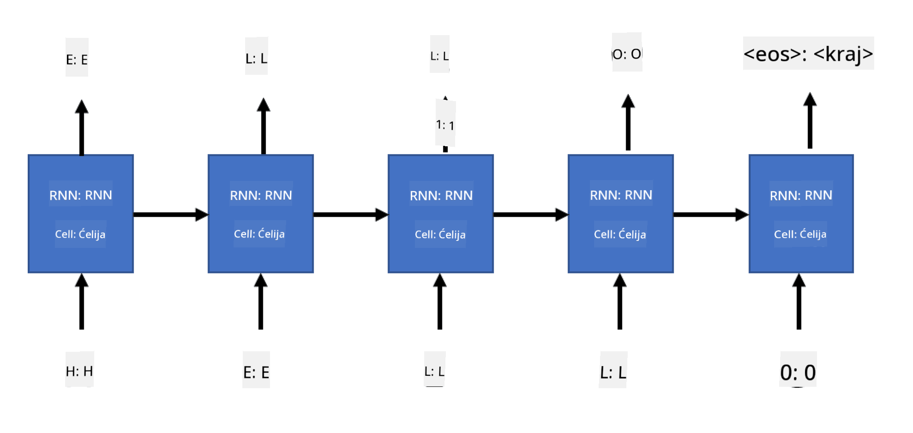

<!--
CO_OP_TRANSLATOR_METADATA:
{
  "original_hash": "d9de7847385eeeda67cfdcce1640ab72",
  "translation_date": "2025-08-25T21:46:19+00:00",
  "source_file": "lessons/5-NLP/17-GenerativeNetworks/README.md",
  "language_code": "hr"
}
-->
# Generativne mreže

## [Kviz prije predavanja](https://ff-quizzes.netlify.app/en/ai/quiz/33)

Rekurentne neuronske mreže (RNN) i njihove varijante s kontroliranim ćelijama, poput ćelija za dugoročno kratkoročno pamćenje (LSTM) i kontroliranih rekurentnih jedinica (GRU), omogućile su modeliranje jezika jer mogu naučiti redoslijed riječi i pružiti predviđanja za sljedeću riječ u nizu. To nam omogućuje korištenje RNN-a za **generativne zadatke**, poput generiranja običnog teksta, strojnog prevođenja, pa čak i opisivanja slika.

> ✅ Razmislite o svim situacijama u kojima ste imali koristi od generativnih zadataka, poput dovršavanja teksta dok tipkate. Istražite svoje omiljene aplikacije kako biste vidjeli koriste li RNN-e.

U arhitekturi RNN-a koju smo raspravili u prethodnoj jedinici, svaka RNN jedinica proizvodila je sljedeće skriveno stanje kao izlaz. Međutim, možemo dodati još jedan izlaz svakoj rekurentnoj jedinici, što bi nam omogućilo da generiramo **niz** (jednak duljini izvornog niza). Štoviše, možemo koristiti RNN jedinice koje ne prihvaćaju ulaz u svakom koraku, već samo uzimaju početni vektor stanja i zatim proizvode niz izlaza.

To omogućuje različite neuronske arhitekture prikazane na slici ispod:


> Slika iz blog posta [Unreasonable Effectiveness of Recurrent Neural Networks](http://karpathy.github.io/2015/05/21/rnn-effectiveness/) autora [Andrej Karpaty](http://karpathy.github.io/)

* **Jedan-na-jedan** je tradicionalna neuronska mreža s jednim ulazom i jednim izlazom
* **Jedan-na-više** je generativna arhitektura koja prihvaća jednu ulaznu vrijednost i generira niz izlaznih vrijednosti. Na primjer, ako želimo trenirati mrežu za **opisivanje slika** koja bi proizvela tekstualni opis slike, možemo sliku koristiti kao ulaz, proslijediti je kroz CNN kako bismo dobili skriveno stanje, a zatim rekurentni lanac generira opis riječ po riječ
* **Više-na-jedan** odgovara arhitekturama RNN-a koje smo opisali u prethodnoj jedinici, poput klasifikacije teksta
* **Više-na-više**, ili **niz-na-niz**, odgovara zadacima poput **strojnog prevođenja**, gdje prvo RNN prikuplja sve informacije iz ulaznog niza u skriveno stanje, a drugi RNN lanac razmotava ovo stanje u izlazni niz.

U ovoj jedinici fokusirat ćemo se na jednostavne generativne modele koji nam pomažu generirati tekst. Radi jednostavnosti, koristit ćemo tokenizaciju na razini znakova.

Trenirat ćemo ovaj RNN da generira tekst korak po korak. U svakom koraku uzet ćemo niz znakova duljine `nchars` i tražiti od mreže da generira sljedeći izlazni znak za svaki ulazni znak:



Tijekom generiranja teksta (tijekom inferencije), započinjemo s nekim **poticajem**, koji se prosljeđuje kroz RNN ćelije kako bi se generiralo njegovo međustanje, a zatim iz tog stanja započinje generiranje. Generiramo jedan znak odjednom, prosljeđujemo stanje i generirani znak sljedećoj RNN ćeliji kako bismo generirali sljedeći znak, sve dok ne generiramo dovoljno znakova.


> Slika autora

## ✍️ Vježbe: Generativne mreže

Nastavite učiti u sljedećim bilježnicama:

* [Generativne mreže s PyTorchom](../../../../../lessons/5-NLP/17-GenerativeNetworks/GenerativePyTorch.ipynb)
* [Generativne mreže s TensorFlowom](../../../../../lessons/5-NLP/17-GenerativeNetworks/GenerativeTF.ipynb)

## Mekano generiranje teksta i temperatura

Izlaz svake RNN ćelije je distribucija vjerojatnosti znakova. Ako uvijek uzmemo znak s najvećom vjerojatnošću kao sljedeći znak u generiranom tekstu, tekst često može postati "cikliran" između istih sekvenci znakova iznova i iznova, kao u ovom primjeru:

```
today of the second the company and a second the company ...
```

Međutim, ako pogledamo distribuciju vjerojatnosti za sljedeći znak, može se dogoditi da razlika između nekoliko najviših vjerojatnosti nije velika, npr. jedan znak može imati vjerojatnost 0.2, drugi - 0.19, itd. Na primjer, kada tražimo sljedeći znak u nizu '*play*', sljedeći znak može jednako dobro biti razmak ili **e** (kao u riječi *player*).

To nas dovodi do zaključka da nije uvijek "pravedno" odabrati znak s većom vjerojatnošću, jer odabir drugog najvišeg i dalje može dovesti do smislenog teksta. Mudrije je **uzorkovati** znakove iz distribucije vjerojatnosti koju daje izlaz mreže. Također možemo koristiti parametar, **temperaturu**, koji će izravnati distribuciju vjerojatnosti ako želimo dodati više slučajnosti ili je učiniti strmijom ako želimo više slijediti znakove s najvećom vjerojatnošću.

Istražite kako je ovo mekano generiranje teksta implementirano u bilježnicama povezanima gore.

## Zaključak

Iako generiranje teksta može biti korisno samo po sebi, glavne prednosti dolaze iz mogućnosti generiranja teksta pomoću RNN-a iz nekog početnog vektora značajki. Na primjer, generiranje teksta koristi se kao dio strojnog prevođenja (niz-na-niz, u ovom slučaju vektor stanja iz *enkodera* koristi se za generiranje ili *dekodiranje* prevedene poruke) ili generiranja tekstualnog opisa slike (u kojem slučaju vektor značajki dolazi iz CNN ekstraktora).

## 🚀 Izazov

Proučite neke lekcije na Microsoft Learn o ovoj temi

* Generiranje teksta s [PyTorchom](https://docs.microsoft.com/learn/modules/intro-natural-language-processing-pytorch/6-generative-networks/?WT.mc_id=academic-77998-cacaste)/[TensorFlowom](https://docs.microsoft.com/learn/modules/intro-natural-language-processing-tensorflow/5-generative-networks/?WT.mc_id=academic-77998-cacaste)

## [Kviz nakon predavanja](https://ff-quizzes.netlify.app/en/ai/quiz/34)

## Pregled i samostalno učenje

Evo nekoliko članaka za proširenje vašeg znanja:

* Različiti pristupi generiranju teksta s Markovim lancem, LSTM-om i GPT-2: [blog post](https://towardsdatascience.com/text-generation-gpt-2-lstm-markov-chain-9ea371820e1e)
* Primjer generiranja teksta u [Keras dokumentaciji](https://keras.io/examples/generative/lstm_character_level_text_generation/)

## [Zadatak](lab/README.md)

Vidjeli smo kako generirati tekst znak po znak. U laboratoriju ćete istražiti generiranje teksta na razini riječi.

**Odricanje od odgovornosti**:  
Ovaj dokument je preveden pomoću AI usluge za prevođenje [Co-op Translator](https://github.com/Azure/co-op-translator). Iako nastojimo osigurati točnost, imajte na umu da automatski prijevodi mogu sadržavati pogreške ili netočnosti. Izvorni dokument na izvornom jeziku treba smatrati mjerodavnim izvorom. Za ključne informacije preporučuje se profesionalni prijevod od strane stručnjaka. Ne preuzimamo odgovornost za bilo kakve nesporazume ili pogrešne interpretacije proizašle iz korištenja ovog prijevoda.