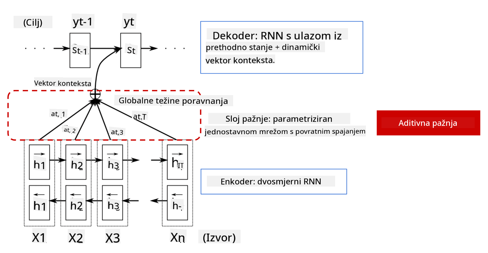
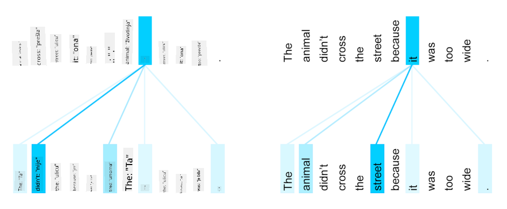
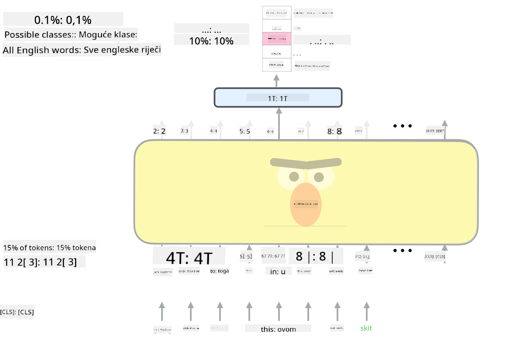

<!--
CO_OP_TRANSLATOR_METADATA:
{
  "original_hash": "7e617f0b8de85a43957a853aba09bfeb",
  "translation_date": "2025-08-25T22:02:58+00:00",
  "source_file": "lessons/5-NLP/18-Transformers/README.md",
  "language_code": "hr"
}
-->
# Mehanizmi pažnje i Transformeri

## [Kviz prije predavanja](https://red-field-0a6ddfd03.1.azurestaticapps.net/quiz/118)

Jedan od najvažnijih problema u području obrade prirodnog jezika (NLP) je **strojno prevođenje**, ključni zadatak koji stoji iza alata poput Google Prevoditelja. U ovom ćemo se dijelu fokusirati na strojno prevođenje ili, općenitije, na bilo koji zadatak *sekvenca-u-sekvencu* (koji se također naziva **transdukcija rečenica**).

Kod RNN-ova, sekvenca-u-sekvencu implementira se pomoću dvaju rekurentnih mreža, gdje jedna mreža, **enkoder**, sažima ulaznu sekvencu u skriveno stanje, dok druga mreža, **dekoder**, razvija to skriveno stanje u prevedeni rezultat. Ovaj pristup ima nekoliko problema:

* Završno stanje enkoderske mreže teško pamti početak rečenice, što uzrokuje lošu kvalitetu modela za duge rečenice.
* Sve riječi u sekvenci imaju isti utjecaj na rezultat. Međutim, u stvarnosti, određene riječi u ulaznoj sekvenci često imaju veći utjecaj na izlazne sekvence od drugih.

**Mehanizmi pažnje** omogućuju ponderiranje kontekstualnog utjecaja svakog ulaznog vektora na svaku izlaznu predikciju RNN-a. To se postiže stvaranjem prečaca između međustanja ulaznog RNN-a i izlaznog RNN-a. Na taj način, prilikom generiranja izlaznog simbola yt, uzimamo u obzir sva skrivena stanja ulaza hi, s različitim težinskim koeficijentima αt,i.

> Enkoder-dekoder model s aditivnim mehanizmom pažnje u [Bahdanau et al., 2015](https://arxiv.org/pdf/1409.0473.pdf), citirano iz [ovog blog posta](https://lilianweng.github.io/lil-log/2018/06/24/attention-attention.html)

Matrica pažnje {αi,j} predstavlja stupanj u kojem određene ulazne riječi sudjeluju u generiranju određene riječi u izlaznoj sekvenci. Ispod je primjer takve matrice:

> Slika iz [Bahdanau et al., 2015](https://arxiv.org/pdf/1409.0473.pdf) (Slika 3)

Mehanizmi pažnje odgovorni su za većinu trenutnih ili gotovo trenutnih dostignuća u NLP-u. Međutim, dodavanje pažnje značajno povećava broj parametara modela, što je dovelo do problema skaliranja s RNN-ovima. Ključno ograničenje skaliranja RNN-ova je rekurzivna priroda modela, koja otežava grupiranje i paralelizaciju treninga. Kod RNN-a svaki element sekvence mora se obraditi redoslijedom, što znači da se ne može lako paralelizirati.

> Slika iz [Googleovog bloga](https://research.googleblog.com/2016/09/a-neural-network-for-machine.html)

Usvajanje mehanizama pažnje u kombinaciji s ovim ograničenjem dovelo je do stvaranja sadašnjih vrhunskih Transformer modela koje poznajemo i koristimo, poput BERT-a i Open-GPT3.

## Transformer modeli

Jedna od glavnih ideja iza transformera je izbjegavanje sekvencijalne prirode RNN-ova i stvaranje modela koji se može paralelizirati tijekom treninga. To se postiže implementacijom dviju ideja:

* pozicijsko kodiranje
* korištenje mehanizma samopažnje za hvatanje obrazaca umjesto RNN-ova (ili CNN-ova) (zbog čega se rad koji uvodi transformere zove *[Attention is all you need](https://arxiv.org/abs/1706.03762)*)

### Pozicijsko kodiranje/ugrađivanje

Ideja pozicijskog kodiranja je sljedeća.  
1. Kod korištenja RNN-ova, relativni položaj tokena predstavlja se brojem koraka i stoga ne treba biti eksplicitno predstavljen.  
2. Međutim, kada prijeđemo na pažnju, moramo znati relativne položaje tokena unutar sekvence.  
3. Da bismo dobili pozicijsko kodiranje, proširujemo našu sekvencu tokena sekvencom položaja tokena u sekvenci (tj. sekvencom brojeva 0, 1, ...).  
4. Zatim miješamo položaj tokena s vektorom ugrađivanja tokena. Za transformaciju položaja (cijelog broja) u vektor možemo koristiti različite pristupe:

* Ugrađivanje koje se trenira, slično ugrađivanju tokena. Ovo je pristup koji ovdje razmatramo. Primjenjujemo slojeve ugrađivanja na tokene i njihove položaje, što rezultira vektorima ugrađivanja iste dimenzije, koje zatim zbrajamo.
* Fiksna funkcija kodiranja položaja, kako je predloženo u izvornom radu.

> Slika autora

Rezultat koji dobivamo s pozicijskim ugrađivanjem uključuje i izvorni token i njegov položaj unutar sekvence.

### Samopažnja s više glava

Zatim trebamo uhvatiti neke obrasce unutar naše sekvence. Da bismo to učinili, transformeri koriste mehanizam **samopažnje**, koji je u osnovi pažnja primijenjena na istu sekvencu kao ulaz i izlaz. Primjena samopažnje omogućuje nam uzimanje u obzir **konteksta** unutar rečenice i uočavanje koji su riječi međusobno povezane. Na primjer, omogućuje nam da vidimo na koje riječi se odnose zamjenice poput *to*, i također uzmemo u obzir kontekst:

> Slika iz [Googleovog bloga](https://research.googleblog.com/2017/08/transformer-novel-neural-network.html)

U transformerima koristimo **pažnju s više glava** kako bismo mreži dali mogućnost hvatanja različitih vrsta ovisnosti, npr. dugoročnih naspram kratkoročnih odnosa riječi, koreferencija naspram nečeg drugog itd.

[TensorFlow bilježnica](../../../../../lessons/5-NLP/18-Transformers/TransformersTF.ipynb) sadrži više detalja o implementaciji slojeva transformera.

### Pažnja enkoder-dekoder

U transformerima se pažnja koristi na dva mjesta:

* Za hvatanje obrazaca unutar ulaznog teksta pomoću samopažnje
* Za prevođenje sekvenci - to je sloj pažnje između enkodera i dekodera.

Pažnja enkoder-dekoder vrlo je slična mehanizmu pažnje korištenom u RNN-ovima, kako je opisano na početku ovog dijela. Ovaj animirani dijagram objašnjava ulogu pažnje enkoder-dekoder.

Budući da se svaka ulazna pozicija neovisno mapira na svaku izlaznu poziciju, transformeri se mogu bolje paralelizirati od RNN-ova, što omogućuje mnogo veće i izražajnije jezične modele. Svaka glava pažnje može se koristiti za učenje različitih odnosa između riječi, što poboljšava zadatke obrade prirodnog jezika.

## BERT

**BERT** (Bidirectional Encoder Representations from Transformers) je vrlo velika višeslojna mreža transformera s 12 slojeva za *BERT-base* i 24 za *BERT-large*. Model se prvo unaprijed trenira na velikom korpusu tekstualnih podataka (Wikipedia + knjige) koristeći nenadzirano učenje (predviđanje maskiranih riječi u rečenici). Tijekom unaprijed treniranja model usvaja značajnu razinu razumijevanja jezika, koja se zatim može iskoristiti s drugim skupovima podataka pomoću finog podešavanja. Ovaj proces naziva se **prijenosno učenje**.

> Izvor slike [ovdje](http://jalammar.github.io/illustrated-bert/)

## ✍️ Vježbe: Transformeri

Nastavite učiti u sljedećim bilježnicama:

* [Transformeri u PyTorch-u](../../../../../lessons/5-NLP/18-Transformers/TransformersPyTorch.ipynb)
* [Transformeri u TensorFlow-u](../../../../../lessons/5-NLP/18-Transformers/TransformersTF.ipynb)

## Zaključak

U ovoj lekciji naučili ste o Transformerima i mehanizmima pažnje, ključnim alatima u NLP alatu. Postoji mnogo varijacija arhitektura Transformera, uključujući BERT, DistilBERT, BigBird, OpenGPT3 i druge, koje se mogu fino podešavati. Paket [HuggingFace](https://github.com/huggingface/) pruža repozitorij za treniranje mnogih od ovih arhitektura s PyTorch-om i TensorFlow-om.

## 🚀 Izazov

## [Kviz nakon predavanja](https://red-field-0a6ddfd03.1.azurestaticapps.net/quiz/218)

## Pregled i samostalno učenje

* [Blog post](https://mchromiak.github.io/articles/2017/Sep/12/Transformer-Attention-is-all-you-need/), koji objašnjava klasični rad [Attention is all you need](https://arxiv.org/abs/1706.03762) o transformerima.
* [Serija blog postova](https://towardsdatascience.com/transformers-explained-visually-part-1-overview-of-functionality-95a6dd460452) o transformerima, koja detaljno objašnjava arhitekturu.

## [Zadatak](assignment.md)

**Odricanje od odgovornosti**:  
Ovaj dokument je preveden pomoću AI usluge za prevođenje [Co-op Translator](https://github.com/Azure/co-op-translator). Iako nastojimo osigurati točnost, imajte na umu da automatski prijevodi mogu sadržavati pogreške ili netočnosti. Izvorni dokument na izvornom jeziku treba smatrati autoritativnim izvorom. Za kritične informacije preporučuje se profesionalni prijevod od strane čovjeka. Ne preuzimamo odgovornost za nesporazume ili pogrešna tumačenja koja mogu proizaći iz korištenja ovog prijevoda.