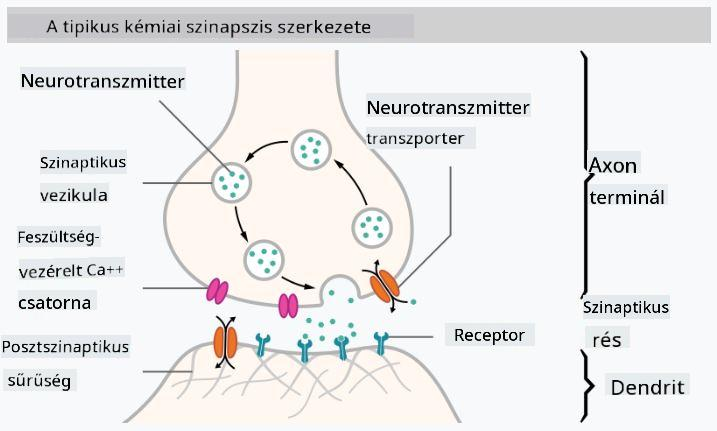
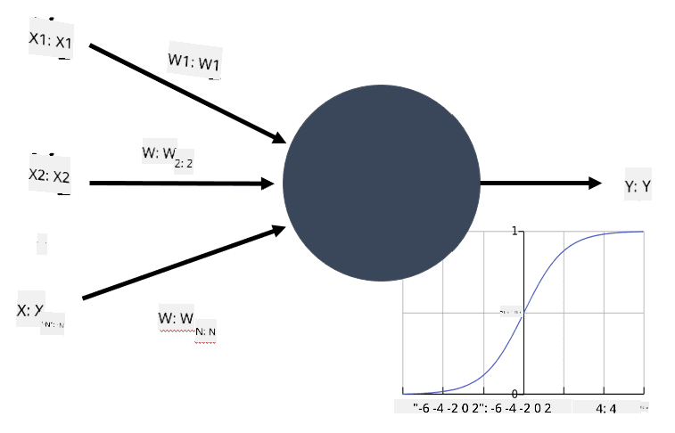

<!--
CO_OP_TRANSLATOR_METADATA:
{
  "original_hash": "5abc5f7978919be90cd313f0c20e8228",
  "translation_date": "2025-09-07T14:35:37+00:00",
  "source_file": "lessons/3-NeuralNetworks/README.md",
  "language_code": "hu"
}
-->
# Bevezetés a Neurális Hálózatokba

Ahogy az előzőekben már említettük, az intelligencia egyik elérési módja az, hogy egy **számítógépes modellt** vagy egy **mesterséges agyat** tanítunk. A 20. század közepétől kezdve a kutatók különböző matematikai modelleket próbáltak ki, míg az utóbbi években ez az irány rendkívül sikeresnek bizonyult. Az agy ilyen matematikai modelljeit **neurális hálózatoknak** nevezzük.

> Néha a neurális hálózatokat *Mesterséges Neurális Hálózatoknak* (Artificial Neural Networks, ANNs) hívják, hogy jelezzék, hogy modellekről van szó, nem valódi neuronhálózatokról.

## Gépi Tanulás

A neurális hálózatok egy nagyobb tudományterület, a **Gépi Tanulás** részei, amelynek célja, hogy adatokat használva olyan számítógépes modelleket tanítsunk, amelyek képesek problémákat megoldani. A Gépi Tanulás az egyik fő része a Mesterséges Intelligenciának, azonban ebben a tananyagban nem foglalkozunk a klasszikus gépi tanulással.

> Látogasd meg különálló **[Gépi Tanulás Kezdőknek](http://github.com/microsoft/ml-for-beginners)** tananyagunkat, hogy többet megtudj a klasszikus gépi tanulásról.

A Gépi Tanulásban feltételezzük, hogy van egy példákból álló adathalmazunk **X**, és a hozzájuk tartozó kimeneti értékek **Y**. A példák gyakran N-dimenziós vektorok, amelyek **jellemzőkből** állnak, míg a kimeneteket **címkéknek** nevezzük.

A két leggyakoribb gépi tanulási problémát fogjuk megvizsgálni:

* **Osztályozás**, ahol egy bemeneti objektumot kell két vagy több osztályba sorolni.
* **Regresszió**, ahol egy numerikus értéket kell előre jelezni minden bemeneti mintára.

> Ha a bemeneteket és kimeneteket tenzorként ábrázoljuk, a bemeneti adathalmaz egy M×N méretű mátrix, ahol M a minták száma, N pedig a jellemzők száma. A kimeneti címkék **Y** egy M méretű vektor.

Ebben a tananyagban kizárólag neurális hálózati modellekre fogunk koncentrálni.

## Egy Neuron Modellje

A biológiából tudjuk, hogy az agyunk neurális sejtekből áll, amelyek mindegyike több "bemenettel" (axonok) és egy kimenettel (dendrit) rendelkezik. Az axonok és dendritek elektromos jeleket tudnak továbbítani, és az axonok és dendritek közötti kapcsolatok különböző vezetőképességi szinteket mutathatnak (amelyeket neuromediátorok szabályoznak).

 | 
----|----
Valódi neuron *([Kép](https://en.wikipedia.org/wiki/Synapse#/media/File:SynapseSchematic_lines.svg) a Wikipédiáról)* | Mesterséges neuron *(Kép a szerzőtől)*

Így a neuron legegyszerűbb matematikai modellje több bemenetet tartalmaz **X1, ..., XN**, egy kimenetet **Y**, valamint egy sor súlyt **W1, ..., WN**. A kimenet a következőképpen számítható ki:

ahol **f** egy nemlineáris **aktivációs függvény**.

> A neuron korai modelljeit Warren McCullock és Walter Pitts 1943-ban írt klasszikus tanulmányában [A logical calculus of the ideas immanent in nervous activity](https://www.cs.cmu.edu/~./epxing/Class/10715/reading/McCulloch.and.Pitts.pdf) írták le. Donald Hebb "[The Organization of Behavior: A Neuropsychological Theory](https://books.google.com/books?id=VNetYrB8EBoC)" című könyvében javasolta, hogyan lehet ezeket a hálózatokat tanítani.

## Ebben a szakaszban

Ebben a szakaszban megtanuljuk:
* [Perceptron](03-Perceptron/README.md), az egyik legkorábbi neurális hálózati modell kétosztályos osztályozáshoz
* [Többrétegű hálózatok](04-OwnFramework/README.md) egy párosított jegyzetfüzettel [hogyan építsünk saját keretrendszert](04-OwnFramework/OwnFramework.ipynb)
* [Neurális Hálózati Keretrendszerek](05-Frameworks/README.md), ezekkel a jegyzetfüzetekkel: [PyTorch](05-Frameworks/IntroPyTorch.ipynb) és [Keras/Tensorflow](05-Frameworks/IntroKerasTF.ipynb)
* [Túlillesztés](../../../../lessons/3-NeuralNetworks/05-Frameworks)

---

**Felelősség kizárása**:  
Ez a dokumentum az AI fordítási szolgáltatás, a [Co-op Translator](https://github.com/Azure/co-op-translator) segítségével lett lefordítva. Bár törekszünk a pontosságra, kérjük, vegye figyelembe, hogy az automatikus fordítások hibákat vagy pontatlanságokat tartalmazhatnak. Az eredeti dokumentum az eredeti nyelvén tekintendő hiteles forrásnak. Kritikus információk esetén javasolt professzionális emberi fordítást igénybe venni. Nem vállalunk felelősséget semmilyen félreértésért vagy téves értelmezésért, amely a fordítás használatából eredhet.