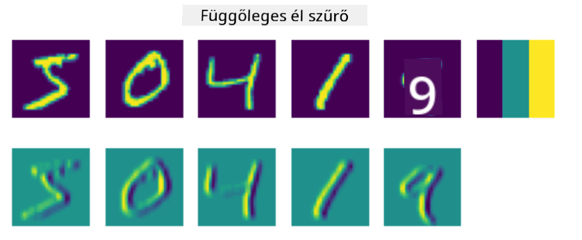
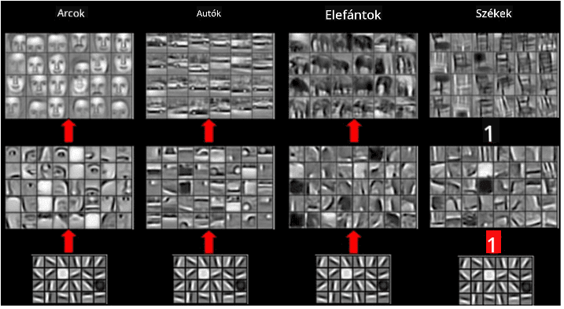

<!--
CO_OP_TRANSLATOR_METADATA:
{
  "original_hash": "088837b42b7d99198bf62db8a42411e0",
  "translation_date": "2025-08-25T22:51:16+00:00",
  "source_file": "lessons/4-ComputerVision/07-ConvNets/README.md",
  "language_code": "hu"
}
-->
# Konvolúciós Neurális Hálók

Korábban láttuk, hogy a neurális hálók elég jól kezelik a képeket, és még egy egyrétegű perceptron is képes az MNIST adathalmazon található kézzel írt számjegyeket elfogadható pontossággal felismerni. Azonban az MNIST adathalmaz különleges, mivel az összes számjegy középre van igazítva a képen, ami egyszerűbbé teszi a feladatot.

## [Előadás előtti kvíz](https://ff-quizzes.netlify.app/en/ai/quiz/13)

A való életben azt szeretnénk, hogy képesek legyünk felismerni tárgyakat egy képen, függetlenül azok pontos helyzetétől a képen belül. A számítógépes látás különbözik az általános osztályozástól, mert amikor egy adott tárgyat keresünk a képen, a képet pásztázzuk, hogy bizonyos **mintázatokat** és azok kombinációit keressük. Például, ha egy macskát keresünk, először vízszintes vonalakat kereshetünk, amelyek bajuszokat alkothatnak, majd bizonyos bajuszkombinációk alapján megállapíthatjuk, hogy valóban egy macska képe van előttünk. A mintázatok relatív helyzete és jelenléte fontos, nem pedig azok pontos helyzete a képen.

A mintázatok kinyeréséhez a **konvolúciós szűrők** fogalmát fogjuk használni. Mint tudjuk, egy kép egy 2D-mátrixként vagy egy színmélységgel rendelkező 3D-tenzorként van ábrázolva. Egy szűrő alkalmazása azt jelenti, hogy veszünk egy viszonylag kicsi **szűrőmag** mátrixot, és az eredeti kép minden egyes pixelére kiszámítjuk a szomszédos pontokkal súlyozott átlagot. Ezt úgy képzelhetjük el, mint egy kis ablakot, amely végigcsúszik az egész képen, és az összes pixelt a szűrőmag mátrix súlyai szerint átlagolja.

 | 
----|----

> Kép: Dmitry Soshnikov

Például, ha 3x3-as függőleges és vízszintes él szűrőket alkalmazunk az MNIST számjegyekre, kiemeléseket (pl. magas értékeket) kapunk ott, ahol az eredeti képen függőleges és vízszintes élek találhatók. Így ez a két szűrő használható az élek "keresésére". Hasonlóan, más szűrőket is tervezhetünk, hogy alacsony szintű mintázatokat keressünk:

> Kép a [Leung-Malik szűrőbankról](https://www.robots.ox.ac.uk/~vgg/research/texclass/filters.html)

Azonban, míg manuálisan is tervezhetünk szűrőket bizonyos mintázatok kinyerésére, a hálót úgy is megtervezhetjük, hogy a mintázatokat automatikusan tanulja meg. Ez az egyik fő ötlet a CNN mögött.

## A CNN fő ötletei

A CNN-ek működése a következő fontos ötleteken alapul:

* A konvolúciós szűrők képesek mintázatokat kinyerni
* A hálót úgy tervezhetjük meg, hogy a szűrők automatikusan tanuljanak
* Ugyanezt a megközelítést használhatjuk magas szintű jellemzők mintázatainak megtalálására is, nem csak az eredeti képen. Így a CNN jellemzők kinyerése egy hierarchikus jellemzőrendszeren működik, az alacsony szintű pixelkombinációktól kezdve egészen a kép részeinek magasabb szintű kombinációjáig.

> Kép: [Hislop-Lynch tanulmánya](https://www.semanticscholar.org/paper/Computer-vision-based-pedestrian-trajectory-Hislop-Lynch/26e6f74853fc9bbb7487b06dc2cf095d36c9021d), [kutatásuk alapján](https://dl.acm.org/doi/abs/10.1145/1553374.1553453)

## ✍️ Gyakorlatok: Konvolúciós Neurális Hálók

Folytassuk a konvolúciós neurális hálók működésének felfedezését, és nézzük meg, hogyan érhetünk el tanulható szűrőket az alábbi notebookok segítségével:

* [Konvolúciós Neurális Hálók - PyTorch](../../../../../lessons/4-ComputerVision/07-ConvNets/ConvNetsPyTorch.ipynb)
* [Konvolúciós Neurális Hálók - TensorFlow](../../../../../lessons/4-ComputerVision/07-ConvNets/ConvNetsTF.ipynb)

## Piramis architektúra

A legtöbb képfeldolgozásra használt CNN az úgynevezett piramis architektúrát követi. Az eredeti képekre alkalmazott első konvolúciós réteg általában viszonylag kevés szűrőt tartalmaz (8-16), amelyek különböző pixelkombinációknak felelnek meg, például vízszintes/függőleges vonalaknak vagy vonásoknak. A következő szinten csökkentjük a háló térbeli dimenzióját, és növeljük a szűrők számát, ami több egyszerű jellemző kombinációját teszi lehetővé. Minden réteggel, ahogy a végső osztályozó felé haladunk, a kép térbeli dimenziói csökkennek, míg a szűrők száma nő.

Példaként nézzük meg a VGG-16 architektúráját, amely 92,7%-os pontosságot ért el az ImageNet top-5 osztályozásában 2014-ben:

> Kép: [Researchgate](https://www.researchgate.net/figure/Vgg16-model-structure-To-get-the-VGG-NIN-model-we-replace-the-2-nd-4-th-6-th-7-th_fig2_335194493)

## Legismertebb CNN architektúrák

[Folytasd a legismertebb CNN architektúrák tanulmányozását](CNN_Architectures.md)

**Felelősség kizárása**:  
Ez a dokumentum az AI fordítási szolgáltatás [Co-op Translator](https://github.com/Azure/co-op-translator) segítségével lett lefordítva. Bár törekszünk a pontosságra, kérjük, vegye figyelembe, hogy az automatikus fordítások hibákat vagy pontatlanságokat tartalmazhatnak. Az eredeti dokumentum az eredeti nyelvén tekintendő hiteles forrásnak. Kritikus információk esetén javasolt professzionális emberi fordítást igénybe venni. Nem vállalunk felelősséget semmilyen félreértésért vagy téves értelmezésért, amely a fordítás használatából eredhet.