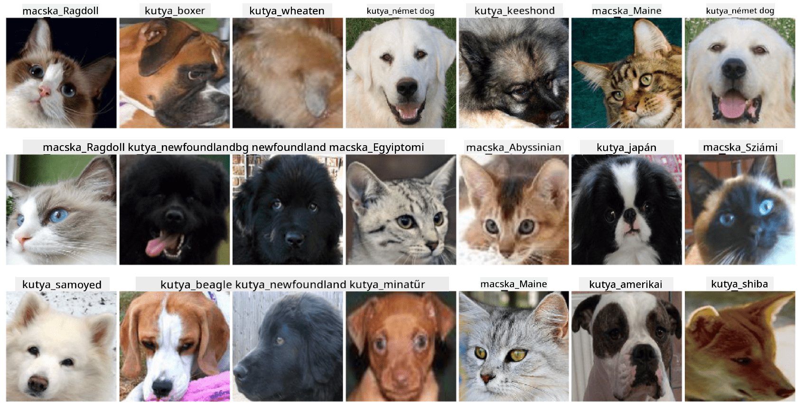

<!--
CO_OP_TRANSLATOR_METADATA:
{
  "original_hash": "f3d2cee9cb3c52160419e560c57a690e",
  "translation_date": "2025-08-25T22:57:52+00:00",
  "source_file": "lessons/4-ComputerVision/07-ConvNets/lab/README.md",
  "language_code": "hu"
}
-->
# Háziállatok arcainak osztályozása

Laborfeladat az [AI for Beginners Curriculum](https://github.com/microsoft/ai-for-beginners) alapján.

## Feladat

Képzeld el, hogy egy alkalmazást kell fejlesztened egy kisállat óvoda számára, amely katalogizálja az összes háziállatot. Az alkalmazás egyik nagyszerű funkciója az lenne, hogy egy fénykép alapján automatikusan felismeri a fajtát. Ez sikeresen megvalósítható neurális hálózatok segítségével.

Egy konvolúciós neurális hálózatot kell betanítanod, amely képes különböző macska- és kutyafajtákat osztályozni a **Pet Faces** adatbázis segítségével.

## Az Adatbázis

A **Pet Faces** adatbázist fogjuk használni, amely az [Oxford-IIIT](https://www.robots.ox.ac.uk/~vgg/data/pets/) kisállat adatbázisból származik. Ez 35 különböző kutya- és macskafajtát tartalmaz.



Az adatbázis letöltéséhez használd az alábbi kódrészletet:

```python
!wget https://mslearntensorflowlp.blob.core.windows.net/data/petfaces.tar.gz
!tar xfz petfaces.tar.gz
!rm petfaces.tar.gz
```

## Induló Jegyzetfüzet

Kezdd a labort a [PetFaces.ipynb](../../../../../../lessons/4-ComputerVision/07-ConvNets/lab/PetFaces.ipynb) megnyitásával.

## Tanulság

Egy viszonylag összetett problémát oldottál meg, amely a képosztályozásról szólt, teljesen az alapoktól! Rengeteg osztály volt, és mégis sikerült elfogadható pontosságot elérned! Érdemes megmérni a top-k pontosságot is, mivel könnyű összekeverni néhány olyan osztályt, amelyek még az emberek számára sem különböztethetők meg egyértelműen.

**Felelősség kizárása**:  
Ez a dokumentum az AI fordítási szolgáltatás, a [Co-op Translator](https://github.com/Azure/co-op-translator) segítségével lett lefordítva. Bár törekszünk a pontosságra, kérjük, vegye figyelembe, hogy az automatikus fordítások hibákat vagy pontatlanságokat tartalmazhatnak. Az eredeti dokumentum az eredeti nyelvén tekintendő hiteles forrásnak. Kritikus információk esetén javasolt professzionális emberi fordítást igénybe venni. Nem vállalunk felelősséget semmilyen félreértésért vagy téves értelmezésért, amely a fordítás használatából eredhet.