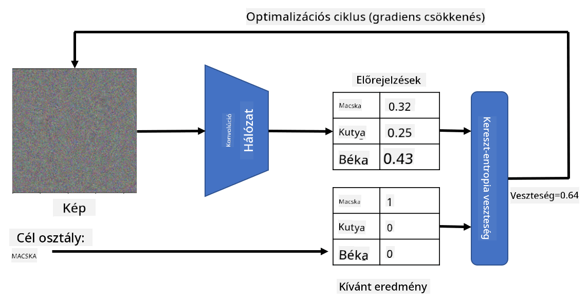

<!--
CO_OP_TRANSLATOR_METADATA:
{
  "original_hash": "717775c4050ccbffbe0c961ad8bf7bf7",
  "translation_date": "2025-08-25T23:06:25+00:00",
  "source_file": "lessons/4-ComputerVision/08-TransferLearning/README.md",
  "language_code": "hu"
}
-->
# Előre betanított hálózatok és transzfer tanulás

A CNN-ek tanítása sok időt vehet igénybe, és ehhez nagy mennyiségű adat szükséges. Az idő nagy részét azonban azzal töltjük, hogy megtanuljuk azokat az alacsony szintű szűrőket, amelyeket a hálózat használhat a minták kinyerésére a képekből. Felmerül egy természetes kérdés: használhatunk-e egy másik adathalmazon betanított neurális hálózatot, és adaptálhatjuk-e azt különböző képek osztályozására anélkül, hogy teljes tanítási folyamatra lenne szükség?

## [Előadás előtti kvíz](https://ff-quizzes.netlify.app/en/ai/quiz/15)

Ezt a megközelítést **transzfer tanulásnak** nevezzük, mivel egy neurális hálózati modellből átvisszük a tudást egy másikba. A transzfer tanulás során általában egy előre betanított modellel kezdünk, amelyet egy nagy képadathalmazon, például az **ImageNet**-en tanítottak. Ezek a modellek már jó eredményeket érhetnek el különböző jellemzők kinyerésében általános képekből, és sok esetben elegendő egy osztályozót építeni ezekre a kinyert jellemzőkre, hogy jó eredményt érjünk el.

> ✅ A transzfer tanulás kifejezés más tudományterületeken is előfordul, például az oktatásban. Arra utal, hogy egy területen szerzett tudást egy másik területen alkalmazunk.

## Előre betanított modellek mint jellemzők kinyerői

Az előző szakaszban tárgyalt konvolúciós hálózatok több rétegből állnak, amelyek mindegyike bizonyos jellemzőket nyer ki a képből, kezdve az alacsony szintű pixelkombinációktól (például vízszintes/függőleges vonal vagy stroke), egészen a magasabb szintű jellemzőkombinációkig, amelyek például egy láng szemének felelnek meg. Ha egy CNN-t elég nagy, általános és változatos képadathalmazon tanítunk, a hálózatnak meg kell tanulnia ezeket a közös jellemzőket kinyerni.

Mind a Keras, mind a PyTorch tartalmaz funkciókat, amelyekkel könnyen betölthetők előre betanított neurális hálózati súlyok néhány gyakori architektúrához, amelyek többségét ImageNet képeken tanították. A leggyakrabban használtakat az előző leckében található [CNN Architektúrák](../07-ConvNets/CNN_Architectures.md) oldalon ismertettük. Különösen érdemes megfontolni az alábbiakat:

* **VGG-16/VGG-19**, amelyek viszonylag egyszerű modellek, de mégis jó pontosságot adnak. Gyakran jó választás a VGG használata első próbálkozásként, hogy lássuk, hogyan működik a transzfer tanulás.
* **ResNet**, amelyet a Microsoft Research javasolt 2015-ben. Ezeknek több rétegük van, így több erőforrást igényelnek.
* **MobileNet**, amely csökkentett méretű modellek családja, mobil eszközökre alkalmas. Használja őket, ha kevés erőforrással rendelkezik, és hajlandó egy kis pontosságot feláldozni.

Íme néhány jellemző, amelyet egy macska képéből nyert ki a VGG-16 hálózat:

## Macskák és kutyák adathalmaz

Ebben a példában a [Macskák és Kutyák](https://www.microsoft.com/download/details.aspx?id=54765&WT.mc_id=academic-77998-cacaste) adathalmazt fogjuk használni, amely nagyon közel áll egy valós életbeli képosztályozási feladathoz.

## ✍️ Gyakorlat: Transzfer tanulás

Nézzük meg a transzfer tanulást működés közben a megfelelő notebookokban:

* [Transzfer tanulás - PyTorch](../../../../../lessons/4-ComputerVision/08-TransferLearning/TransferLearningPyTorch.ipynb)
* [Transzfer tanulás - TensorFlow](../../../../../lessons/4-ComputerVision/08-TransferLearning/TransferLearningTF.ipynb)

## Az ellenséges macska vizualizálása

Az előre betanított neurális hálózat különböző mintákat tartalmaz az *agyában*, beleértve az **ideális macska** fogalmát (valamint ideális kutya, ideális zebra stb.). Érdekes lenne valahogy **vizualizálni ezt a képet**. Ez azonban nem egyszerű, mert a minták szétszóródnak a hálózat súlyai között, és hierarchikus struktúrában vannak szervezve.

Egy megközelítés, amit alkalmazhatunk, az, hogy egy véletlenszerű képpel kezdünk, majd megpróbáljuk **gradiens csökkenés optimalizációs** technikával úgy módosítani azt a képet, hogy a hálózat elkezdje azt macskának gondolni.

Ha ezt tesszük, akkor valami nagyon hasonlót kapunk, mint egy véletlenszerű zaj. Ennek az az oka, hogy *sokféleképpen lehet a hálózatot rávenni arra, hogy a bemeneti képet macskának gondolja*, beleértve olyanokat is, amelyek vizuálisan nem értelmezhetők. Bár ezek a képek sok olyan mintát tartalmaznak, amelyek tipikusak egy macskára, semmi sem kényszeríti őket arra, hogy vizuálisan megkülönböztethetők legyenek.

Az eredmény javítása érdekében hozzáadhatunk egy másik tagot a veszteségfüggvényhez, amelyet **variációs veszteségnek** nevezünk. Ez egy metrika, amely megmutatja, mennyire hasonlóak a kép szomszédos pixelei. A variációs veszteség minimalizálása simábbá teszi a képet, és megszabadul a zajtól - így vizuálisan vonzóbb mintákat tár fel. Íme egy példa az ilyen "ideális" képekre, amelyeket nagy valószínűséggel macskának és zebrának osztályoznak:

 | 
-----|-----
 *Ideális macska* | *Ideális zebra*

Hasonló megközelítést alkalmazhatunk úgynevezett **ellenséges támadások** végrehajtására egy neurális hálózaton. Tegyük fel, hogy meg akarjuk téveszteni a neurális hálózatot, és egy kutyát macskának akarunk láttatni. Ha veszünk egy kutya képét, amelyet a hálózat kutyaként ismer fel, akkor azt egy kicsit módosíthatjuk gradiens csökkenés optimalizációval, amíg a hálózat macskaként nem kezdi osztályozni:

 | 
-----|-----
*Eredeti kép egy kutyáról* | *Kép egy kutyáról, amelyet macskának osztályoznak*

Nézze meg a fenti eredmények reprodukálásához szükséges kódot az alábbi notebookban:

* [Ideális és ellenséges macska - TensorFlow](../../../../../lessons/4-ComputerVision/08-TransferLearning/AdversarialCat_TF.ipynb)

## Következtetés

A transzfer tanulás segítségével gyorsan összeállíthat egy osztályozót egy egyedi objektum osztályozási feladathoz, és magas pontosságot érhet el. Látható, hogy az összetettebb feladatok, amelyeket most megoldunk, nagyobb számítási teljesítményt igényelnek, és nem oldhatók meg könnyen CPU-n. A következő egységben megpróbálunk egy könnyebb implementációt használni ugyanazon modell tanítására alacsonyabb számítási erőforrásokkal, ami csak kissé alacsonyabb pontosságot eredményez.

## 🚀 Kihívás

A kísérő notebookokban vannak megjegyzések az alján arról, hogy a transzfer tudás legjobban hasonló tanítási adatokkal működik (például egy új állatfajta). Kísérletezzen teljesen új típusú képekkel, hogy lássa, mennyire jól vagy rosszul teljesítenek a transzfer tudás modellek.

## [Előadás utáni kvíz](https://ff-quizzes.netlify.app/en/ai/quiz/16)

## Áttekintés és önálló tanulás

Olvassa el a [TrainingTricks.md](TrainingTricks.md) fájlt, hogy elmélyítse tudását a modellek tanításának egyéb módjairól.

## [Feladat](lab/README.md)

Ebben a laborban a valós életből vett [Oxford-IIIT](https://www.robots.ox.ac.uk/~vgg/data/pets/) háziállatok adathalmazt fogjuk használni, amely 35 macska- és kutyafajtát tartalmaz, és egy transzfer tanulási osztályozót fogunk építeni.

**Felelősség kizárása**:  
Ez a dokumentum az AI fordítási szolgáltatás [Co-op Translator](https://github.com/Azure/co-op-translator) segítségével lett lefordítva. Bár törekszünk a pontosságra, kérjük, vegye figyelembe, hogy az automatikus fordítások hibákat vagy pontatlanságokat tartalmazhatnak. Az eredeti dokumentum az eredeti nyelvén tekintendő hiteles forrásnak. Kritikus információk esetén javasolt professzionális emberi fordítást igénybe venni. Nem vállalunk felelősséget semmilyen félreértésért vagy téves értelmezésért, amely a fordítás használatából eredhet.