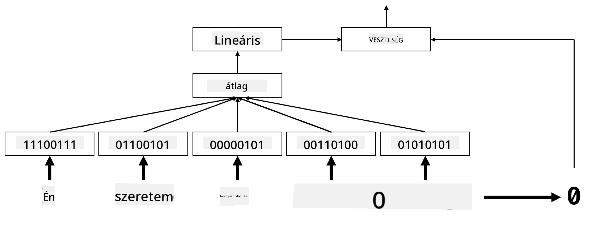

<!--
CO_OP_TRANSLATOR_METADATA:
{
  "original_hash": "e40b47ac3fd48f71304ede1474e66293",
  "translation_date": "2025-08-25T21:37:56+00:00",
  "source_file": "lessons/5-NLP/14-Embeddings/README.md",
  "language_code": "hu"
}
-->
# Beágyazások

## [Előadás előtti kvíz](https://ff-quizzes.netlify.app/en/ai/quiz/27)

Amikor BoW vagy TF/IDF alapú osztályozókat tanítottunk, magas dimenziós szavak zsákja vektorokkal dolgoztunk, amelyek hossza `vocab_size`, és kifejezetten alacsony dimenziós pozíciós reprezentációs vektorokat alakítottunk át ritka egyhot reprezentációvá. Ez az egyhot reprezentáció azonban nem memóriahatékony. Ezenkívül minden szót egymástól függetlenül kezelünk, azaz az egyhot kódolt vektorok nem fejeznek ki semmilyen szemantikai hasonlóságot a szavak között.

A **beágyazás** ötlete az, hogy a szavakat alacsonyabb dimenziós, sűrű vektorokkal reprezentáljuk, amelyek valamilyen módon tükrözik a szó szemantikai jelentését. Később megbeszéljük, hogyan lehet értelmes szóbeágyazásokat létrehozni, de egyelőre gondoljunk a beágyazásokra úgy, mint a szóvektor dimenziójának csökkentésére.

Tehát a beágyazási réteg egy szót vesz bemenetként, és egy meghatározott `embedding_size` méretű kimeneti vektort állít elő. Bizonyos értelemben nagyon hasonló egy `Linear` réteghez, de egyhot kódolt vektor helyett képes lesz egy szó számát bemenetként venni, lehetővé téve számunkra, hogy elkerüljük a nagy egyhot kódolt vektorok létrehozását.

Ha a beágyazási réteget használjuk osztályozó hálózatunk első rétegeként, akkor áttérhetünk a szavak zsákjáról az **embedding bag** modellre, ahol először minden szót a szövegünkben a megfelelő beágyazásra konvertálunk, majd valamilyen aggregált függvényt számítunk ki az összes beágyazás felett, például `sum`, `average` vagy `max`.

> Kép a szerzőtől

## ✍️ Gyakorlatok: Beágyazások

Folytasd a tanulást az alábbi jegyzetfüzetekben:
* [Beágyazások PyTorch segítségével](../../../../../lessons/5-NLP/14-Embeddings/EmbeddingsPyTorch.ipynb)
* [Beágyazások TensorFlow segítségével](../../../../../lessons/5-NLP/14-Embeddings/EmbeddingsTF.ipynb)

## Szemantikai beágyazások: Word2Vec

Míg a beágyazási réteg megtanulta a szavakat vektorreprezentációra leképezni, ez a reprezentáció nem feltétlenül hordozott sok szemantikai jelentést. Jó lenne olyan vektorreprezentációt tanulni, amelyben hasonló szavak vagy szinonimák olyan vektoroknak felelnek meg, amelyek közel vannak egymáshoz valamilyen vektortávolság (pl. euklideszi távolság) szempontjából.

Ehhez először elő kell tanítanunk a beágyazási modellt egy nagy szöveggyűjteményen egy specifikus módon. Az egyik módszer a szemantikai beágyazások tanítására a [Word2Vec](https://en.wikipedia.org/wiki/Word2vec). Ez két fő architektúrán alapul, amelyeket a szavak elosztott reprezentációjának előállítására használnak:

 - **Folytonos szavak zsákja** (CBoW) — ebben az architektúrában a modellt arra tanítjuk, hogy egy szót jósoljon meg a környező kontextusból. Az ngram $(W_{-2},W_{-1},W_0,W_1,W_2)$ esetén a modell célja, hogy megjósolja $W_0$-t $(W_{-2},W_{-1},W_1,W_2)$ alapján.
 - **Folytonos skip-gram** a CBoW ellentéte. A modell a környező kontextus szavait használja a jelenlegi szó megjóslására.

A CBoW gyorsabb, míg a skip-gram lassabb, de jobban reprezentálja a ritka szavakat.

> Kép [ebből a tanulmányból](https://arxiv.org/pdf/1301.3781.pdf)

A Word2Vec előtanított beágyazások (valamint más hasonló modellek, mint például GloVe) szintén használhatók a beágyazási réteg helyett a neurális hálózatokban. Azonban foglalkoznunk kell a szókészletekkel, mivel a Word2Vec/GloVe előtanításához használt szókészlet valószínűleg eltér a szövegkorpuszunk szókészletétől. Nézd meg a fenti jegyzetfüzeteket, hogy lásd, hogyan lehet ezt a problémát megoldani.

## Kontextuális beágyazások

A hagyományos előtanított beágyazási reprezentációk, mint például a Word2Vec, egyik fő korlátja a szavak jelentésének diszambiguációja. Míg az előtanított beágyazások képesek bizonyos mértékben megragadni a szavak jelentését a kontextusban, minden szó lehetséges jelentését ugyanabba a beágyazásba kódolják. Ez problémákat okozhat a későbbi modellekben, mivel sok szó, például a "play", különböző jelentésekkel bír attól függően, hogy milyen kontextusban használják.

Például a "play" szó az alábbi két mondatban teljesen eltérő jelentéssel bír:

- Elmentem egy **színdarabra** a színházban.
- John játszani szeretne a barátaival.

A fent említett előtanított beágyazások mindkét jelentését ugyanabba a beágyazásba kódolják. Ennek a korlátnak a leküzdéséhez olyan beágyazásokat kell építenünk, amelyek a **nyelvi modellre** alapoznak, amelyet egy nagy szövegkorpuszra tanítanak, és *tudja*, hogyan lehet a szavakat különböző kontextusokban összekapcsolni. A kontextuális beágyazások tárgyalása túlmutat ennek az oktatóanyagnak a keretein, de később visszatérünk rájuk, amikor a nyelvi modellekről beszélünk a kurzus során.

## Összegzés

Ebben a leckében felfedezted, hogyan lehet beágyazási rétegeket építeni és használni TensorFlow-ban és Pytorch-ban, hogy jobban tükrözzék a szavak szemantikai jelentését.

## 🚀 Kihívás

A Word2Vec-et néhány érdekes alkalmazásra használták, például dalok szövegének és költészet generálására. Nézd meg [ezt a cikket](https://www.politetype.com/blog/word2vec-color-poems), amely bemutatja, hogyan használta a szerző a Word2Vec-et költészet generálására. Nézd meg [Dan Shiffmann videóját](https://www.youtube.com/watch?v=LSS_bos_TPI&ab_channel=TheCodingTrain) is, hogy felfedezz egy másik magyarázatot erre a technikára. Ezután próbáld meg alkalmazni ezeket a technikákat saját szövegkorpuszodra, amelyet például Kaggle-ről szerezhetsz be.

## [Előadás utáni kvíz](https://ff-quizzes.netlify.app/en/ai/quiz/28)

## Áttekintés és önálló tanulás

Olvasd el ezt a tanulmányt a Word2Vec-ről: [Efficient Estimation of Word Representations in Vector Space](https://arxiv.org/pdf/1301.3781.pdf)

## [Feladat: Jegyzetfüzetek](assignment.md)

**Felelősség kizárása**:  
Ez a dokumentum az AI fordítási szolgáltatás [Co-op Translator](https://github.com/Azure/co-op-translator) segítségével lett lefordítva. Bár törekszünk a pontosságra, kérjük, vegye figyelembe, hogy az automatikus fordítások hibákat vagy pontatlanságokat tartalmazhatnak. Az eredeti dokumentum az eredeti nyelvén tekintendő hiteles forrásnak. Kritikus információk esetén javasolt professzionális emberi fordítást igénybe venni. Nem vállalunk felelősséget semmilyen félreértésért vagy téves értelmezésért, amely a fordítás használatából eredhet.