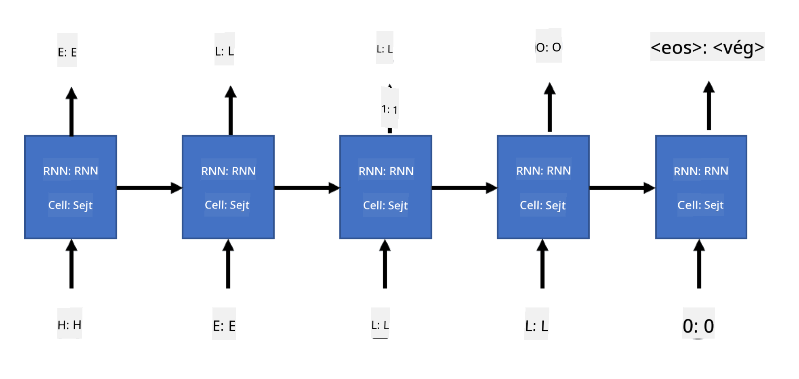

<!--
CO_OP_TRANSLATOR_METADATA:
{
  "original_hash": "51be6057374d01d70e07dd5ec88ebc0d",
  "translation_date": "2025-09-23T11:17:06+00:00",
  "source_file": "lessons/5-NLP/17-GenerativeNetworks/README.md",
  "language_code": "hu"
}
-->
# Generatív hálózatok

## [Előadás előtti kvíz](https://ff-quizzes.netlify.app/en/ai/quiz/33)

A Rekurrens Neurális Hálózatok (RNN-ek) és azok kapuzott cellaváltozatai, mint például a Hosszú-Rövid Távú Memóriacellák (LSTM-ek) és Kapuzott Rekurrens Egységek (GRU-k), lehetőséget biztosítanak a nyelvi modellezésre, mivel képesek megtanulni a szavak sorrendjét, és előre jelezni a következő szót egy sorozatban. Ez lehetővé teszi, hogy az RNN-eket **generatív feladatokra** használjuk, például szöveg generálására, gépi fordításra, sőt akár képaláírás készítésére is.

> ✅ Gondolj arra, hányszor használtál generatív feladatokat, például szövegkiegészítést gépelés közben. Kutass utána kedvenc alkalmazásaidnak, hogy megtudd, használtak-e RNN-eket.

Az előző egységben tárgyalt RNN architektúrában minden RNN egység a következő rejtett állapotot állította elő kimenetként. Azonban hozzáadhatunk egy másik kimenetet is minden rekurrens egységhez, amely lehetővé teszi, hogy egy **sorozatot** állítsunk elő (amely megegyezik az eredeti sorozat hosszával). Továbbá használhatunk olyan RNN egységeket, amelyek nem fogadnak bemenetet minden lépésnél, hanem csak egy kezdeti állapotvektort vesznek, és ebből állítanak elő egy kimeneti sorozatot.

Ez különböző neurális architektúrákat tesz lehetővé, amelyeket az alábbi képen láthatunk:


> Kép Andrej Karpaty [Unreasonable Effectiveness of Recurrent Neural Networks](http://karpathy.github.io/2015/05/21/rnn-effectiveness/) című blogbejegyzéséből [Andrej Karpaty](http://karpathy.github.io/) által

* **Egy-az-egyhez**: hagyományos neurális hálózat egy bemenettel és egy kimenettel
* **Egy-az-sokhoz**: generatív architektúra, amely egy bemeneti értéket fogad, és egy kimeneti értéksorozatot generál. Például, ha egy **képaláírás készítő** hálózatot szeretnénk tanítani, amely egy képről szöveges leírást készít, akkor egy képet adhatunk bemenetként, amelyet egy CNN-en keresztül rejtett állapottá alakítunk, majd egy rekurrens lánc szó szerint generálja az aláírást.
* **Sok-az-egyhez**: az előző egységben leírt RNN architektúráknak felel meg, például szövegklasszifikáció
* **Sok-az-sokhoz**, vagy **sorozat-az-sorozathoz**: olyan feladatokat jelent, mint például a **gépi fordítás**, ahol az első RNN összegyűjti az összes információt a bemeneti sorozatból a rejtett állapotba, majd egy másik RNN lánc ezt az állapotot kimeneti sorozattá bontja ki.

Ebben az egységben egyszerű generatív modellekre fogunk összpontosítani, amelyek segítenek szöveget generálni. Az egyszerűség kedvéért karakter szintű tokenizálást fogunk használni.

Ezt az RNN-t arra fogjuk tanítani, hogy lépésről lépésre generáljon szöveget. Minden lépésben egy `nchars` hosszúságú karakter sorozatot veszünk, és megkérjük a hálózatot, hogy generálja a következő kimeneti karaktert minden bemeneti karakterhez:



Szöveg generálásakor (következtetés során) egy **indítószöveggel** kezdünk, amelyet RNN cellákon keresztül adunk át, hogy előállítsuk annak köztes állapotát, majd ebből az állapotból kezdődik a generálás. Egy karaktert generálunk egyszerre, és az állapotot és a generált karaktert átadjuk egy másik RNN cellának, hogy generálja a következőt, amíg elegendő karaktert nem generálunk.


> Kép a szerzőtől

## ✍️ Gyakorlatok: Generatív hálózatok

Folytasd a tanulást az alábbi jegyzetfüzetekben:

* [Generatív hálózatok PyTorch segítségével](GenerativePyTorch.ipynb)
* [Generatív hálózatok TensorFlow segítségével](GenerativeTF.ipynb)

## Lágy szöveg generálás és hőmérséklet

Minden RNN cella kimenete egy karakterek valószínűségi eloszlása. Ha mindig a legmagasabb valószínűségű karaktert választjuk a generált szöveg következő karaktereként, a szöveg gyakran "ciklusba" kerülhet, és ugyanazokat a karakter sorozatokat ismételheti újra és újra, mint ebben a példában:

```
today of the second the company and a second the company ...
```

Azonban, ha megnézzük a következő karakter valószínűségi eloszlását, előfordulhat, hogy a néhány legmagasabb valószínűség közötti különbség nem jelentős, például egy karakter valószínűsége lehet 0.2, egy másiké pedig 0.19, stb. Például, amikor a '*play*' sorozat következő karakterét keressük, a következő karakter lehet egyaránt szóköz vagy **e** (mint a *player* szóban).

Ez arra a következtetésre vezet minket, hogy nem mindig "igazságos" a magasabb valószínűségű karaktert választani, mert a második legmagasabb választása is értelmes szöveghez vezethet. Bölcsebb **mintavételezni** a karaktereket a hálózat kimenete által adott valószínűségi eloszlásból. Használhatunk egy paramétert, **hőmérsékletet**, amely kisimítja a valószínűségi eloszlást, ha több véletlenszerűséget szeretnénk hozzáadni, vagy meredekebbé teszi, ha inkább a legmagasabb valószínűségű karakterekhez szeretnénk ragaszkodni.

Fedezd fel, hogyan valósul meg ez a lágy szöveg generálás az előzőekben linkelt jegyzetfüzetekben.

## Összegzés

Bár a szöveg generálása önmagában is hasznos lehet, a fő előnyök abból származnak, hogy képesek vagyunk szöveget generálni RNN-ek segítségével egy kezdeti jellemzővektorból. Például a szöveg generálása része lehet a gépi fordításnak (sorozat-az-sorozathoz, ebben az esetben az *enkóder* állapotvektorát használjuk a lefordított üzenet generálására vagy *dekódolására*), vagy egy kép szöveges leírásának generálására (ebben az esetben a jellemzővektor egy CNN kinyerőből származik).

## 🚀 Kihívás

Vegyél részt néhány Microsoft Learn leckén ebben a témában

* Szöveg generálása [PyTorch](https://docs.microsoft.com/learn/modules/intro-natural-language-processing-pytorch/6-generative-networks/?WT.mc_id=academic-77998-cacaste)/[TensorFlow](https://docs.microsoft.com/learn/modules/intro-natural-language-processing-tensorflow/5-generative-networks/?WT.mc_id=academic-77998-cacaste) segítségével

## [Előadás utáni kvíz](https://ff-quizzes.netlify.app/en/ai/quiz/34)

## Áttekintés és önálló tanulás

Íme néhány cikk, amelyekkel bővítheted tudásodat

* Különböző megközelítések szöveg generálására Markov-lánccal, LSTM-mel és GPT-2-vel: [blogbejegyzés](https://towardsdatascience.com/text-generation-gpt-2-lstm-markov-chain-9ea371820e1e)
* Szöveg generálás minta a [Keras dokumentációban](https://keras.io/examples/generative/lstm_character_level_text_generation/)

## [Feladat](lab/README.md)

Láttuk, hogyan lehet karakterről karakterre szöveget generálni. A laborban a szó szintű szöveg generálást fogod felfedezni.

---

