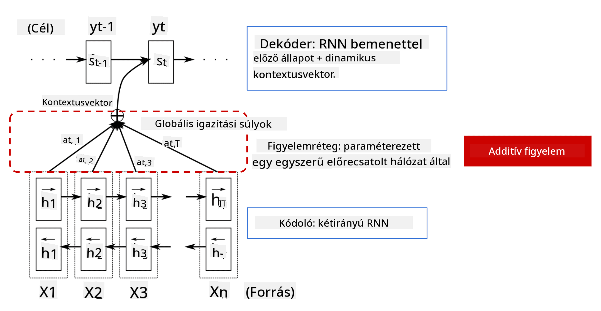
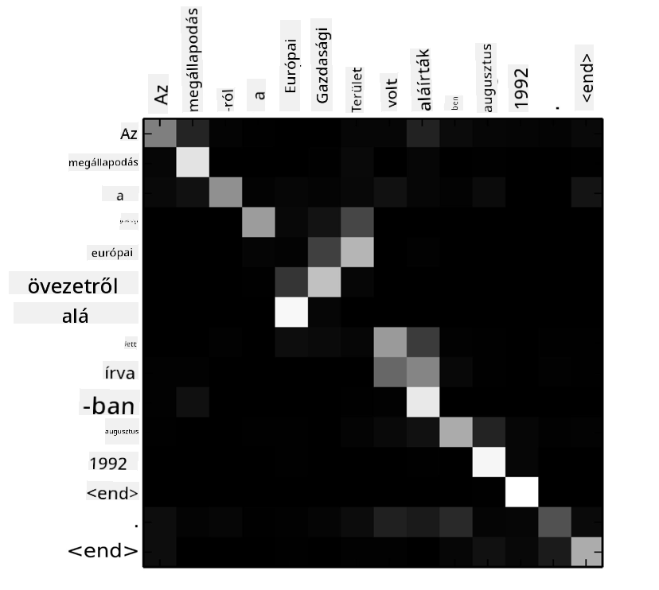
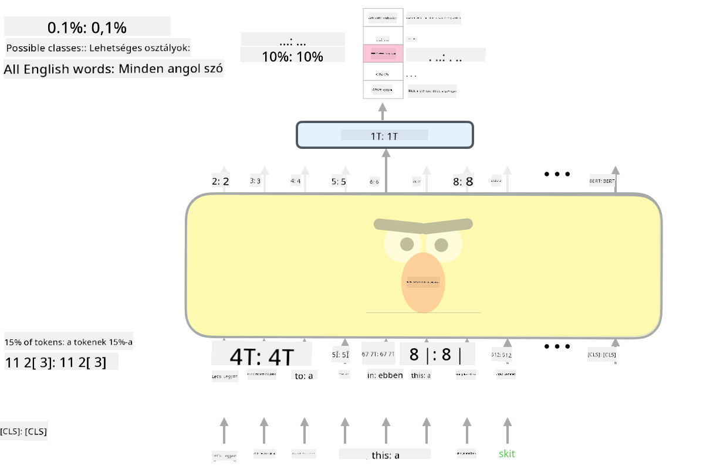

<!--
CO_OP_TRANSLATOR_METADATA:
{
  "original_hash": "7e617f0b8de85a43957a853aba09bfeb",
  "translation_date": "2025-08-25T21:59:45+00:00",
  "source_file": "lessons/5-NLP/18-Transformers/README.md",
  "language_code": "hu"
}
-->
# Figyelem Mechanizmusok és Transzformerek

## [Előadás előtti kvíz](https://red-field-0a6ddfd03.1.azurestaticapps.net/quiz/118)

Az NLP terület egyik legfontosabb problémája a **gépi fordítás**, amely alapvető feladat olyan eszközök mögött, mint a Google Translate. Ebben a részben a gépi fordításra, vagy általánosabban bármilyen *sorról-sorra* feladatra (amit **mondattranszdukciónak** is neveznek) fogunk összpontosítani.

Az RNN-ekkel a sorról-sorra megvalósítás két rekurrens hálózaton keresztül történik, ahol az egyik hálózat, az **enkóder**, egy bemeneti sorozatot egy rejtett állapotba tömörít, míg a másik hálózat, a **dekóder**, ezt a rejtett állapotot egy lefordított eredménnyé bontja ki. Ezzel a megközelítéssel azonban van néhány probléma:

* Az enkóder hálózat végső állapota nehezen emlékszik a mondat elejére, ami gyenge modellminőséget eredményez hosszú mondatok esetén.
* A sorozat minden szava ugyanolyan hatással van az eredményre. A valóságban azonban a bemeneti sorozat bizonyos szavai gyakran nagyobb hatással vannak a kimeneti sorozatra, mint mások.

A **Figyelem Mechanizmusok** lehetőséget nyújtanak arra, hogy súlyozzuk az egyes bemeneti vektorok kontextuális hatását az RNN kimeneti előrejelzéseire. Ez úgy valósul meg, hogy rövidítéseket hozunk létre a bemeneti RNN köztes állapotai és a kimeneti RNN között. Ily módon, amikor a yt kimeneti szimbólumot generáljuk, figyelembe vesszük az összes bemeneti rejtett állapotot hi, különböző súlyozási együtthatókkal αt,i.

> Az enkóder-dekóder modell additív figyelem mechanizmussal [Bahdanau et al., 2015](https://arxiv.org/pdf/1409.0473.pdf), idézve [ebből a blogbejegyzésből](https://lilianweng.github.io/lil-log/2018/06/24/attention-attention.html)

A figyelem mátrix {αi,j} azt reprezentálja, hogy bizonyos bemeneti szavak milyen mértékben játszanak szerepet egy adott szó generálásában a kimeneti sorozatban. Az alábbiakban egy ilyen mátrix példáját láthatjuk:

> Ábra [Bahdanau et al., 2015](https://arxiv.org/pdf/1409.0473.pdf) (3. ábra)

A figyelem mechanizmusok felelősek az NLP jelenlegi vagy közel jelenlegi csúcstechnológiájáért. A figyelem hozzáadása azonban jelentősen növeli a modell paramétereinek számát, ami méretezési problémákat okozott az RNN-ekkel. Az RNN-ek méretezésének egyik kulcsfontosságú korlátja, hogy a modellek rekurrens természete megnehezíti a tanítás párhuzamosítását és csoportosítását. Az RNN-ben a sorozat minden elemét sorrendben kell feldolgozni, ami azt jelenti, hogy nem lehet könnyen párhuzamosítani.

> Ábra a [Google Blogból](https://research.googleblog.com/2016/09/a-neural-network-for-machine.html)

A figyelem mechanizmusok elfogadása és ez a korlát vezetett a ma ismert és használt csúcstechnológiás Transzformer Modellek létrehozásához, mint például a BERT és az Open-GPT3.

## Transzformer modellek

A transzformerek egyik fő ötlete az RNN-ek szekvenciális jellegének elkerülése, és egy olyan modell létrehozása, amely párhuzamosítható a tanítás során. Ezt két ötlet megvalósításával érik el:

* pozíciós kódolás
* önfigyelem mechanizmus használata minták megragadására RNN-ek (vagy CNN-ek) helyett (ezért hívják a transzformereket bemutató cikket *[Attention is all you need](https://arxiv.org/abs/1706.03762)*)

### Pozíciós Kódolás/Beágyazás

A pozíciós kódolás ötlete a következő:
1. Az RNN-ek használatakor a tokenek relatív pozícióját a lépések száma képviseli, így nem kell kifejezetten reprezentálni.
2. Azonban, amikor áttérünk a figyelemre, tudnunk kell a tokenek relatív pozícióját a sorozaton belül.
3. A pozíciós kódolás eléréséhez a tokenek sorozatát kiegészítjük a tokenek pozícióinak sorozatával a sorozatban (azaz egy 0,1,... számok sorozatával).
4. Ezután a token pozícióját összekeverjük egy token beágyazási vektorral. A pozíció (egész szám) vektorrá alakításához különböző megközelítéseket alkalmazhatunk:

* Tanítható beágyazás, hasonlóan a token beágyazáshoz. Ez az itt tárgyalt megközelítés. Beágyazási rétegeket alkalmazunk mind a tokenekre, mind azok pozícióira, így azonos dimenziójú beágyazási vektorokat kapunk, amelyeket összeadunk.
* Fix pozíciós kódolási függvény, ahogy az eredeti cikk javasolja.

> Kép a szerzőtől

Az eredmény, amit a pozíciós beágyazással kapunk, beágyazza az eredeti tokent és annak pozícióját a sorozaton belül.

### Többfejű Önsfigyelem

Ezután mintákat kell megragadnunk a sorozaton belül. Ehhez a transzformerek **önfigyelem** mechanizmust használnak, amely lényegében figyelem, amelyet ugyanarra a sorozatra alkalmaznak bemenetként és kimenetként. Az önfigyelem alkalmazása lehetővé teszi számunkra, hogy figyelembe vegyük a mondaton belüli **kontekztust**, és lássuk, mely szavak kapcsolódnak egymáshoz. Például lehetővé teszi számunkra, hogy lássuk, mely szavakra utalnak korreferenciák, mint például *az*, és figyelembe vegyük a kontextust:

> Kép a [Google Blogból](https://research.googleblog.com/2017/08/transformer-novel-neural-network.html)

A transzformerekben **Többfejű Figyelmet** használunk annak érdekében, hogy a hálózat képes legyen különböző típusú függőségeket megragadni, például hosszú távú vs. rövid távú szavak kapcsolatait, korreferenciát vs. valami mást stb.

[TensorFlow Notebook](../../../../../lessons/5-NLP/18-Transformers/TransformersTF.ipynb) további részleteket tartalmaz a transzformer rétegek megvalósításáról.

### Enkóder-Dekóder Figyelem

A transzformerekben a figyelmet két helyen használják:

* Minták megragadására a bemeneti szövegen belül önfigyelem segítségével
* Sorozatfordítás végrehajtására - ez az enkóder és dekóder közötti figyelem réteg.

Az enkóder-dekóder figyelem nagyon hasonló az RNN-ekben használt figyelem mechanizmushoz, ahogy a szakasz elején leírtuk. Ez az animált diagram magyarázza az enkóder-dekóder figyelem szerepét.

Mivel minden bemeneti pozíciót függetlenül térképezünk minden kimeneti pozícióhoz, a transzformerek jobban párhuzamosíthatók, mint az RNN-ek, ami lehetővé teszi sokkal nagyobb és kifejezőbb nyelvi modellek létrehozását. Minden figyelem fej különböző szavak közötti kapcsolatok tanulására használható, ami javítja az NLP feladatok eredményeit.

## BERT

A **BERT** (Bidirectional Encoder Representations from Transformers) egy nagyon nagy, többrétegű transzformer hálózat, amelynek 12 rétege van a *BERT-base*-hez, és 24 a *BERT-large*-hoz. A modellt először egy nagy szövegkorpuszra (WikiPedia + könyvek) tanítják be felügyelet nélküli tanítással (maszkolt szavak előrejelzése egy mondatban). Az előtanítás során a modell jelentős szintű nyelvi megértést szív magába, amelyet később más adathalmazokkal finomhangolva lehet hasznosítani. Ezt a folyamatot **transzfer tanulásnak** nevezzük.

> Kép [forrása](http://jalammar.github.io/illustrated-bert/)

## ✍️ Gyakorlatok: Transzformerek

Folytasd a tanulást az alábbi jegyzetfüzetekben:

* [Transzformerek PyTorch-ban](../../../../../lessons/5-NLP/18-Transformers/TransformersPyTorch.ipynb)
* [Transzformerek TensorFlow-ban](../../../../../lessons/5-NLP/18-Transformers/TransformersTF.ipynb)

## Összegzés

Ebben a leckében megismerkedtél a Transzformerekkel és Figyelem Mechanizmusokkal, amelyek az NLP eszköztárának alapvető elemei. Számos Transzformer architektúra létezik, beleértve a BERT-et, DistilBERT-et, BigBird-et, OpenGPT3-at és még sok mást, amelyeket finomhangolni lehet. A [HuggingFace csomag](https://github.com/huggingface/) lehetőséget nyújt sok ilyen architektúra tanítására PyTorch és TensorFlow segítségével.

## 🚀 Kihívás

## [Előadás utáni kvíz](https://red-field-0a6ddfd03.1.azurestaticapps.net/quiz/218)

## Áttekintés és Önálló Tanulás

* [Blogbejegyzés](https://mchromiak.github.io/articles/2017/Sep/12/Transformer-Attention-is-all-you-need/), amely magyarázza a klasszikus [Attention is all you need](https://arxiv.org/abs/1706.03762) cikket a transzformerekről.
* [Blogbejegyzés-sorozat](https://towardsdatascience.com/transformers-explained-visually-part-1-overview-of-functionality-95a6dd460452) a transzformerekről, amely részletesen magyarázza az architektúrát.

## [Feladat](assignment.md)

**Felelősség kizárása**:  
Ez a dokumentum az AI fordítási szolgáltatás [Co-op Translator](https://github.com/Azure/co-op-translator) segítségével lett lefordítva. Bár törekszünk a pontosságra, kérjük, vegye figyelembe, hogy az automatikus fordítások hibákat vagy pontatlanságokat tartalmazhatnak. Az eredeti dokumentum az eredeti nyelvén tekintendő hiteles forrásnak. Kritikus információk esetén javasolt professzionális emberi fordítást igénybe venni. Nem vállalunk felelősséget semmilyen félreértésért vagy téves értelmezésért, amely a fordítás használatából eredhet.