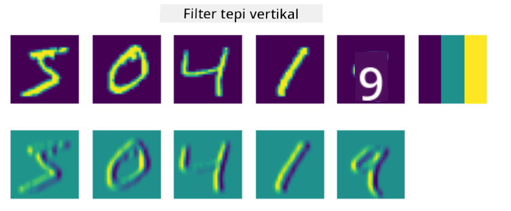
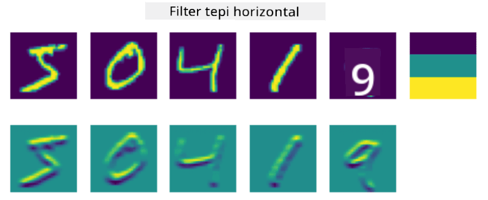

<!--
CO_OP_TRANSLATOR_METADATA:
{
  "original_hash": "088837b42b7d99198bf62db8a42411e0",
  "translation_date": "2025-08-29T12:19:24+00:00",
  "source_file": "lessons/4-ComputerVision/07-ConvNets/README.md",
  "language_code": "id"
}
-->
# Jaringan Saraf Konvolusional

Kita telah melihat sebelumnya bahwa jaringan saraf cukup baik dalam menangani gambar, bahkan perceptron satu lapis mampu mengenali angka tulisan tangan dari dataset MNIST dengan akurasi yang cukup baik. Namun, dataset MNIST sangatlah spesial, karena semua angka di dalamnya sudah dipusatkan di tengah gambar, sehingga tugasnya menjadi lebih sederhana.

## [Kuis sebelum kuliah](https://ff-quizzes.netlify.app/en/ai/quiz/13)

Dalam kehidupan nyata, kita ingin dapat mengenali objek dalam gambar tanpa peduli lokasi pastinya di dalam gambar. Penglihatan komputer berbeda dari klasifikasi umum, karena ketika kita mencoba menemukan objek tertentu dalam gambar, kita memindai gambar untuk mencari **pola** tertentu dan kombinasinya. Sebagai contoh, ketika mencari kucing, kita mungkin pertama-tama mencari garis horizontal yang dapat membentuk kumis, dan kemudian kombinasi tertentu dari kumis tersebut dapat memberi tahu kita bahwa itu sebenarnya adalah gambar kucing. Posisi relatif dan keberadaan pola tertentu penting, bukan posisi pastinya di dalam gambar.

Untuk mengekstrak pola, kita akan menggunakan konsep **filter konvolusional**. Seperti yang Anda ketahui, gambar direpresentasikan sebagai matriks 2D, atau tensor 3D dengan kedalaman warna. Menerapkan filter berarti kita mengambil matriks **filter kernel** yang relatif kecil, dan untuk setiap piksel dalam gambar asli, kita menghitung rata-rata berbobot dengan titik-titik tetangganya. Kita dapat membayangkan ini seperti jendela kecil yang meluncur di seluruh gambar, dan meratakan semua piksel sesuai dengan bobot dalam matriks filter kernel.

 | 
----|----

> Gambar oleh Dmitry Soshnikov

Sebagai contoh, jika kita menerapkan filter tepi vertikal dan horizontal 3x3 pada angka MNIST, kita dapat menyoroti (misalnya nilai tinggi) di mana terdapat tepi vertikal dan horizontal dalam gambar asli kita. Dengan demikian, kedua filter tersebut dapat digunakan untuk "mencari" tepi. Demikian pula, kita dapat merancang filter yang berbeda untuk mencari pola tingkat rendah lainnya:

> Gambar dari [Leung-Malik Filter Bank](https://www.robots.ox.ac.uk/~vgg/research/texclass/filters.html)

Namun, meskipun kita dapat merancang filter untuk mengekstrak beberapa pola secara manual, kita juga dapat merancang jaringan sedemikian rupa sehingga jaringan tersebut akan mempelajari pola secara otomatis. Ini adalah salah satu ide utama di balik CNN.

## Ide Utama di Balik CNN

Cara kerja CNN didasarkan pada ide-ide penting berikut:

* Filter konvolusional dapat mengekstrak pola
* Kita dapat merancang jaringan sedemikian rupa sehingga filter dilatih secara otomatis
* Kita dapat menggunakan pendekatan yang sama untuk menemukan pola dalam fitur tingkat tinggi, bukan hanya dalam gambar asli. Dengan demikian, ekstraksi fitur CNN bekerja pada hierarki fitur, mulai dari kombinasi piksel tingkat rendah hingga kombinasi tingkat tinggi dari bagian-bagian gambar.

> Gambar dari [makalah oleh Hislop-Lynch](https://www.semanticscholar.org/paper/Computer-vision-based-pedestrian-trajectory-Hislop-Lynch/26e6f74853fc9bbb7487b06dc2cf095d36c9021d), berdasarkan [penelitian mereka](https://dl.acm.org/doi/abs/10.1145/1553374.1553453)

## ✍️ Latihan: Jaringan Saraf Konvolusional

Mari kita lanjutkan mengeksplorasi bagaimana jaringan saraf konvolusional bekerja, dan bagaimana kita dapat mencapai filter yang dapat dilatih, dengan mengerjakan notebook berikut:

* [Jaringan Saraf Konvolusional - PyTorch](ConvNetsPyTorch.ipynb)
* [Jaringan Saraf Konvolusional - TensorFlow](ConvNetsTF.ipynb)

## Arsitektur Piramida

Sebagian besar CNN yang digunakan untuk pemrosesan gambar mengikuti apa yang disebut arsitektur piramida. Lapisan konvolusional pertama yang diterapkan pada gambar asli biasanya memiliki jumlah filter yang relatif kecil (8-16), yang sesuai dengan berbagai kombinasi piksel, seperti garis horizontal/vertikal atau goresan. Pada level berikutnya, kita mengurangi dimensi spasial jaringan, dan meningkatkan jumlah filter, yang sesuai dengan lebih banyak kemungkinan kombinasi fitur sederhana. Dengan setiap lapisan, saat kita bergerak menuju pengklasifikasi akhir, dimensi spasial gambar berkurang, dan jumlah filter bertambah.

Sebagai contoh, mari kita lihat arsitektur VGG-16, sebuah jaringan yang mencapai akurasi 92,7% dalam klasifikasi top-5 ImageNet pada tahun 2014:

> Gambar dari [Researchgate](https://www.researchgate.net/figure/Vgg16-model-structure-To-get-the-VGG-NIN-model-we-replace-the-2-nd-4-th-6-th-7-th_fig2_335194493)

## Arsitektur CNN Terkenal

[Lanjutkan pembelajaran Anda tentang arsitektur CNN terkenal](CNN_Architectures.md)

---

**Penafian**:  
Dokumen ini telah diterjemahkan menggunakan layanan penerjemahan AI [Co-op Translator](https://github.com/Azure/co-op-translator). Meskipun kami berupaya untuk memberikan hasil yang akurat, harap diperhatikan bahwa terjemahan otomatis mungkin mengandung kesalahan atau ketidakakuratan. Dokumen asli dalam bahasa aslinya harus dianggap sebagai sumber yang berwenang. Untuk informasi yang bersifat kritis, disarankan menggunakan jasa penerjemahan manusia profesional. Kami tidak bertanggung jawab atas kesalahpahaman atau penafsiran yang keliru yang timbul dari penggunaan terjemahan ini.