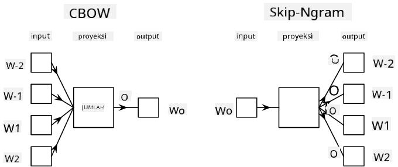

<!--
CO_OP_TRANSLATOR_METADATA:
{
  "original_hash": "31b46ba1f3aa78578134d4829f88be53",
  "translation_date": "2025-08-29T12:43:15+00:00",
  "source_file": "lessons/5-NLP/15-LanguageModeling/README.md",
  "language_code": "id"
}
-->
# Pemodelan Bahasa

Embedding semantik, seperti Word2Vec dan GloVe, sebenarnya adalah langkah awal menuju **pemodelan bahasa** - menciptakan model yang dapat *memahami* (atau *merepresentasikan*) sifat bahasa.

## [Kuis sebelum pelajaran](https://ff-quizzes.netlify.app/en/ai/quiz/29)

Ide utama di balik pemodelan bahasa adalah melatihnya pada dataset tanpa label secara tidak diawasi. Hal ini penting karena kita memiliki jumlah teks tanpa label yang sangat besar, sementara jumlah teks berlabel selalu terbatas oleh upaya yang dapat kita lakukan untuk memberi label. Sebagian besar waktu, kita dapat membangun model bahasa yang dapat **memprediksi kata yang hilang** dalam teks, karena mudah untuk menyembunyikan kata acak dalam teks dan menggunakannya sebagai sampel pelatihan.

## Melatih Embedding

Dalam contoh sebelumnya, kita menggunakan embedding semantik yang sudah dilatih sebelumnya, tetapi menarik untuk melihat bagaimana embedding tersebut dapat dilatih. Ada beberapa ide yang dapat digunakan:

* **Pemodelan bahasa N-Gram**, di mana kita memprediksi sebuah token dengan melihat N token sebelumnya (N-gram).
* **Continuous Bag-of-Words** (CBoW), di mana kita memprediksi token tengah $W_0$ dalam urutan token $W_{-N}$, ..., $W_N$.
* **Skip-gram**, di mana kita memprediksi sekumpulan token tetangga {$W_{-N},\dots, W_{-1}, W_1,\dots, W_N$} dari token tengah $W_0$.

> Gambar dari [makalah ini](https://arxiv.org/pdf/1301.3781.pdf)

## ✍️ Notebook Contoh: Melatih Model CBoW

Lanjutkan pembelajaran Anda melalui notebook berikut:

* [Melatih CBoW Word2Vec dengan TensorFlow](CBoW-TF.ipynb)
* [Melatih CBoW Word2Vec dengan PyTorch](CBoW-PyTorch.ipynb)

## Kesimpulan

Dalam pelajaran sebelumnya, kita telah melihat bahwa embedding kata bekerja seperti sihir! Sekarang kita tahu bahwa melatih embedding kata bukanlah tugas yang sangat kompleks, dan kita seharusnya dapat melatih embedding kata kita sendiri untuk teks spesifik domain jika diperlukan.

## [Kuis setelah pelajaran](https://ff-quizzes.netlify.app/en/ai/quiz/30)

## Tinjauan & Studi Mandiri

* [Tutorial resmi PyTorch tentang Pemodelan Bahasa](https://pytorch.org/tutorials/beginner/nlp/word_embeddings_tutorial.html).
* [Tutorial resmi TensorFlow tentang melatih model Word2Vec](https://www.TensorFlow.org/tutorials/text/word2vec).
* Menggunakan kerangka kerja **gensim** untuk melatih embedding yang paling umum digunakan hanya dalam beberapa baris kode dijelaskan [dalam dokumentasi ini](https://pytorch.org/tutorials/beginner/nlp/word_embeddings_tutorial.html).

## 🚀 [Tugas: Melatih Model Skip-Gram](lab/README.md)

Dalam lab, kami menantang Anda untuk memodifikasi kode dari pelajaran ini untuk melatih model skip-gram alih-alih CBoW. [Baca detailnya](lab/README.md)

---

**Penafian**:  
Dokumen ini telah diterjemahkan menggunakan layanan penerjemahan AI [Co-op Translator](https://github.com/Azure/co-op-translator). Meskipun kami berusaha untuk memberikan hasil yang akurat, harap diketahui bahwa terjemahan otomatis mungkin mengandung kesalahan atau ketidakakuratan. Dokumen asli dalam bahasa aslinya harus dianggap sebagai sumber yang otoritatif. Untuk informasi yang bersifat kritis, disarankan menggunakan jasa penerjemahan profesional oleh manusia. Kami tidak bertanggung jawab atas kesalahpahaman atau penafsiran yang keliru yang timbul dari penggunaan terjemahan ini.