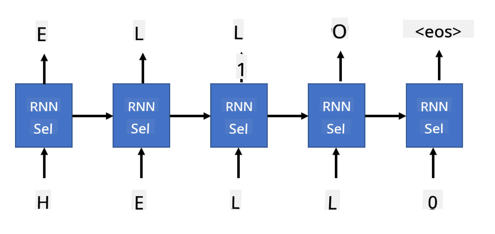

<!--
CO_OP_TRANSLATOR_METADATA:
{
  "original_hash": "d9de7847385eeeda67cfdcce1640ab72",
  "translation_date": "2025-08-29T12:42:26+00:00",
  "source_file": "lessons/5-NLP/17-GenerativeNetworks/README.md",
  "language_code": "id"
}
-->
# Jaringan Generatif

## [Kuis Pra-Kuliah](https://ff-quizzes.netlify.app/en/ai/quiz/33)

Recurrent Neural Networks (RNNs) dan varian sel ber-gate seperti Long Short Term Memory Cells (LSTMs) dan Gated Recurrent Units (GRUs) menyediakan mekanisme untuk pemodelan bahasa karena mereka dapat mempelajari urutan kata dan memberikan prediksi untuk kata berikutnya dalam sebuah rangkaian. Hal ini memungkinkan kita menggunakan RNN untuk **tugas generatif**, seperti pembuatan teks biasa, penerjemahan mesin, dan bahkan pembuatan keterangan gambar.

> ✅ Pikirkan semua momen di mana Anda mendapatkan manfaat dari tugas generatif seperti pelengkapan teks saat mengetik. Lakukan riset tentang aplikasi favorit Anda untuk melihat apakah mereka menggunakan RNN.

Dalam arsitektur RNN yang kita bahas di unit sebelumnya, setiap unit RNN menghasilkan status tersembunyi berikutnya sebagai output. Namun, kita juga dapat menambahkan output lain ke setiap unit rekuren, yang memungkinkan kita menghasilkan sebuah **rangkaian** (yang panjangnya sama dengan rangkaian asli). Selain itu, kita dapat menggunakan unit RNN yang tidak menerima input di setiap langkah, melainkan hanya mengambil vektor status awal, dan kemudian menghasilkan rangkaian output.

Hal ini memungkinkan berbagai arsitektur neural yang ditunjukkan pada gambar di bawah ini:


> Gambar dari artikel blog [Unreasonable Effectiveness of Recurrent Neural Networks](http://karpathy.github.io/2015/05/21/rnn-effectiveness/) oleh [Andrej Karpaty](http://karpathy.github.io/)

* **One-to-one** adalah jaringan neural tradisional dengan satu input dan satu output
* **One-to-many** adalah arsitektur generatif yang menerima satu nilai input, dan menghasilkan rangkaian nilai output. Misalnya, jika kita ingin melatih jaringan **image captioning** yang menghasilkan deskripsi teks dari sebuah gambar, kita dapat memberikan gambar sebagai input, melewatkannya melalui CNN untuk mendapatkan status tersembunyinya, dan kemudian menggunakan rantai rekuren untuk menghasilkan keterangan kata demi kata
* **Many-to-one** sesuai dengan arsitektur RNN yang kita bahas di unit sebelumnya, seperti klasifikasi teks
* **Many-to-many**, atau **sequence-to-sequence**, sesuai dengan tugas seperti **penerjemahan mesin**, di mana kita memiliki RNN pertama yang mengumpulkan semua informasi dari rangkaian input ke dalam status tersembunyi, dan rantai RNN lainnya mengurai status ini menjadi rangkaian output.

Di unit ini, kita akan fokus pada model generatif sederhana yang membantu kita menghasilkan teks. Untuk kesederhanaan, kita akan menggunakan tokenisasi tingkat karakter.

Kita akan melatih RNN ini untuk menghasilkan teks langkah demi langkah. Pada setiap langkah, kita akan mengambil rangkaian karakter dengan panjang `nchars`, dan meminta jaringan untuk menghasilkan karakter output berikutnya untuk setiap karakter input:



Saat menghasilkan teks (selama inferensi), kita memulai dengan beberapa **prompt**, yang dilewatkan melalui sel RNN untuk menghasilkan status antara, dan kemudian dari status ini proses generasi dimulai. Kita menghasilkan satu karakter pada satu waktu, dan melewatkan status serta karakter yang dihasilkan ke sel RNN lainnya untuk menghasilkan karakter berikutnya, hingga kita menghasilkan cukup banyak karakter.


> Gambar oleh penulis

## ✍️ Latihan: Jaringan Generatif

Lanjutkan pembelajaran Anda di notebook berikut:

* [Jaringan Generatif dengan PyTorch](GenerativePyTorch.ipynb)
* [Jaringan Generatif dengan TensorFlow](GenerativeTF.ipynb)

## Generasi Teks Lunak dan Temperatur

Output dari setiap sel RNN adalah distribusi probabilitas karakter. Jika kita selalu mengambil karakter dengan probabilitas tertinggi sebagai karakter berikutnya dalam teks yang dihasilkan, teks tersebut sering kali dapat menjadi "berulang" dengan urutan karakter yang sama lagi dan lagi, seperti dalam contoh ini:

```
today of the second the company and a second the company ...
```

Namun, jika kita melihat distribusi probabilitas untuk karakter berikutnya, bisa jadi perbedaan antara beberapa probabilitas tertinggi tidak terlalu besar, misalnya satu karakter memiliki probabilitas 0.2, dan karakter lainnya 0.19, dll. Sebagai contoh, ketika mencari karakter berikutnya dalam rangkaian '*play*', karakter berikutnya bisa saja spasi, atau **e** (seperti dalam kata *player*).

Hal ini membawa kita pada kesimpulan bahwa tidak selalu "adil" untuk memilih karakter dengan probabilitas tertinggi, karena memilih yang kedua tertinggi masih dapat menghasilkan teks yang bermakna. Lebih bijaksana untuk **mengambil sampel** karakter dari distribusi probabilitas yang diberikan oleh output jaringan. Kita juga dapat menggunakan parameter, **temperature**, yang akan meratakan distribusi probabilitas, jika kita ingin menambahkan lebih banyak keacakan, atau membuatnya lebih curam, jika kita ingin lebih berpegang pada karakter dengan probabilitas tertinggi.

Jelajahi bagaimana generasi teks lunak ini diimplementasikan di notebook yang ditautkan di atas.

## Kesimpulan

Meskipun pembuatan teks mungkin berguna dengan sendirinya, manfaat utama datang dari kemampuan untuk menghasilkan teks menggunakan RNN dari beberapa vektor fitur awal. Misalnya, pembuatan teks digunakan sebagai bagian dari penerjemahan mesin (sequence-to-sequence, dalam hal ini vektor status dari *encoder* digunakan untuk menghasilkan atau *decode* pesan yang diterjemahkan), atau menghasilkan deskripsi teks dari sebuah gambar (dalam hal ini vektor fitur berasal dari ekstraktor CNN).

## 🚀 Tantangan

Ikuti beberapa pelajaran di Microsoft Learn tentang topik ini

* Pembuatan Teks dengan [PyTorch](https://docs.microsoft.com/learn/modules/intro-natural-language-processing-pytorch/6-generative-networks/?WT.mc_id=academic-77998-cacaste)/[TensorFlow](https://docs.microsoft.com/learn/modules/intro-natural-language-processing-tensorflow/5-generative-networks/?WT.mc_id=academic-77998-cacaste)

## [Kuis Pasca-Kuliah](https://ff-quizzes.netlify.app/en/ai/quiz/34)

## Tinjauan & Studi Mandiri

Berikut adalah beberapa artikel untuk memperluas pengetahuan Anda

* Pendekatan berbeda untuk pembuatan teks dengan Markov Chain, LSTM, dan GPT-2: [artikel blog](https://towardsdatascience.com/text-generation-gpt-2-lstm-markov-chain-9ea371820e1e)
* Contoh pembuatan teks di [dokumentasi Keras](https://keras.io/examples/generative/lstm_character_level_text_generation/)

## [Tugas](lab/README.md)

Kita telah melihat bagaimana menghasilkan teks karakter demi karakter. Di laboratorium, Anda akan mengeksplorasi pembuatan teks tingkat kata.

---

**Penafian**:  
Dokumen ini telah diterjemahkan menggunakan layanan penerjemahan AI [Co-op Translator](https://github.com/Azure/co-op-translator). Meskipun kami berusaha untuk memberikan hasil yang akurat, harap diingat bahwa terjemahan otomatis mungkin mengandung kesalahan atau ketidakakuratan. Dokumen asli dalam bahasa aslinya harus dianggap sebagai sumber yang otoritatif. Untuk informasi yang bersifat kritis, disarankan menggunakan jasa penerjemahan profesional oleh manusia. Kami tidak bertanggung jawab atas kesalahpahaman atau penafsiran yang keliru yang timbul dari penggunaan terjemahan ini.