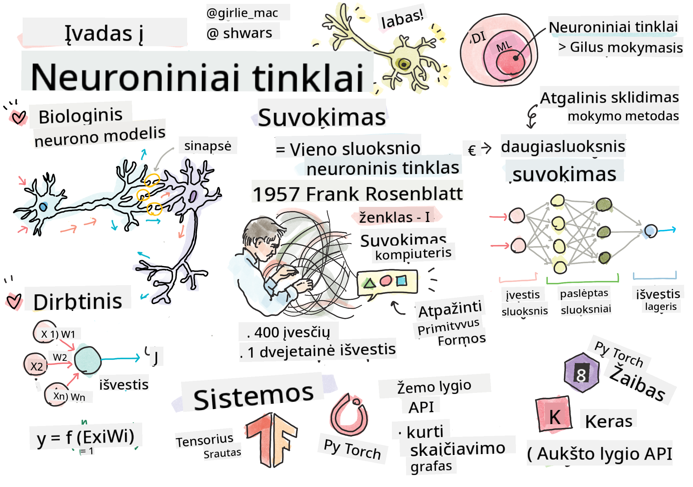

<!--
CO_OP_TRANSLATOR_METADATA:
{
  "original_hash": "1c6b8c7c1778a35fc1139b7f2aecb7b3",
  "translation_date": "2025-08-31T17:48:54+00:00",
  "source_file": "lessons/3-NeuralNetworks/README.md",
  "language_code": "lt"
}
-->
# Įvadas į Neuroninius Tinklus

Kaip aptarėme įvade, vienas iš būdų pasiekti intelektą yra treniruoti **kompiuterinį modelį** arba **dirbtines smegenis**. Nuo XX a. vidurio mokslininkai bandė įvairius matematinius modelius, kol pastaraisiais metais ši kryptis tapo itin sėkminga. Tokie smegenų matematiniai modeliai vadinami **neuroniniais tinklais**.

> Kartais neuroniniai tinklai vadinami *Dirbtiniais Neuroniniais Tinklais* (Artificial Neural Networks, ANNs), siekiant pabrėžti, kad kalbame apie modelius, o ne tikrus neuronų tinklus.

## Mašininis Mokymasis

Neuroniniai tinklai yra didesnės disciplinos, vadinamos **Mašininiu Mokymusi**, dalis. Jos tikslas – naudoti duomenis kompiuteriniams modeliams treniruoti, kad jie galėtų spręsti problemas. Mašininis mokymasis sudaro didelę dalį Dirbtinio Intelekto, tačiau šiame kurse klasikinio mašininio mokymosi neaptarsime.

> Apsilankykite mūsų atskirame **[Mašininio Mokymosi pradedantiesiems](http://github.com/microsoft/ml-for-beginners)** kurse, kad sužinotumėte daugiau apie klasikinį mašininį mokymąsi.

Mašininiame mokymesi darome prielaidą, kad turime tam tikrą pavyzdžių rinkinį **X** ir atitinkamas išvesties reikšmes **Y**. Pavyzdžiai dažnai yra N-dimensiniai vektoriai, sudaryti iš **savybių**, o išvestys vadinamos **žymėmis**.

Mes nagrinėsime dvi dažniausiai pasitaikančias mašininio mokymosi problemas:

* **Klasifikacija**, kai reikia klasifikuoti įvesties objektą į dvi ar daugiau klasių.
* **Regresija**, kai reikia numatyti skaitinę reikšmę kiekvienam įvesties pavyzdžiui.

> Kai įvestys ir išvestys pateikiamos kaip tensoriai, įvesties duomenų rinkinys yra M×N dydžio matrica, kur M – pavyzdžių skaičius, o N – savybių skaičius. Išvesties žymės Y yra M dydžio vektorius.

Šiame kurse dėmesį skirsime tik neuroninių tinklų modeliams.

## Neurono Modelis

Iš biologijos žinome, kad mūsų smegenys susideda iš neuroninių ląstelių, kurių kiekviena turi kelis "įėjimus" (aksonus) ir vieną išėjimą (dendritą). Aksonai ir dendritai gali perduoti elektrinius signalus, o jungtys tarp aksonų ir dendritų gali turėti skirtingą laidumo laipsnį (valdomą neuromediatoriais).

 | 
----|----
Tikras neuronas *([Vaizdas](https://en.wikipedia.org/wiki/Synapse#/media/File:SynapseSchematic_lines.svg) iš Vikipedijos)* | Dirbtinis neuronas *(Vaizdas autoriaus)*

Taigi, paprasčiausias neurono matematinis modelis turi kelis įėjimus X1, ..., XN, vieną išėjimą Y ir svorių rinkinį W1, ..., WN. Išėjimas apskaičiuojamas taip:

kur f yra tam tikra nelinijinė **aktyvavimo funkcija**.

> Ankstyvieji neurono modeliai buvo aprašyti klasikiniame straipsnyje [A logical calculus of the ideas immanent in nervous activity](https://www.cs.cmu.edu/~./epxing/Class/10715/reading/McCulloch.and.Pitts.pdf), kurį 1943 m. parašė Warren McCullock ir Walter Pitts. Donald Hebb savo knygoje "[The Organization of Behavior: A Neuropsychological Theory](https://books.google.com/books?id=VNetYrB8EBoC)" pasiūlė būdą, kaip šiuos tinklus galima treniruoti.

## Šiame skyriuje

Šiame skyriuje sužinosime apie:
* [Perceptroną](03-Perceptron/README.md), vieną iš ankstyviausių dviejų klasių klasifikavimo neuroninių tinklų modelių
* [Daugiasluoksnius tinklus](04-OwnFramework/README.md) su susietu užrašų knygeliu [kaip sukurti savo sistemą](04-OwnFramework/OwnFramework.ipynb)
* [Neuroninių tinklų sistemas](05-Frameworks/README.md), su šiomis užrašų knygelėmis: [PyTorch](05-Frameworks/IntroPyTorch.ipynb) ir [Keras/Tensorflow](05-Frameworks/IntroKerasTF.ipynb)
* [Perteklinį pritaikymą](../../../../lessons/3-NeuralNetworks/05-Frameworks)

---

**Atsakomybės apribojimas**:  
Šis dokumentas buvo išverstas naudojant AI vertimo paslaugą [Co-op Translator](https://github.com/Azure/co-op-translator). Nors siekiame tikslumo, prašome atkreipti dėmesį, kad automatiniai vertimai gali turėti klaidų ar netikslumų. Originalus dokumentas jo gimtąja kalba turėtų būti laikomas autoritetingu šaltiniu. Kritinei informacijai rekomenduojama naudoti profesionalų žmogaus vertimą. Mes neprisiimame atsakomybės už nesusipratimus ar klaidingus interpretavimus, atsiradusius dėl šio vertimo naudojimo.