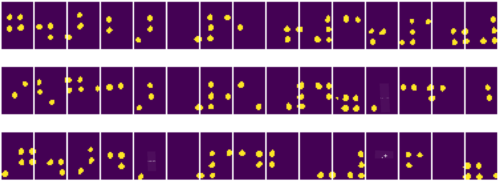

<!--
CO_OP_TRANSLATOR_METADATA:
{
  "original_hash": "4bedc8e702db17260cfe824d58b6cfd4",
  "translation_date": "2025-08-31T17:39:17+00:00",
  "source_file": "lessons/4-ComputerVision/06-IntroCV/README.md",
  "language_code": "lt"
}
-->
# Įvadas į kompiuterinį matymą

[Kompiuterinis matymas](https://wikipedia.org/wiki/Computer_vision) yra disciplina, kurios tikslas – leisti kompiuteriams suprasti skaitmeninius vaizdus aukštu lygiu. Tai gana plati sąvoka, nes *supratimas* gali reikšti daugybę dalykų, įskaitant objekto radimą nuotraukoje (**objektų atpažinimas**), įvykių atpažinimą (**įvykių detekcija**), nuotraukos aprašymą tekstu ar scenos atkūrimą 3D formatu. Taip pat yra specialių užduočių, susijusių su žmogaus atvaizdais: amžiaus ir emocijų nustatymas, veido aptikimas ir atpažinimas, 3D pozos nustatymas ir kt.

## [Prieš paskaitą: testas](https://ff-quizzes.netlify.app/en/ai/quiz/11)

Viena iš paprasčiausių kompiuterinio matymo užduočių yra **vaizdų klasifikacija**.

Kompiuterinis matymas dažnai laikomas dirbtinio intelekto šaka. Šiais laikais dauguma kompiuterinio matymo užduočių sprendžiamos naudojant neuroninius tinklus. Šioje dalyje sužinosime daugiau apie specialų neuroninių tinklų tipą, naudojamą kompiuteriniam matymui – [konvoliucinius neuroninius tinklus](../07-ConvNets/README.md).

Tačiau prieš perduodant vaizdą neuroniniam tinklui, daugeliu atvejų verta naudoti tam tikras algoritmines technikas vaizdui pagerinti.

Yra keletas Python bibliotekų, skirtų vaizdų apdorojimui:

* **[imageio](https://imageio.readthedocs.io/en/stable/)** gali būti naudojama skirtingų vaizdo formatų skaitymui/rašymui. Ji taip pat palaiko ffmpeg – naudingą įrankį vaizdo kadrų konvertavimui į vaizdus.
* **[Pillow](https://pillow.readthedocs.io/en/stable/index.html)** (dar žinoma kaip PIL) yra šiek tiek galingesnė ir palaiko kai kurias vaizdų manipuliacijas, tokias kaip morfingas, paletės koregavimas ir kt.
* **[OpenCV](https://opencv.org/)** yra galinga vaizdų apdorojimo biblioteka, parašyta C++ kalba, kuri tapo *de facto* standartu vaizdų apdorojimui. Ji turi patogią Python sąsają.
* **[dlib](http://dlib.net/)** yra C++ biblioteka, įgyvendinanti daugelį mašininio mokymosi algoritmų, įskaitant kai kuriuos kompiuterinio matymo algoritmus. Ji taip pat turi Python sąsają ir gali būti naudojama sudėtingoms užduotims, tokioms kaip veido ir veido bruožų aptikimas.

## OpenCV

[OpenCV](https://opencv.org/) laikoma *de facto* standartu vaizdų apdorojimui. Ji turi daugybę naudingų algoritmų, įgyvendintų C++ kalba. OpenCV taip pat galima naudoti su Python.

Geras šaltinis mokytis OpenCV yra [šis Learn OpenCV kursas](https://learnopencv.com/getting-started-with-opencv/). Mūsų mokymo programoje tikslas nėra išmokti OpenCV, bet parodyti keletą pavyzdžių, kada ir kaip ji gali būti naudojama.

### Vaizdų įkėlimas

Python kalboje vaizdai gali būti patogiai atvaizduojami naudojant NumPy masyvus. Pavyzdžiui, pilkų atspalvių vaizdai, kurių dydis yra 320x200 pikselių, būtų saugomi 200x320 masyve, o spalvoti vaizdai su tais pačiais matmenimis turėtų formą 200x320x3 (3 spalvų kanalams). Norėdami įkelti vaizdą, galite naudoti šį kodą:

```python
import cv2
import matplotlib.pyplot as plt

im = cv2.imread('image.jpeg')
plt.imshow(im)
```

Tradiciškai OpenCV naudoja BGR (mėlyna-žalia-raudona) kodavimą spalvotiems vaizdams, o kitos Python priemonės naudoja tradicinį RGB (raudona-žalia-mėlyna). Kad vaizdas atrodytų teisingai, reikia jį konvertuoti į RGB spalvų erdvę, arba keičiant dimensijas NumPy masyve, arba naudojant OpenCV funkciją:

```python
im = cv2.cvtColor(im,cv2.COLOR_BGR2RGB)
```

Ta pati `cvtColor` funkcija gali būti naudojama kitoms spalvų erdvės transformacijoms, pavyzdžiui, konvertuojant vaizdą į pilkų atspalvių arba HSV (atspalvis-sodrumas-vertė) spalvų erdvę.

Taip pat galite naudoti OpenCV, kad įkeltumėte vaizdo įrašą kadrų po kadro – pavyzdys pateiktas užduotyje [OpenCV Notebook](OpenCV.ipynb).

### Vaizdų apdorojimas

Prieš perduodant vaizdą neuroniniam tinklui, gali būti naudinga atlikti kelis išankstinio apdorojimo veiksmus. OpenCV gali atlikti daugybę dalykų, įskaitant:

* **Vaizdo dydžio keitimą** naudojant `im = cv2.resize(im, (320,200),interpolation=cv2.INTER_LANCZOS)`
* **Vaizdo suliejimą** naudojant `im = cv2.medianBlur(im,3)` arba `im = cv2.GaussianBlur(im, (3,3), 0)`
* Vaizdo **ryškumo ir kontrasto** keitimą galima atlikti naudojant NumPy masyvų manipuliacijas, kaip aprašyta [šiame Stackoverflow įraše](https://stackoverflow.com/questions/39308030/how-do-i-increase-the-contrast-of-an-image-in-python-opencv).
* Naudojant [slenksčio nustatymą](https://docs.opencv.org/4.x/d7/d4d/tutorial_py_thresholding.html) su `cv2.threshold`/`cv2.adaptiveThreshold` funkcijomis, kas dažnai yra geriau nei ryškumo ar kontrasto koregavimas.
* Skirtingų [transformacijų](https://docs.opencv.org/4.5.5/da/d6e/tutorial_py_geometric_transformations.html) taikymas vaizdui:
    - **[Afiniškos transformacijos](https://docs.opencv.org/4.5.5/d4/d61/tutorial_warp_affine.html)** gali būti naudingos, jei reikia sujungti sukimosi, dydžio keitimo ir iškraipymo veiksmus, žinant trijų taškų pradinę ir galutinę padėtį vaizde. Afiniškos transformacijos išlaiko lygiagrečias linijas lygiagrečias.
    - **[Perspektyvinės transformacijos](https://medium.com/analytics-vidhya/opencv-perspective-transformation-9edffefb2143)** gali būti naudingos, kai žinote keturių taškų pradinę ir galutinę padėtį vaizde. Pavyzdžiui, jei fotografuojate stačiakampį dokumentą išmaniojo telefono kamera iš tam tikro kampo ir norite gauti stačiakampį dokumento vaizdą.
* Judesio supratimas vaizde naudojant **[optinį srautą](https://docs.opencv.org/4.5.5/d4/dee/tutorial_optical_flow.html)**.

## Kompiuterinio matymo naudojimo pavyzdžiai

Mūsų [OpenCV Notebook](OpenCV.ipynb) pateikiame keletą pavyzdžių, kaip kompiuterinis matymas gali būti naudojamas specifinėms užduotims atlikti:

* **Brailio knygos nuotraukos išankstinis apdorojimas**. Mes sutelkiame dėmesį į tai, kaip galima naudoti slenksčio nustatymą, bruožų aptikimą, perspektyvinę transformaciją ir NumPy manipuliacijas, kad atskirtume atskirus Brailio simbolius tolimesnei klasifikacijai neuroniniu tinklu.

 |  | 
----|-----|-----

> Vaizdas iš [OpenCV.ipynb](OpenCV.ipynb)

* **Judesio aptikimas vaizdo įraše naudojant kadrų skirtumą**. Jei kamera yra fiksuota, tuomet kadrų skirtumai turėtų būti minimalūs. Kadangi kadrai yra atvaizduojami kaip masyvai, tiesiog atimant du iš eilės einančius kadrus, gausime pikselių skirtumą, kuris turėtų būti mažas statiniams kadrams ir didesnis, kai vaizde yra reikšmingas judesys.


> Vaizdas iš [OpenCV.ipynb](OpenCV.ipynb)

* **Judesio aptikimas naudojant optinį srautą**. [Optinis srautas](https://docs.opencv.org/3.4/d4/dee/tutorial_optical_flow.html) leidžia suprasti, kaip atskiri pikseliai juda vaizdo kadruose. Yra du optinio srauto tipai:

   - **Tankus optinis srautas** apskaičiuoja vektorių lauką, kuris rodo, kur juda kiekvienas pikselis.
   - **Retas optinis srautas** remiasi tam tikrų išskirtinių bruožų (pvz., kraštų) aptikimu ir jų trajektorijos kūrimu iš kadro į kadrą.


> Vaizdas iš [OpenCV.ipynb](OpenCV.ipynb)

## ✍️ Pavyzdiniai užrašai: OpenCV [išbandykite OpenCV veiksmuose](OpenCV.ipynb)

Atlikime keletą eksperimentų su OpenCV, tyrinėdami [OpenCV Notebook](OpenCV.ipynb).

## Išvada

Kartais, palyginti sudėtingos užduotys, tokios kaip judesio ar pirštų galiukų aptikimas, gali būti išspręstos vien tik kompiuterinio matymo pagalba. Todėl labai naudinga žinoti pagrindines kompiuterinio matymo technikas ir ką tokios bibliotekos kaip OpenCV gali atlikti.

## 🚀 Iššūkis

Peržiūrėkite [šį vaizdo įrašą](https://docs.microsoft.com/shows/ai-show/ai-show--2021-opencv-ai-competition--grand-prize-winners--cortic-tigers--episode-32?WT.mc_id=academic-77998-cacaste) iš AI šou, kad sužinotumėte apie Cortic Tigers projektą ir kaip jie sukūrė blokų pagrindu veikiančią sprendimą, skirtą kompiuterinio matymo užduotims demokratizuoti per robotą. Atlikite tyrimą apie kitus panašius projektus, kurie padeda naujokams įsitraukti į šią sritį.

## [Po paskaitos: testas](https://ff-quizzes.netlify.app/en/ai/quiz/12)

## Peržiūra ir savarankiškas mokymasis

Plačiau apie optinį srautą skaitykite [šiame puikiame vadove](https://learnopencv.com/optical-flow-in-opencv/).

## [Užduotis](lab/README.md)

Šioje laboratorijoje turėsite nufilmuoti vaizdo įrašą su paprastais gestais, o jūsų tikslas bus išgauti aukštyn/žemyn/kairėn/dešinėn judesius naudojant optinį srautą.


---

**Atsakomybės apribojimas**:  
Šis dokumentas buvo išverstas naudojant AI vertimo paslaugą [Co-op Translator](https://github.com/Azure/co-op-translator). Nors siekiame tikslumo, prašome atkreipti dėmesį, kad automatiniai vertimai gali turėti klaidų ar netikslumų. Originalus dokumentas jo gimtąja kalba turėtų būti laikomas autoritetingu šaltiniu. Kritinei informacijai rekomenduojama naudoti profesionalų žmogaus vertimą. Mes neprisiimame atsakomybės už nesusipratimus ar klaidingus interpretavimus, atsiradusius dėl šio vertimo naudojimo.