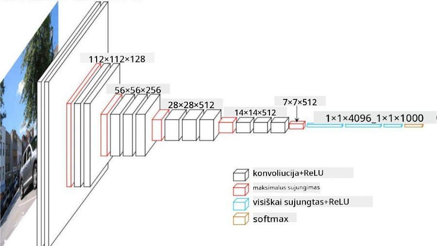

<!--
CO_OP_TRANSLATOR_METADATA:
{
  "original_hash": "53faab85adfcebd8c10bcd71dc2fa557",
  "translation_date": "2025-09-23T15:42:03+00:00",
  "source_file": "lessons/4-ComputerVision/07-ConvNets/CNN_Architectures.md",
  "language_code": "lt"
}
-->
# Gerai žinomos CNN architektūros

### VGG-16

VGG-16 yra tinklas, kuris 2014 m. pasiekė 92,7% tikslumą ImageNet top-5 klasifikacijoje. Jo sluoksnių struktūra yra tokia:

Kaip matote, VGG seka tradicinę piramidės architektūrą, kuri yra konvoliucinių ir kaupimo sluoksnių seka.

> Vaizdas iš [Researchgate](https://www.researchgate.net/figure/Vgg16-model-structure-To-get-the-VGG-NIN-model-we-replace-the-2-nd-4-th-6-th-7-th_fig2_335194493)

### ResNet

ResNet yra modelių šeima, kurią 2015 m. pasiūlė Microsoft Research. Pagrindinė ResNet idėja yra naudoti **likutinius blokus**:

> Vaizdas iš [šio straipsnio](https://arxiv.org/pdf/1512.03385.pdf)

Likutinio perdavimo naudojimo priežastis yra tai, kad sluoksnis prognozuotų **skirtumą** tarp ankstesnio sluoksnio rezultato ir likutinio bloko išvesties - todėl jis vadinamas *likutiniu*. Šiuos blokus yra daug lengviau treniruoti, ir galima sukurti tinklus su keliais šimtais tokių blokų (dažniausiai naudojami variantai yra ResNet-52, ResNet-101 ir ResNet-152).

Taip pat galite galvoti apie šį tinklą kaip apie gebantį prisitaikyti prie duomenų rinkinio sudėtingumo. Pradžioje, kai pradedate treniruoti tinklą, svorių reikšmės yra mažos, ir dauguma signalo pereina per identiteto sluoksnius. Treniruojant toliau ir svoriams didėjant, tinklo parametrų reikšmė auga, ir tinklas prisitaiko, kad turėtų reikiamą išraiškos galią teisingai klasifikuoti mokymo vaizdus.

### Google Inception

Google Inception architektūra žengia dar vieną žingsnį į priekį ir kiekvieną tinklo sluoksnį kuria kaip kelių skirtingų kelių kombinaciją:

> Vaizdas iš [Researchgate](https://www.researchgate.net/figure/Inception-module-with-dimension-reductions-left-and-schema-for-Inception-ResNet-v1_fig2_355547454)

Čia reikia pabrėžti 1x1 konvoliucijų vaidmenį, nes iš pradžių jos gali atrodyti nelogiškos. Kodėl reikėtų per vaizdą paleisti 1x1 filtrą? Tačiau reikia prisiminti, kad konvoliucijos filtrai taip pat veikia su keliais gylio kanalais (pradiniame lygyje - RGB spalvos, vėlesniuose sluoksniuose - kanalai skirtingiems filtrams), o 1x1 konvoliucija naudojama šiems įvesties kanalams sumaišyti naudojant skirtingus treniruojamus svorius. Tai taip pat gali būti laikoma gylio kanalų dimensijos sumažinimu (kaupimu).

Štai [geras tinklaraščio įrašas](https://medium.com/analytics-vidhya/talented-mr-1x1-comprehensive-look-at-1x1-convolution-in-deep-learning-f6b355825578) apie šią temą ir [originalus straipsnis](https://arxiv.org/pdf/1312.4400.pdf).

### MobileNet

MobileNet yra modelių šeima su sumažintu dydžiu, tinkama mobiliesiems įrenginiams. Naudokite juos, jei turite ribotus resursus ir galite paaukoti šiek tiek tikslumo. Pagrindinė jų idėja yra vadinamoji **gylio atskiriama konvoliucija**, kuri leidžia konvoliucijos filtrus atvaizduoti kaip erdvinių konvoliucijų ir 1x1 konvoliucijos per gylio kanalus kompoziciją. Tai žymiai sumažina parametrų skaičių, todėl tinklas tampa mažesnis ir lengviau treniruojamas su mažesniu duomenų kiekiu.

Štai [geras tinklaraščio įrašas apie MobileNet](https://medium.com/analytics-vidhya/image-classification-with-mobilenet-cc6fbb2cd470).

## Išvada

Šiame skyriuje sužinojote pagrindinę kompiuterinio matymo neuroninių tinklų koncepciją - konvoliucinius tinklus. Tikrojo gyvenimo architektūros, kurios palaiko vaizdų klasifikavimą, objektų aptikimą ir net vaizdų generavimo tinklus, visos yra pagrįstos CNN, tik su daugiau sluoksnių ir papildomais treniravimo triukais.

## 🚀 Iššūkis

Pridedamuose užrašų knygelėse yra pastabų apačioje apie tai, kaip pasiekti didesnį tikslumą. Atlikite eksperimentus ir pažiūrėkite, ar galite pasiekti didesnį tikslumą.

## [Po paskaitos testas](https://ff-quizzes.netlify.app/en/ai/quiz/14)

## Apžvalga ir savarankiškas mokymasis

Nors CNN dažniausiai naudojami kompiuterinio matymo užduotims, jie paprastai yra geri fiksuoto dydžio šablonų išgavimui. Pavyzdžiui, jei dirbame su garsais, taip pat galime norėti naudoti CNN, kad ieškotume tam tikrų šablonų garso signale - tokiu atveju filtrai būtų vienmatiai (ir šis CNN būtų vadinamas 1D-CNN). Taip pat kartais naudojamas 3D-CNN, kad būtų išgautos savybės daugiamačiame erdvėje, pavyzdžiui, tam tikri įvykiai, vykstantys vaizdo įraše - CNN gali užfiksuoti tam tikrus šablonus, kaip savybės keičiasi laikui bėgant. Atlikite apžvalgą ir savarankišką mokymąsi apie kitas užduotis, kurias galima atlikti naudojant CNN.

## [Užduotis](lab/README.md)

Šioje laboratorijoje jums pavesta klasifikuoti skirtingas kačių ir šunų veisles. Šie vaizdai yra sudėtingesni nei MNIST duomenų rinkinys, turi didesnę dimensiją, ir yra daugiau nei 10 klasių.

---

