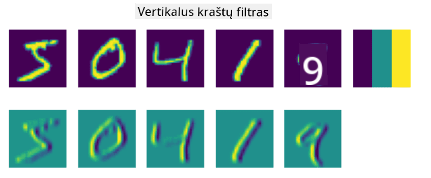
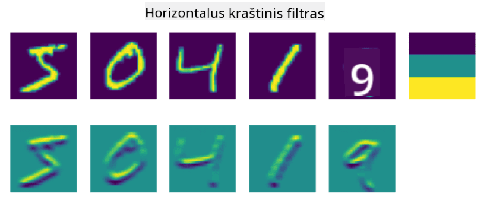
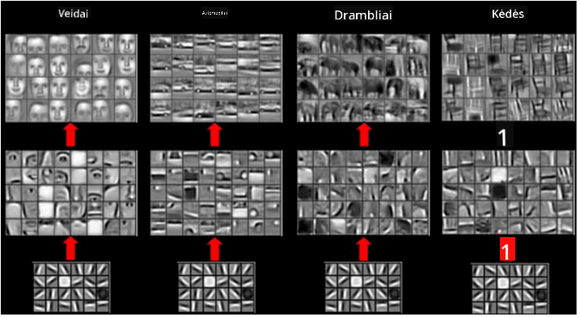

<!--
CO_OP_TRANSLATOR_METADATA:
{
  "original_hash": "088837b42b7d99198bf62db8a42411e0",
  "translation_date": "2025-08-31T17:35:46+00:00",
  "source_file": "lessons/4-ComputerVision/07-ConvNets/README.md",
  "language_code": "lt"
}
-->
# Konvoliuciniai neuroniniai tinklai

Anksčiau matėme, kad neuroniniai tinklai puikiai susidoroja su vaizdais, ir net vieno sluoksnio perceptronas gali atpažinti ranka rašytus skaitmenis iš MNIST duomenų rinkinio su pakankamu tikslumu. Tačiau MNIST duomenų rinkinys yra labai specifinis – visi skaitmenys yra centruoti vaizde, todėl užduotis tampa paprastesnė.

## [Klausimynas prieš paskaitą](https://red-field-0a6ddfd03.1.azurestaticapps.net/quiz/107)

Realiame gyvenime norime atpažinti objektus paveikslėlyje, nepaisant jų tikslios vietos vaizde. Kompiuterinis matymas skiriasi nuo bendro klasifikavimo, nes bandydami rasti tam tikrą objektą paveikslėlyje, skenuojame vaizdą ieškodami specifinių **raštų** ir jų kombinacijų. Pavyzdžiui, ieškodami katės, pirmiausia galime ieškoti horizontalių linijų, kurios gali sudaryti ūsus, o tam tikra ūsų kombinacija gali pasakyti, kad tai iš tiesų katės paveikslėlis. Svarbi yra santykinė tam tikrų raštų padėtis ir buvimas, o ne jų tiksli vieta vaizde.

Norėdami išgauti raštus, naudosime **konvoliucinių filtrų** sąvoką. Kaip žinote, vaizdas yra pateikiamas kaip 2D matrica arba 3D tensoras su spalvų gyliais. Filtrą taikyti reiškia, kad imame palyginti mažą **filtrų branduolio** matricą ir kiekvienam pradiniam vaizdo pikseliui apskaičiuojame svertinį vidurkį su kaimyniniais taškais. Galime tai įsivaizduoti kaip mažą langą, kuris slysta per visą vaizdą ir vidurkina visus pikselius pagal filtrų branduolio matricos svorius.

 | 
----|----

> Vaizdas: Dmitry Soshnikov

Pavyzdžiui, jei MNIST skaitmenims taikome 3x3 vertikalų ir horizontalų kraštų filtrus, galime išryškinti (pvz., gauti aukštas reikšmes) vietas, kuriose yra vertikalūs ir horizontalūs kraštai pradiniame vaizde. Taigi šiuos du filtrus galima naudoti "ieškant" kraštų. Panašiai galime sukurti skirtingus filtrus, kad ieškotume kitų žemo lygio raštų:

> Vaizdas [Leung-Malik filtrų banko](https://www.robots.ox.ac.uk/~vgg/research/texclass/filters.html)

Tačiau, nors galime rankiniu būdu sukurti filtrus tam tikrų raštų išgavimui, galime taip pat sukurti tinklą, kuris pats išmoktų raštus automatiškai. Tai yra viena pagrindinių CNN idėjų.

## Pagrindinės CNN idėjos

CNN veikimas grindžiamas šiomis svarbiomis idėjomis:

* Konvoliuciniai filtrai gali išgauti raštus
* Galime sukurti tinklą taip, kad filtrai būtų mokomi automatiškai
* Galime naudoti tą patį metodą, kad rastume raštus aukšto lygio savybėse, ne tik pradiniame vaizde. Taigi CNN savybių išgavimas veikia hierarchijos principu, pradedant nuo žemo lygio pikselių kombinacijų iki aukštesnio lygio paveikslėlio dalių kombinacijų.

> Vaizdas iš [Hislop-Lynch straipsnio](https://www.semanticscholar.org/paper/Computer-vision-based-pedestrian-trajectory-Hislop-Lynch/26e6f74853fc9bbb7487b06dc2cf095d36c9021d), remiantis [jų tyrimu](https://dl.acm.org/doi/abs/10.1145/1553374.1553453)

## ✍️ Pratimai: Konvoliuciniai neuroniniai tinklai

Tęskime tyrinėjimą, kaip veikia konvoliuciniai neuroniniai tinklai ir kaip galime pasiekti mokomus filtrus, atlikdami atitinkamus užrašų knygelių pratimus:

* [Konvoliuciniai neuroniniai tinklai - PyTorch](ConvNetsPyTorch.ipynb)
* [Konvoliuciniai neuroniniai tinklai - TensorFlow](ConvNetsTF.ipynb)

## Piramidės architektūra

Dauguma CNN, naudojamų vaizdų apdorojimui, seka vadinamąją piramidės architektūrą. Pirmasis konvoliucinis sluoksnis, taikomas pradiniams vaizdams, paprastai turi palyginti mažą filtrų skaičių (8-16), kurie atitinka skirtingas pikselių kombinacijas, tokias kaip horizontalios/vertikalios linijos ar brūkšniai. Kitame lygyje sumažiname tinklo erdvinį matmenį ir padidiname filtrų skaičių, kuris atitinka daugiau galimų paprastų savybių kombinacijų. Kiekviename sluoksnyje, artėjant prie galutinio klasifikatoriaus, vaizdo erdviniai matmenys mažėja, o filtrų skaičius didėja.

Pavyzdžiui, pažvelkime į VGG-16 architektūrą – tinklą, kuris 2014 m. pasiekė 92,7% tikslumą ImageNet top-5 klasifikacijoje:

> Vaizdas iš [Researchgate](https://www.researchgate.net/figure/Vgg16-model-structure-To-get-the-VGG-NIN-model-we-replace-the-2-nd-4-th-6-th-7-th_fig2_335194493)

## Geriausiai žinomos CNN architektūros

[Tęskite mokymąsi apie geriausiai žinomas CNN architektūras](CNN_Architectures.md)

---

**Atsakomybės apribojimas**:  
Šis dokumentas buvo išverstas naudojant AI vertimo paslaugą [Co-op Translator](https://github.com/Azure/co-op-translator). Nors siekiame tikslumo, prašome atkreipti dėmesį, kad automatiniai vertimai gali turėti klaidų ar netikslumų. Originalus dokumentas jo gimtąja kalba turėtų būti laikomas autoritetingu šaltiniu. Kritinei informacijai rekomenduojama profesionali žmogaus vertimo paslauga. Mes neprisiimame atsakomybės už nesusipratimus ar klaidingus interpretavimus, atsiradusius naudojant šį vertimą.