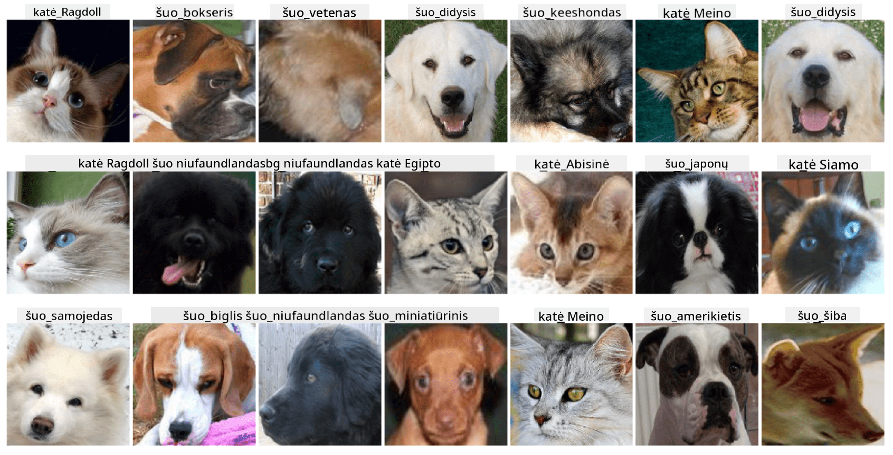

<!--
CO_OP_TRANSLATOR_METADATA:
{
  "original_hash": "f3d2cee9cb3c52160419e560c57a690e",
  "translation_date": "2025-08-31T17:36:45+00:00",
  "source_file": "lessons/4-ComputerVision/07-ConvNets/lab/README.md",
  "language_code": "lt"
}
-->
# Naminių Gyvūnų Veidų Klasifikacija

Laboratorinis darbas iš [AI for Beginners Curriculum](https://github.com/microsoft/ai-for-beginners).

## Užduotis

Įsivaizduokite, kad jums reikia sukurti programą gyvūnų darželiui, kuri kataloguotų visus gyvūnus. Viena iš puikių tokios programos funkcijų būtų automatiškai nustatyti veislę iš nuotraukos. Tai galima sėkmingai atlikti naudojant neuroninius tinklus.

Jums reikia išmokyti konvoliucinį neuroninį tinklą klasifikuoti skirtingas kačių ir šunų veisles naudojant **Pet Faces** duomenų rinkinį.

## Duomenų rinkinys

Naudosime **Pet Faces** duomenų rinkinį, kuris yra sukurtas remiantis [Oxford-IIIT](https://www.robots.ox.ac.uk/~vgg/data/pets/) gyvūnų duomenų rinkiniu. Jame yra 35 skirtingos šunų ir kačių veislės.



Norėdami atsisiųsti duomenų rinkinį, naudokite šį kodo fragmentą:

```python
!wget https://mslearntensorflowlp.blob.core.windows.net/data/petfaces.tar.gz
!tar xfz petfaces.tar.gz
!rm petfaces.tar.gz
```

## Pradinis Užrašų Knygelės Failas

Pradėkite laboratorinį darbą atidarę [PetFaces.ipynb](PetFaces.ipynb)

## Išvada

Jūs išsprendėte gana sudėtingą vaizdų klasifikavimo problemą nuo nulio! Buvo nemažai klasių, tačiau jums vis tiek pavyko pasiekti pagrįstą tikslumą! Taip pat verta išmatuoti top-k tikslumą, nes kai kurias klases lengva supainioti, ypač tas, kurios net žmonėms nėra aiškiai skirtingos.

---

**Atsakomybės apribojimas**:  
Šis dokumentas buvo išverstas naudojant AI vertimo paslaugą [Co-op Translator](https://github.com/Azure/co-op-translator). Nors siekiame tikslumo, prašome atkreipti dėmesį, kad automatiniai vertimai gali turėti klaidų ar netikslumų. Originalus dokumentas jo gimtąja kalba turėtų būti laikomas autoritetingu šaltiniu. Kritinei informacijai rekomenduojama naudoti profesionalų žmogaus vertimą. Mes neprisiimame atsakomybės už nesusipratimus ar klaidingus interpretavimus, atsiradusius dėl šio vertimo naudojimo.