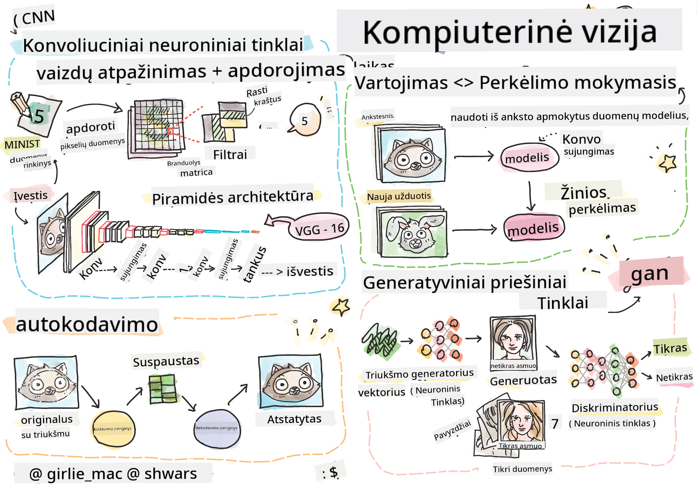

<!--
CO_OP_TRANSLATOR_METADATA:
{
  "original_hash": "58a52f000089c1d8906a4daa4ab1169b",
  "translation_date": "2025-08-31T17:35:32+00:00",
  "source_file": "lessons/4-ComputerVision/README.md",
  "language_code": "lt"
}
-->
# Kompiuterinis matymas

Šiame skyriuje sužinosime apie:

* [Įvadas į kompiuterinį matymą ir OpenCV](06-IntroCV/README.md)
* [Konvoliuciniai neuroniniai tinklai](07-ConvNets/README.md)
* [Iš anksto apmokyti tinklai ir perkėlimo mokymasis](08-TransferLearning/README.md) 
* [Autoenkoderiai](09-Autoencoders/README.md)
* [Generatyviniai priešiniai tinklai](10-GANs/README.md)
* [Objektų atpažinimas](11-ObjectDetection/README.md)
* [Semantinis segmentavimas](12-Segmentation/README.md)

---

**Atsakomybės apribojimas**:  
Šis dokumentas buvo išverstas naudojant AI vertimo paslaugą [Co-op Translator](https://github.com/Azure/co-op-translator). Nors siekiame tikslumo, prašome atkreipti dėmesį, kad automatiniai vertimai gali turėti klaidų ar netikslumų. Originalus dokumentas jo gimtąja kalba turėtų būti laikomas autoritetingu šaltiniu. Kritinei informacijai rekomenduojama naudoti profesionalų žmogaus vertimą. Mes neprisiimame atsakomybės už nesusipratimus ar klaidingus aiškinimus, atsiradusius dėl šio vertimo naudojimo.