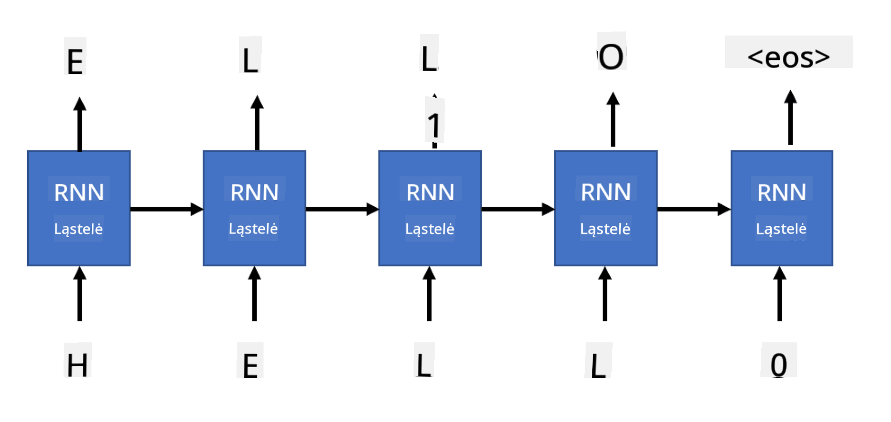

<!--
CO_OP_TRANSLATOR_METADATA:
{
  "original_hash": "d9de7847385eeeda67cfdcce1640ab72",
  "translation_date": "2025-08-31T17:55:40+00:00",
  "source_file": "lessons/5-NLP/17-GenerativeNetworks/README.md",
  "language_code": "lt"
}
-->
# Generatyviniai tinklai

## [Klausimynas prieš paskaitą](https://ff-quizzes.netlify.app/en/ai/quiz/33)

Pasikartojančių neuroninių tinklų (RNN) ir jų vartų ląstelių variantai, tokie kaip ilgos trumpos atminties ląstelės (LSTM) ir vartų pasikartojančios vienetai (GRU), suteikė mechanizmą kalbos modeliavimui, nes jie gali išmokti žodžių tvarką ir pateikti prognozes apie kitą žodį sekoje. Tai leidžia mums naudoti RNN **generatyvinėms užduotims**, tokioms kaip paprastas teksto generavimas, mašininis vertimas ir net vaizdų aprašymas.

> ✅ Pagalvokite apie visas situacijas, kai pasinaudojote generatyvinėmis užduotimis, pavyzdžiui, teksto užbaigimu rašant. Atlikite tyrimą apie savo mėgstamas programas ir sužinokite, ar jos naudojo RNN.

RNN architektūroje, kurią aptarėme ankstesniame skyriuje, kiekvienas RNN vienetas generavo kitą paslėptą būseną kaip išvestį. Tačiau mes taip pat galime pridėti kitą išvestį prie kiekvieno pasikartojančio vieneto, kuris leistų generuoti **seką** (lygią pradinės sekos ilgiui). Be to, galime naudoti RNN vienetus, kurie kiekviename žingsnyje nepriima įvesties, o tiesiog naudoja pradinį būsenos vektorių ir generuoja išvesties seką.

Tai leidžia sukurti skirtingas neuronines architektūras, kurios parodytos paveikslėlyje žemiau:


> Paveikslėlis iš tinklaraščio įrašo [Unreasonable Effectiveness of Recurrent Neural Networks](http://karpathy.github.io/2015/05/21/rnn-effectiveness/) autoriaus [Andrej Karpaty](http://karpathy.github.io/)

* **Vienas į vieną** yra tradicinis neuroninis tinklas su viena įvestimi ir viena išvestimi
* **Vienas į daug** yra generatyvinė architektūra, kuri priima vieną įvesties reikšmę ir generuoja išvesties reikšmių seką. Pavyzdžiui, jei norime apmokyti **vaizdų aprašymo** tinklą, kuris generuotų tekstinį paveikslėlio aprašymą, galime naudoti paveikslėlį kaip įvestį, perduoti jį per CNN, kad gautume paslėptą būseną, o tada pasikartojanti grandinė generuotų aprašymą žodis po žodžio.
* **Daug į vieną** atitinka RNN architektūras, kurias aprašėme ankstesniame skyriuje, pavyzdžiui, teksto klasifikavimą.
* **Daug į daug**, arba **seka į seką**, atitinka užduotis, tokias kaip **mašininis vertimas**, kur pirmasis RNN surenka visą informaciją iš įvesties sekos į paslėptą būseną, o kita RNN grandinė išskleidžia šią būseną į išvesties seką.

Šiame skyriuje mes sutelksime dėmesį į paprastus generatyvinius modelius, kurie padeda generuoti tekstą. Paprastumo dėlei naudosime simbolių lygio tokenizaciją.

Mes apmokysime šį RNN generuoti tekstą žingsnis po žingsnio. Kiekviename žingsnyje imsime simbolių seką, kurios ilgis yra `nchars`, ir paprašysime tinklo generuoti kitą išvesties simbolį kiekvienam įvesties simboliui:



Generuojant tekstą (inferencijos metu), pradedame nuo tam tikro **pradžios taško**, kuris perduodamas per RNN ląsteles, kad generuotų tarpinę būseną, o tada iš šios būsenos prasideda generavimas. Generuojame po vieną simbolį, perduodame būseną ir sugeneruotą simbolį kitai RNN ląstelei, kad sugeneruotume kitą simbolį, kol sugeneruojame pakankamai simbolių.


> Paveikslėlis autoriaus

## ✍️ Pratimai: Generatyviniai tinklai

Tęskite mokymąsi šiuose užrašuose:

* [Generatyviniai tinklai su PyTorch](GenerativePyTorch.ipynb)
* [Generatyviniai tinklai su TensorFlow](GenerativeTF.ipynb)

## Minkštas teksto generavimas ir temperatūra

Kiekvienos RNN ląstelės išvestis yra simbolių tikimybių pasiskirstymas. Jei visada pasirinksime simbolį su didžiausia tikimybe kaip kitą simbolį generuojamame tekste, tekstas dažnai gali "užstrigti" tarp tų pačių simbolių sekų, kaip šiame pavyzdyje:

```
today of the second the company and a second the company ...
```

Tačiau, jei pažvelgsime į tikimybių pasiskirstymą kitam simboliui, gali būti, kad kelių didžiausių tikimybių skirtumas nėra didelis, pvz., vienas simbolis gali turėti tikimybę 0.2, o kitas - 0.19 ir t.t. Pavyzdžiui, ieškant kito simbolio sekoje '*play*', kitas simbolis gali būti tiek tarpas, tiek **e** (kaip žodyje *player*).

Tai veda prie išvados, kad ne visada "teisinga" pasirinkti simbolį su didžiausia tikimybe, nes pasirinkus antrą pagal dydį vis tiek galime gauti prasmingą tekstą. Protingiau yra **imti mėginius** iš tikimybių pasiskirstymo, kurį pateikia tinklo išvestis. Taip pat galime naudoti parametrą **temperatūra**, kuris išlygins tikimybių pasiskirstymą, jei norime pridėti daugiau atsitiktinumo, arba padaryti jį statesnį, jei norime labiau laikytis didžiausios tikimybės simbolių.

Išbandykite, kaip šis minkštas teksto generavimas įgyvendinamas užrašuose, pateiktuose aukščiau.

## Išvada

Nors teksto generavimas gali būti naudingas pats savaime, pagrindiniai privalumai atsiranda iš galimybės generuoti tekstą naudojant RNN iš tam tikro pradinio požymių vektoriaus. Pavyzdžiui, teksto generavimas naudojamas kaip mašininio vertimo dalis (seka į seką, šiuo atveju būsenos vektorius iš *koduotojo* naudojamas generuoti arba *dekoduoti* išverstą pranešimą), arba generuojant tekstinį vaizdo aprašymą (šiuo atveju požymių vektorius būtų gaunamas iš CNN ekstraktoriaus).

## 🚀 Iššūkis

Pasimokykite apie šią temą Microsoft Learn platformoje:

* Teksto generavimas su [PyTorch](https://docs.microsoft.com/learn/modules/intro-natural-language-processing-pytorch/6-generative-networks/?WT.mc_id=academic-77998-cacaste)/[TensorFlow](https://docs.microsoft.com/learn/modules/intro-natural-language-processing-tensorflow/5-generative-networks/?WT.mc_id=academic-77998-cacaste)

## [Klausimynas po paskaitos](https://ff-quizzes.netlify.app/en/ai/quiz/34)

## Apžvalga ir savarankiškas mokymasis

Štai keletas straipsnių, kurie padės praplėsti žinias:

* Skirtingi teksto generavimo metodai naudojant Markovo grandinę, LSTM ir GPT-2: [tinklaraščio įrašas](https://towardsdatascience.com/text-generation-gpt-2-lstm-markov-chain-9ea371820e1e)
* Teksto generavimo pavyzdys [Keras dokumentacijoje](https://keras.io/examples/generative/lstm_character_level_text_generation/)

## [Užduotis](lab/README.md)

Mes matėme, kaip generuoti tekstą simbolis po simbolio. Laboratorijoje tyrinėsite teksto generavimą žodžių lygiu.

---

**Atsakomybės apribojimas**:  
Šis dokumentas buvo išverstas naudojant AI vertimo paslaugą [Co-op Translator](https://github.com/Azure/co-op-translator). Nors siekiame tikslumo, prašome atkreipti dėmesį, kad automatiniai vertimai gali turėti klaidų ar netikslumų. Originalus dokumentas jo gimtąja kalba turėtų būti laikomas autoritetingu šaltiniu. Kritinei informacijai rekomenduojama naudoti profesionalų žmogaus vertimą. Mes neprisiimame atsakomybės už nesusipratimus ar klaidingus interpretavimus, atsiradusius dėl šio vertimo naudojimo.