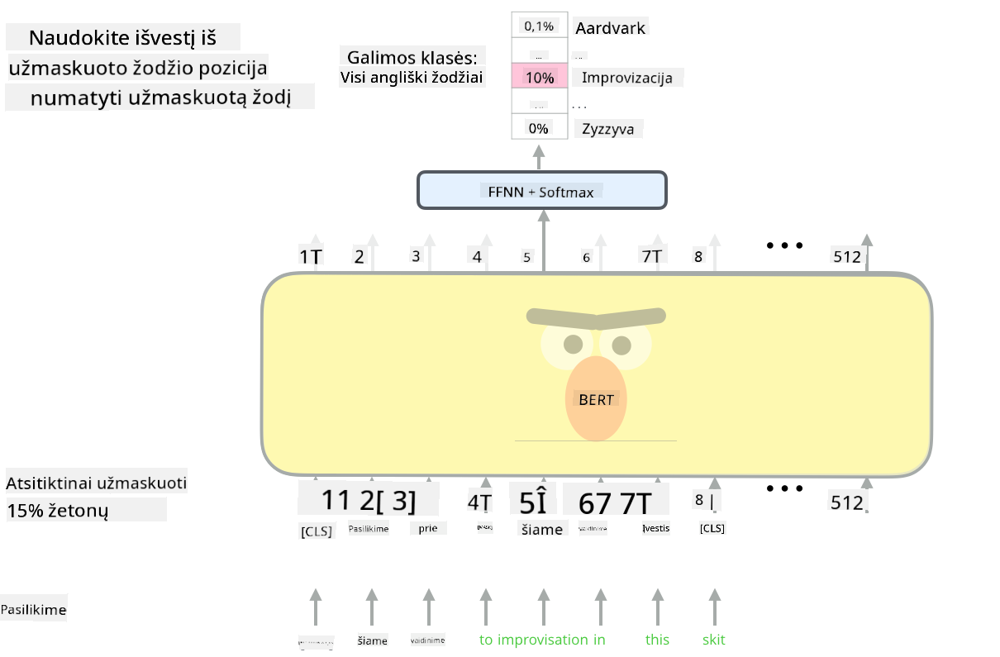

<!--
CO_OP_TRANSLATOR_METADATA:
{
  "original_hash": "f335dfcb4a993920504c387973a36957",
  "translation_date": "2025-09-23T15:49:11+00:00",
  "source_file": "lessons/5-NLP/18-Transformers/README.md",
  "language_code": "lt"
}
-->
# Dėmesio mechanizmai ir transformatoriai

## [Prieš paskaitą testas](https://ff-quizzes.netlify.app/en/ai/quiz/35)

Viena svarbiausių problemų NLP srityje yra **mašininis vertimas**, esminė užduotis, kuri yra tokių įrankių kaip Google Translate pagrindas. Šioje dalyje mes sutelksime dėmesį į mašininį vertimą arba, plačiau kalbant, į bet kokią *sekos į seką* užduotį (dar vadinamą **sakinių transformacija**).

Naudojant RNN, sekos į seką užduotis įgyvendinama naudojant du rekursinius tinklus, kur vienas tinklas, **koduotojas**, suspaudžia įvesties seką į paslėptą būseną, o kitas tinklas, **dekoduotojas**, išskleidžia šią paslėptą būseną į išverstą rezultatą. Šis metodas turi keletą problemų:

* Galutinė koduotojo tinklo būsena sunkiai prisimena sakinio pradžią, todėl modelio kokybė ilgiems sakiniams yra prasta.
* Visi žodžiai sekoje turi vienodą poveikį rezultatui. Tačiau realybėje tam tikri žodžiai įvesties sekoje dažnai turi didesnį poveikį išvesties rezultatams nei kiti.

**Dėmesio mechanizmai** suteikia galimybę įvertinti kiekvieno įvesties vektoriaus kontekstinį poveikį kiekvienai RNN išvesties prognozei. Tai įgyvendinama sukuriant trumpesnius ryšius tarp įvesties RNN tarpinių būsenų ir išvesties RNN. Tokiu būdu, generuojant išvesties simbolį yt, atsižvelgiama į visas įvesties paslėptas būsenas hi, su skirtingais svorio koeficientais &alpha;t,i.

> Koduotojo-dekoduotojo modelis su papildomu dėmesio mechanizmu [Bahdanau et al., 2015](https://arxiv.org/pdf/1409.0473.pdf), cituota iš [šio tinklaraščio įrašo](https://lilianweng.github.io/lil-log/2018/06/24/attention-attention.html)

Dėmesio matrica {&alpha;i,j} atspindėtų, kokiu mastu tam tikri įvesties žodžiai dalyvauja generuojant tam tikrą žodį išvesties sekoje. Žemiau pateiktas tokios matricos pavyzdys:

> Paveikslas iš [Bahdanau et al., 2015](https://arxiv.org/pdf/1409.0473.pdf) (Fig.3)

Dėmesio mechanizmai yra atsakingi už daugelį dabartinių ar beveik dabartinių NLP pasiekimų. Tačiau dėmesio pridėjimas žymiai padidina modelio parametrų skaičių, o tai sukėlė mastelio problemas su RNN. Vienas pagrindinių RNN mastelio apribojimų yra tai, kad modelių rekursinis pobūdis apsunkina mokymo partijų sudarymą ir paralelizavimą. RNN kiekvienas sekos elementas turi būti apdorojamas nuosekliai, todėl jo negalima lengvai paralelizuoti.

> Paveikslas iš [Google tinklaraščio](https://research.googleblog.com/2016/09/a-neural-network-for-machine.html)

Dėmesio mechanizmų pritaikymas kartu su šiuo apribojimu paskatino sukurti dabartinius pažangiausius transformatorių modelius, tokius kaip BERT ir Open-GPT3.

## Transformatorių modeliai

Viena pagrindinių transformatorių idėjų yra išvengti RNN nuoseklumo ir sukurti modelį, kuris būtų paralelizuojamas mokymo metu. Tai pasiekiama įgyvendinant dvi idėjas:

* pozicinį kodavimą
* savidėmesio mechanizmo naudojimą modeliams kurti vietoj RNN (arba CNN) (todėl straipsnis, pristatantis transformatorius, vadinasi *[Attention is all you need](https://arxiv.org/abs/1706.03762)*)

### Pozicinis kodavimas/įterpimas

Pozicinio kodavimo idėja yra tokia:  
1. Naudojant RNN, santykinė žetonų pozicija yra atspindėta žingsnių skaičiumi, todėl jos nereikia aiškiai reprezentuoti.  
2. Tačiau perėjus prie dėmesio, reikia žinoti santykines žetonų pozicijas sekoje.  
3. Norint gauti pozicinį kodavimą, mūsų žetonų seką papildome žetonų pozicijų seka (pvz., skaičių seka 0,1, ...).  
4. Tada sumaišome žetono poziciją su žetono įterpimo vektoriumi. Norėdami transformuoti poziciją (sveikąjį skaičių) į vektorių, galime naudoti skirtingus metodus:

* Mokomasis įterpimas, panašus į žetono įterpimą. Tai metodas, kurį čia apsvarstysime. Mes taikome įterpimo sluoksnius tiek žetonams, tiek jų pozicijoms, gaudami vienodo dydžio įterpimo vektorius, kuriuos vėliau sudedame.
* Fiksuota pozicijos kodavimo funkcija, kaip siūloma originaliame straipsnyje.

> Vaizdas autoriaus

Rezultatas, kurį gauname su poziciniu įterpimu, įterpia tiek originalų žetoną, tiek jo poziciją sekoje.

### Daugiafunkcinis savidėmesys

Toliau mums reikia užfiksuoti tam tikrus modelius mūsų sekoje. Tam transformatoriai naudoja **savidėmesio** mechanizmą, kuris iš esmės yra dėmesys, taikomas tai pačiai sekai kaip įvestis ir išvestis. Taikant savidėmesį, galime atsižvelgti į **kontekstą** sakinyje ir pamatyti, kurie žodžiai yra tarpusavyje susiję. Pavyzdžiui, tai leidžia pamatyti, į ką nurodo koreferencijos, tokios kaip *tai*, ir taip pat atsižvelgti į kontekstą:

> Vaizdas iš [Google tinklaraščio](https://research.googleblog.com/2017/08/transformer-novel-neural-network.html)

Transformatoriuose naudojame **daugiafunkcinį dėmesį**, kad tinklas galėtų užfiksuoti kelis skirtingus priklausomybių tipus, pvz., ilgalaikius ir trumpalaikius žodžių ryšius, koreferencijas ir kitus.

[TensorFlow užrašų knygelė](TransformersTF.ipynb) pateikia daugiau detalių apie transformatorių sluoksnių įgyvendinimą.

### Koduotojo-dekoduotojo dėmesys

Transformatoriuose dėmesys naudojamas dviejose vietose:

* Norint užfiksuoti modelius įvesties tekste naudojant savidėmesį
* Norint atlikti sekos vertimą - tai yra dėmesio sluoksnis tarp koduotojo ir dekoduotojo.

Koduotojo-dekoduotojo dėmesys yra labai panašus į dėmesio mechanizmą, naudojamą RNN, kaip aprašyta šios dalies pradžioje. Ši animuota diagrama paaiškina koduotojo-dekoduotojo dėmesio vaidmenį.

Kadangi kiekviena įvesties pozicija yra nepriklausomai susieta su kiekviena išvesties pozicija, transformatoriai gali geriau paralelizuoti nei RNN, o tai leidžia kurti daug didesnius ir išraiškingesnius kalbos modelius. Kiekvienas dėmesio galvutė gali būti naudojama mokytis skirtingų žodžių santykių, kurie pagerina NLP užduotis.

## BERT

**BERT** (Bidirectional Encoder Representations from Transformers) yra labai didelis daugiasluoksnis transformatorių tinklas su 12 sluoksnių *BERT-base* ir 24 sluoksniais *BERT-large*. Modelis pirmiausia iš anksto apmokomas naudojant didelį tekstų korpusą (WikiPedia + knygos) taikant nesupervizuotą mokymą (prognozuojant užmaskuotus žodžius sakinyje). Per išankstinį mokymą modelis įgyja reikšmingą kalbos supratimą, kurį vėliau galima panaudoti su kitais duomenų rinkiniais taikant smulkų derinimą. Šis procesas vadinamas **perkėlimo mokymu**.

> Vaizdo [šaltinis](http://jalammar.github.io/illustrated-bert/)

## ✍️ Pratimai: Transformatoriai

Tęskite mokymąsi šiose užrašų knygelėse:

* [Transformatoriai PyTorch](TransformersPyTorch.ipynb)
* [Transformatoriai TensorFlow](TransformersTF.ipynb)

## Išvada

Šioje pamokoje sužinojote apie transformatorius ir dėmesio mechanizmus, kurie yra esminiai NLP įrankių rinkinio elementai. Yra daugybė transformatorių architektūrų variantų, įskaitant BERT, DistilBERT, BigBird, OpenGPT3 ir daugiau, kuriuos galima smulkiai derinti. [HuggingFace paketas](https://github.com/huggingface/) suteikia galimybę mokyti daugelį šių architektūrų naudojant tiek PyTorch, tiek TensorFlow.

## 🚀 Iššūkis

## [Po paskaitos testas](https://ff-quizzes.netlify.app/en/ai/quiz/36)

## Apžvalga ir savarankiškas mokymasis

* [Tinklaraščio įrašas](https://mchromiak.github.io/articles/2017/Sep/12/Transformer-Attention-is-all-you-need/), paaiškinantis klasikinį [Attention is all you need](https://arxiv.org/abs/1706.03762) straipsnį apie transformatorius.
* [Tinklaraščių serija](https://towardsdatascience.com/transformers-explained-visually-part-1-overview-of-functionality-95a6dd460452) apie transformatorius, išsamiai paaiškinanti architektūrą.

## [Užduotis](assignment.md)

---

