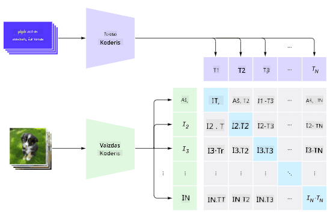

<!--
CO_OP_TRANSLATOR_METADATA:
{
  "original_hash": "9c592c26aca16ca085d268c732284187",
  "translation_date": "2025-08-31T17:35:04+00:00",
  "source_file": "lessons/X-Extras/X1-MultiModal/README.md",
  "language_code": "lt"
}
-->
# Daugiarūšiai tinklai

Po transformatorių modelių sėkmės sprendžiant NLP užduotis, tos pačios arba panašios architektūros buvo pritaikytos kompiuterinio matymo užduotims. Vis labiau domimasi modelių kūrimu, kurie galėtų *sujungti* matymo ir natūralios kalbos galimybes. Vienas iš tokių bandymų buvo atliktas OpenAI, ir jis vadinamas CLIP ir DALL.E.

## Kontrastinis vaizdų išankstinis mokymas (CLIP)

Pagrindinė CLIP idėja yra gebėjimas palyginti tekstinius užklausimus su vaizdu ir nustatyti, kaip gerai vaizdas atitinka užklausimą.

> *Paveikslėlis iš [šio tinklaraščio įrašo](https://openai.com/blog/clip/)*

Modelis mokomas naudojant vaizdus, gautus iš interneto, ir jų antraštes. Kiekviename pakete imame N porų (vaizdas, tekstas) ir paverčiame juos į tam tikras vektorių reprezentacijas I, ..., I / T, ..., T. Šios reprezentacijos yra suderinamos tarpusavyje. Nuostolių funkcija apibrėžiama taip, kad maksimaliai padidintų kosinuso panašumą tarp vektorių, atitinkančių vieną porą (pvz., I ir T), ir sumažintų kosinuso panašumą tarp visų kitų porų. Dėl šios priežasties šis metodas vadinamas **kontrastiniu**.

CLIP modelis/biblioteka pasiekiama iš [OpenAI GitHub](https://github.com/openai/CLIP). Metodas aprašytas [šiame tinklaraščio įraše](https://openai.com/blog/clip/) ir išsamiau [šiame straipsnyje](https://arxiv.org/pdf/2103.00020.pdf).

Kai modelis yra iš anksto apmokytas, galime jam pateikti vaizdų paketą ir tekstinių užklausų paketą, o jis grąžins tensorą su tikimybėmis. CLIP gali būti naudojamas kelioms užduotims:

**Vaizdų klasifikavimas**

Tarkime, mums reikia klasifikuoti vaizdus, pavyzdžiui, į kategorijas: katės, šunys ir žmonės. Tokiu atveju galime modeliui pateikti vaizdą ir seriją tekstinių užklausų: "*katės paveikslas*", "*šuns paveikslas*", "*žmogaus paveikslas*". Gautame 3 tikimybių vektoriuje tiesiog reikia pasirinkti indeksą su didžiausia reikšme.

> *Paveikslėlis iš [šio tinklaraščio įrašo](https://openai.com/blog/clip/)*

**Vaizdų paieška pagal tekstą**

Galime atlikti ir priešingą veiksmą. Jei turime vaizdų kolekciją, galime ją perduoti modeliui kartu su tekstine užklausa – tai suteiks mums vaizdą, kuris labiausiai atitinka pateiktą užklausą.

## ✍️ Pavyzdys: [CLIP naudojimas vaizdų klasifikavimui ir paieškai](Clip.ipynb)

Atidarykite [Clip.ipynb](Clip.ipynb) užrašų knygelę, kad pamatytumėte CLIP veikimą.

## Vaizdų generavimas su VQGAN+CLIP

CLIP taip pat gali būti naudojamas **vaizdų generavimui** iš tekstinės užklausos. Tam reikia **generuojančio modelio**, kuris galėtų generuoti vaizdus pagal tam tikrą vektorinį įvestį. Vienas iš tokių modelių vadinamas [VQGAN](https://compvis.github.io/taming-transformers/) (Vector-Quantized GAN).

Pagrindinės VQGAN idėjos, kurios skiriasi nuo įprasto [GAN](../../4-ComputerVision/10-GANs/README.md), yra šios:
* Naudojama autoregresinė transformatoriaus architektūra, kuri generuoja kontekstualiai turtingų vizualinių dalių seką, sudarančią vaizdą. Šios vizualinės dalys mokomos naudojant [CNN](../../4-ComputerVision/07-ConvNets/README.md).
* Naudojamas sub-vaizdo diskriminatorius, kuris nustato, ar vaizdo dalys yra "tikros" ar "netikros" (skirtingai nuo "viskas arba nieko" požiūrio tradiciniame GAN).

Daugiau apie VQGAN sužinokite [Taming Transformers](https://compvis.github.io/taming-transformers/) svetainėje.

Vienas svarbus skirtumas tarp VQGAN ir tradicinio GAN yra tas, kad pastarasis gali sukurti padorų vaizdą iš bet kokio įvesties vektoriaus, o VQGAN greičiausiai sukurs vaizdą, kuris nebus nuoseklus. Todėl reikia papildomai vadovauti vaizdo kūrimo procesui, ir tai galima padaryti naudojant CLIP.

Norint sugeneruoti vaizdą, atitinkantį tekstinę užklausą, pradedame nuo atsitiktinio kodavimo vektoriaus, kuris perduodamas per VQGAN, kad būtų sukurtas vaizdas. Tada CLIP naudojamas nuostolių funkcijai sukurti, kuri parodo, kaip gerai vaizdas atitinka tekstinę užklausą. Tikslas yra sumažinti šiuos nuostolius, naudojant atgalinį sklidimą, kad būtų koreguojami įvesties vektoriaus parametrai.

Puiki biblioteka, įgyvendinanti VQGAN+CLIP, yra [Pixray](http://github.com/pixray/pixray).

 |   | 
----|----|----
Vaizdas sukurtas pagal užklausą *artimas akvarelės portretas jauno literatūros mokytojo su knyga* | Vaizdas sukurtas pagal užklausą *artimas aliejinis portretas jaunos kompiuterių mokslų mokytojos su kompiuteriu* | Vaizdas sukurtas pagal užklausą *artimas aliejinis portretas seno matematikos mokytojo priešais lentą*

> Vaizdai iš **Dirbtinių mokytojų** kolekcijos, sukurtos [Dmitry Soshnikov](http://soshnikov.com)

## DALL-E
### [DALL-E 1](https://openai.com/research/dall-e)
DALL-E yra GPT-3 versija, apmokyta generuoti vaizdus iš užklausų. Jis buvo apmokytas naudojant 12 milijardų parametrų.

Skirtingai nei CLIP, DALL-E gauna tiek tekstą, tiek vaizdą kaip vieną žetonų srautą tiek vaizdams, tiek tekstui. Todėl iš kelių užklausų galite generuoti vaizdus pagal tekstą.

### [DALL-E 2](https://openai.com/dall-e-2)
Pagrindinis skirtumas tarp DALL-E 1 ir 2 yra tas, kad pastarasis generuoja realistiškesnius vaizdus ir meną.

DALL-E vaizdų generavimo pavyzdžiai:
 |   | 
----|----|----
Vaizdas sukurtas pagal užklausą *artimas akvarelės portretas jauno literatūros mokytojo su knyga* | Vaizdas sukurtas pagal užklausą *artimas aliejinis portretas jaunos kompiuterių mokslų mokytojos su kompiuteriu* | Vaizdas sukurtas pagal užklausą *artimas aliejinis portretas seno matematikos mokytojo priešais lentą*

## Nuorodos

* VQGAN straipsnis: [Taming Transformers for High-Resolution Image Synthesis](https://compvis.github.io/taming-transformers/paper/paper.pdf)
* CLIP straipsnis: [Learning Transferable Visual Models From Natural Language Supervision](https://arxiv.org/pdf/2103.00020.pdf)

---

**Atsakomybės apribojimas**:  
Šis dokumentas buvo išverstas naudojant AI vertimo paslaugą [Co-op Translator](https://github.com/Azure/co-op-translator). Nors siekiame tikslumo, prašome atkreipti dėmesį, kad automatiniai vertimai gali turėti klaidų ar netikslumų. Originalus dokumentas jo gimtąja kalba turėtų būti laikomas autoritetingu šaltiniu. Kritinei informacijai rekomenduojama naudoti profesionalų žmogaus vertimą. Mes neprisiimame atsakomybės už nesusipratimus ar klaidingus aiškinimus, kylančius dėl šio vertimo naudojimo.