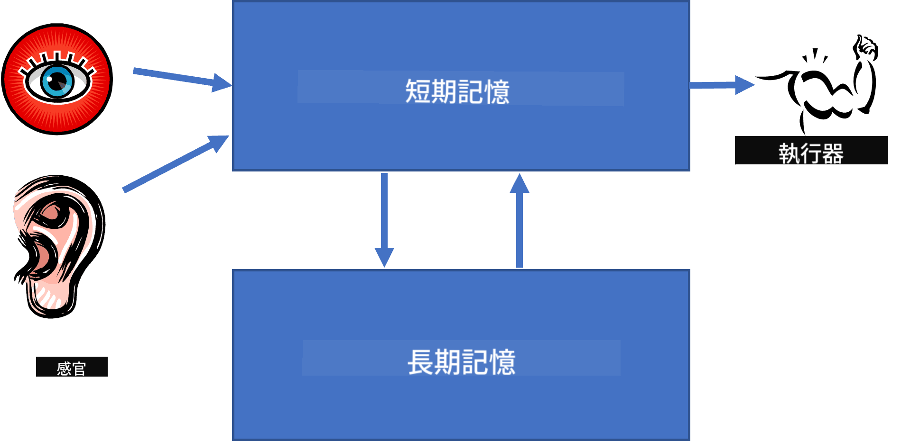

<!--
CO_OP_TRANSLATOR_METADATA:
{
  "original_hash": "98c5222ff9556b55223fed2337145e18",
  "translation_date": "2025-08-26T10:56:31+00:00",
  "source_file": "lessons/2-Symbolic/README.md",
  "language_code": "mo"
}
-->
# 知識表示與專家系統


> 由 [Tomomi Imura](https://twitter.com/girlie_mac) 繪製的手繪筆記

人工智慧的追求基於對知識的探索，試圖像人類一樣理解世界。但該如何實現這一目標呢？

## [課前測驗](https://red-field-0a6ddfd03.1.azurestaticapps.net/quiz/102)

在人工智慧的早期，創建智能系統的自上而下方法（在上一課中討論過）非常流行。這種方法的核心思想是將人類的知識提取為機器可讀的形式，然後用它來自動解決問題。這種方法基於兩個重要的概念：

* 知識表示
* 推理

## 知識表示

符號 AI 的一個重要概念是**知識**。需要將知識與*信息*或*數據*區分開。例如，人們常說書籍包含知識，因為通過學習書籍可以成為專家。然而，書籍實際上包含的是*數據*，通過閱讀書籍並將這些數據整合到我們的世界模型中，我們將數據轉化為知識。

> ✅ **知識**是我們頭腦中包含的內容，代表我們對世界的理解。它是通過主動的**學習**過程獲得的，這個過程將我們接收到的信息片段整合到我們的世界模型中。

通常，我們不會嚴格定義知識，而是通過 [DIKW 金字塔](https://en.wikipedia.org/wiki/DIKW_pyramid) 與其他相關概念對齊。該金字塔包含以下概念：

* **數據**是以物理媒介表示的內容，例如書面文本或口頭語言。數據獨立於人類存在，可以在人與人之間傳遞。
* **信息**是我們在頭腦中對數據的解釋。例如，當我們聽到“電腦”這個詞時，我們對它有一定的理解。
* **知識**是信息被整合到我們的世界模型中。例如，一旦我們了解了什麼是電腦，我們就會對它的工作原理、價格以及用途有一些想法。這些相互關聯的概念網絡構成了我們的知識。
* **智慧**是我們對世界理解的更高層次，代表著*元知識*，例如關於如何以及何時使用知識的某種概念。

*圖片來源：[維基百科](https://commons.wikimedia.org/w/index.php?curid=37705247)，作者 Longlivetheux - 自製，CC BY-SA 4.0*

因此，**知識表示**的問題在於找到某種有效的方法，將知識以數據的形式表示在計算機中，使其能夠自動使用。這可以被視為一個光譜：


> 圖片由 [Dmitry Soshnikov](http://soshnikov.com) 提供

* 在左側，有非常簡單的知識表示類型，計算機可以有效地使用。最簡單的是算法式，當知識以計算機程序的形式表示時。然而，這並不是表示知識的最佳方式，因為它缺乏靈活性。我們頭腦中的知識通常不是算法式的。
* 在右側，有像自然文本這樣的表示形式。這是最強大的，但無法用於自動推理。

> ✅ 想一想你是如何在頭腦中表示知識並將其轉化為筆記的。是否有某種特定的格式能幫助你更好地記住？

## 計算機知識表示的分類

我們可以將不同的計算機知識表示方法分為以下幾類：

* **網絡表示**基於我們頭腦中有一個相互關聯的概念網絡。我們可以嘗試在計算機中以圖的形式再現這些網絡，這被稱為**語義網絡**。

1. **對象-屬性-值三元組**或**屬性-值對**。由於圖可以在計算機中表示為節點和邊的列表，我們可以用三元組列表來表示語義網絡，包含對象、屬性和值。例如，我們可以構建以下關於編程語言的三元組：

對象 | 屬性 | 值
-----|------|----
Python | 是 | 無類型語言
Python | 發明者 | Guido van Rossum
Python | 區塊語法 | 縮排
無類型語言 | 沒有 | 類型定義

> ✅ 想一想三元組如何用於表示其他類型的知識。

2. **層次結構表示**強調我們經常在頭腦中創建對象的層次結構。例如，我們知道金絲雀是一種鳥類，所有鳥類都有翅膀。我們還知道金絲雀通常是什麼顏色，以及它們的飛行速度。

   - **框架表示**基於將每個對象或對象類表示為一個**框架**，框架包含**槽**。槽可以有默認值、值限制或存儲的程序，這些程序可以被調用以獲取槽的值。所有框架形成一個類似於面向對象編程語言中的對象層次結構。
   - **場景**是一種特殊的框架，表示可以隨時間展開的複雜情境。

**Python**

槽 | 值 | 默認值 | 範圍
---|----|--------|----
名稱 | Python | | 
是 | 無類型語言 | | 
變量命名 | | 駝峰式命名 | 
程序長度 | | | 5-5000 行
區塊語法 | 縮排 | | 

3. **程序表示**基於通過一系列動作來表示知識，當某些條件發生時可以執行這些動作。
   - 產生式規則是 if-then 語句，允許我們得出結論。例如，醫生可以有一條規則說明：**如果**患者有高燒**或**血液檢測中 C 反應蛋白水平高，**那麼**他有炎症。一旦我們遇到其中一個條件，就可以得出關於炎症的結論，然後在進一步推理中使用它。
   - 算法可以被認為是另一種程序表示形式，儘管它們幾乎從未直接用於基於知識的系統。

4. **邏輯**最早由亞里士多德提出，作為表示普遍人類知識的一種方式。
   - 謂詞邏輯作為一種數學理論過於豐富而無法計算，因此通常使用它的一些子集，例如 Prolog 中使用的霍恩子句。
   - 描述邏輯是一系列邏輯系統，用於表示和推理對象層次結構以及分佈式知識表示，例如*語義網*。

## 專家系統

符號 AI 的早期成功之一是所謂的**專家系統**——設計用於在某些有限問題領域中充當專家的計算機系統。它們基於從一位或多位人類專家中提取的**知識庫**，並包含一個在其上執行推理的**推理引擎**。

 | 
----------------------------------|-----------------------------------------
人類神經系統的簡化結構         | 基於知識的系統架構

專家系統的構建類似於人類的推理系統，其中包含**短期記憶**和**長期記憶**。同樣，在基於知識的系統中，我們區分以下組件：

* **問題記憶**：包含當前正在解決的問題的知識，例如患者的體溫或血壓、是否有炎症等。這些知識也稱為**靜態知識**，因為它包含了我們目前對問題的了解——所謂的*問題狀態*。
* **知識庫**：表示關於問題領域的長期知識。它是從人類專家手動提取的，並且不會因諮詢而改變。由於它允許我們從一個問題狀態導航到另一個問題狀態，因此也稱為**動態知識**。
* **推理引擎**：協調整個搜索問題狀態空間的過程，必要時向用戶提問。它還負責為每個狀態找到應用的正確規則。

例如，讓我們考慮以下基於動物物理特徵的專家系統：


> 圖片由 [Dmitry Soshnikov](http://soshnikov.com) 提供

此圖稱為**AND-OR 樹**，它是產生式規則集的圖形表示。在從專家提取知識的初期，繪製樹是有用的。要在計算機內部表示知識，使用規則會更方便：

```
IF the animal eats meat
OR (animal has sharp teeth
    AND animal has claws
    AND animal has forward-looking eyes
) 
THEN the animal is a carnivore
```

你會注意到，規則左側的每個條件和動作本質上都是對象-屬性-值（OAV）三元組。**工作記憶**包含與當前正在解決的問題對應的一組 OAV 三元組。**規則引擎**尋找條件滿足的規則並應用它們，將另一個三元組添加到工作記憶中。

> ✅ 試著畫一個你感興趣主題的 AND-OR 樹！

### 前向推理與後向推理

上述過程稱為**前向推理**。它從工作記憶中可用的初始數據開始，然後執行以下推理循環：

1. 如果目標屬性已存在於工作記憶中——停止並給出結果
2. 查找所有條件當前滿足的規則——獲得**衝突集**規則
3. 執行**衝突解決**——選擇一條將在此步驟中執行的規則。可能的衝突解決策略包括：
   - 選擇知識庫中第一條適用的規則
   - 隨機選擇一條規則
   - 選擇*更具體的*規則，即左側條件（LHS）滿足最多的規則
4. 應用選定的規則並將新知識插入問題狀態
5. 從第 1 步重複。

然而，在某些情況下，我們可能希望從對問題的空白知識開始，並通過提問來幫助我們得出結論。例如，在進行醫學診斷時，我們通常不會在診斷患者之前提前進行所有醫學分析。我們更希望在需要做出決定時進行分析。

這一過程可以用**後向推理**建模。它由**目標**驅動——即我們希望找到的屬性值：

1. 選擇所有可以給出目標值的規則（即目標在右側（RHS））——形成衝突集
2. 如果該屬性沒有規則，或者有規則說明我們應該向用戶詢問該值——詢問用戶，否則：
3. 使用衝突解決策略選擇一條規則作為*假設*——我們將嘗試證明它
4. 對規則左側的所有屬性遞歸重複該過程，嘗試將它們作為目標證明
5. 如果過程在任何時候失敗——在第 3 步使用另一條規則。

> ✅ 在哪些情況下前向推理更合適？後向推理又適用於哪些情況？

### 實現專家系統

專家系統可以使用不同的工具實現：

* 直接用某種高級編程語言編寫程序。這不是最好的方法，因為基於知識的系統的主要優勢在於知識與推理的分離，理論上問題領域的專家應該能夠在不了解推理過程細節的情況下編寫規則。
* 使用**專家系統外殼**，即專門設計用於使用某種知識表示語言填充知識的系統。

## ✍️ 練習：動物推理

參見 [Animals.ipynb](https://github.com/microsoft/AI-For-Beginners/blob/main/lessons/2-Symbolic/Animals.ipynb)，了解實現前向和後向推理專家系統的示例。
> **注意**：這個範例相對簡單，只是用來說明專家系統的概念。一旦你開始建立這樣的系統，當規則數量達到一定程度（大約 200 條以上）時，你才會開始注意到一些*智能化*的行為。在某個階段，規則會變得過於複雜，難以全部記住，而在這個時候，你可能會開始疑惑為什麼系統會做出某些決策。然而，知識型系統的一個重要特徵是，你總是可以*解釋*清楚任何一個決策是如何做出的。
## 本體論與語義網

在 20 世紀末，有一項倡議試圖使用知識表示來標註互聯網資源，以便能夠找到符合非常特定查詢的資源。這項運動被稱為 **語義網**，它依賴於以下幾個概念：

- 基於 **[描述邏輯](https://en.wikipedia.org/wiki/Description_logic)** (DL) 的特殊知識表示。它類似於框架知識表示，因為它構建了一個具有屬性的對象層次結構，但它具有形式邏輯語義和推理能力。描述邏輯有一整個家族，它們在表達能力和推理的算法複雜性之間取得平衡。
- 分佈式知識表示，其中所有概念都由全局 URI 標識符表示，使得能夠創建跨越互聯網的知識層次結構。
- 一系列基於 XML 的知識描述語言：RDF（資源描述框架）、RDFS（RDF 架構）、OWL（本體網絡語言）。

語義網中的核心概念是 **本體論**。它指的是使用某種形式化知識表示對問題領域進行明確的規範。最簡單的本體論可以僅僅是問題領域中的對象層次結構，但更複雜的本體論將包括可用於推理的規則。

在語義網中，所有的表示都基於三元組。每個對象和每個關係都由 URI 唯一標識。例如，如果我們想陳述這個 AI 課程是由 Dmitry Soshnikov 在 2022 年 1 月 1 日開發的事實，我們可以使用以下三元組：


```
http://github.com/microsoft/ai-for-beginners http://www.example.com/terms/creation-date “Jan 13, 2007”
http://github.com/microsoft/ai-for-beginners http://purl.org/dc/elements/1.1/creator http://soshnikov.com
```

> ✅ 這裡的 `http://www.example.com/terms/creation-date` 和 `http://purl.org/dc/elements/1.1/creator` 是一些公認的、普遍接受的 URI，用於表達 *創建者* 和 *創建日期* 的概念。

在更複雜的情況下，如果我們想定義一個創建者列表，我們可以使用 RDF 中定義的一些數據結構。


> 上圖由 [Dmitry Soshnikov](http://soshnikov.com) 提供

語義網的發展因搜索引擎和自然語言處理技術的成功而有所放緩，這些技術能夠從文本中提取結構化數據。然而，在某些領域，仍然有重要的努力來維護本體論和知識庫。以下是一些值得注意的項目：

* [WikiData](https://wikidata.org/) 是與維基百科相關的機器可讀知識庫集合。大多數數據來自維基百科的 *信息框*，即維基百科頁面中的結構化內容片段。你可以使用 SPARQL（一種語義網的特殊查詢語言）[查詢](https://query.wikidata.org/) WikiData。以下是一個顯示人類中最常見眼睛顏色的示例查詢：

```sparql
#defaultView:BubbleChart
SELECT ?eyeColorLabel (COUNT(?human) AS ?count)
WHERE
{
  ?human wdt:P31 wd:Q5.       # human instance-of homo sapiens
  ?human wdt:P1340 ?eyeColor. # human eye-color ?eyeColor
  SERVICE wikibase:label { bd:serviceParam wikibase:language "en". }
}
GROUP BY ?eyeColorLabel
```

* [DBpedia](https://www.dbpedia.org/) 是另一個類似於 WikiData 的努力。

> ✅ 如果你想嘗試構建自己的本體論，或打開現有的本體論，有一個很棒的可視化本體論編輯器叫 [Protégé](https://protege.stanford.edu/)。你可以下載它，或者在線使用。


*Web Protégé 編輯器打開了 Romanov 家族的本體論。截圖由 Dmitry Soshnikov 提供*

## ✍️ 練習：家庭本體論

參見 [FamilyOntology.ipynb](https://github.com/Ezana135/AI-For-Beginners/blob/main/lessons/2-Symbolic/FamilyOntology.ipynb)，了解如何使用語義網技術推理家庭關係的示例。我們將採用以常見 GEDCOM 格式表示的家譜和家庭關係的本體論，並為給定的一組個體構建所有家庭關係的圖。

## 微軟概念圖譜

在大多數情況下，本體論是由人工精心創建的。然而，也可以從非結構化數據中 **挖掘** 本體論，例如來自自然語言文本。

微軟研究院曾進行過這樣的一次嘗試，並產生了 [Microsoft Concept Graph](https://blogs.microsoft.com/ai/microsoft-researchers-release-graph-that-helps-machines-conceptualize/?WT.mc_id=academic-77998-cacaste)。

這是一個使用 `is-a` 繼承關係將實體分組的大型集合。它可以回答像「什麼是微軟？」這樣的問題——答案可能是「一家公司，概率為 0.87；一個品牌，概率為 0.75」。

該圖譜可以通過 REST API 獲取，也可以作為一個大型可下載的文本文件，列出所有實體對。

## ✍️ 練習：概念圖譜

試試 [MSConceptGraph.ipynb](https://github.com/microsoft/AI-For-Beginners/blob/main/lessons/2-Symbolic/MSConceptGraph.ipynb) 筆記本，看看我們如何使用微軟概念圖譜將新聞文章分組到幾個類別中。

## 結論

如今，AI 通常被認為是 *機器學習* 或 *神經網絡* 的同義詞。然而，人類也表現出明確的推理能力，而這是目前神經網絡無法處理的。在現實世界的項目中，明確的推理仍然被用來執行需要解釋的任務，或者在受控方式下修改系統行為。

## 🚀 挑戰

在與本課程相關的家庭本體論筆記本中，有機會嘗試其他家庭關係。試著發現家譜中人與人之間的新聯繫。

## [課後測驗](https://red-field-0a6ddfd03.1.azurestaticapps.net/quiz/202)

## 回顧與自學

在互聯網上進行一些研究，了解人類試圖量化和編碼知識的領域。看看布魯姆的分類法，回顧歷史，了解人類如何試圖理解他們的世界。探索林奈斯創建生物分類法的工作，觀察德米特里·門捷列夫如何創建描述和分組化學元素的方法。你還能找到哪些有趣的例子？

**作業**: [構建一個本體論](assignment.md)

**免責聲明**：  
本文件使用 AI 翻譯服務 [Co-op Translator](https://github.com/Azure/co-op-translator) 進行翻譯。我們致力於提供準確的翻譯，但請注意，自動翻譯可能包含錯誤或不準確之處。應以原始語言的文件作為權威來源。對於關鍵資訊，建議尋求專業人工翻譯。我們對因使用此翻譯而引起的任何誤解或誤釋不承擔責任。