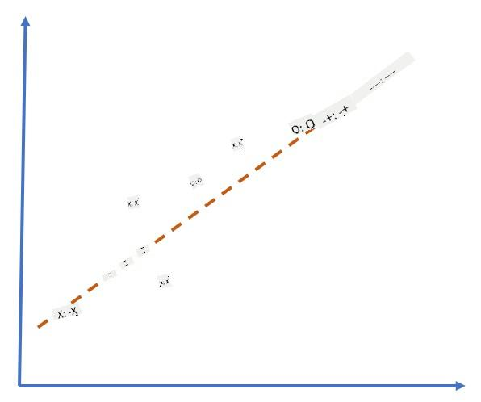

<!--
CO_OP_TRANSLATOR_METADATA:
{
  "original_hash": "2b544f20b796402507fb05a0df893323",
  "translation_date": "2025-08-26T10:31:11+00:00",
  "source_file": "lessons/3-NeuralNetworks/05-Frameworks/README.md",
  "language_code": "mo"
}
-->
# 神經網路框架

正如我們已經學到的，要有效地訓練神經網路，我們需要做到以下兩件事：

* 操作張量，例如進行乘法、加法，以及計算一些函數如 sigmoid 或 softmax
* 計算所有表達式的梯度，以便進行梯度下降優化

## [課前測驗](https://ff-quizzes.netlify.app/en/ai/quiz/9)

雖然 `numpy` 庫可以完成第一部分，但我們需要某種機制來計算梯度。在[我們的框架](../../../../../lessons/3-NeuralNetworks/04-OwnFramework/OwnFramework.ipynb)中，我們在上一節中開發的框架需要手動在 `backward` 方法中編程所有的導數函數，該方法負責反向傳播。理想情況下，一個框架應該能讓我們計算*任何表達式*的梯度。

另一個重要的事情是能夠在 GPU 或其他專用計算單元（例如 [TPU](https://en.wikipedia.org/wiki/Tensor_Processing_Unit)）上進行計算。深度神經網路的訓練需要*大量*的計算，能夠在 GPU 上並行化這些計算非常重要。

> ✅ 「並行化」的意思是將計算分配到多個設備上。

目前，最流行的兩個神經網路框架是：[TensorFlow](http://TensorFlow.org) 和 [PyTorch](https://pytorch.org/)。這兩者都提供了低階 API，用於在 CPU 和 GPU 上操作張量。在低階 API 之上，還有高階 API，分別是 [Keras](https://keras.io/) 和 [PyTorch Lightning](https://pytorchlightning.ai/)。

低階 API | [TensorFlow](http://TensorFlow.org) | [PyTorch](https://pytorch.org/)
---------|-------------------------------------|--------------------------------
高階 API | [Keras](https://keras.io/) | [PyTorch Lightning](https://pytorchlightning.ai/)

**低階 API** 在這兩個框架中允許構建所謂的**計算圖**。這個圖定義了如何使用給定的輸入參數計算輸出（通常是損失函數），並且可以在 GPU 上進行計算（如果可用）。框架提供了函數來對這個計算圖進行微分並計算梯度，這些梯度可以用於優化模型參數。

**高階 API** 將神經網路視為**層的序列**，使得構建大多數神經網路變得更加容易。訓練模型通常需要準備數據，然後調用 `fit` 函數來完成工作。

高階 API 允許快速構建典型的神經網路，而不需要擔心太多細節。同時，低階 API 提供了對訓練過程的更多控制，因此在研究新型神經網路架構時經常使用。

需要理解的是，這兩種 API 可以一起使用。例如，你可以使用低階 API 開發自己的網路層架構，然後將其用於使用高階 API 構建和訓練的更大網路中。或者，你可以使用高階 API 定義一個由層組成的網路，然後使用自己的低階訓練循環進行優化。這兩種 API 使用相同的基本概念，並且設計上能很好地協同工作。

## 學習

在本課程中，我們提供了針對 PyTorch 和 TensorFlow 的大部分內容。你可以選擇自己偏好的框架，並僅學習相應的筆記本。如果你不確定選擇哪個框架，可以在網上閱讀一些關於 **PyTorch vs. TensorFlow** 的討論。你也可以查看這兩個框架以加深理解。

在可能的情況下，我們將使用高階 API 以簡化操作。然而，我們認為理解神經網路的基礎非常重要，因此在開始時，我們將從低階 API 和張量開始學習。然而，如果你希望快速入門，不想花太多時間學習這些細節，你可以跳過這些部分，直接進入高階 API 的筆記本。

## ✍️ 練習：框架

在以下筆記本中繼續學習：

低階 API | [TensorFlow+Keras 筆記本](../../../../../lessons/3-NeuralNetworks/05-Frameworks/IntroKerasTF.ipynb) | [PyTorch](../../../../../lessons/3-NeuralNetworks/05-Frameworks/IntroPyTorch.ipynb)
---------|-------------------------------------|--------------------------------
高階 API | [Keras](../../../../../lessons/3-NeuralNetworks/05-Frameworks/IntroKeras.ipynb) | *PyTorch Lightning*

掌握框架後，讓我們回顧過擬合的概念。

# 過擬合

過擬合是機器學習中一個非常重要的概念，理解它至關重要！

考慮以下近似 5 個點（圖中的 `x`）的問題：

 | 
-------------------------|--------------------------
**線性模型，2 個參數** | **非線性模型，7 個參數**
訓練誤差 = 5.3 | 訓練誤差 = 0
驗證誤差 = 5.1 | 驗證誤差 = 20

* 左邊的圖是一個良好的直線近似。由於參數數量適當，模型正確地理解了點的分佈。
* 右邊的模型過於強大。由於我們只有 5 個點，而模型有 7 個參數，它可以調整到通過所有點，使得訓練誤差為 0。然而，這阻止了模型理解數據背後的正確模式，因此驗證誤差非常高。

在模型的豐富性（參數數量）和訓練樣本數量之間找到正確的平衡非常重要。

## 為什麼會發生過擬合

  * 訓練數據不足
  * 模型過於強大
  * 輸入數據中噪聲過多

## 如何檢測過擬合

如上圖所示，過擬合可以通過非常低的訓練誤差和非常高的驗證誤差來檢測。通常在訓練過程中，我們會看到訓練和驗證誤差都開始下降，然後在某個時候驗證誤差可能停止下降並開始上升。這將是過擬合的跡象，表明我們可能需要停止訓練（或者至少保存模型的快照）。

## 如何防止過擬合

如果你發現過擬合發生，可以採取以下措施：

 * 增加訓練數據量
 * 降低模型的複雜性
 * 使用一些[正則化技術](../../4-ComputerVision/08-TransferLearning/TrainingTricks.md)，例如 [Dropout](../../4-ComputerVision/08-TransferLearning/TrainingTricks.md#Dropout)，我們稍後會討論。

## 過擬合與偏差-方差權衡

過擬合實際上是統計學中一個更通用的問題，稱為[偏差-方差權衡](https://en.wikipedia.org/wiki/Bias%E2%80%93variance_tradeoff)。如果我們考慮模型中的可能誤差來源，可以看到兩種類型的誤差：

* **偏差誤差**是由於我們的算法無法正確捕捉訓練數據之間的關係而引起的。這可能是因為模型不夠強大（**欠擬合**）。
* **方差誤差**是由於模型近似輸入數據中的噪聲而不是有意義的關係引起的（**過擬合**）。

在訓練過程中，偏差誤差會減少（因為模型學會了近似數據），而方差誤差會增加。重要的是要停止訓練——可以手動（當我們檢測到過擬合時）或自動（通過引入正則化）——以防止過擬合。

## 結論

在本課中，你學到了兩個最流行的 AI 框架 TensorFlow 和 PyTorch 的不同 API。此外，你還學到了非常重要的主題——過擬合。

## 🚀 挑戰

在配套的筆記本中，你會在底部找到「任務」；請完成筆記本中的任務。

## [課後測驗](https://ff-quizzes.netlify.app/en/ai/quiz/10)

## 回顧與自學

研究以下主題：

- TensorFlow
- PyTorch
- 過擬合

問自己以下問題：

- TensorFlow 和 PyTorch 有什麼區別？
- 過擬合和欠擬合有什麼區別？

## [作業](lab/README.md)

在本次實驗中，你需要使用 PyTorch 或 TensorFlow 解決兩個分類問題，分別使用單層和多層全連接網路。

* [說明](lab/README.md)
* [筆記本](../../../../../lessons/3-NeuralNetworks/05-Frameworks/lab/LabFrameworks.ipynb)

**免責聲明**：  
本文件已使用 AI 翻譯服務 [Co-op Translator](https://github.com/Azure/co-op-translator) 進行翻譯。雖然我們致力於提供準確的翻譯，但請注意，自動翻譯可能包含錯誤或不準確之處。原始文件的母語版本應被視為權威來源。對於關鍵信息，建議使用專業人工翻譯。我們對因使用此翻譯而引起的任何誤解或誤釋不承擔責任。