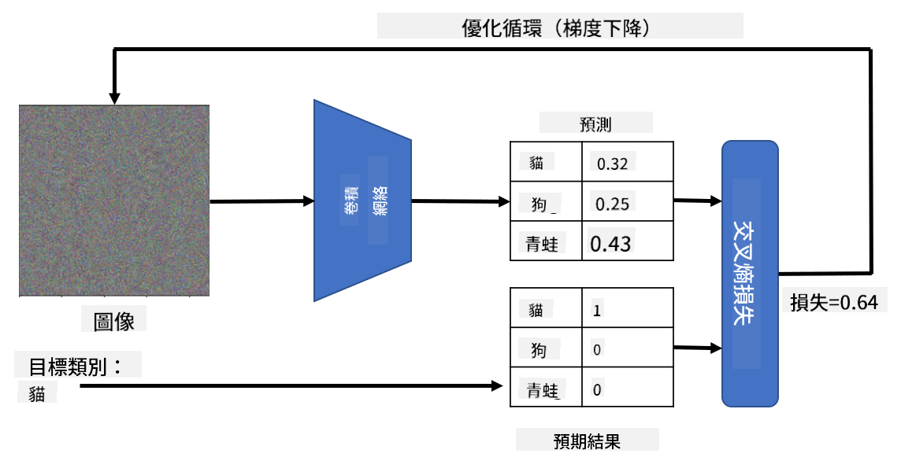

<!--
CO_OP_TRANSLATOR_METADATA:
{
  "original_hash": "178c0b5ee5395733eb18aec51e71a0a9",
  "translation_date": "2025-09-23T08:06:37+00:00",
  "source_file": "lessons/4-ComputerVision/08-TransferLearning/README.md",
  "language_code": "mo"
}
-->
# 預訓練網絡與遷移學習

訓練 CNN 需要耗費大量時間，並且需要大量數據。然而，大部分時間都花在學習網絡用於從圖像中提取模式的最佳低層濾波器上。一個自然的問題是：我們是否可以使用在一個數據集上訓練的神經網絡，並將其適配於分類不同的圖像，而不需要完整的訓練過程？

## [課前測驗](https://ff-quizzes.netlify.app/en/ai/quiz/15)

這種方法被稱為**遷移學習**，因為我們將某些知識從一個神經網絡模型轉移到另一個模型。在遷移學習中，我們通常從一個預訓練模型開始，該模型已經在一些大型圖像數據集（例如 **ImageNet**）上進行了訓練。這些模型已經能夠很好地從通用圖像中提取不同的特徵，在許多情況下，只需在這些提取的特徵之上構建一個分類器就能取得良好的結果。

> ✅ 遷移學習這個術語在其他學術領域（例如教育）中也能找到，它指的是將一個領域的知識應用到另一個領域的過程。

## 預訓練模型作為特徵提取器

我們在上一節中討論的卷積網絡包含多層，每層都旨在從圖像中提取一些特徵，從低層的像素組合（例如水平/垂直線或筆劃）到高層的特徵組合（例如火焰的眼睛）。如果我們在足夠大的通用和多樣化的圖像數據集上訓練 CNN，網絡應該能夠學習提取這些常見特徵。

Keras 和 PyTorch 都包含函數，可以輕鬆加載一些常見架構的預訓練神經網絡權重，其中大多數是在 ImageNet 圖像上訓練的。最常用的架構在上一課的 [CNN Architectures](../07-ConvNets/CNN_Architectures.md) 頁面中有描述。特別是，你可能會考慮使用以下模型之一：

* **VGG-16/VGG-19** 是相對簡單的模型，仍然能提供良好的準確性。通常使用 VGG 作為初步嘗試是一個不錯的選擇，可以看看遷移學習的效果。
* **ResNet** 是由微軟研究院在 2015 年提出的一系列模型。它們有更多層，因此需要更多資源。
* **MobileNet** 是一系列尺寸較小的模型，適合移動設備。如果資源有限並且可以接受稍微降低的準確性，可以使用它們。

以下是 VGG-16 網絡從一張貓的圖片中提取的特徵示例：

## 貓與狗數據集

在這個例子中，我們將使用 [貓與狗數據集](https://www.microsoft.com/download/details.aspx?id=54765&WT.mc_id=academic-77998-cacaste)，這非常接近現實生活中的圖像分類場景。

## ✍️ 練習：遷移學習

讓我們在相應的筆記本中看看遷移學習的實際應用：

* [遷移學習 - PyTorch](TransferLearningPyTorch.ipynb)
* [遷移學習 - TensorFlow](TransferLearningTF.ipynb)

## 可視化對抗性貓

預訓練的神經網絡在其“腦海”中包含不同的模式，包括**理想貓**（以及理想狗、理想斑馬等）的概念。能以某種方式**可視化這些圖像**會很有趣。然而，這並不簡單，因為模式分散在網絡權重中，並且以層次結構組織。

我們可以採取的一種方法是從一張隨機圖像開始，然後嘗試使用**梯度下降優化**技術調整該圖像，使網絡開始認為它是一隻貓。

然而，如果我們這樣做，結果會非常接近隨機噪聲。這是因為*有很多方法可以讓網絡認為輸入圖像是一隻貓*，包括一些在視覺上沒有意義的方式。雖然這些圖像包含了許多典型的貓的模式，但並沒有任何約束使它們在視覺上更具辨識性。

為了改善結果，我們可以在損失函數中添加另一個項，稱為**變異損失**。它是一種度量，顯示圖像中相鄰像素的相似程度。最小化變異損失可以使圖像更平滑，並消除噪聲——從而揭示更具視覺吸引力的模式。以下是一些“理想”圖像的示例，它們被高概率分類為貓和斑馬：

 | 
-----|-----
*理想貓* | *理想斑馬*

類似的方法可以用於對神經網絡進行所謂的**對抗性攻擊**。假設我們想要欺騙神經網絡，使一隻狗看起來像一隻貓。如果我們拿一張狗的圖片，該圖片被網絡識別為狗，然後稍微調整它，使用梯度下降優化，直到網絡開始將其分類為貓：

 | 
-----|-----
*狗的原始圖片* | *被分類為貓的狗圖片*

查看以下筆記本中的代碼以重現上述結果：

* [理想與對抗性貓 - TensorFlow](AdversarialCat_TF.ipynb)

## 結論

使用遷移學習，你可以快速組建一個自定義物體分類任務的分類器並獲得高準確性。你可以看到，我們現在解決的更複雜的任務需要更高的計算能力，並且不能輕易在 CPU 上完成。在下一單元中，我們將嘗試使用更輕量化的實現來訓練相同的模型，使用較低的計算資源，結果僅稍微降低準確性。

## 🚀 挑戰

在配套的筆記本中，底部有關於遷移知識在某些相似的訓練數據（例如新類型的動物）中效果最佳的筆記。嘗試使用完全新類型的圖像進行實驗，看看你的遷移知識模型表現得如何。

## [課後測驗](https://ff-quizzes.netlify.app/en/ai/quiz/16)

## 回顧與自學

閱讀 [TrainingTricks.md](TrainingTricks.md)，深入了解其他訓練模型的方法。

## [作業](lab/README.md)

在這次實驗中，我們將使用真實的 [Oxford-IIIT](https://www.robots.ox.ac.uk/~vgg/data/pets/) 寵物數據集，其中包含 35 種貓和狗的品種，我們將構建一個遷移學習分類器。

---

