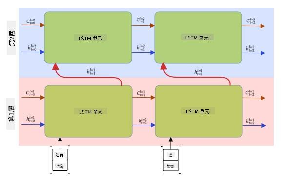

<!--
CO_OP_TRANSLATOR_METADATA:
{
  "original_hash": "e2273cc150380a5e191903cea858f021",
  "translation_date": "2025-09-23T08:13:48+00:00",
  "source_file": "lessons/5-NLP/16-RNN/README.md",
  "language_code": "mo"
}
-->
# 循環神經網絡

## [課前測驗](https://ff-quizzes.netlify.app/en/ai/quiz/31)

在之前的章節中，我們使用了豐富的文本語義表示以及嵌入層上的簡單線性分類器。這種架構的作用是捕捉句子中詞語的聚合意義，但它並未考慮詞語的**順序**，因為嵌入層上的聚合操作已經移除了原始文本中的這些信息。由於這些模型無法建模詞語的順序，因此它們無法解決更複雜或更具歧義的任務，例如文本生成或問題回答。

為了捕捉文本序列的意義，我們需要使用另一種神經網絡架構，稱為**循環神經網絡**（Recurrent Neural Network，簡稱 RNN）。在 RNN 中，我們將句子逐個符號地傳遞給網絡，網絡會生成某種**狀態**，然後將該狀態與下一個符號一起再次傳遞給網絡。

> 圖片由作者提供

給定輸入序列的標記 X0,...,Xn，RNN 創建了一系列神經網絡塊，並通過反向傳播端到端地訓練這個序列。每個網絡塊接受一對 (Xi,Si) 作為輸入，並生成 Si+1 作為結果。最終的狀態 Sn 或 (輸出 Yn) 進入線性分類器以生成結果。所有的網絡塊共享相同的權重，並通過一次反向傳播端到端地訓練。

由於狀態向量 S0,...,Sn 被傳遞通過網絡，它能夠學習詞語之間的序列依賴性。例如，當詞語 *not* 出現在序列中的某處時，它可以學習否定狀態向量中的某些元素，從而實現否定。

> ✅ 由於上圖中所有 RNN 塊的權重是共享的，因此同一圖可以表示為右側的一個塊，並帶有一個循環反饋回路，將網絡的輸出狀態返回到輸入。

## RNN 單元的結構

讓我們來看看一個簡單的 RNN 單元是如何組織的。它接受前一狀態 Si-1 和當前符號 Xi 作為輸入，並需要生成輸出狀態 Si（有時我們也對其他輸出 Yi 感興趣，例如在生成網絡的情況下）。

一個簡單的 RNN 單元內部有兩個權重矩陣：一個用於轉換輸入符號（我們稱之為 W），另一個用於轉換輸入狀態（H）。在這種情況下，網絡的輸出計算公式為 &sigma;(W&times;Xi+H&times;Si-1+b)，其中 &sigma; 是激活函數，b 是額外的偏置。

> 圖片由作者提供

在許多情況下，輸入標記在進入 RNN 之前會通過嵌入層以降低維度。在這種情況下，如果輸入向量的維度是 *emb_size*，而狀態向量的維度是 *hid_size*，則 W 的大小為 *emb_size*&times;*hid_size*，H 的大小為 *hid_size*&times;*hid_size*。

## 長短期記憶（LSTM）

經典 RNN 的主要問題之一是所謂的**梯度消失**問題。由於 RNN 是通過一次反向傳播端到端地訓練的，它在將誤差傳遞到網絡的第一層時存在困難，因此網絡無法學習遠距離標記之間的關係。解決這個問題的一種方法是通過使用所謂的**門控**來引入**顯式狀態管理**。有兩種著名的架構：**長短期記憶**（Long Short Term Memory，簡稱 LSTM）和**門控遞歸單元**（Gated Relay Unit，簡稱 GRU）。

> 圖片來源待定

LSTM 網絡的組織方式與 RNN 類似，但有兩個狀態從層到層傳遞：實際狀態 C 和隱藏向量 H。在每個單元中，隱藏向量 Hi 與輸入 Xi 進行拼接，並通過**門控**控制狀態 C 的變化。每個門控是一個具有 sigmoid 激活（輸出範圍為 [0,1]）的神經網絡，可以被認為是狀態向量的逐位掩碼，當與狀態向量相乘時生效。以下是圖中從左到右的門控：

* **遺忘門**接受隱藏向量並決定向量 C 的哪些組件需要遺忘，哪些需要通過。
* **輸入門**從輸入和隱藏向量中提取一些信息並插入到狀態中。
* **輸出門**通過具有 *tanh* 激活的線性層轉換狀態，然後使用隱藏向量 Hi 選擇其某些組件以生成新狀態 Ci+1。

狀態 C 的組件可以被認為是一些可以開啟或關閉的標誌。例如，當我們在序列中遇到名字 *Alice* 時，我們可能會假設它指的是一個女性角色，並在狀態中設置一個標誌，表示句子中有一個女性名詞。當我們進一步遇到短語 *and Tom* 時，我們會設置一個標誌，表示我們有一個複數名詞。因此，通過操作狀態，我們可以追蹤句子部分的語法屬性。

> ✅ 理解 LSTM 內部結構的絕佳資源是 Christopher Olah 的這篇精彩文章 [Understanding LSTM Networks](https://colah.github.io/posts/2015-08-Understanding-LSTMs/)。

## 雙向和多層 RNN

我們已經討論了從序列開始到結束單向運行的循環網絡。這看起來很自然，因為它類似於我們閱讀和聽取語音的方式。然而，由於在許多實際情況下我們可以隨機訪問輸入序列，因此在兩個方向上運行循環計算可能是有意義的。這樣的網絡稱為**雙向** RNN。在處理雙向網絡時，我們需要兩個隱藏狀態向量，每個方向一個。

循環網絡，無論是單向還是雙向，都能捕捉序列中的某些模式，並將它們存儲到狀態向量中或傳遞到輸出中。與卷積網絡類似，我們可以在第一層之上構建另一個循環層，以捕捉更高層次的模式，並基於第一層提取的低層次模式進行構建。這引出了**多層 RNN** 的概念，它由兩個或更多循環網絡組成，其中前一層的輸出作為輸入傳遞到下一層。

*圖片來自 Fernando López 的[這篇精彩文章](https://towardsdatascience.com/from-a-lstm-cell-to-a-multilayer-lstm-network-with-pytorch-2899eb5696f3)*

## ✍️ 練習：嵌入層

在以下筆記本中繼續學習：

* [使用 PyTorch 的 RNN](RNNPyTorch.ipynb)
* [使用 TensorFlow 的 RNN](RNNTF.ipynb)

## 結論

在本單元中，我們已經看到 RNN 可用於序列分類，但事實上，它們可以處理更多任務，例如文本生成、機器翻譯等。我們將在下一單元中探討這些任務。

## 🚀 挑戰

閱讀一些關於 LSTM 的文獻並考慮它們的應用：

- [Grid Long Short-Term Memory](https://arxiv.org/pdf/1507.01526v1.pdf)
- [Show, Attend and Tell: Neural Image Caption
Generation with Visual Attention](https://arxiv.org/pdf/1502.03044v2.pdf)

## [課後測驗](https://ff-quizzes.netlify.app/en/ai/quiz/32)

## 回顧與自學

- [Understanding LSTM Networks](https://colah.github.io/posts/2015-08-Understanding-LSTMs/) by Christopher Olah.

## [作業：筆記本](assignment.md)

---

