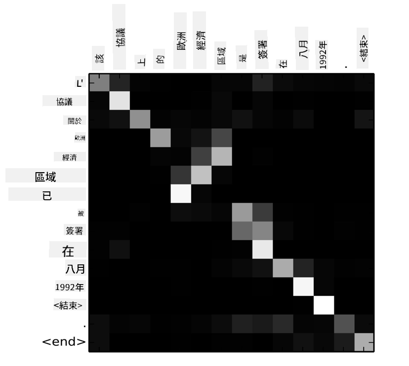
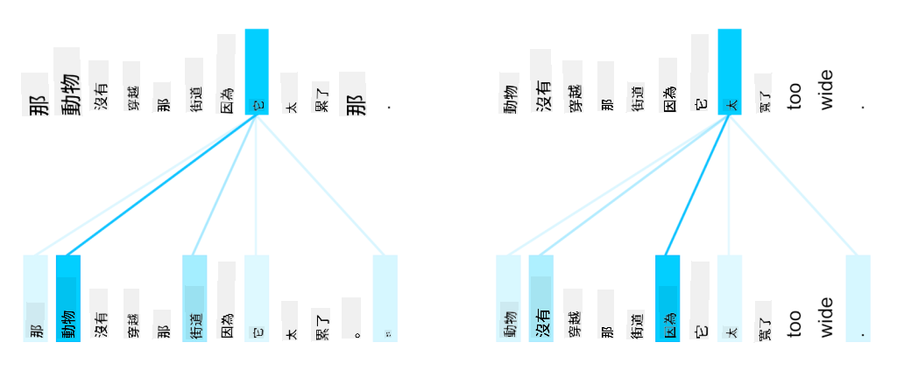
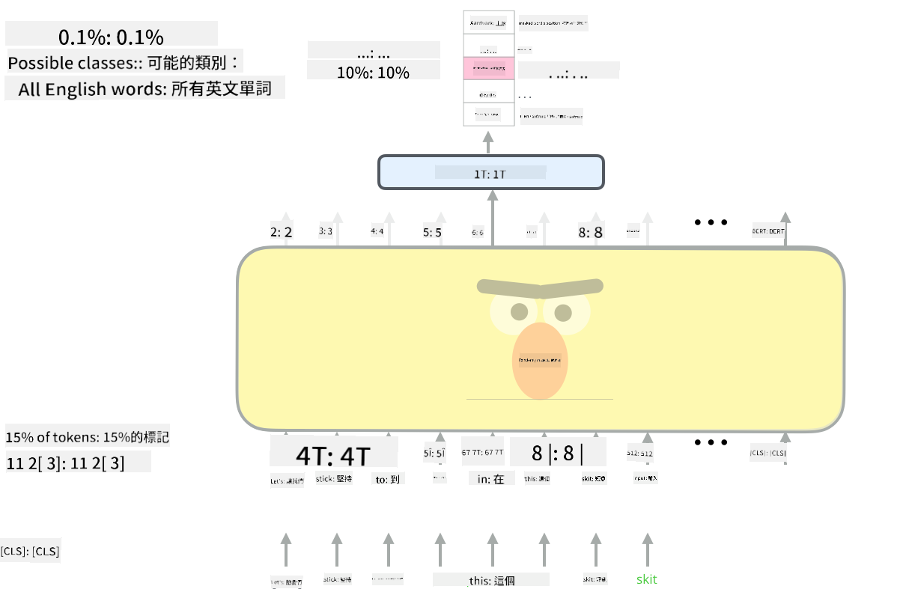

<!--
CO_OP_TRANSLATOR_METADATA:
{
  "original_hash": "f335dfcb4a993920504c387973a36957",
  "translation_date": "2025-09-23T08:12:37+00:00",
  "source_file": "lessons/5-NLP/18-Transformers/README.md",
  "language_code": "mo"
}
-->
# 注意力機制與Transformer

## [課前測驗](https://ff-quizzes.netlify.app/en/ai/quiz/35)

在自然語言處理（NLP）領域中，**機器翻譯**是最重要的問題之一，這是一項支撐像 Google 翻譯這類工具的關鍵任務。在本節中，我們將專注於機器翻譯，或者更廣泛地說，任何*序列到序列*的任務（也稱為**句子轉換**）。

使用 RNN 時，序列到序列的實現是通過兩個遞歸網路完成的，其中一個網路，稱為**編碼器**，將輸入序列壓縮為隱藏狀態，而另一個網路，稱為**解碼器**，將該隱藏狀態展開為翻譯結果。然而，這種方法存在一些問題：

* 編碼器網路的最終狀態很難記住句子的開頭，導致模型在處理長句子時質量較差。
* 序列中的所有詞對結果的影響相同。然而，實際上，輸入序列中的某些特定詞對輸出序列的影響往往比其他詞更大。

**注意力機制**提供了一種方法，能夠對每個輸入向量對 RNN 每個輸出預測的上下文影響進行加權。其實現方式是通過在輸入 RNN 的中間狀態與輸出 RNN 之間創建捷徑。這樣，在生成輸出符號 yt 時，我們會考慮所有輸入隱藏狀態 hi，並賦予不同的權重係數 &alpha;t,i。

> [Bahdanau et al., 2015](https://arxiv.org/pdf/1409.0473.pdf) 中的加性注意力機制編碼器-解碼器模型，圖片來源於[這篇博客文章](https://lilianweng.github.io/lil-log/2018/06/24/attention-attention.html)

注意力矩陣 {&alpha;i,j} 表示某些輸入詞在生成輸出序列中特定詞時所起的作用程度。以下是一個這樣的矩陣示例：

> 圖片來自 [Bahdanau et al., 2015](https://arxiv.org/pdf/1409.0473.pdf) (圖3)

注意力機制是當前或接近當前 NLP 領域最先進技術的關鍵因素。然而，添加注意力機制會大幅增加模型參數的數量，這導致了 RNN 的擴展問題。RNN 的一個關鍵限制是其遞歸性質使得訓練過程難以批量化和並行化。在 RNN 中，序列的每個元素都需要按順序處理，這意味著它無法輕易並行化。

> 圖片來自 [Google 的博客](https://research.googleblog.com/2016/09/a-neural-network-for-machine.html)

注意力機制的採用結合了這一限制，促成了如今我們所熟知和使用的最先進 Transformer 模型的誕生，例如 BERT 和 Open-GPT3。

## Transformer 模型

Transformer 的核心思想之一是避免 RNN 的序列性質，並創建一個在訓練過程中可並行化的模型。這是通過實現以下兩個概念來完成的：

* 位置編碼
* 使用自注意力機制來捕捉模式，而不是使用 RNN（或 CNN）（這也是為什麼介紹 Transformer 的論文被稱為 *[Attention is all you need](https://arxiv.org/abs/1706.03762)*）

### 位置編碼/嵌入

位置編碼的想法如下：
1. 使用 RNN 時，詞元的相對位置由步數表示，因此不需要顯式表示。
2. 然而，一旦我們切換到注意力機制，我們需要知道詞元在序列中的相對位置。
3. 為了獲得位置編碼，我們將詞元序列與序列中的詞元位置序列（即數字序列 0,1, ...）結合。
4. 然後我們將詞元位置與詞元嵌入向量混合。為了將位置（整數）轉換為向量，我們可以使用不同的方法：

* 可訓練的嵌入，類似於詞元嵌入。我們在這裡考慮這種方法。我們在詞元和它們的位置上應用嵌入層，生成相同維度的嵌入向量，然後將它們相加。
* 固定位置編碼函數，這是原始論文中提出的方法。

> 圖片由作者提供

通過位置嵌入，我們獲得的結果同時嵌入了原始詞元及其在序列中的位置。

### 多頭自注意力

接下來，我們需要捕捉序列中的一些模式。為此，Transformer 使用了**自注意力**機制，這本質上是將注意力應用於相同的輸入和輸出序列。應用自注意力使我們能夠考慮句子中的**上下文**，並查看哪些詞是相互關聯的。例如，它可以幫助我們理解哪些詞是由代詞（如 *it*）指代的，並考慮上下文：

> 圖片來自 [Google 博客](https://research.googleblog.com/2017/08/transformer-novel-neural-network.html)

在 Transformer 中，我們使用**多頭注意力**來賦予網路捕捉多種類型依賴關係的能力，例如長期與短期詞關係、共指關係與其他關係等。

[TensorFlow Notebook](TransformersTF.ipynb) 包含有關 Transformer 層實現的更多細節。

### 編碼器-解碼器注意力

在 Transformer 中，注意力機制用於兩個地方：

* 使用自注意力捕捉輸入文本中的模式
* 執行序列翻譯——這是編碼器和解碼器之間的注意力層。

編碼器-解碼器注意力與本節開頭描述的 RNN 中使用的注意力機制非常相似。以下動畫圖解釋了編碼器-解碼器注意力的作用。

由於每個輸入位置可以獨立映射到每個輸出位置，Transformer 比 RNN 更容易並行化，這使得更大且更具表達力的語言模型成為可能。每個注意力頭可以用於學習詞之間的不同關係，從而改進下游自然語言處理任務。

## BERT

**BERT**（Bidirectional Encoder Representations from Transformers）是一個非常大的多層 Transformer 網路，*BERT-base* 有 12 層，*BERT-large* 有 24 層。該模型首先在大規模文本語料庫（維基百科 + 書籍）上進行無監督訓練（預測句子中的遮蔽詞）。在預訓練過程中，模型吸收了大量的語言理解能力，這些能力可以通過微調其他數據集來利用。這個過程稱為**遷移學習**。

> 圖片 [來源](http://jalammar.github.io/illustrated-bert/)

## ✍️ 練習：Transformer

繼續學習以下筆記本：

* [PyTorch 中的 Transformer](TransformersPyTorch.ipynb)
* [TensorFlow 中的 Transformer](TransformersTF.ipynb)

## 結論

在本課中，你學習了 Transformer 和注意力機制，這些都是 NLP 工具箱中的重要工具。Transformer 架構有許多變體，包括 BERT、DistilBERT、BigBird、OpenGPT3 等，可以進行微調。[HuggingFace 套件](https://github.com/huggingface/) 提供了用 PyTorch 和 TensorFlow 訓練這些架構的資源庫。

## 🚀 挑戰

## [課後測驗](https://ff-quizzes.netlify.app/en/ai/quiz/36)

## 回顧與自學

* [博客文章](https://mchromiak.github.io/articles/2017/Sep/12/Transformer-Attention-is-all-you-need/)，解釋經典的 [Attention is all you need](https://arxiv.org/abs/1706.03762) 論文。
* [一系列博客文章](https://towardsdatascience.com/transformers-explained-visually-part-1-overview-of-functionality-95a6dd460452)，詳細解釋 Transformer 的架構。

## [作業](assignment.md)

---

