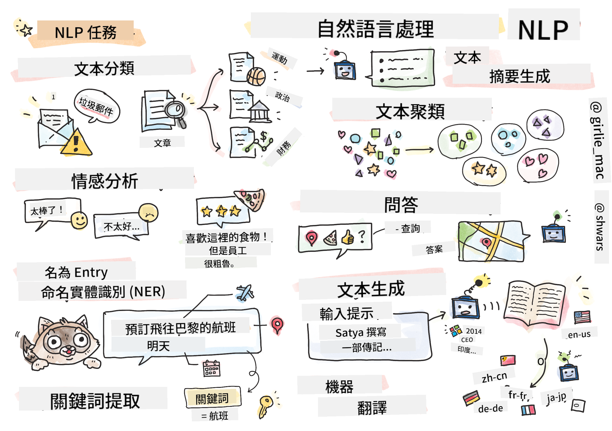

<!--
CO_OP_TRANSLATOR_METADATA:
{
  "original_hash": "8ef02a9318257ea140ed3ed74442096d",
  "translation_date": "2025-08-26T08:02:59+00:00",
  "source_file": "lessons/5-NLP/README.md",
  "language_code": "mo"
}
-->
# 自然語言處理



在本節中，我們將專注於使用神經網絡來處理與**自然語言處理 (NLP)** 相關的任務。我們希望計算機能夠解決許多 NLP 問題：

* **文本分類** 是一種典型的文本序列分類問題。例如，將電子郵件分類為垃圾郵件或非垃圾郵件，或者將文章分類為體育、商業、政治等。此外，在開發聊天機器人時，我們經常需要理解用戶的意圖——這種情況下，我們處理的是**意圖分類**。在意圖分類中，我們通常需要處理許多類別。
* **情感分析** 是一種典型的回歸問題，我們需要為句子的正面/負面情感程度賦予一個數值。一種更高級的情感分析是**基於方面的情感分析** (ABSA)，它不是為整個句子賦予情感，而是為句子的不同部分（方面）賦予情感，例如：*在這家餐廳，我喜歡菜餚，但氣氛糟透了*。
* **命名實體識別** (NER) 是從文本中提取特定實體的問題。例如，我們需要理解在短語 *我需要明天飛往巴黎* 中，*明天* 指的是日期 (DATE)，而 *巴黎* 是地點 (LOCATION)。
* **關鍵詞提取** 與 NER 類似，但我們需要自動提取對句子含義重要的詞，而不需要針對特定實體類型進行預訓練。
* **文本聚類** 在我們希望將相似的句子分組時非常有用，例如，在技術支持對話中將相似的請求分組。
* **問答系統** 是指模型回答特定問題的能力。模型接收一段文本和一個問題作為輸入，並需要提供文本中包含答案的位置（有時需要生成答案文本）。
* **文本生成** 是指模型生成新文本的能力。這可以被視為一種分類任務，根據某些*文本提示*預測下一個字母/單詞。高級文本生成模型（如 GPT-3）能夠通過一種稱為[提示編程](https://towardsdatascience.com/software-3-0-how-prompting-will-change-the-rules-of-the-game-a982fbfe1e0)或[提示工程](https://medium.com/swlh/openai-gpt-3-and-prompt-engineering-dcdc2c5fcd29)的技術解決其他 NLP 任務，例如分類。
* **文本摘要** 是一種技術，我們希望計算機能夠“閱讀”長文本並將其總結為幾句話。
* **機器翻譯** 可以被視為一種將一種語言的文本理解與另一種語言的文本生成相結合的任務。

最初，大多數 NLP 任務是通過傳統方法（如語法）解決的。例如，在機器翻譯中，解析器被用來將初始句子轉換為語法樹，然後提取高層語義結構來表示句子的含義，基於這些含義和目標語言的語法生成結果。如今，許多 NLP 任務使用神經網絡更有效地解決。

> 許多經典的 NLP 方法已在 [Natural Language Processing Toolkit (NLTK)](https://www.nltk.org) Python 庫中實現。網上有一本很棒的 [NLTK 書](https://www.nltk.org/book/)，涵蓋了如何使用 NLTK 解決不同的 NLP 任務。

在我們的課程中，我們將主要專注於使用神經網絡進行 NLP，並在需要時使用 NLTK。

我們已經學習了如何使用神經網絡處理表格數據和圖像。這些數據類型與文本的主要區別在於，文本是可變長度的序列，而圖像的輸入大小是預先確定的。雖然卷積網絡可以從輸入數據中提取模式，但文本中的模式更為複雜。例如，否定可能與主語之間隔著許多單詞（例如：*我不喜歡橙子*，與 *我不喜歡那些又大又多彩又美味的橙子*），但仍應被解釋為一種模式。因此，為了處理語言，我們需要引入新的神經網絡類型，例如*循環網絡*和*Transformer*。

## 安裝庫

如果您使用本地 Python 安裝來運行本課程，您可能需要使用以下命令安裝 NLP 所需的所有庫：

**對於 PyTorch**
```bash
pip install -r requirements-torch.txt
```
**對於 TensorFlow**
```bash
pip install -r requirements-tf.txt
```

> 您可以在 [Microsoft Learn](https://docs.microsoft.com/learn/modules/intro-natural-language-processing-tensorflow/?WT.mc_id=academic-77998-cacaste) 上嘗試使用 TensorFlow 進行 NLP。

## GPU 警告

在本節中，我們的一些示例將訓練相當大的模型。
* **使用支持 GPU 的計算機**：建議在支持 GPU 的計算機上運行筆記本，以減少處理大型模型時的等待時間。
* **GPU 記憶體限制**：在 GPU 上運行可能會導致 GPU 記憶體不足的情況，特別是在訓練大型模型時。
* **GPU 記憶體消耗**：訓練過程中消耗的 GPU 記憶體量取決於多種因素，包括小批量大小。
* **減小小批量大小**：如果遇到 GPU 記憶體問題，請考慮在代碼中減小小批量大小作為潛在解決方案。
* **TensorFlow GPU 記憶體釋放**：舊版本的 TensorFlow 在一個 Python 內核中訓練多個模型時可能無法正確釋放 GPU 記憶體。為了有效管理 GPU 記憶體使用，您可以配置 TensorFlow 僅在需要時分配 GPU 記憶體。
* **代碼包含**：要設置 TensorFlow 僅在需要時增長 GPU 記憶體分配，請在筆記本中包含以下代碼：

```python
physical_devices = tf.config.list_physical_devices('GPU') 
if len(physical_devices)>0:
    tf.config.experimental.set_memory_growth(physical_devices[0], True) 
```

如果您對從經典機器學習的角度學習 NLP 感興趣，請訪問[這套課程](https://github.com/microsoft/ML-For-Beginners/tree/main/6-NLP)。

## 本節內容
在本節中，我們將學習：

* [將文本表示為張量](13-TextRep/README.md)
* [詞嵌入](14-Emdeddings/README.md)
* [語言建模](15-LanguageModeling/README.md)
* [循環神經網絡](16-RNN/README.md)
* [生成網絡](17-GenerativeNetworks/README.md)
* [Transformer](18-Transformers/README.md)

**免責聲明**：  
本文件使用 AI 翻譯服務 [Co-op Translator](https://github.com/Azure/co-op-translator) 進行翻譯。我們致力於提供準確的翻譯，但請注意，自動翻譯可能包含錯誤或不準確之處。應以原始語言的文件作為權威來源。對於關鍵資訊，建議尋求專業人工翻譯。我們對因使用本翻譯而產生的任何誤解或錯誤解讀概不負責。