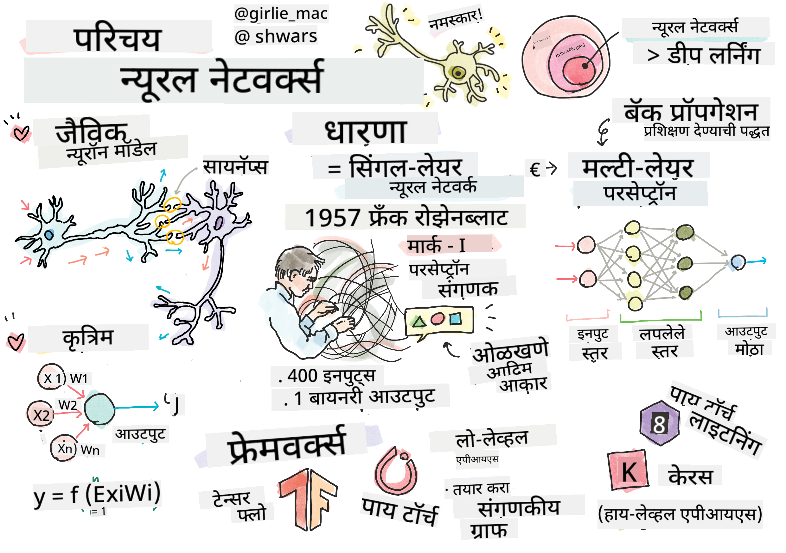
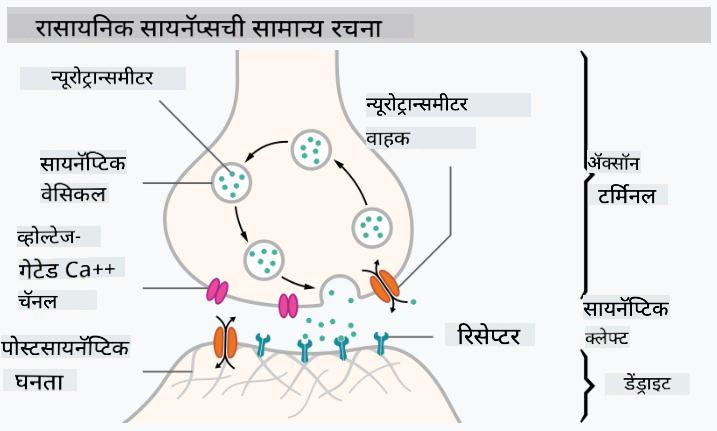
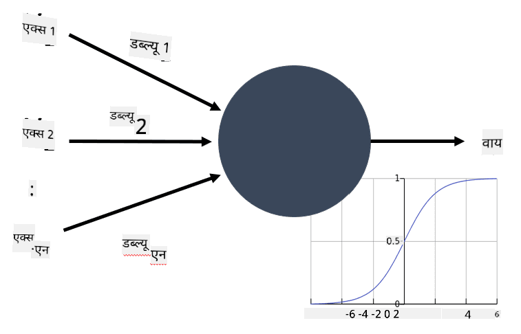

<!--
CO_OP_TRANSLATOR_METADATA:
{
  "original_hash": "f862a99d88088163df12270e2f2ad6c3",
  "translation_date": "2025-10-03T12:45:12+00:00",
  "source_file": "lessons/3-NeuralNetworks/README.md",
  "language_code": "mr"
}
-->
# न्यूरल नेटवर्क्सची ओळख

जसे आपण परिचयात चर्चा केली, बुद्धिमत्ता मिळवण्याचा एक मार्ग म्हणजे **कंप्यूटर मॉडेल** किंवा **कृत्रिम मेंदू** तयार करणे. विसाव्या शतकाच्या मध्यापासून संशोधकांनी विविध गणितीय मॉडेल्स वापरून पाहिले, आणि अलीकडच्या वर्षांत हा दृष्टिकोन अत्यंत यशस्वी ठरला. मेंदूचे असे गणितीय मॉडेल्स **न्यूरल नेटवर्क्स** म्हणून ओळखले जातात.

> कधी कधी न्यूरल नेटवर्क्सना *कृत्रिम न्यूरल नेटवर्क्स*, ANNs असे म्हणतात, जेणेकरून आपण मॉडेल्सबद्दल बोलत आहोत, वास्तविक न्यूरॉन्सच्या नेटवर्क्सबद्दल नाही हे स्पष्ट होईल.

## मशीन लर्निंग

न्यूरल नेटवर्क्स ही **मशीन लर्निंग** नावाच्या मोठ्या शाखेचा भाग आहे, ज्याचा उद्देश डेटा वापरून समस्यांचे निराकरण करणारे कंप्यूटर मॉडेल्स तयार करणे आहे. मशीन लर्निंग कृत्रिम बुद्धिमत्तेचा मोठा भाग आहे, परंतु या अभ्यासक्रमात आम्ही पारंपरिक मशीन लर्निंग कव्हर करत नाही.

> पारंपरिक मशीन लर्निंगबद्दल अधिक जाणून घेण्यासाठी आमचा स्वतंत्र **[Machine Learning for Beginners](http://github.com/microsoft/ml-for-beginners)** अभ्यासक्रम भेट द्या.

मशीन लर्निंगमध्ये, आपण मानतो की आपल्याकडे काही उदाहरणांचा डेटा संच **X** आहे आणि त्यासोबत संबंधित आउटपुट मूल्ये **Y** आहेत. उदाहरणे अनेक वेळा N-डायमेंशनल व्हेक्टर असतात ज्यामध्ये **वैशिष्ट्ये** असतात, आणि आउटपुट्स **लेबल्स** म्हणून ओळखले जातात.

आपण मशीन लर्निंगमधील दोन सर्वसामान्य समस्या विचारात घेऊ:

* **वर्गीकरण**, जिथे आपल्याला इनपुट ऑब्जेक्ट दोन किंवा अधिक वर्गांमध्ये वर्गीकृत करायचे आहे.
* **रेग्रेशन**, जिथे आपल्याला प्रत्येक इनपुट नमुन्यासाठी एक संख्यात्मक संख्या अंदाज करायची आहे.

> इनपुट्स आणि आउटपुट्स टेन्सर्स म्हणून दर्शवताना, इनपुट डेटा संच M&times;N आकाराच्या मॅट्रिक्समध्ये असतो, जिथे M म्हणजे नमुन्यांची संख्या आणि N म्हणजे वैशिष्ट्यांची संख्या. आउटपुट लेबल्स Y हा M आकाराचा व्हेक्टर असतो.

या अभ्यासक्रमात, आपण फक्त न्यूरल नेटवर्क मॉडेल्सवर लक्ष केंद्रित करू.

## न्यूरॉनचे मॉडेल

जीवशास्त्रानुसार, आपला मेंदू न्यूरल पेशींनी (न्यूरॉन्स) बनलेला असतो, ज्यामध्ये अनेक "इनपुट्स" (डेंड्राइट्स) आणि एक "आउटपुट" (अॅक्सॉन) असतो. डेंड्राइट्स आणि अॅक्सॉन्स दोन्ही विद्युत संकेत वाहून नेऊ शकतात, आणि त्यांच्यातील कनेक्शन्स — ज्यांना सायनॅप्स म्हणतात — विविध प्रकारच्या चालकतेचे प्रदर्शन करू शकतात, जे न्यूरोट्रान्समीटरद्वारे नियंत्रित केले जातात.

 | 
----|----
वास्तविक न्यूरॉन *([Wikipedia](https://en.wikipedia.org/wiki/Synapse#/media/File:SynapseSchematic_lines.svg) मधील प्रतिमा)* | कृत्रिम न्यूरॉन *(लेखकाने तयार केलेली प्रतिमा)*

त्यामुळे, न्यूरॉनचे सर्वात सोपे गणितीय मॉडेलमध्ये अनेक इनपुट्स X1, ..., XN आणि एक आउटपुट Y, तसेच वजनांची मालिका W1, ..., WN असते. आउटपुट खालीलप्रमाणे गणना केली जाते:

जिथे f ही काही नॉन-लिनियर **अॅक्टिवेशन फंक्शन** आहे.

> न्यूरॉनचे सुरुवातीचे मॉडेल्स 1943 मध्ये वॉरेन मॅककुलॉक आणि वॉल्टर पिट्स यांनी लिहिलेल्या [A logical calculus of the ideas immanent in nervous activity](https://www.cs.cmu.edu/~./epxing/Class/10715/reading/McCulloch.and.Pitts.pdf) या क्लासिकल पेपरमध्ये वर्णन केले होते. डोनाल्ड हेब यांनी त्यांच्या "[The Organization of Behavior: A Neuropsychological Theory](https://books.google.com/books?id=VNetYrB8EBoC)" या पुस्तकात या नेटवर्क्सना प्रशिक्षण देण्याचा मार्ग प्रस्तावित केला.

## या विभागात

या विभागात आपण शिकू:
* [पर्सेप्ट्रॉन](03-Perceptron/README.md), दोन-वर्ग वर्गीकरणासाठी सर्वात जुने न्यूरल नेटवर्क मॉडेल्स
* [मल्टी-लेयर्ड नेटवर्क्स](04-OwnFramework/README.md) आणि त्यासोबतचा नोटबुक [आपले स्वतःचे फ्रेमवर्क कसे तयार करावे](04-OwnFramework/OwnFramework.ipynb)
* [न्यूरल नेटवर्क फ्रेमवर्क्स](05-Frameworks/README.md), यासह नोटबुक्स: [PyTorch](05-Frameworks/IntroPyTorch.ipynb) आणि [Keras/Tensorflow](05-Frameworks/IntroKerasTF.ipynb)
* [ओव्हरफिटिंग](../../../../lessons/3-NeuralNetworks/05-Frameworks)

---

**अस्वीकरण**:  
हा दस्तऐवज AI भाषांतर सेवा [Co-op Translator](https://github.com/Azure/co-op-translator) चा वापर करून भाषांतरित करण्यात आला आहे. आम्ही अचूकतेसाठी प्रयत्नशील असलो तरी कृपया लक्षात ठेवा की स्वयंचलित भाषांतरे त्रुटी किंवा अचूकतेच्या अभावाने युक्त असू शकतात. मूळ भाषेतील दस्तऐवज हा अधिकृत स्रोत मानला जावा. महत्त्वाच्या माहितीसाठी व्यावसायिक मानवी भाषांतराची शिफारस केली जाते. या भाषांतराचा वापर करून उद्भवलेल्या कोणत्याही गैरसमज किंवा चुकीच्या अर्थासाठी आम्ही जबाबदार राहणार नाही.